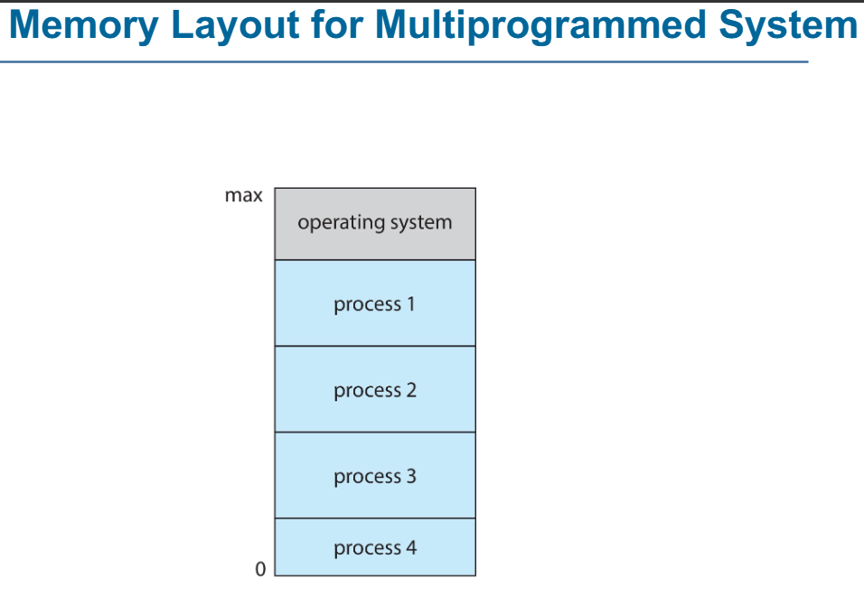
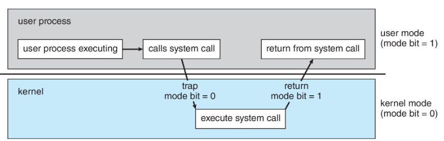
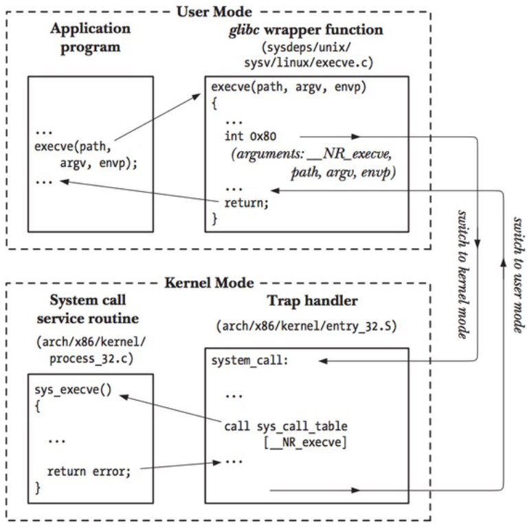
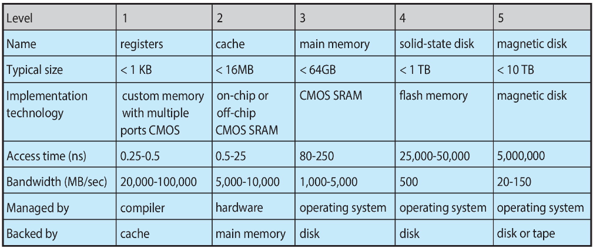
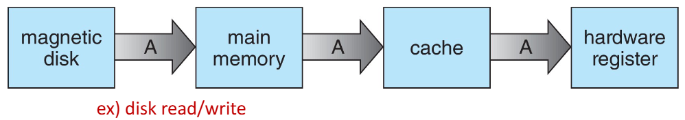
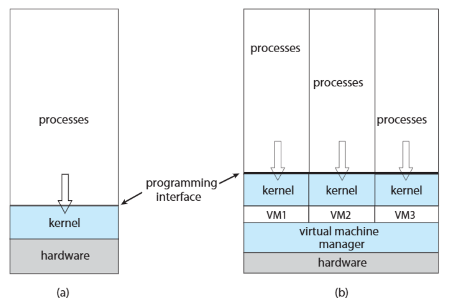
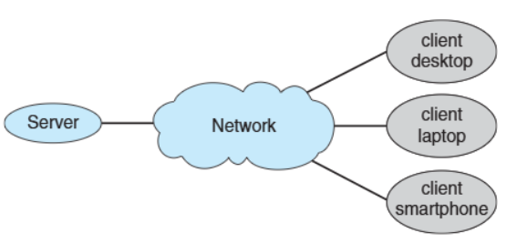
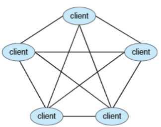
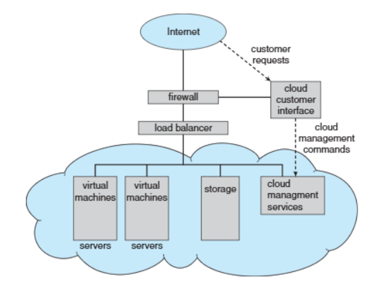

>🍀 운영체제 전공 수업 정리

## OS-Operations
---
* **Bootstrap** program - simple code to initialize the system, load the kernel(컴퓨터를 초기화(부팅)하는 역할을 하는 간단한 코드)
* **Kernel** load
* Starts **system daemons**
  * 백그라운드에서 실행되는 서비스 프로그램
  * 커널이 로드된 후, **system daemons**가 실행되며 운영 체제의 주요 기능을 담당
  * 커널 외부에서 제공되는 서비스들로, OS가 정상적으로 동작하도록 지원
* Kernel **interrupt driven(기반)**
  * Hardware interrupt by one of the devices - 컴퓨터의 **device**가 CPU에게 작업 요청을 보낼 때 발생
    * ex: 키보드를 누르면 CPU가 이를 감지하고 입력을 처리, 하드디스크에서 데이터를 읽을 때 CPU에게 완료 신호를 보냄
  * Software interrupt (**exception** or **trap**)- Software에서 특정한 이벤트가 발생할 경우 CPU가 처리하는 interrupt.
    * software error (ex: Division by Zero, Segmentation Fault)
    * **system call** - Request for OS service(프로그램이 운영 체제의 기능을 사용하기 위해) 
    * ex: 파일 읽기/쓰기(`read()`, `write()`), 프로세스 생성`(fork()`), 메모리 할당(`malloc()`)
  * Other process problems
    * ex: Infinite loop, processes modifying each other or the operating system

### Multiprogramming and Multitasking
---
1. **Multiprogramming** (Batch System)
  * Single user cannot keep CPU and I/O devices busy at all times(병원 진료처럼)
  * 여러 개의 작업(code, data)을 관리하여 CPU always has one to execute(CPU가 항상 실행할 작업을 가질 수 있도록 함)
  * 특징:
    1. A subset of total jobs in system is kept in memory 
    2. One job selected and run via **job scheduling**
    3. When it has to wait (for I/O for example), OS switches to another job (다른 작업으로 전환하여 CPU가 놀지 않도록 함)
2. **Timesharing (multitasking)**
  * logical extension in which CPU switches jobs so frequently that users can interact with each job while it is running, creating **interactive** computing
  * 특징:
    1. **Response time** should be < 1 second
    2. Each user has at least one program executing in memory -> **process**
    3. If several jobs ready to run at the same time -> **CPU scheduling** (**CPU scheduling**을 통해 여러 개의 준비된 작업 중 하나를 선택 후 실행)
    4. If processes don’t fit in memory, **swapping** moves them in and out to run
    5. **Virtual memory** allows execution of processes not completely in memory

### Multiprogramming vs Multitasking 비교

| 개념          | Multiprogramming                                          | Multitasking                                          |
| ------------- | --------------------------------------------------------- | ----------------------------------------------------- |
| **방식**      | 하나의 프로그램이 CPU를 점유하면, 다른 프로그램은 대기    | CPU가 여러 작업을 빠르게 전환, 동시에 실행되는 것처럼 |
| **목적**      | CPU가 항상 작업을 실행하도록 유지                         | 사용자가 여러 프로그램을 동시에 사용할 수 있도록 지원 |
| **CPU 활용**  | CPU가 놀지 않도록 I/O 작업이 끝날 때까지 다른 작업을 실행 | 사용자가 실행하는 여러 개의 프로그램을 빠르게 전환    |
| **반응 속도** | 즉각적이지 않음 (배치 처리)                               | < 1초 (즉각적인 반응)                                 |
| **대표 사례** | Batch System (병원 진료 예약)                             | 운영체제에서 여러 프로그램 실행 (Windows, macOS)      |

* 메모리는 OS 영역과 User Process 영역으로 나뉩니다.
* **OS**는 메모리의 max 주소에서 실행되며, 시스템을 제어하고 관리합니다.
* **사용자 프로세스(Process 1, 2, 3, 4)**는 메모리의 하단부터 위쪽 방향으로 로드됩니다.  
  (즉, 프로세스는 주소 0에서 시작하여 위쪽으로 할당됨)
* 다중 프로그래밍 시스템에서는 여러 개의 프로세스가 동시에 메모리에 적재되어 CPU가 작업을 교체하며 실행할 수 있습니다.

### Dual-mode and Multimode Operation
---
**Dual-mode** operation allows OS ot protect itself and other system components
* 운영체제를 보호하기 위해 CPU는 두가지 모드에서 작동:
  * User mode: 일반 사용자 응용 프로그램 실행
  * Kernel mode: OS가 실행, 하드웨어 및 시스템 리소스에 대한 전체 권한을 가짐(priviledged mode, supervised mode, system mode)
* **Mode bit**: provided by hardware
  * Provides ability to **distinguis** when system is running user code or kernel code
  * 운영체제는 mode bit를 확인하여 시스템 보호를 수행
* **Privileged Instruction** only executable in **kernel mode**

* Increasingly CPUs support multi-mode operations
  * **Virtual Machine Manager(VMM)** 모드 지원
  * VMM has more priviledges than user processes but fewer than the kernel

#### Transition from User to kernel Mode
---

**Timer** to prevent infinite loop / process hogging resources
* **Timer Set**: To interrupt the computer after some time period
* **Keep Counter**: Decremented(감소) by the **physical clock**
* Operating system set the counter (privileged instruction으로만 가능)
* When counter zero, generate an interrup
* Set up before scheduling process to regain control or terminate program that exceeds allotted time

* 작동 방식
    1. `User Mode`에서 실행 중인 프로세스가 System Call `(ex: 파일 읽기, 네트워크 요청, 메모리 할당 등)`
    2. 사용자가 System Call → CPU는 **`trap`** 발동 -> Kernel mode로 변경됨`(mode bit = 0)`
    3. 작업 완료 후 다시 User Mode로 변경됨`(mode bit = 1)`

>mechanism

## Resource Management

### Process Management
---
1. Process란?
* 실행 중인 프로그램
* **Program**은 단순한 코드(**passive entity**), **Process**는 실행 중인 코드(**active entity**)

* Process needs resources to accomplish its task
  * CPU, memory, I/O, files, Initialization data
* Process termination(종료) requires reclaim of any reusable resources
  * 즉, OS는 종료된 process가 자원을 차지하지 않도록 해제해야 함

2. `Single-threaded` vs `Multi-threaded`
|------|------|
| **Single-threaded** | 하나의 프로세스는 **하나의 Program Counter** 만 가짐  |
| | 한 번에 한 개의 명령어만 실행 가능 (순차적 실행) |
| **Multi-threaded** | 하나의 프로세스가 **여러 개의 스레드를 가짐** |
| | 각 스레드는 독립적인 Program Counter를 가지며, **병렬 실행 가능** |

3. Concurrency(동시성)
* OS는 여러 개의 process를 동시에 실행
* 일부 프로세스는 User process, 일부는 OS process
* Concurrency by Multiplexing
  * CPU는 여러 process를 빠르게 Scheduling(전환)하며 실행(동시에 실행하는 것처럼 보이게)

#### Process Management Activities
---
1. **Creating** and **deleting** both user and system processes
2. **Suspending** and **resuming** processes
3. Providing mechanisms for process **synchronization**(데이터의 일관성을 위해)
4. Providing mechanisms for process **communication**
5. Providing mechanisms for **deadlock handling**

### Memory Management
---
* To execute a program, all (or part) of the **instructions(명령어)** must be **in memory**
* All (or part) of the **data** that is needed by the program must be **in memory**
* Memory management determines **what is in memory and when**
  * **Optimizing** CPU utilization and computer response to users
✅ Memory management activities
1. **memory 사용 추적**
  * Keeping track of which parts of memory are currently being used and by whom
2. **process 관리**
  * Deciding which processes (or parts thereof) and data to move into and out of memory
3. **memory 공간 할당 및 해제**
  * Allocating and deallocating memory space as needed

### File-system Management
---
* OS provides **uniform**, **logical** view of information storage  
  (일관되고 논리적으로 정보를 저장, 관리)
* Abstracts physical properties to logical storage unit - **file**
* Each medium is controlled by device (ex: disk drive, tape drive)
  * Varying properties:
    1. **Access speed**
    2. **Capacity**
    3. **Data transfer rate**
    4. **Access method**(sequantial or random)

__**File-system management**__:  
* Files usually organized into **directories**
* **Access control**: most systems use <U>access control</u> to determine who can access what
* OS activities include:
  1. **Creating and deleting** files and directories
  2. **Primitives(기본 기능)** to manipulate files and directories
  3. **Mapping** files onto secondary storage  
    * Mapping: 사용자가 지정한 파일 이름을 저장장치의 실제 위치로 연결해주는 과정
  4. **Backup files** onto stable(non-volatile) storage media

### Mass-storage management
---
📚What is Mass-storage?
  * Stores data that cannot fit in main memory or needs to be kept for a **long** period.  
    (i.e. Hard disk, SSD, optical disk, magnatic tapes)

✅ OS management Activities
  1. **Mounting/Unmounting**: <u>Connecting and disconnecting</u> storage devices
  2. **Free-space Management**: Managing <u>available storage space</u>
  3. **Storage allocation**
  4. **Disk scheduling**: <u>Optimizing input/output</u> operations
  5. **Partitioning**: Dividing disks into separate sections
  6. **Protection**

* Optical storage, magnetic tapes are slower but requre management by the OS or applications.

### Caching(⭐)
---
>* **Caching** is an important concpet applied at multiple levels in a computer(H/W, OS, S/W)

📚 Principle of **Caching**
  * **<u>Temporarily copying data</u> from slower to faster storage(cache)** for quicker access

✅ Caching works
  * When accessing data, the system **<u>checks the cache first</u>**
    * **If found** → Use it directly from cache(fast)
    * **If not** → Copy from slow storage to cache, then use it

📝 Why need Cache Management
  * Cache smaller than storage being cached, so efficient management is key
  * Design factors:
    * **Cache size**
    * **Replacement policy**(Which data to remove when the cache is full)

### Type of Storage
---

* lower levels(registers, cache) are faster but smaller, while higher levels(SSD, HDD) are slower but larger
* registers are inside the CPU, extremely fast but small
* cache is close to the CPU, faster than main memory but smaller
* main memory(RAM) holds data during program execution
* SSD is faster than HDD but slower than RAM
* magnetic disk(HDD) is the slowest but offers the largest storage capacity\

### Data Migration Process
---

>Data Migration Process

1. **Multitasking Environment**
  * The system must **always use the most recent data**, regardless of where it is stored in the storage hierarchy
2. **Multiprocessor Environment**
  * Requires **cache coherency(일관성)** to ensure that <u>all CPUs have the most recent data</u> in their cache
3. **Distributed Environment**
  * The situation is even more complex
  * Multiple copies of the same data can exist, requiring proper management strategies

### I/O subsystem
---
* OS is to **hide peculiarities** of hardware devices from the user

✅ **Responsibilities of the I/O Subsystem**
* Memory Management for I/O:
  1. **Buffering**: **Temporarily stores data** while it's being transferred
  2. **Caching**: Stores parts of data in **faster storage** for better performance
  3. **Spooling**: Manages **overlapping of job** outputs and inputs by placing I/O data in a buffer  
     (It refers to putting data of various I/O jobs in a buffer.)
* Provides a General Device-Driver Interface
  * Ensures that hardware can communicate with the OS
* Drivers for Specific Hardware Devices

## Protection and Security
---
📚**Protection**
  * Mechanisms for controlling access to processes or resources as defined by the OS

📚**Security**
  * **Defense** against internal and external **attacks**
  __Types of attacks include:__  
  1. denial-of-service(DoS)
  2. worms and viruses
  3. identity Theft
  4. Theft of Service

* **User Identification and Management**
  * Systems distinguish among users, to **determine who can do what**
  * **User ID**
    * Include usernames and unique IDs(one per user)
    * Linked to files and processes for **access control**(ID는 사용자의 file과 process에 연결되어 **access control**를 결정)
  * **Group ID**
    * Allow management of user groups for **access rights**
    * Associated with processes and files
  * **Privilege Escalation(권한 상승)**
    * Allows users to switch to an **effective ID** with higher rights

## **Virtualization**
---
📚What is **virtualization**
* Technology that allows an OS to **run applications within other OSes**
* 
✅ **Emulation**: Used when the source CPU type is different from the target type (i.e. PowerPC → Intel x86 → M1 / Apple의 Rosetta)
  * **Generally the slowest method**
  * If the computer language is not compiled to native code(CPU가 직접 실행할 수 있는 기계어(바이너리 코드)), it uses **interpretation(소스 코드를 한 줄씩 해석하고 실행하는 방식)**

✅ **Virtualization**
* OS is **natively compiled** for the CPU, and it runs **guest** OSes that are also natively compiled
  __Example__:  
  * Running Windows XP guests on VMware, with the host OS being Windows XP.
* VMM (Virtual Machine Manager)
  * Software that provides virtualization services (e.g., VMware, VirtualBox).

✅ **Use case of virtualization**
  * Used for **exploring and ensuring compatibility(호환성)** when running multiple OSes
  __Examples__:
    1. Running Mac OS X as the host and Windows as the guest on an Apple laptop
    2. Developing apps for multiple OSes without owning multiple systems → **Performing QA testing**
    3. Executing and managing compute environments within data centers

✅ **Native Execution of VMM**
  * If VMM runs natively, **it acts as the host OS itself**
  * In this case, there is no general-purpose host OS (ex: **VMware ESX**, **Citrix XenServer**) → VMM자체가 host

### Computing Environment - virtualization
---

> Computing Environment - virtualization

* The **VMM manages multiple VMs**, and each **VM operates independently** with **its own kernel and processes**
* This allows **multiple OSes to run simultaneously** on a single hardware system.
* **VMM = Host OS**

| **구분**       | **Computing Environment-Non-virtualized(a)** | **Computing Environment-Virtualized(b)** |
| -------------- | -------------------------------------------- | ---------------------------------------- |
| **Kernel**     | 단일 커널 사용                               | 각 VM이 개별 커널 사용                   |
| **Process**    | 단일 OS의 프로세스                           | 각 VM이 독립적인 프로세스 실행           |
| **Management** | 하드웨어를 커널이 직접 관리                  | VMM이 하드웨어 자원을 관리하고 VM에 할당 |

## **Distributed Systems**
---
📚 **Distributed Computing**
* A **collection of separate, possibly heterogeneous systems** that are <u>networked together</u>
* Systems typically communicate using **TCP/IP**
__Types of networks__:
  * 🌐 **Local Area Network(LAN)**: Connects computers in a small
  * 🌍 **Wide Area Network(WAN)**: Covers large geographical areas
  * 🌆 **Metropolitan Area Network(MAN)**
  * 📱 **Personal Area Network(PAN)**

📚 **Network Operating System**
* **Provides features to manage interactions** b/w systems across a network
__Key features__:
  1. **Communication Scheme**: Allows systems to exchange messages
  2. **Illusion of a Single System**: Users perceive the network as a single system

## **Computing Environment**
---
### Traditional
---
1. **stand-alone general purpose machines**
   * Early computers were stand-alone systems with no internet or network connection
2. But **blurred** as most systems interconnect with others (i.e. the Internet)
3. **Portals**
   * Provide **web access to internal systems **
4. **Network computers(Thin Clients: 클라이언트 단에서는 최소한의 처리만 수행하고, 주요 작업은 중앙 서버에서 처리)**
   * **Thin clients** act like <u>web terminals</u>, depending on **central servers** for processing and data
5. **Wireless Networks**
   * Mobile computers connect with each other using **wireless networks**
6. **Networking Becoming Ubiquitous(보편화)**
   * Home systems use **firewalls** to <u>protect against internet attacks</u>.

✅ **Stand-alone → Connected**
### Mobile
---
* Handheld smartphones, tablets, and similar portable devices
* Functional difference from Traditional laptops
  * Extra Features: Mobile OS offer more features like **GPS** and **gyroscope**
* Allows new types of apps like **augmented reality(AR)**
* **Connectivity**
  * Using **IEEE 802.11 wireless networks(Wi-Fi)** or **cellular data networks(4G, 5G)**
* Leaders
  * Apple iOS, Google Andriod

### Client-Server
---
>Older dumb terminals(:서버에서 처리된 데이터를 단순히 출력) have been <u>replaced by smart PCs</u>

📚 Now many systems act as **servers**, handling requests generated by **clients** = **Client-Server Computing**

✅ **Types of Servers**
1. **Computer-server system**: Provides an **interface for clients to request services**, such as accessing databases.
2. **File-server system**: Provides an **interface for clients to store and retrieve files**

>Client-Server Connection Structure

### Peer-to-Peer(P2P)
---
📚 **P2P** is another type of **distributed system** where nodes connect directly with each other

>P2P

✅ **Key feature of P2P**
  * **No distinction b/w clients and servers**
  * All nodes are **treated as peers**
  * Each node can **act as a client, server, or both** depending on the situation
  * A node **must join the P2P network** to participate  
    → How to Join a P2P Network
    1. **Register Service**: Nodes **register their services** with a <u>central lookup service on the network</u>
    2. **Broadcast Request**: Nodes **broadcast service requests** and respond to requests **using the discovery protocol**(네트워크에서 서비스를 찾고 상호 작용을 돕는 protocol)
  * **Examples of P2P:**
    * **Napster, Gnutella**
    * **VoIP(Voice over IP)**: like Skype

### Cloud Computing
---
📚 **Cloud Computing**: <u>Delivers computing, storage, and applications</u> as services over a network

* Cloud computing is a **logical extension of virtualization**
  * EX: Amazon EC2 - Provides thousands of servers, millions of virtual machines, and massive storage
✅ __**Type of Cloud Computing**__:
1. 🌐 **Public Cloud**: Available over the Internet to anyone willing to pay
2. 🏢 **Private Cloud**: Operated **internally** by a company for its own use
3. 🔄 **Hybrid Cloud**: **Combines public and private** cloud components

✅ __**Cloud Service Models**__:
1. **SaaS(Software as a Service)**
  * Delivers software applications <u>via the Internet</u> (i.e. word processor(Google Docs, Microsoft Office 365))
2. **PaaS(Platform as a Service)**
  * Provides a platform for <u>developers to build and deploy applications</u> (i.e. database server)
3. **IaaS(Infrastructure as a Service)**
  * Offers <u>infrastructure resources like servers and storage</u> over the Internet(i.e. storage available for backup use)

* **Components of Cloud Computing**
  * **Traditional OSes**
  * **VMMs (Virtual Machine Managers)**
  * **Cloud Management Tools**

* Internet connectivity requires security tools like **firewalls**
* **Load Balancers**: Distribute traffic across multiple applications(to ensure no single server is overloaded)

>Cloud Computing

### Real-Time Embedded Systems
---
📚 **Real-Time(실시간) Embedded Systems**
  * <u>Most prevalent form</u> of computers today
  * Use **special-purpose OS** designed for specific tasks(Ex: **Real-Time OS(RTOS)**)

* Some systems **have OS**, while others operate **without an OS**

✅ **Feature of Real-Time OS(RTOS)**
  1. **Well-defined, fixed time constraints** for processing
  2. **Processing must be completed within the specified time**(Failure to meet deadlines results in system errors)
  3. **Correct operation only if constraints met**