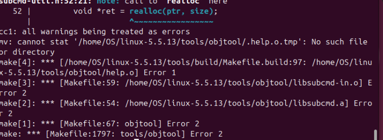
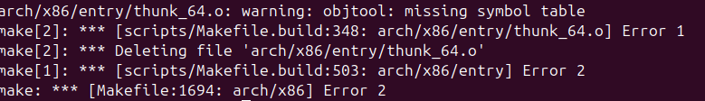
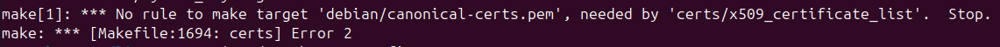

>🍀 운영체제 실습 수업 정리

## Build environment
---
>Use virtual machine
>ubuntu version: `24.04LTS`
>kernel은 5.5.13을 설치해야함

## Build process
---
```Shell
# 1. Update Packages and Install Required Packages
sudo apt update && sudo apt upgrade
sudo apt install build-essential libncurses6 libncurses-dev flex bison \
                 bc dwarves pahole libudev-dev libpci-dev \
                 libssl-dev libelf-dev libiberty-dev binutils-dev -y

# 2. Download the desired kernel version and decompress
wget https://cdn.kernel.org/pub/linux/kernel/v5.x/linux-5.5.13.tar.xz
tar xvf linux-5.5.13.tar.xz

# 3. Build kernel
cd linux-5.5.13

sudo cp -v /boot/config-$(uname -r) .config
sudo make menuconfig
* 1. Load -> .config
* 2. Save -> .config
* 3. Exit

sudo make -j$(nproc) # <- 오류 발생
sudo make modules_install
sudo make install

sudo reboot
```

### 첫번째 오류
---

* xrealloc 함수에서 use-after-free 오류가 발생함

* 원인 
  * Linux 5.5.13은 최신 gcc와 호환되지 않을 수 있음

__해결 방안__:
gcc의 버전을 10로 낮추기로 결정
```shell
# gcc 10 version 설치
sudo apt install gcc-10 g++-10

# gcc의 우선 순위 변경
sudo update-alternatives --install /usr/bin/gcc gcc /usr/bin/gcc-10 1 # <-우선순위번호
sudo update-alternatives --install /usr/bin/g++ g++ /usr/bin/g++-10 1
```

### 두번째 오류
---


* objtool이 `thunk_64.o`를 처리할 때 missing symbol table이 발생함

* 발생하는 이유:
  * `objtool`이 **`symbol table`**을 확인하는 과정에서 **missing symbol table** 발생 
  * `Makefile.build`에서 오류가 발생한 경우 해당 `.o` 파일을 삭제하는 규칙이 적용됨
  * 따라서 `arch/x86/entry/thunk_64.o`가 삭제됨
  
__해결 방안__:
`CONFIG_STACK_VALIDATION` 비활성화(objtool을 사용하여 사용하여 Stack Validation을 수행할지 결정하는 옵션)
-> 전체 objtool 검사를 우회하지 말고 **`thunk_64.o`파일만 예외 처리**해서 우회

* `arch/x86/entry/Makefile`에서 thunk_64.o 파일을 objtool 검증에서 제외하도록 편집
```shell
vim arch/x86/entry/Makefile

# SPDX-License-Identifier: GPL-2.0
#
# Makefile for the x86 low level entry code
#

OBJECT_FILES_NON_STANDARD_entry_64_compat.o := y
OBJECT_FILES_NON_STANDARD_thunk_64.o := y # 추가

CFLAGS_syscall_64.o		+= $(call cc-option,-Wno-override-init,)
CFLAGS_syscall_32.o		+= $(call cc-option,-Wno-override-init,)
obj-y				:= entry_$(BITS).o thunk_$(BITS).o syscall_$(BITS).o
obj-y				+= common.o

obj-y				+= vdso/
obj-y				+= vsyscall/

obj-$(CONFIG_IA32_EMULATION)	+= entry_64_compat.o syscall_32.o

CFLAGS_REMOVE_thunk_64.o := -fstack-validation # 추가
```
이후 `sudo make clean`로 캐시 초기화 후 다시 빌드

### 세번째 오류
---

* build 과정에서 `debian/canonical-certs.pem` 파일이 필요하지만 존재하지 않아서 발생하는 오류
* 이 파일은 보통 배포판에서 제공하는 인증서이지만, 커널 소스에는 포함되지 않는 경우가 많음

__해결 방안__:
`.config`파일에서 `CONFIG_SYSTEM_TRUSTED_KEYS=""`으로 수정