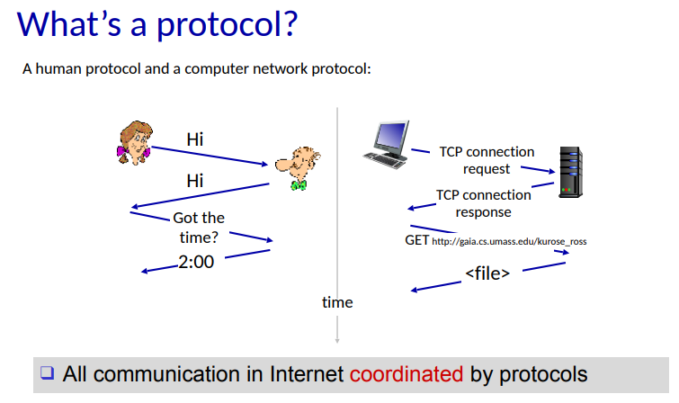
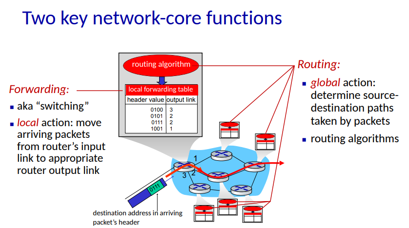
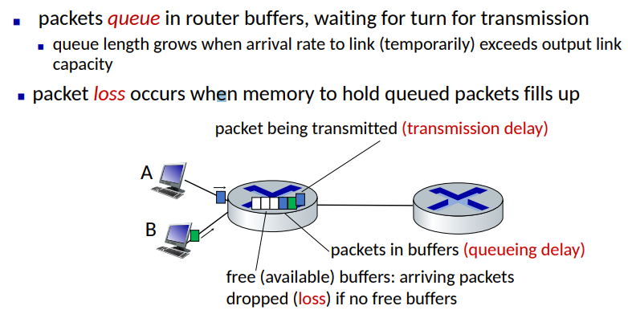
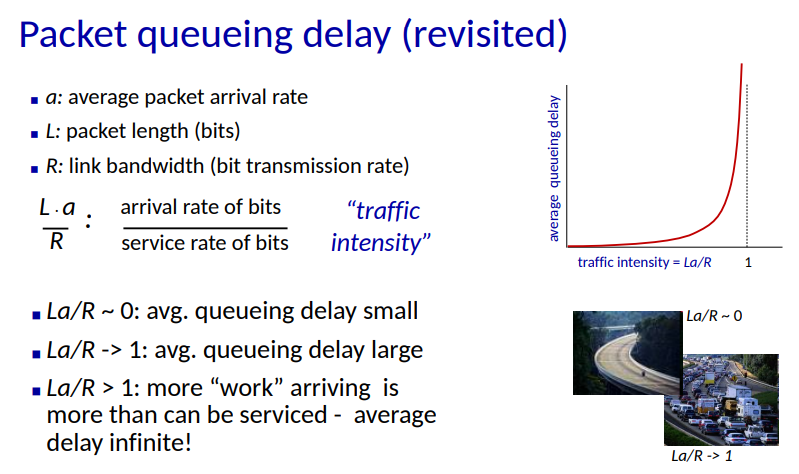
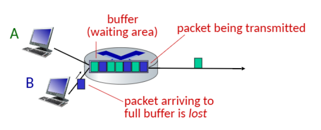
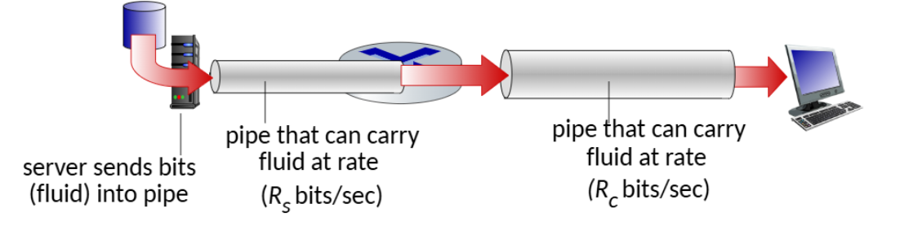

>📚컴퓨터 네트워크 전공 수업 정리

## Internet structure
---
* **Newtwork edge**:
  * **hosts**: clients and server
  * **servers** often in data center

* **Access networks, physical media**:
  * wired, wireless communication links
 
* **Network core**:
  * interconnected **routers**
  * network of networks

## Protocol
---

## The network core
---
* mesh of interconnected **routers**(routers is like little computer - size↓ / speed↑)
* **Packet-switching**: hosts break app-layer messages into **packets** (current network use P-s)
  * network **forwards** packets from one router to the next, across links on path from **source to destination**

### Two key network-core funtions
---

1. **Forwarding**(switching): local action
2. **Routing**: global action

## How do packet delay and loss occur
---

### 4-Packet delay
---
.png)
.png)

1. **nodal processing**
2. **queueing delay**

   * cant reduce only queueing delay
   * most packet loss in here
3. **transmission delay**
4. **propagation delay**

### Packet loss
---
**Packet loss**: 네트워크에서 데이터 패킷이 목적지에 도달하지 못하고 사라지는 현상

* Buffer는 유한한 용량을 가진다.
* Buffer가 가득 찼을 때 새로운 **packet이 도착하면 버퍼가 가득 차서 더 이상 저장할 수 없어 패킷이 손실**된다.
* **손실된 패킷**은 **이전 노드, 원본 시스템에 의해 재전송**되거나, **아예 재전송되지 않을 수**도 있다.

### Throughput
---
**Throughput**: sender에서 receiver로 전송되는 전송되는 비트 수(bits/time unit)
* **instantaneous(순간 처리량)**: 특정 시점에서의 처리량
* **average(평균 처리량)**: 더 긴 시간 동안의 평균 처리량

✅ 링크 속도가 서로 다를 때 전체 처리량은 어떻게 되는가?

* `Rs < Rc` 경우: average end-end throuput은 **Rs**가 된다.
* `Rs > Rc` 경우: average end-end throuput은 **Rc**가 된다.

* **bottleneck link**(병목 링크): end-end path에서 처리량을 제한하는 링크
