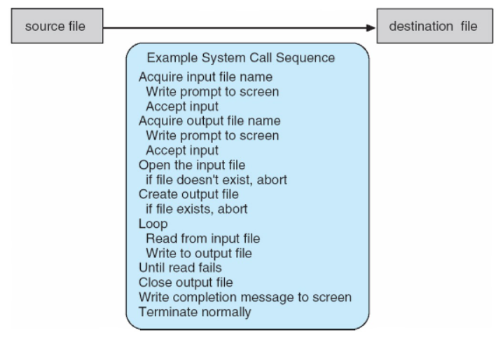
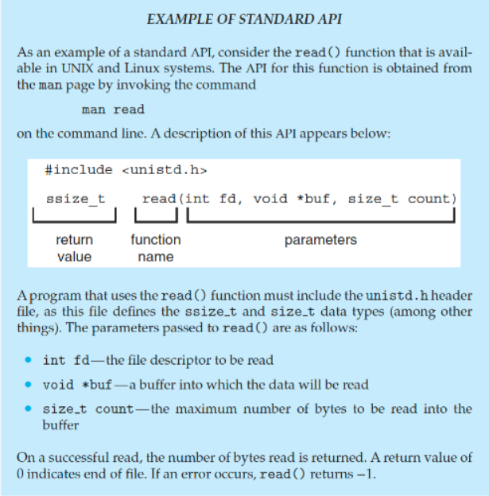
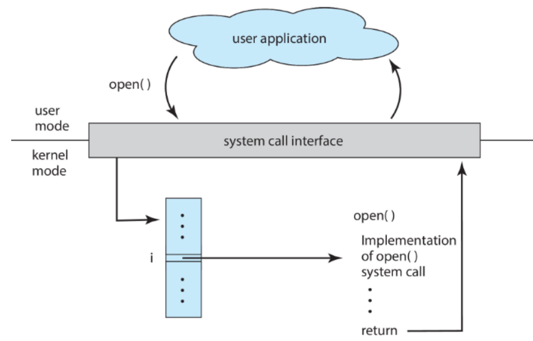
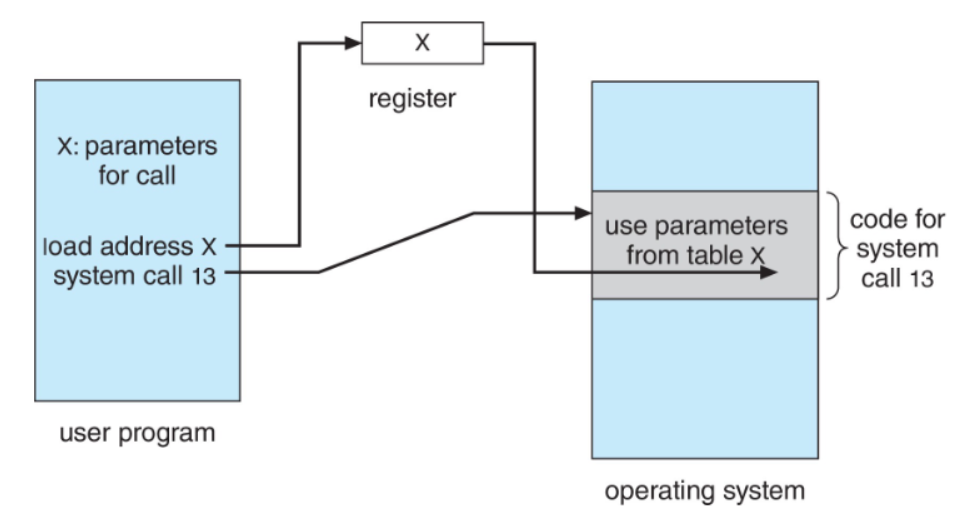
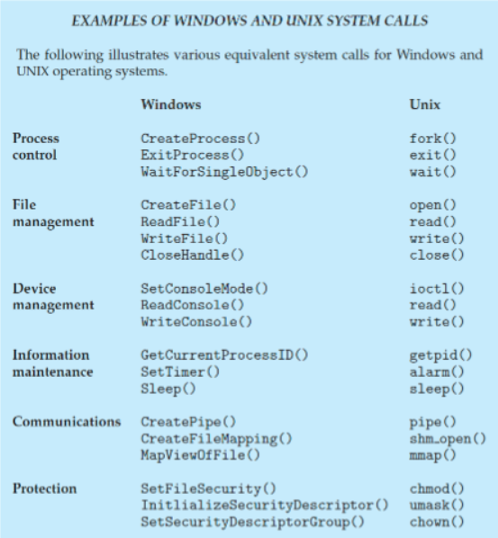
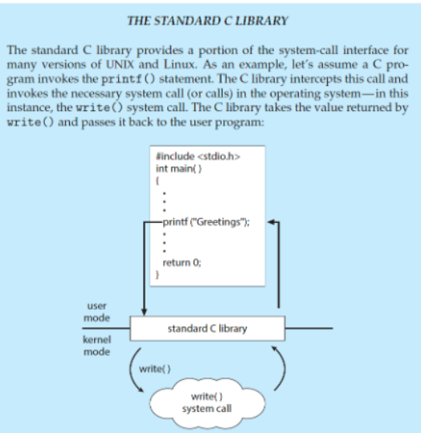
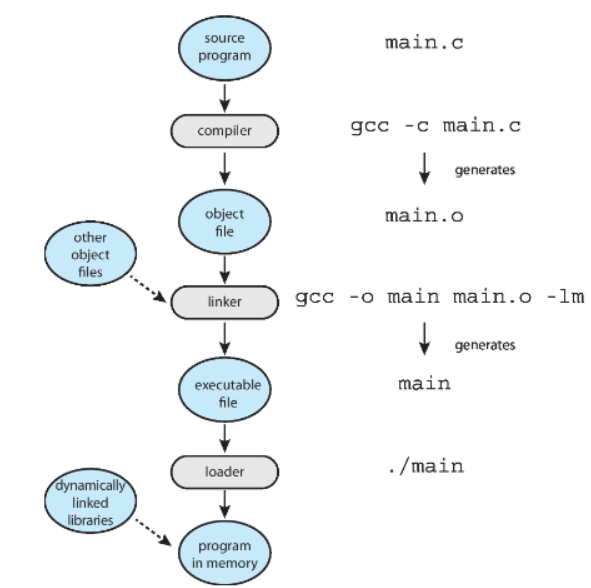

>🍀 운영체제 전공 수업 정리

## Operating System Services
---
📚 OS **<u>Provide an environment for the execution of programs and services</u> to programs and users**

* **Helpful Services to Users**
  1. **UI(User Interface)**
    * Almost all OSes provide a user interface
    * Types of UI:
      1. **Command-Line interface(CLI)**
      2. **Graphics User interface(GUI)**
      3. **touch-screen**
      4. **Batch**: 일괄 처리 방식
  2. **Program execution**
    * OS must be able to **load programs into memory, run them, and terminate them**
      * termination can be **normal** or **abnormal(indicating error)**
  3. **I/O operations** 
    * Running programs may <u>require I/O operations(Ex: File access, I/O device control) </u> 
  4. **File-system manipulation**
    * OS provides **file management services** for programs 
    * Key function:
      * **Reading/Writing** files and directories
      * **Creating and deleting** files
      * **Searching and listing** file information
      * **Managing file permissions**
  5. **Communication**
    * Processes **exchange information** either on **the same compute**r or **over a network**
    * Communication **methods**:
        1. **Shared Memory**: Multiple processes share a **<u>common memory space</u>** to communicate
        2. **Message Passing**: The OS **moves packets** to facilitate communication(ex: email)  
  6. **Error detection**
    * The OS must **continuously** monitor and detect errors in the system
    * OS 역할:
      * 오류 감지 후 적절한 조치 수행
      * 오류가 발생해도 **시스템이 올바르게 유지**되도록 보장
      * **디버깅 기능 제공**: 사용자 및 개발자의 문제 해결 능력 향상
  7. **Resource allocation**
    * 여러 사용자 혹은 여러 개의 많은 프로그램이나 장치를 동시에 돌릴 때, **시스템 리소스는 한정적**임
    * 그래서 시스템 리소스를 <u>적절하게 할당</u>해야함
    * Key resources managed by the OS:
      * **CPU cycle**: CPU를 최대한 배분해서 GPU의 활용률을 높여야함
      * **main memory**
      * **file storage**
      * **I/O device**
  8. **Logging**
    * **Tracks which users consume how many resources**
    * Helps optimize system performance and security
  9. **Protection and security**
    * 멀티유저 시스템 및 네트워크 환경에서 **정보 소유자가 데이터 사용을 제어**할 수 있도록 보장
    * 동시에 실행되는 프로세스들이 서로 간섭하지 않도록 보호
    * protection과 security는 다른 개념
      * **protection**: **Ensures controlled access** to system resources
      * **security**:
        * **Protects the system** from unauthorized access(<u>requires user authentication</u>)
        * **Defends I/O devices** from unauthorized access attempts
        * 

>View of Operating_System_Service

## User and Operating System-Interface
---
### CLI(Command Line Interface)
---
📚 **CLI or Command interpreter**: 사용자가 **직접 명령을 입력하여 운영체제와 상호작용**할 수 있도록 하는 인터페이스
  * **커널 내부**에서 구현될 수도 있고, **시스템 프로그램**으로 구현될 수도 있음.
  * **CLI**는 여러 형태로 구현될 수 있으며, 이를 **Shells**이라고 함.
  * Types of CLI Commands:
    * **Built-in Commands(내장 명령어)**
      * Commands that are **part of the shell itself**(Ex: `cd`, `echo`, `exit`)
    * **Externel programs(외부 프로그램 호출)**
      * The shell executes external programs(Ex: `ls`, `grep`, `vim`)
      * **Adding new features does <u>not require modifying the shell</u>**

### GUI(Graphical User Interface)
---
📚 **GUI**: A **desktop metaphor interface**, designed **for user-friendly interaction**
  * 보통 **마우스, 키보드, 모니터**를 사용하여 조작
  * **GUI Components**:
    * **Icons**: Represent files, programs, and actions
    * **Mouse interactions**: Provide Options, execute functions, open folders, etc
  * **Invented at <u>Xerox PARC</u>**
  * Modern systems offer <u>**both CLI and GUI**</u>
  * Example:
    * **Microsoft Windows** → **Primarily** GUI, but **includes** CLI
    * **Apple Mac OS X** → Uses Aqua GUI, but supports CLI with UNIX shell
    * **Unix and Linux** → Primarily **CLI**, but support **GUI** options like **CDE, KDE, and GNOME**

  * 주요 GUI 환경:
    1. **KDE(K Desktop Environment)** → Linux 기반의 데스크톱 환경.
    2. **GNOME(Gnu Network Object Model Environment)** → Linux 및 Unix 시스템에서 사용되는 GUI 환경, 리눅스의 Graphical User Interface는 `GNOME`
    3. **CDE(Common Desktop Environment)** → LUnix 시스템에서 사용되는 GUI 환경

### Touchscreen Interface
---
* Touchscreen devices require new interfaces
  * Mouse not possible or not desired
  * Actions and selection based on gestures
  * Virtual keyboard for text entry

## System Calls(⭐)
---
📚 **System Calls**: 
  * <u>**Programming interface** to access services</u> provided by the OS
  * Typically written in **high-level languages like C or C++**
  * Programs do not use <u>direct system calls</u>
  * Instead, they access system services through **high-level API(Application Programming Interface)**
  * Common API Types: **Win32 API(for Windows)**, **POSIX API(for UNIX, Linux, macOS 등의 POSIX-baseed system)**, **JAVA API(for Java Virtual Machine(JVM))**

>System call sequence to copy the contents of one file to another file

>Example of Standard API `read()`

### System Call Implementation
---
* 각 시스템 호출은 <u>특정 숫자와 연관됨</u>
* **System-call interface** maintains a **table** indexed by these number
* **Role of system call interface**
  * System call interface **invokes(호출) the intended system call** <u>in the OS kernel</u>
  * Returns the **status** of the system call and any **return values**

* **Caller Does Not Need to Know Implementation**
  * The caller **need know nothing** about how the system call is implemented
  * It only needs to **follow the API** and **understand the expected results**
  * Most OS interface **details are hidden** from the programmer by API(information encapsulation/정보 은닉화)
  * System calls are **managed by run-time support library(컴파일러와 함께 제공되는 라이브러리)**

>`open()` 시스템 콜을 요청하면 번호에 따라서 table에 mapping을 한다  
> 그리고 그 인덱스에 있는 주소값을 따라 코드를 실행하고 리턴을 해준다

### System Call Parameter Passing
---
* System Calls often require **more information**
* Exact type and number of parameters vary depending on OS and system call

* Three Methods for **Passing Parameters to the OS**
  * (1) **Registers**
    * register에 parameter를 저장하여 전달, 가장 간단하고 빠름(CPU가 가장 빨리 접근 가능하기 때문)
    * table이나 block 같은 큰 파라미터를 전달하기에는 register 용량의 한계가 있음
  * (2) **Address of Block/Table**
    * Parameters are **stored in a block(or table) in memory**
    * The <u>**address** of the block is passed in a register</u> (`Call by reference` of C/C++)
    * Used by Linux and Solaris
  * (3) **Stack**
    * **Parameters are pushed onto the stack** by the program
    * The OS **pops them from the stack to retrieve the values**
  * Block and stack methods do **not limit the number or length of parameters**

>1번째 라인은 register, 2번째는 x주소의 table을 passing한 라인

### Types of System Calls
---
#### **Process control**
* `create`/`terminate` process
* `end`, `abort`
* `load`, `execute`
* `get`/`set` process attributes
* wait for time
* wait event, signal event
* allocate and free memory
* Dump memory error
* **Debugger** for determining **bugs**, **single step** execution
* **Locks** for managing access to shared data b/w processes
  * 다중 프로세스 환경에서 공유 데이터에 대한 동시 접근을 방지(Lock)
  * 여러 process가 같은 데이터에 read/write를 한다면 데이터가 엉키기때문

#### File management
* Device management의 추상화(상위 개념)
* `Create`/`delete` file
* `open`/`close` file
* `read`, `write`, `reposition`
* `get` and `set` file attributes

#### Device management
* `request`/`release` device
* `read`, `write`, `reposition`
* `get` and `set` device attributes
* logically `attach` or `detach` devices

#### Information maintenance
* `get`/`set` time or date
* `get`/`set` system data
* `get` and `set` process, file, or device attributes

#### Communications
* `create`, `delete` communication connection
* `send`, `receive` messages
  * **message passing model**: to send messages to a host name or process name(Ex: client → server)
  * **Shared-memory model**: Allows processes to create and access shared memory
* `transfer status information`
* `attach` and `detach` remote(원격) devices

#### Protection
* Control access to resources
* `get` and `set` permissions
* `allow` and `deny` user access
* 

>`printf`를 쓰게 되면 I/O가 발생되어 OS service를 받게 됨
>`printf`의 `write`라는 system call을 사용함 (직접 write를 쓰려면 fd, buf등을 직접 지정해야하기 때문에 번거로움)

## System Services(=System Utilities)
---
📚OS는 System Programs(=System Utilities)을 통해 다양한 서비스를 제공하여 **편리한 실행 환경(convenient environment)**을 조성함
  * 대부분의 유저들은 OS를 **`system call`이 아닌 `system programs`로 정의**된다. 

1. **File manipulation**
  * `Create`, `delete`, `copy`, `rename`, `print`, `dump`, and `list` files
2. **Status Information**
  * **Retrieve system info**(date, time, memory, disk space, users)
  * Performance **monitoring, logging, debugging**
  * Uses **registry** to store and retrieve <u>configuration information(설정 정보)</u>
3. **File Modification**
  * Provide Text editors to create and modify files
  * Commands to `search` and `transform` text content
4. **Programming-Language Support**
  * Includes `compilers`, `assemblers`, `debuggers`, `interpreters`
5. **Program Loading and Execution**
  * Uses **loaders, linkage editors, and debugging systems**
6. **Communications**
  * Provides **virtual connections** among processes, users, and systems
  * Enables messaging, remote login, and file transfers
7. **Background Services**
  * 시스템 부팅 시 자동으로 실행됨
  * 일부 서비스는 시스템 시작 후 종료되며, 일부는 계속 실행됨
  * Includes disk checking, process scheduling, error logging, and printing
  * **Runs in user context, not kernel context**(커널 exec → background service exec)
  * Known as **services, subsystems, daemons**
8.  **Application Programs**
  * User-executed programs that are not part of the OS
  * Launched via command-line, mouse clicks, or other user interactions

### Linkers and Loaders (⭐)
---
#### Linkers
---
* Source code is compiled into **relocatable object files**
  * **relocatable object file**: 절대 주소값이 아니라 **상대 주소/심볼링 주소**를 사용해서 <u>어느 메모리에나 재배치가 가능한 object file</u>
* **Linker** combines multiple object files into a <u>single executable</u> file
* Also includes libraries('s code) if necessary

#### Loaders
---
* Executable file is stored in **secondary storage**
* 실행을 위해 반드시 **loader**가 memory에 적재해야 함
* memory에 적재하기 위해 **relocation**과정에서 program의 final addresses를 assign하고, 그 address에 맞게 code와 data를 수정함

* **Dynamically Linked Libraries(DLLs)**
  * 프로그램들은 거의 다 표준 라이브러리를 사용함
  * 프로그램마다 표준 라이브러리를 가져오는 비효율을 없애기 위해 라이브러리를 share하기로 함
  * Modern OSs don’t embed libraries into executables
  * **DLLs**를 사용하여 <u>**필요할 때만 적재**하고, 여러 프로그램에서 **shared**</u>
* The OS knows **how to load and execute programs based on standard formats(표준 실행 파일 형식)**

>link and loader's role

✅ Why Applications Are Operating System Specific
* A program compiled on one **OS usually does not run on another**
* Each OS has **unique system calls and file formats**
그럼 **OS 관계없이 돌아가는 프로그램**은 없는가?
* **Multi-Operating System Apps**
  * **interpreted languages**(e.g., `Python`, `Ruby`)
  * **VM-based languages**(e.g., `Java`)
  * **standard languages**(e.g., `C`) and <u>compile separately for each OS</u>
* **Application Binary Interface(ABI)**
  * API처럼 CPU 및 OS 환경에서 **binary code가 interact**하는 방식을 정의