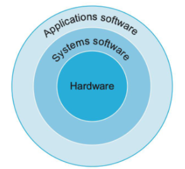
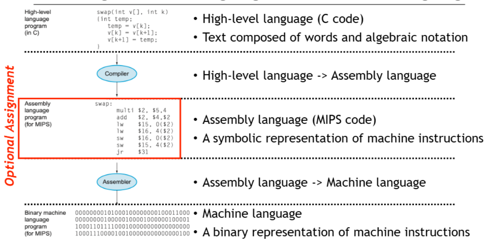

⚙ Computer Architecture 공부

* **System software** enable your **app software** to run on **hardware**
  * System software는 application과 hardware를 연결하는 다리 역할
* Two type of system sw
  1. **OS**
     1. **Allocates** memory and storage
     2. **Handles I/O** operations
     3. Coordinates concurrent applicaions
  2. **Compiler**
     1. 고급 언어로 작성된 프로그램을 하드웨어가 실행할 수 있는 명령어로 변환
     * ex: `c = a + b;` → `100111010`

## High-level language to Machine Language
---

> **High-level** language(C code): Text composed of words and algebraic notation 
> ↓ `Compiler`
> **<span style="color: #008000">Assembly language</span>**: A symbolic representation of **machine instructions**(대충 봐도 추측 가능)
> `Assembly language` → `Machine language`
> **<span style="color: #008000">Machine language</span>**: A **binary** representation of machine instructions
* `고급 언어(C) → 컴파일러 → 어셈블리 언어(MIPS) → 어셈블러 → 기계어`

## Instruction Set
---
* **Instruction**: 컴퓨터 언어의 단어
* **Instruction Set**: 특정 컴퓨터가 이해하는 명령어 목록
* 다른 컴퓨터 언어(Instruction Set)는 **서로 유사함**

## 💻MIPS ARITHMETIC Instructions
---
* **MIPS의 특징**
  * 각 명령어는 **하나의 연산만 수행**
  * 각 명령어는 **정확히 3개의 변수**를 가짐
  * **복잡한 연산은 여러 개의 명령어로 분해**해야 함

##### MIPS 기본적인 예시
```
add a, b, c  # a = b + c
sub a, b, c  # a = b - c
```
**그럼 여러 변수의 경우는?**
```
# C 언어: a = b + c + d + e;

# MIPS 명령어:
add a, b, c  # a = b + c
add a, a, d  # a = a + d
add a, a, e  # a = a + e
```
* 위의 예시처럼 **3개의 변수로 계산**하도록 분해해야함!!

##### C 프로그램을 MIPS 명령어로 변환하는 예제
**예제 1: 간단한 덧셈과 뺄셈**
```
# C 프로그램:
a = b + c;
d = a - e;

# MIPS 명령어:
add a, b, c
sub d, a, e
```

**예제 2: 괄호가 포함된 복잡한 수식**
```
# C 프로그램:
f = (g + h) - (i + j);

# MIPS 명령어:
add t0, g, h  # 임시 변수 t0에 g + h 저장
add t1, i, j  # 임시 변수 t1에 i + j 저장
sub f, t0, t1 # f = (g + h) - (i + j)
```
> 5개의 변수 필요, g+h를 담을 임시 변수가 필요함(t0)

### MIPS Registers
---
* MIPS CPU에는 **32개의 <span style="color: #008000">Registers</span>**가 있으며, **각 레지스터 크기는 32bits(32bits 단위는 "word"라 부름)**
* 명령어는 이를 **피연산자**로 활용
```
┌─────────┬───────────┬─────────────────────────────┐
│name     │register number│ 용도                    │
├─────────┼───────────┼─────────────────────────────┤
│ $zero   │ 0         │ 상수 0                      │
│ $v0-$v1 │ 2-3       │ 결과값과 수식 계산           │
│ $a0-$a3 │ 4-7       │ 인자(Arguments)              │
│ $t0-$t7 │ 8-15      │ 임시 변수                    │
│ $s0-$s7 │ 16-23     │ 저장된 변수                  │
│ $t8-$t9 │ 24-25     │ 추가 임시 변수               │
│ $gp     │ 28        │ 전역 포인터                  │
│ $sp     │ 29        │ 스택 포인터                  │
│ $fp     │ 30        │ 프레임 포인터                │
│ $ra     │ 31        │ 리턴 주소                    │
└─────────┴───────────┴─────────────────────────────┘
```

* 위의 register에 따라 예시 2를 다음처럼 바꿔볼 수 있다
```
# f,g,h,i,j를 각각 $s0, $s1, $s2, $s3, $s4에 저장 (#s0~7은 저장된 변수)
add t0, $s1, $s2   # 임시 변수 t0에 g + h 저장
add t1, $s3, $s4  # 임시 변수 t1에 i + j 저장
sub $s0, $t0, $t1 # f = (g + h) - (i + j)
```

### MIPS Constant
---
* constant를 연산에 사용하기 위한 **"immediate operation"** 제공
* `addi $s3, $s3, 4` → `$s3 = $s3 + 4`
* 세가지 연산 비교
```
┌─────────────┬─────────────┬───────────────┬────────────────┐
│ 명령어      │ 예시         │ 의미           │ 설명           │
├─────────────┼─────────────┼───────────────┼────────────────┤
│ add        │ add $s1,$s2,$s3 │ $s1=$s2+$s3 │ 레지스터 3개 사용 │
│ subtract   │ sub $s1,$s2,$s3 │ $s1=$s2-$s3 │ 레지스터 3개 사용 │
│ add immediate│ addi $s1,$s2,20│ $s1=$s2+20  │ 상수 더하기      │
└─────────────┴─────────────┴───────────────┴────────────────┘
```