>📚컴퓨터 네트워크 전공 수업 정리

## Client-server paradigm
---
* **server**:
  * **always-on host**
  * **permanent IP address**
  * often in data centers, for scaling

* **clients**:
  * contact, communicate with server
  * may have dynamic IP addresses

## Sokets
---
* process sends/receives messages to/from **soket**
* socket analogous to **door**
  * sending process relies on transport infrastructure on other side of door to deliver message to socket at receiving process
* socket interface b/w transfer layer

* 어떻게 process(soket)이 특정되는가?
  * **IP addr, port-number**을 통해
  * 예: web-server = `203.252.112.1:80`
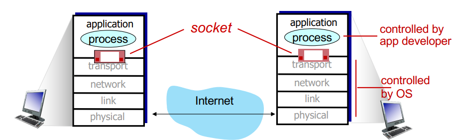

## Transport protocols
---
### TCP service
---
* **reliable transport** b/w sending and receiving process
* **flow control**: sender won't **overwhelm** receiver
* **congestion control**: throttle sender when network overloaded
* **connections-oriented**: setup required b/w client and server processes
* does no provide: timing, security, minimum throughput guarantee

### UDP service
---
* faster, lighter than TCP
* **unreliable data transfer**
* **dose no provide**: reliability, flow/congestion control, timing, throughput guarantee or connection setup

## Web and HTTP
### HTTP
---
**HTTP: hypertext transfer protocol**
* Web's application-layer protocol
* client/serve model
  * **client**: browser that requests, receives, (using HTTP protocol) and **displays** Web objects
  * **server**: Web server sends (using HTTP protocol) objects in response to requests
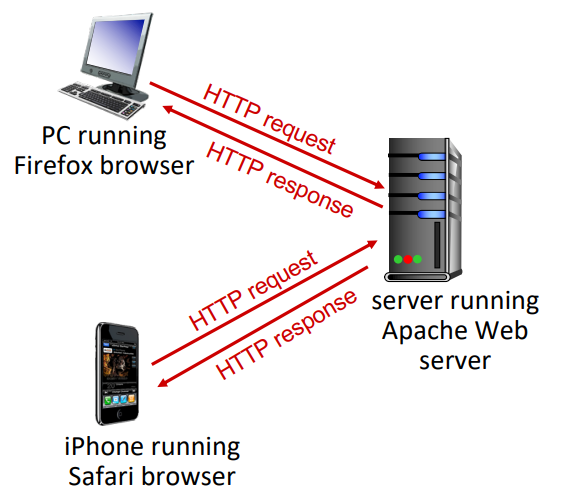

* **HTTP uses TCP**:
  1. client initiates TCP connection(**creates socket**) to server, port 80
  2. **server accepts TCP connection** from client
  3. HTTP messages(application-layer protocol messages) exchanged between browser(HTTP client) and Web server(HTTP server)
  4. TCP connection closed
  

* HTTP is **stateless**: 이전 요청을 기억하지 않는다.
#### Non-persistent/persistent HTTP
---
✅ **HTTP가 TCP를 사용하는 방식에는 2가지가 있다.**
1. **Non-persistent HTTP**
  * TCP connection을 요청이 들어올때마다 생성하고 끝나면 close
2. **Persistent HTTP**
  * 생성된 TCP connection을 계속 사용
  * Non-persistent보다 효율적
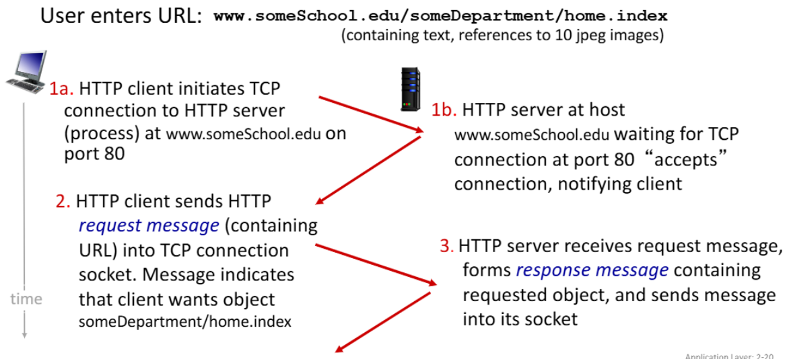
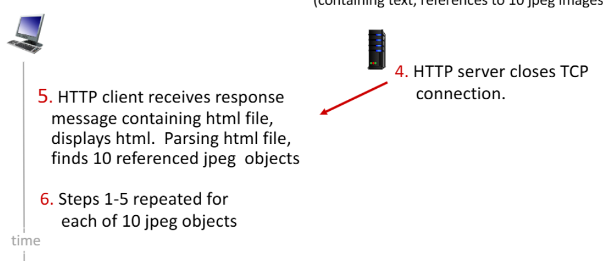

* **RTT(Round Trip Time)**: time for a small packet to travel from client to server and back
  * a small packet은 Transmission Delay를 무시한다는 뜻, 단위 패킷당 네트워크 왕복시간 정도로 해석

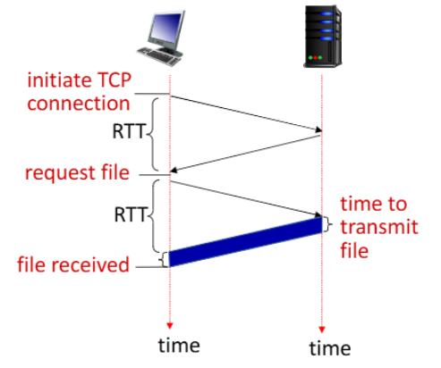
* Non-persistent HTTP의 경우
* **TCP 커넥션을 생성할 때 마다 1RTT가 소요.**
* **원하는 오브젝트를 받기위해 1RTT가 소요.**
* 즉 Non-persistent HTTP에서 오브젝트 하나당 `2RTT+file transmission time`가 소요되고 100개라면 200RTT가 소요

✅ 그래서 HTTP1.1 버전에서는 persistent HTTP를 지원!
* 서버가 Response를 보낸 후에도 **TCP 커넥션을 유지**
* 커넥션 연결에 1 RTT, 여러 오브젝트들을 전송하는데 약 1RTT
* 여러개의 오브젝트들을 보낸다해도 2RTT + a의 시간이 걸린다.

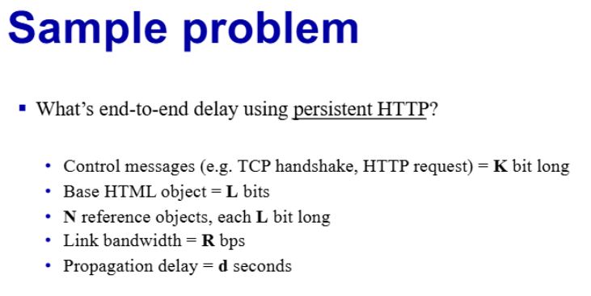
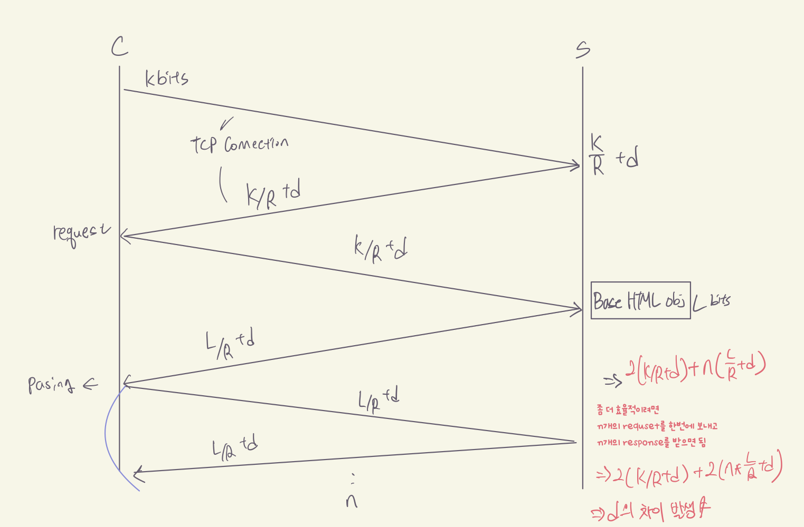

#### HTTP request/response Message
---
* **request message**
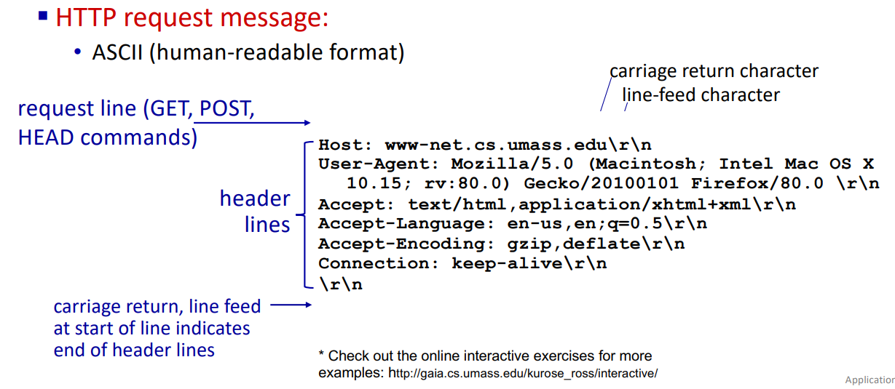
> 맨 윗줄에 `GET /index.html HTTP/1.1\r\n`
* `HEAD`: 테스트 목적으로, 본문을 받을 필요가 없을 때 사용
* `GET`: **조회용 메서드**. 파라미터를 URL에 `?`로 연결하여 보낸다.
* `POST`: **서버에 처리를 요청할 때 사용하는 메서드** 
* `PUT`: File Upload를 하고 싶을 때 사용

* **response message**
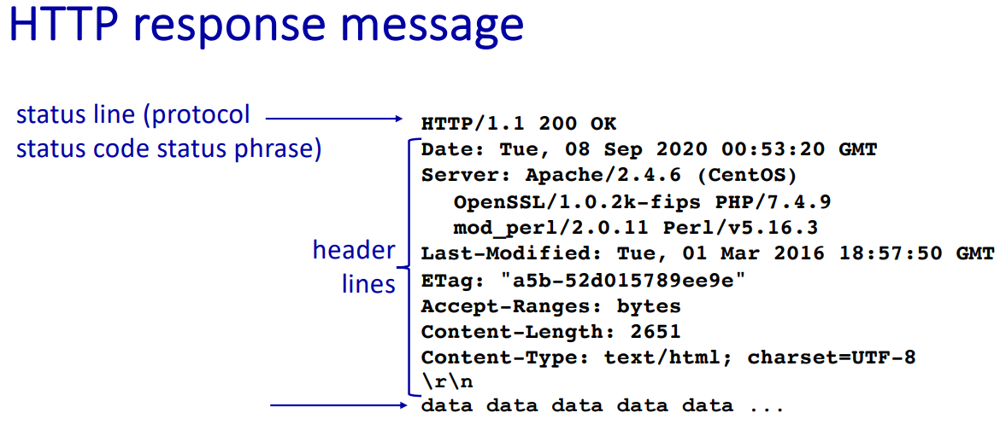
> data data data...: data, e.g. http request file
  * response status codes:
    * `200`: ok
    * `300`: Moved Permanently
    * `400`: Bad Request
    * `404`: Not Found
    * `505`: HTTP Version Not Supported

#### Cookies
---
**cookie**: HTTP의 `stateless`를 보완하기 위함
* **cookie의 four components**:
  1. cookie header line of HTTP response message
  2. cookie header line in next HTTP request message
  3. 사용자 브라우저에 의해 관리되는 사용자 호스트에 저장된 쿠키 파일
  4. back-end database at Web site

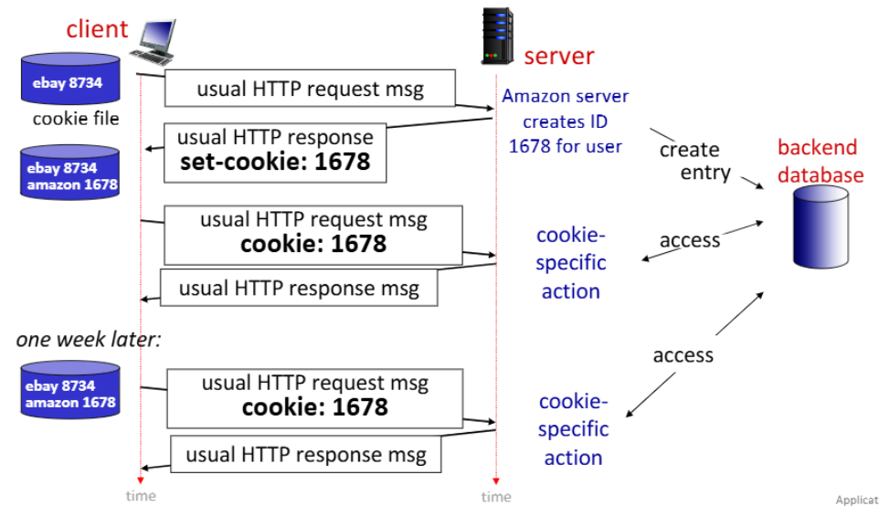

### Web cache
---
**Web cache**: 인터넷에서 자주 접근하는 웹 페이지나 콘텐츠를 **임시로 저장해두는 시스템**
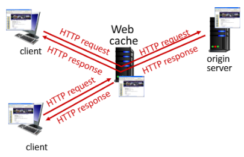
* "중간 저장소"로 작동
* **클라이언트와 원본 서버 사이에서 데이터를 전달**

* **operation of Web cache:**
1. **사용자 설정**: user configures browser **to point to a (local) Web cache**
2. **요청 전달**: browser **sends all HTTP requests to cache**
3. **캐시 확인:**
  * `if object in cache`: cache returns object to client
  * `else`: cache **requests object from origin server**, caches received object, then returns object to client

client가 request하면 server가 아닌 web 프록시(web cache)에서 response하며 http를 request받을때 procxy(web cache)에 정보가 없으면 server에서 프록시로 받아오고 다시 client한테 response. 그 담 요청에는 procxy에 저장되어 있는 정보를 바탕으로 바로 response함

* Web cache는 **server/client 역할을 동시**에 수행함.
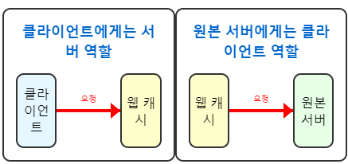
* 또한 origin server는 response header에 캐싱 정책을 명시 가능
  * `Cache-Control: max-age=<seconds>`: 해당 시간(초) 동안 캐싱 허용
  * `Cache-Control: no-cache`: 캐싱 금지

✅Web Caching이 왜 필요한가?  
1. `reduce response time`: cache is closer to client
2. `reduce traffic` on an institution’s access link
3. **Internet is dense with caches**: 인터넷에는 많은 캐시가 분산되어 있어 효율적인 콘텐츠 전달이 가능
4. `enables “poor” content providers` to **more effectively deliver content**

* web caching 시나리오
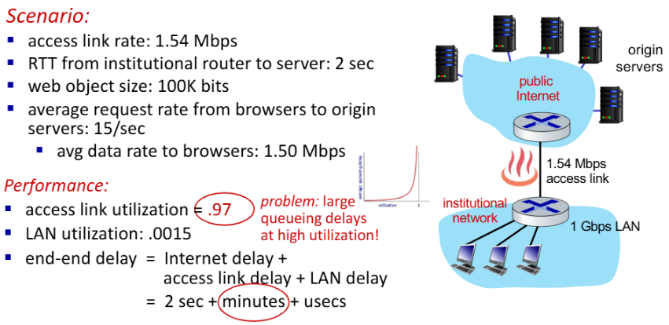
> **access link 사용률: 97% → 큰 대기열 지연**  

* 솔루션:
1. **buy a faster access link**
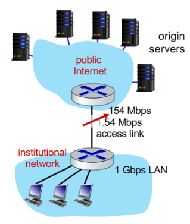
> access link: 1.54 Mbps → 154 Mbps (100배 증가)  
> access link 사용률: 0.97 → 0.0097 (97% → 0.97%)  
> end-end time = 2초 + 밀리초 + 마이크로초
* 이 방법은 효과적이지만 **비용이 많이 드는 해결책**

2. **install a web cache**
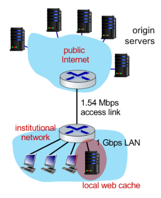
> `cache hit rate`가 40%인 경우
> **40%의 요청은 캐시에서 낮은 지연 시간(밀리초)으로 처리**  
> **60%의 요청은 여전히 원본 서버에서 처리**  
> 평균 지연 시간 = 0.6 * (원본 서버에서의 지연) + 0.4 * (캐시에서의 지연)  
> = 0.6 * (2.01초) + 0.4 * (밀리초) ≈ 1.2초

### Conditional GET
---
📚**Conditional GET**: client의 cache에 이미 최신 버전의 객체가 있다면, 서버가 객체를 다시 보내지 않도록 하는 것

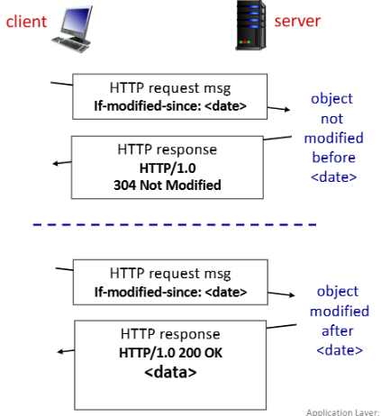
✅**작동 방식:**
1. `Client`: HTTP 요청에 `If-modified-since: <date>` 헤더를 포함하여 **자신이 가진 캐시된 버전의 날짜를 명시**
2. `Server`: 
  * 요청받은 객체가 **날짜 이후로 변경되지 않았다면** → `HTTP/1.0 304 Not Modified` 응답 (객체 데이터 없음)
  * 요청받은 객체가 **날짜 이후로 변경되었다면** → `HTTP/1.0 200 OK` 응답과 함께 **새로운 객체 데이터 전송**

### HTTP1.1, 2, 3
---
💻 **HTTP/1.1**  
  * **Pipelining**: 단일 TCP 연결에서 여러 GET 요청을 순차적으로 보낼 수 있음
  * **FCFS(First-Come-First-Served) Scheduling**: 서버는 요청 받은 순서대로 응답
  * **HOL(Head-of-Line) 블로킹 문제 발생**:
    * 큰 객체 뒤에 작은 객체가 대기해야 하는 상황 발생
    * TCP 패킷 손실 시 모든 객체 전송이 지연

💻 **HTTP/2**  
  * HTTP/1.1과 호환성 유지
  * **Priority Scheduling**: 클라이언트가 지정한 **우선순위에 따라 전송 순서 결정**
  * **Server Push**: **클라이언트가 요청하지 않은 객체도 서버가 미리 전송 가능**
  * **프레임 분할 및 interleaving**: 객체를 작은 프레임으로 나누어 전송하여 HOL 블로킹 완화
    * 객체를 작은 프레임으로 나누어 interleaving 방식으로 전송
    * **큰 객체(예: 비디오 파일)가 전송되는 도중에도 작은 객체(예: CSS, JS 파일)들이 함께 전송가능** → HOL 블로킹 문제를 크게 완화
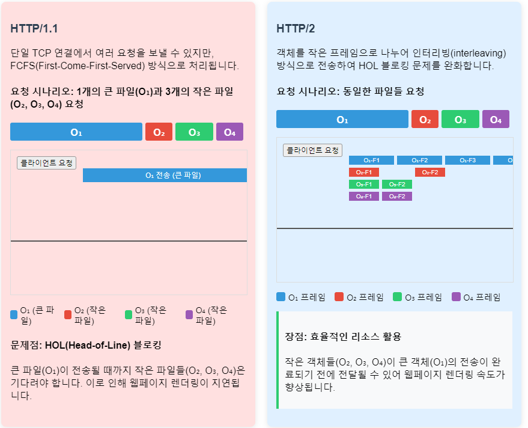
* HTTP/2 한계
  * 단일 TCP 연결에 의존 → **패킷 손실 발생 시 모든 객체 전송이 지연**
  * TCP 연결 자체에는 **기본적인 보안 메커니즘이 없음**

💻 **HTTP/3**  
* **UDP 기반**의 `QUIC protocol` 사용
* **향상된 보안**: 기본적으로 암호화 제공
* **객체별 오류 및 혼잡 제어**: 하나의 객체 전송 문제가 다른 객체 전송에 영향을 미치지 않음
* **more pipelining**: 병렬 처리 기능 향상

### E-mail, SMTP
---
E-mail의 3가지 구성요소
1. **user agent**
2. **mail servers**
3. SMTP(simple mail transfer protocol)

* **user agent:**
  * a.k.a. “mail reader”
  * outgoing, incoming messages stored on server
* **mail servers**:
  * **mailbox**: contains incoming messages for user
  * **message queue** of outgoing (to be sent) mail messages

**SMTP** between mail servers to send email messages  
* **client**: sending mail server
* **server**: receiving mail server

