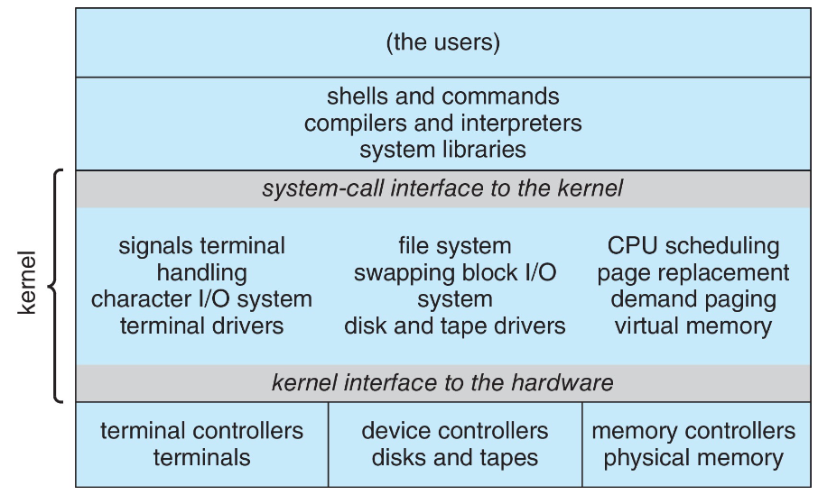
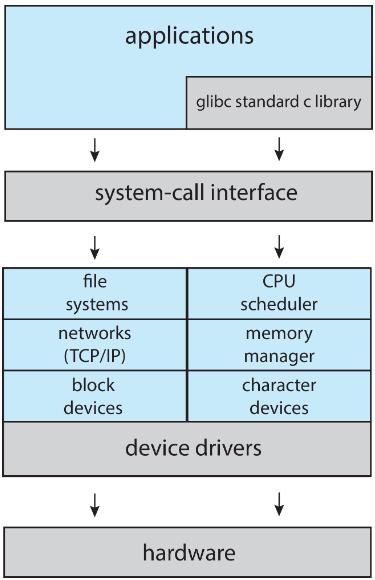
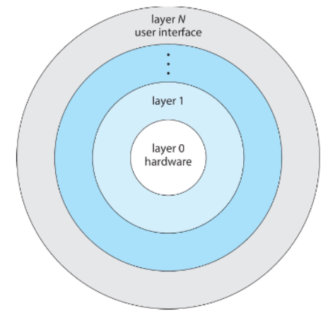
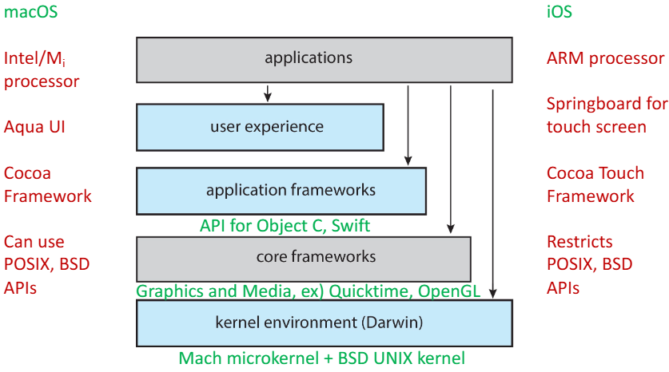
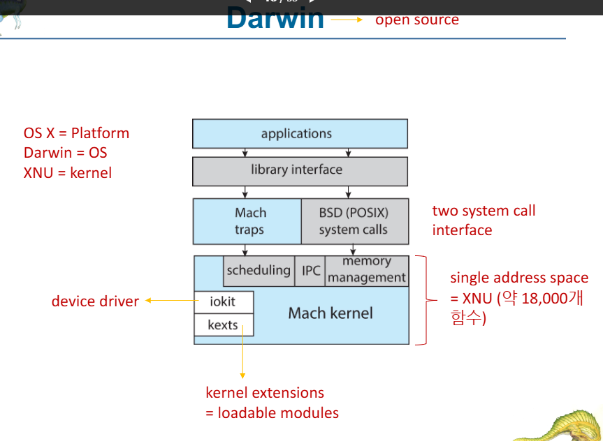
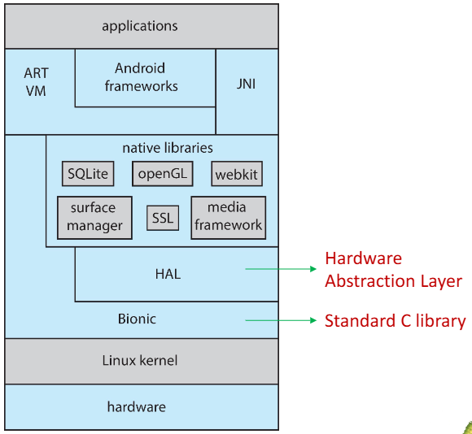
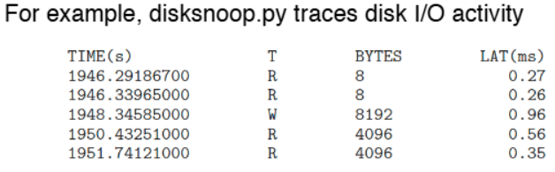

>🍀 운영체제 전공 수업 정리

## Operating system Design and Implementation
---
* OS Design is Not a Simple Problem("**Solvable**")
  * However, some approaches have been successful
* 운영체제의 내부 구조는 다양함
  * 하드웨어 및 시스템 유형에 따라 차이가 있음
* **Start by Defining Goals and Specifications**
* **OS Goals**: 
  * **User Goals**: OS should be easy to **use, learn, reliable, safe, fast**
  * **System Goals**:OS should be easy to **design, implement, maintain, flexible, reliable, error-free, efficient**

?**Key Principle in OS Design**
* **Policy**: "What will be done?"
* **Mechanism**: "How to do it?"
* **Mechanism Defines Methods, Policy Determines Decisions**
  * 운영체제에서 정책과 메커니즘을 분리하면 유연성을 높일 수 있음
* Importance of **Separating Policy & Mechanism**
  * 정책이 바뀌어도 메커니즘을 수정하지 않아도 됨
  * Ex:
    * **Policy**: Limit CPU usage time
    * **Mechanism**: Use a timer to measure execution time
    * CPU를 시간 제한을 두지 않으면 어느 한 사람이 독점해버리는 문제가 생길 수 있다 
    * **시간 제한을 두는 원칙을 Policy**로 정했다면 **어떻게 무슨 방법으로 시간을 제한할 건지 정하는건 Mechanism**
* OS Design is a **Highly Creative Software Engineering Task**

### Implement
---
OS는 다양한 언어로 구현됨
* 초창기: **assembly language**
* 이후: Algol, PL/1 등의 **system programming languages**
* 현재: **C/C++**

OS는 일반적으로 **여러 언어의 mix**임
* **Lowest levels in assembly**
* **Main body in C**
* **Systems programs: C, C++, Python, Perl, Shell Script**

* Higher-Level Languages easier to <u>**port** to other hardware</u>, but **slower**(이식성↑, 성능↓)
* **Emulation** enables OS to run on Non-Native Hardware(비원본 하드웨어)

## OS Structure
---
**Various ways to structure ones**
* Simple structure ? `MS-DOS`
* More complex ? `UNIX`
* Layered ? `an abstraction`
* Microkernel ? `Mach`

### Monolithic(단일) Structure ? Original UNIX
---
단일 계층으로 되어있는 시스템
* 단일 계층: **계층화X**, 한 개의 층에 `file system`, `CPU Scheduling` 등등 다 넣은 구조
* **Limited by hardware functionality** and **had minimal structuring**
* 2가지 주요 구성 요소
  * **System Programs**
  * **The Kernel**:
    * Operates **below the system-call interface** and **above hardware**
    * Provides core OS functionalities(`File System`, `CPU Scheduling`, `Memory Management`)
* **모든 기능이 하나의 레벨(one level)에서 수행**됨(Monolithic Structure)

>Original UNIX
>모든 기능이 커널 내에서 하나의 레벨로 작동함

>모놀리식 커널이지만, 모듈화를 통해 보다 유연하게 기능을 추가 및 제거할 수 있음

### Layered OS Architecture
---
📚 The operating system is divided into a number of layers(levels)
* The bottom layer(layer 0) is the **hardware**; the highest (layer N) is the **user interface**

> Layered

* With **modularity**, layers are selected such that each uses functions(operations) and services of **<u>only lower-level layers</u>**
  * 상위 계층에서 하위 계층을 호출할 수가 있지만 반대는 안 됨

### Microkernels
---
* **Moves** as much from the kernel into **user space**
* **Mach** example of **microkernel**
  * **Mac OS X kernel(Darwin)** partly based on **Mach**
* **Communication takes place between user modules using message passing**
  * 보통 사용하는 **monolithic kernel에서는 API를 통해서(func call) 서비스를 제공**하지만 **microkernel은 message passing을 통해 제공**함
  * 그럼 function call을 단순히 messeage 형태로 바꾼게 아닌가?
  * function call은 동기식이지만 messeage passing은 동기식, 비동기식 둘다 가능하다
  * 동기식은 messeage가 올 때까지 기다리지만 비동기식은 메세지가 오면 나중에 확인하고 그때 회신하는 개념

✅ **Benefits of Microkernel**  
1. **Easier to extend a microkernel**: 새로운 기능 추가 시 커널을 직접 수정하지 않고 새로운 서비스 모듈을 추가하는 방식으로 확장 가능
2. **Easier to port the operating system to new architectures**: 하드웨어 의존성이 낮아 새로운 아키텍처(CPU, 하드웨어)에 쉽게 port 가능
3. **More reliable**: Kernel Mode에서 실행되는 코드가 줄어들어 운영체제가 더욱 안정적
4. **More secure**

✅ **Detriments of Microkernel**  
* Performance **overhead of user space to kernel space communication**
  * Microkernel에서는 여러 사용자 모듈 간 `Message Passing` 방식으로 통신해야 하므로, **성능 저하(Overhead)** 문제가 발생할 수 있음.

### Modules
---
* Many modern operating systems implement **loadable kernel modules(LKMs)**
  * Uses **object-oriented(객체지향)** approach
  * Each core component is **separate**
  * Each **communicate to the others over known interfaces**
  * Each is **loadable as needed within the kernel**(필요할 때만 동적으로 로드 가능)
* Overall, similar to layers but with **more flexibility**
  * Examples: **Linux**, **Solaris**, etc.

### Hybrid Systems
---
* 대부분의 최신 운영체제는 **단일한 순수한 모델이 아님**
* **Hybrid combines multiple approaches** to address performance, security, usability needs
  * **Linux and Solaris kernels**: `Monolithic` + `modular` → **dynamic loading** of functionality(새로운 기능을 쉽게 추가 가능)
  * **Windows**: `Monolithic` + `Microkernel` → for different **subsystem personalities**
  * **Apple Mac OS X**: 
    * hybrid, layered, **Aqua** UI plus **Cocoa** programming environment
    * `Mach microkernel` + `BSD Unix` + **I/O kit and dynamically loadable modules(called kernel extensions)**

#### MacOS and iOS Structure
---

> macOS and iOS Structure

#### Darwin Structure
---

> Darwin Structure
* **Two System Call Interfaces**
  * **Mach Traps**: Mach 마이크로커널에서 제공하는 시스템 호출
  * **BSD(POSIX) System Calls**: UNIX/POSIX 표준을 지원하는 BSD 커널의 시스템 호출

#### Android 
---
Developed by Open Handset Alliance(**mostly Google**)
* **Open Source**
* Similar stack to iOS
* Based on **Linux kernel but modified**
  * `process`, `memory`, `device-driver management` 제공
  * Adds power management
* Runtime Environment
  * **핵심 라이브러리**와 **ART(Android Runtime) virtual machine** 포함
  * Apps은 **Java 및 Android API를 기반**으로 개발됨
  * **Java class files** → Java bytecode **변환** → **ART VM에서 실행**
* Libraries: `web browser(webkit)`, `database(SQLite)`, `multimedia`, `smaller libc`
* **Dalvik VM**: **JIT(Just-In-Time) Compilation**
* **ART VM**: **AOT(Ahead-Of-Time) Compilation**

> Android Structure

* **ART(Android Runtime) VM**: 안드로이드 애플리케이션 실행 환경
* **JNI(Java Native Interface)**: **Java 코드가 네이티브 C/C++ 코드와 통신**할 수 있도록 지원
* **HAL(Hardware Abstraction Layer)**: Hardware와 Software 사이에서 Hardware 기능을 소프트웨어적으로 접근할 수 있도록 지원하는 계층

## System Boot
---
📚 When power is initialized on the system, execution starts at a **fixed memory location**
* OS는 하드웨어에서 사용 가능하도록 로드되어야 함
✅ **Booting Process**  
1. **BIOS / UEFI 실행 (Executing BIOS / UEFI)**
   * `Small piece of code`가 **ROM** or **EEPROM**에 저장됨
   * 이를 통해 **커널을 찾고**, **메모리에 로드 후 실행**
   * Modern systems replace BIOS with **UEFI (Unified Extensible Firmware Interface)**
2. **Boot Block 활용 (Optional Two-step Process)**
   * **Boot Block**이 **ROM 코드**에 의해 실행됨
   * Boot Block이 디스크에서 **bootstrap loader**를 로드하여 실행
3. **Bootloader Execution - GRUB 사용**
   * **GRUB (Grand Unified Bootloader)**를 통해 여러 OS 커널을 선택 가능
4. **Kernel Loads and System Running**

* **GRUB(Grand Unified Bootloader)** 역할
  * GRUB는 Linux에서 주로 사용되며, 다양한 부팅 옵션을 지원
  * 부팅 시 사용자가 원하는 커널을 선택 가능
  * GRUB는 **open source**로 개발됨

## Operating System Debugging
---
📚 **Debugging is finding and fixing errors, or bugs**
* OS generate **log files** containing **error information**
* **Core Dump & Crash Dump**
  * **Core Dump와 Crash Dump**는 프로그램 및 OS 오류 발생 시 필수적인 **디버깅 도구** 
  * **Core Dump**: 프로그램이 비정상적으로 종료될 때, **<u>프로세스의 메모리 상태</u>를 저장한 파일**
  * **Crash Dump**: 운영체제가 비정상적으로 종료될 때, **<u>커널 메모리 상태</u>를 저장한 파일**

* **Performance Tuning(성능 최적화)**
  * **Trace Listings(추적 목록)**: **프로그램 실행 중의 활동을 기록**하여 분석하는 기법
  * **Profiling**: **주기적으로 Instruction Pointer를 샘플링**하여 성능 분석
  * Improve performance by removing **bottlenecks(병목 현상)**
  * OS must **provide means of computing and displaying measures of system behavior**
    * For example, **“top” program(Linux)** or **Windows Task Manager**

* **Kernighan's Law**
  * "디버깅은 코드를 작성하는 것보다 두 배 더 어렵다"
  * "코드를 가능한 한 스마트하게 작성했다면, 디버깅을 할 만큼 똑똑하지 않을 가능성이 높다"
  * 즉, 지나치게 복잡한 코드를 작성하면 디버깅이 어려워진다는 의미!!

### Tracing
---
* **Tracing**: Collects data for a specific event, such as steps involved in a system call invocation  
  → **시스템이 어떤 순서로 어떤 자원에 접근하는지 추적 가능**

  * 대표적인 트레이싱 도구들
    * `strace`: 특정 **프로세스가 호출하는 system call**을 추적함 (ex: 파일 열기, 읽기, 쓰기 등)
    * `gdb`: GNU Debugger. **소스 코드 단위의 디버깅 도구** (breakpoint 설정, 변수 확인 등)
    * `perf`: **Linux 내장 성능 분석 툴 모음**. CPU 사용량, 캐시 미스 등 하드웨어 성능도 추적 가능
    * `tcpdump`: **collects network packets**

### BCC
---
`user-level code`와 `kernel code` 사이의 상호작용을 **debugging**하는 것은 이를 모두 이해하고 분석할 수 있는 **toolset** 없이는 거의 불가능함

📚**BCC = BPF Compiler Collection**: **리눅스를 위한 강력한 트레이싱 도구 모음**
  * 기반 기술은 eBPF (Extended Berkeley Packet Filter)

> disk I/O 활동 추적 도구

> Linux bcc/BPF Tracing Tools