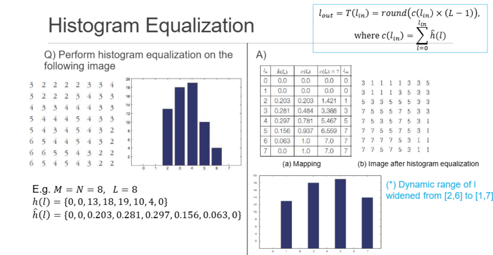

👓Computer Vision 정리

## Image
---
### Digital Camera vs Human eye
---

* **Similarities between human eye and digital camera**
  * Lens, iris(aperture), ...
  * Retina corresponds to **image sensors** (i.e. CCD, CMOS)

* **Digital Image sensor**
  * `CCD(Charge-coupled device)` - 광자가 들어와서 센서를 때리면 charge가 됨 -> pixel to pixel로 **전달**되며 output이 나옴
  * `COMS(Complementary metal oxide on silicon)` - 각 픽셀에서 직접 전압 신호로 변환하는 방식

### Digital image
---

* `Sampling` - **2차원 이미지는 M x N(ex 12의 격자) 으로 샘플**되며 그 이미지가 
* `Quantuzation` - **밝기 level도 quantized**해서 나타냄(설정한 양자화 level에 따라서, 2의 제곱수로 하며 편함 0~255같은)

### Image Coordinate system
---

* 이미지는 기본적으로 **2차원배열**, 각각은 pixel
* 각각의 pixel의 주소를 부여해야함 **f(j,i) / f(y,x) (y=세로축, x=가로축)** 이건 흑백의 경우
* 각각의 pixel은 샘플링 된 점이다. 그래서 정수의 좌표를 가지게 됨
* **Color image**: **각각 pixel은 2차원 값을 3개 가진다.**
  * `fr(x)`, `fg(x)`, `fb(x)`

* 정수가 아닌 실수를 써야할 경우가 있음(이미지 보정 등에 사용)

## Color models
---
* 우리 눈은 380-750nm 안에 있는 빛(가시광선)만 볼 수 있다
* 수식은 외우지 말고 모델이 뭐가 있는지 알고 있을것

### Tri-stimulus theory
---

* **Tri-stimulus theory**: 우리 눈에는 RGB를 받아 들일 수 있는 3개의 세포(원추세포(cone cell))가 있다.
* 다른 색상은 RGB파장의 조화를 통해 나타내자는 이론

### XYZ Color model
---

* Tri-stimulus: 음수값이 있지만 이걸 없애기 위해 가중치를 더해 양수를 만들자는 모델
* `X=red`의 가중치, `Y=green`의 가중치, `Z=blue`의 가중치
* `Y-axis`는 **휘도**라고 불린다.
* x,y,z의 sum은 무조건 1

### RGB color Model
---

* Red(1,0,0), Green(0,1,0), Blue(0,0,1)
* 모든 색은 정육면체 안에서 나타낼 수 있다.

#### Color filter arrays
---

> 오른쪽은 Bayer pattern

* 각각의 색을 구별하기 위해 fliter를 씌운다.
* red만 sense하기 위해서 color filter를 씌우면 red만 인식함
* 많이 쓰는 패턴은 **Bayer pattern**(green은 휘도에 많은 영향을 끼치기 때문에 1/2을 사용함)

#### Represent RGB color model
---

### YCrCb/YUV/YIQ Color Model
---

* 값은 외울 필요 X

### HSV Color model
---
* 사람은 색을 색조(Hue),채도(Saturation),명도(Value) 이 3가지로 인식을 하게 된다.

## Image processing operators
---
한 이미지의 픽셀들의 값을 변경해서 이미지에 적용하는 연산자들이 있다.

1. **Point operator**: 각각의 pixel에 **독립적으로 연산**해서 처리(하나의 이미지에서 가능)
2. **Neighborhood operator**: 하나의 pixel값을 변경하기 위해 **주변의 pixel까지 고려해서 처리**(이미지를 두개로 만들어서 하나는 저장용, 하나는 계산용)
3. **Geometric transformation**: global operation 즉 **전체의 값을 한번에 변경함**(회전, 이동, 확대/축소, 왜곡 등)

### Point operator
---
📚**point operator**: 각 픽셀의 값만을 이용해서 **독립적**으로 그 픽셀의 값만을 변환하는 연산자  

* ex: 밝기 조정, 대비 조정, 감마 보정 등

* 일반적인 pointer operator의 표현:
$$f_out​(x,y)=t(f_in​(x,y))$$
* $𝑓_in(𝑥,𝑦)$: 입력 픽셀 값
* $𝑓_out(𝑥,𝑦)$: 출력 픽셀 값
* $t$: 픽셀 값을 변환하는 함수

#### Linear Point Operators
**linear operators**: **두 이미지 $f_0$. %f_1%을 각각 연산한 후 더한 결과 = 두 이미지를 더한 후 연산한 결과**

$$t(f_0+f_1) = t(f_0)+t(f_1)$$

✅ **밝기 조정 연산** 
* 밝게 만드는 연산:
$$f_out(j,i) = min(f_in(j,i)+a,L-1)$$
* 어둡게 만드는 연산:
$$f_out(j,i) = max(f_in(j,i)+a,0)$$
* 반전 연산:
$$f_out(j,i) = (L-1)-f_in(j,i)$$

* $a$: 밝기 조정값
* $L$: 픽셀 값이 가질 수 있는 최대값(보통 256)

> linear point operator 예시  
> 밝기 조정 및 반전

✅**Linear Blend 연산**  
두 이미지를 혼합하여 중간 단계의 이미지를 생성한다
* 혼합 연산:
$$f_out(j,i)=\alphaf_1(j,i)+(1-\alpha)f_2(j,i)$$
* alpha가 0에서 1로 변할 때 이미지가 점진적으로 변형

> 각각 1번, 6번이 2개의 사진이다. 그 사이에는 중간 사진

#### Non-linear point operator-Gamma correction
---
📚**Gamma Correction**: 이미지의 밝기 수준을 비선형적으로 조정
모니터(CRT)의 **출력 밝기가 입력 신호와 비선형 관계**에 있기 때문에 보정이 필요

> $\gamma$값에 따라 이미지의 밝기가 비선형적으로 바뀜
> > $\gamma<1$: 이미지가 전체적으로 밝아짐(어두운 부분 강조)
> > $\gamma>1$: 이미지가 전체적으로 어두워짐(밝은 부분 강조)

* 전류(V)에 gamma(r)을 제곱하여 명도를 조절함
* **감마값을 두배로 해도 밝기가 비례로 가지 않는다**

#### Compositing and matting
---
* **Matting**: 사진의 foreground 물체만 인식해서 추출(예: 크로마키)
* **Compositing**: 뽑아낸 물체를 background 위에 놓음(예: 배경 합성)
* 각각의 pixel에 RGB에 4번째 채널 A(alpha)값(투명도)을 이용해서 더한다
  * $\alpha=1$: 완전 불투명
  * $\alpha=0$: 완전 투명

> C: 최종 합성이미지  
> B: Background  
> F: Foreground  
> $\alpha$: 각 픽셀의 투명도

### Histogram Equalization
---
{:.prompt_warning}
> what is histogram?

이미지에서 **밝기 값의 분포**를 나타낸 그래프
→ Count the total number of pixels for each brightness value in `[0, L-1]`
* **Normalized histogram**: 이미지의 **밝기 분포를 넓게 펴서**, 대비를 높이는 연산

> $\hat{h}(l)$: **Normalized histogram 값**
> $c(l_in)$: 누적 분포 함수
> $T$: 변환 함수
* 즉, 밝기 값이 $l_in$이었던 픽셀은 $T(l_in)$이라는 새 밝기 값으로 바뀜

* Find a mapping function f(I) to make histogram flat
* Improve the visual appearance of image by increasing the dynamic range of colors

>사진을 보면 대조가 잘보이게 변경되어 얼룩말은 더 좋아졌지만 새 사진은 노이즈처럼 보이게 됨

그럼 어떻게 하는가?
* 누적 히스토그램(**cumulative histogram)**을 구한다

> $\hat{h}(l)=h(l)​/M*N=h(l)/64​⇒{0,0,0.203,0.281,0.297,0.156,0.063,0}$  
> $c(l)=\displaystyle\sum_{k=0}^l \hat{​h}(k)⇒{0.0,0.0,0.203,0.484,0.781,0.937,1.0,1.0}$  
> $l_out$ 계산(소수점 반올림) -> (A) 도표를 이미지에 적용  
> 히스토그램이 골고루 분포(원래 밝기 값이 (2,6)사이 였는데 (1,7)로 넓어짐)

하지만 이미지에 밝은 영역과 어두운 영역이 동시에 존재하면?? 
→ 한쪽은 좋아지지만, 다른 쪽은 망가짐!

* 해결방법:
  * 이미지를 여러 개의 작은 MxM 블록으로 나눠서 각 블록마다 `Histogram Equalization` 수행

✅ 이 방식은 픽셀 주변을 고려하기 때문에 더 이상 Point Operator가 아니다! (이건 지역 연산이니까)