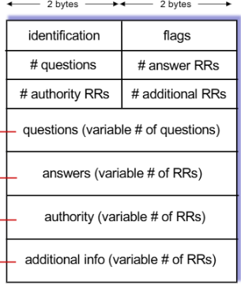

>📚컴퓨터 네트워크 전공 수업 정리

## DNS(Domain Name System)
---
**<span style="color: #008000">DNS</span>**: 인터넷에서 사람이 이해하기 쉬운 `domain name`(예: google.com)을 컴퓨터가 이해할 수 있는 `IP address`(예: 172.217.21.24)로 변환해주는 시스템
DNS는 **UDP packet으로 전송**된다.

{:.prompt-warning}
> 그러면 IP address와 domain name 사이를 어떻게 매핑하는가?
> 

그게 DNS가 하는 역할이다

##### ✅ DNS의 주요 서비스
1. **<span style="color: #008000">hostname-to-IP-address translation</span>**: 도메인 이름을 IP 주소로 변환
2. **<span style="color: #008000">host aliasing</span>**: 하나의 서버에 여러 도메인 이름을 지정 가능
3. **<span style="color: #008000">mail server aliasing</span>**
4. **<span style="color: #008000">load distribution</span>**: 하나의 도메인 이름에 여러 IP 주소를 연결하여 트래픽을 분산
   
##### ❌ DNS를 centralize 하지 않는 이유
* **Single Point of Failure**: 중앙 서버가 다운되면 전체 인터넷이 마비
* **traffic volume**: 엄청난 양의 쿼리를 하나의 서버가 처리하기 어려움
* **distant centralized database**: 지리적 거리로 인한 지연 시간이 발생
* **maintenance**

**그래서 DNS는 분산 데이터베이스, 계층적 구조를 가진다.**

### DNS hierarchical structure
---


##### 1. Root DNS Servers
📚 `ICANN`이 직접 관리하는 절대 존엄 서버로, `TLD DNS 서버 IP`들을 저장해두고 안내하는 역할  
* 전 세계에 13개의 논리적 루트 서버가 있다.

모든 DNS 서버들은 이 `Root DNS Server`의 주소를 **기본적으로 갖고 있다**
그래서 **모르는 Domain name이 온다면 가장 먼저 Root DNS에게 물어보게 되는 것**
하지만 `Root DNS Server`의 목록에도 해당 `Domain Name의 IP 정보`가 없다면 **다음 DNS 서버로 리턴**을 해준다.
그것이 바로 **<span style="color: #008000">TLD(최상위 도메인) servers</span>**
* `Root DNS Server` : "나한텐 해당 도메인 주소가 없다. 대신 google.com의 주소중 .com의 주소를 알고 있으니, com DNS주소에게 물어봐라."

##### 2. TLD servers(Top-Level Domaion)
📚 `.com`, `.org`, `.net`과 같은 **일반 최상위 도메인**과 `.kr`, `.jp`, `.uk`와 같은 **국가 코드 최상위 도메인**을 관리  

* 다양한 기관에서 관리:
  * **Network Solutions**: `.com`, `.net` **TLD 관리**
  * **Educause**: `.edu` **TLD 관리**

##### 3. Authoritative DNS Servers
📚 **<span style="color: #008000">각 조직의 DNS 서버</span>**로, **해당 조직의 도메인 이름에 대한 IP 주소 매핑**을 제공  

만일 `google.com`을 요청했다면, **TLD 서버**에서 `.com`을 파악하고 **그 앞에 달린 문자열을 보고 구글 서버에게 요청**

##### 4. Local DNS server
* 컴퓨터의 LAN선을 통해 인터넷이 연결되면, 가입했던 각 **통신사의 기지국 DNS 서버(<span style="color: #008000">local DNS server</span>)가 등록되게 된다.**
* 사용자가 DNS 쿼리를 요청하면, 이는 <u>먼저</u> local DNS 서버로 전송된다.
* local DNS server의 두가지 응답:
  1. `local cache`에서 **최근 이름-주소 변환 쌍을 확인**(캐시가 오래되었을 수 있음)
  2. DNS 계층 구조로 요청을 전달하여 해결

### DNS name resolution
---
#### 1. iterated query(반복 쿼리)

1. `engineering.nyu.edu`에 있는 사용자가 `gaia.cs.umass.edu의 IP 주소`를 알고 싶어함
2. 사용자는 `local DNS 서버(dns.nyu.edu)`에 쿼리를 전송
3. **local DNS 서버**는 **root DNS 서버**에 쿼리를 전송
4. root DNS 서버는 `.edu` 도메인을 담당하는 `TLD(Top-Level Domain) DNS 서버 정보`를 return
5. **local DNS 서버**는 **TLD DNS 서버**에 쿼리를 전송
6. TLD 서버는 `umass.edu` 도메인을 담당하는 `authoritative DNS 서버(dns.cs.umass.edu) 정보`를 return
7. **local DNS 서버**는 **authoritative DNS 서버**에 쿼리를 전송
8. 권한 있는 DNS 서버는 `gaia.cs.umass.edu의 IP 주소`를 return
9. local DNS 서버는 이 IP 주소를 사용자에게 전달

#### 2. recursive query(재귀 쿼리)

1. 사용자는 local DNS 서버에 `gaia.cs.umass.edu의 IP 주소`를 요청
2. **local DNS 서버**는 **root DNS 서버에 재귀적 쿼리**를 전송
3. **root DNS 서버**는 **TLD DNS 서버에 쿼리**를 전송
4. **TLD DNS 서버**는 **authoritative DNS 서버에 쿼리**를 전송
5. **authoritative DNS 서버**는 **TLD DNS 서버에 return**
6. **TLD DNS 서버**는 **root DNS 서버에 return**
7. **root DNS 서버**는 **local DNS 서버에 return**
8. **local DNS 서버**는 **사용자에게 return**

### DNS Caching
---
위 과정을 통해서 우리는 `gaia.cs.umass.edu`의 IP주소를 받아왔다.

몇 분 후 다시 `gaia.cs.umass.edu`에 방문하려고 했을 때, 또다시 위와 같은 과정을 반복해서 IP 주소를 받아와야하나?

그러면 너무 비 효율적이다.
때문에, PC에는 **<span style="color: #008000">DNS Cache</span>**라는 Cache를 활용해 **<u>Cache안에 자주쓰는 Domain Name 주소를 저장</u>s**해 놓는다.
* 캐시 항목은 **일정 시간(TTL, Time To Live)이 지나면 만료**된다.

### DNS Records
---
📚 DNS는 **분산 데이터베이스**로, **다양한 유형의 <span style="color: #008000">resource record(RR)</span>를 저장**
* RR format
```
RR format: (name, value, type, ttl)
```

✅ **DNS record type:**  
1. `A` **record** (Address)
  * `name`: **hostname**
  * `value`: **IP address**
  * ex: (example.com, 192.168.1.1, A, 3600)
2. `NS` **record** (Name Server)
  * `name`: **domain**
  * `value`: **도메인의 authoritative name 서버의 호스트 이름**
  * ex: (example.com, ns1.example.com, NS, 86400)
3. `CNAME` **record** (Canonical Name)
  * `name`: **별칭 이름**
  * `value`: **정식(canonical) 이름**
  * ex: (www.example.com, example.com, CNAME, 3600)
4. `MX` **record** (Mail Exchange)
  * `name`: **domain**
  * `value`: **해당 도메인과 관련된 메일 서버 이름**
  * ex: (example.com, mail.example.com, MX, 3600)


### DNS protocol messages
---
DNS 쿼리와 응답 메시지는 동일한 형식을 가진다.



✅**DNS 메시지 구조:**  
1. **message header**
  * **identification**: 쿼리를 식별하는 16비트 번호, 응답 시 같은 번호 사용 
  * **flag**: 쿼리/응답, 재귀 희망, 재귀 가능, 응답이 권한 있는지 여부 등
2. **section**
  * **questions**: 쿼리의 name, type 필드
  * **answers**: 쿼리에 대한 응답 RR
  * **authority**: 권한 있는 서버에 대한 레코드
  * **additional**: 추가 "도움이 될 만한" 정보


## P2P(Peer-to-Peer) Architect
---
📚 **<span style="color: #008000">P2P/</span>**: **서버 없이** 클라이언트(피어)끼리 통신하는 것

✅ 특징:  
* **중앙 서버 없음**
* **직접 통신**: 참여하는 시스템들이 **서로 직접 통신**
* 피어들은 다른 피어들에게 서비스를 요청하고, 또한 다른 피어들에게 서비스를 제공
* **자가 확장성**: 새로운 피어는 새로운 서비스 용량과 새로운 서비스 수요를 함께 가져옴
* **간헐적 연결**: **피어들은 항상 연결되어 있지 않으며, IP 주소가 변경될 수 있음**
* 중앙 관리 시스템이 없어 관리가 복잡
* ex: BitTorren, KanKan, Skype

#### Client-Server VS P2P
---
##### 1. Client-Server


* `server`: N개의 파일 복사본을 순차적으로 업로드 → `NF/us`(N개 복사본 전송 시간)  
* `client`: `F/dmin`(최소 클라이언트 다운로드 시간)  
* `Client-Server` 방식의 총 배포 시간(Dc-s): `Dc-s ≥ max{NF/us, F/dmin}`
* **시간은 N이 증가할수록 선형적으로 증가하는 특성**

##### 2. P2P

* `server`: 서버는 최소한 하나의 복사본을 업로드
  * 한 개 복사본 전송 시간: `F/us`
* `client`: 각 클라이언트는 파일 복사본을 다운로드
  * 최소 클라이언트 다운로드 시간: `F/dmin`
* `clients`: 든 클라이언트는 총 **NF 비트를 다운로드**
  * 최대 업로드 속도(최대 다운로드 속도 제한): `us + Σui`
* P2P 방식의 총 배포 시간(DP2P): `DP2P ≥ max{F/us, F/dmin, NF/(us + Σui)}`


* **P2P는 N이 증가해도**, 한 피어의 다운로드 `bandwidth`가 비정상적으로 나쁘지 않은 이상, **배포시간은 획기적으로 단축**
* 결과적으로 **서버의 파일 업로드 부담을 줄였고**, **작은 크기의 청크로 인해 한 피어가 부담하는 업로드 Bandwidth또한 줄었다**

### P2P file distribution: BitTorrent
---
📝**BitTorrent 기본 개념**  
* `Chunk`: 파일은 **256KB 크기의 작은 chunk**로 분할
* `Tracker`: 토렌트에 참여하는 **peer list를 관리하는 서버**
* `Torrent`: 하나의 file chunk를 교환하는 **peer group**
 
✅**BitTorrent 작동 방식**  
1. **torrent joining**:
  * **new peer는 처음에 chunk X** → 시간이 지나면서 다른 peer로 부터 chunk 수집
  * 트래커에 등록하여 피어 목록을 받고, **일부 피어(neighbors)에 연결**
2. **다운로드와 업로드 동시 진행**:
  * 다운로드하면서 **동시에** 다른 피어에게 청크를 업로드
  * 피어는 **청크 교환 상대를 바꿀 수 있다**
3. `Churn`: 피어는 언제든지 들어오고 나갈 수 있습니다.
4. **파일 완성 후 선택**: 파일은 모두 받은 peer는 **selfish(이기적: 떠남) or altruistic(이타적: 남아서 chunk 공유)**

✅**Chunk requesting, sending**
1. **Chunk requesting**
  * 피어마다 서로 다른 청크의 **부분집합**을 가지고 있다.
  * **주기적으로 다른 피어에게 그들이 가진 청크 목록**을 요청
  * 가장 희귀한 청크부터 요청

2. **Chunk sending: Tit-for-Tat**
  * 피어는 자신에게 가장 빠른 속도로 청크를 제공하는 **상위 4개 피어에게만 청크를 보냄**
  * 다른 피어들은 "막힘(`choked`)" 상태
  * 10초마다 상위 4개 피어를 재평가
  * 30초마다 **무작위로 다른 피어를 선택하여 청크 전송**을 시작(`optimistically unchoke`)

> 참고: https://inpa.tistory.com/entry/WEB-🌐-DNS-개념-동작-완벽-이해-★-알기-쉽게-정리 [Inpa Dev 👨‍💻:티스토리]