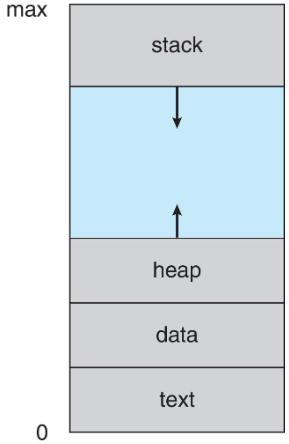

>🍀 운영체제 전공 수업 정리

## Process
---
🧠**<span style="color: #008000">Process</span> = A program in execution**, must progress in **sequential fashion**
* 단순히 코드만 있는 정적인 프로그램이 아니라, CPU에서 실제 실행되고 있는 동적인 존재
* 즉, 프로세스는 시간에 따라 상태가 변하며, 실행 순서를 따라 순차적으로 진행

✅ **프로세스의 구성 요소**
* **Text section**
  * 프로그램의 **실행 코드가 저장된 영역**
* **Program Counter and Register**
  * `Program Counter`: 다음에 실행할 **명령어의 <u>메모리 주소</u>를 저장**
  * `Register`: **현재 수행 중인 작업의 상태 정보 저장**

* **Stack**
  * 함수 호출 시 생성되는 **임시 데이터 저장소**
  * 저장 내용:
    * **Funtion parameters**: 함수를 호출할 때 일반적인 user program들은 편의성 때문에 stack을 통해서 parameter형식으로 넘김
    * **return addresses**: 함수에서 return한 값을 stack으로 저장
    * **local variables**: 함수가 구동되는 동안만 사용할 수 있는 변수,사용이 끝나면 파괴됨(↔ 전역변수)

* **Data section**: 프로그램 내 **전역 변수(Global variables) 저장 공간** → 프로그램 전체에서 접근 가능
* **Heap**: **동적 메모리 할당 공간**, 실행 중 `malloc`, `new` 같은 함수를 통해 요청한 메모리는 이곳에 저장됨
* 프로세스는 `active`이지만 프로그램은 `passive` entity이다.
* 하나의 프로그램은 여러 개의 process를 생성 가능함(예시: 웹브라우저 여러개 띄우기 가능)


> text는 기계어가 들어가 있음  
> `stack`, `heap`, `data(전역 변수 등)`들이 있다  
> `stack`, `heap`은 동적으로 공간을 할당, `free()`하기 때문에 양쪽으로 늘어났다 줄었다 함 → 그래서 마주보게 디자인


> 코드를 컴파일하게 되면 binary code가 되고 text에 저장됨  
> x, y는 data에 영역에 저장  
> `malloc`은 **heap**, `main`함수 안의 `*value`등은 **local variable**로 **stack**에 저장  

### Process state
---
process의 실행에 따라 상태가 바뀐다

* `New`: process가 방금 생성된 상태
* `Running`: process가 실행 중인 상태(CPU를 잡음)
* `Waiting`: 이떤 event발생을 기다리는 상태(CPU를 잡고있지 않음)
* `Ready`: 멈춰있다가 **CPU만 할당하면 바로 실행할 수 있게 준비된** 상태 
* `Terminated`: process가 종료된 상태


> * running 상태에 가기 직전에 **반드시 ready상태에 놓여있어야함**
> * 그 이유는 무수히 많은 process가 ready상태에 놓여있기 때문에
> * 많은 process중에 실행할 process를 고르는 작업이 `process scheduling 알고리즘`이다.

#### Process Control Block (PCB)
---
**Process Control Block (PCB)**: **process를 관리하는 정보를 담고있는 자료구조**
PCB는 프로세스가 생기면 같이 생성되고, 프로세스가 삭제되면 삭제된다.


* **Process state**: `running`, `waiting`등의 상태 정보
* **Program counter**: 다음에 실행할 CPU instruction의 주소 → 나중에 프로세스가 재시작을 하기 위한 정보가 담김
* **CPU registers**: CPU가 사용하는 레지스터 값들
* **CPU scheduling info**: **우선순위**, **큐 위치** 등 스케줄링 관련 정보
* **Memory management info**: process에 할당된 메모리 정보
* **Accounting info**: 사용된 CPU 시간, 실행 시간, 제한시간 등
* **I/O status info**: 연결된 I/O 장치나 열린 파일 리스트

#### Threads
---
📚 **스레드는 프로세스 내에 있는 실행의 한 흐름을 의미한다**
* 각 프로세스는 구별되고 메모리도 구별되지만, 하나의 프로세스에 속해있는 스레드들은 독립적으로 움직이고 메모리/코드를 공유한다.


> Linux에서는 대부분 process보다 thread 단위로 나타낸다

### Process Scheduling
---
**Process scheduling**은 CPU가 놀지 않게 항상 작업을 시키고, 여러 프로세스를 빠르게 CPU에 할당해서 실행하기 위해 필요하다
**<span style="color: #008000">Process scheduling</span>**: 실행 가능한 프로세스들 중에서 다음에 CPU에 올릴 걸 선택하는 담당자

✅ **Process Queue 종류**
* **<span style="color: #008000">Ready Queue</span>**: 메인 메모리에 있고 즉시 CPU 할당받을 준비가 된 프로세스들의 집합
* **<span style="color: #008000">Wait Queue</span>**: I/O 등 어떤 이벤트를 기다리는 중인 프로세스들의 줄(예: 키보드 입력, 디스크 읽기 등)
* 프로세스는 이 큐들 사이를 **자유롭게 이동함**
  * 예: CPU 쓰다가 → 입출력 기다리면 `wait queue`로 → 끝나면 다시 `ready queue`로


> queue이기 때문에 `tail`포인터도 필요, 양방향도 가능


> `time slice expired`는 각 활동에 시간을 할당함  
> **Multicore system**이기 때문에 여러개의 `Queue`를 가지고 실행할 수 있음

#### Context Switch
---

> process P0 실행 중 → `interrupt` or `systemcall` 발생 → P0 정지 후 **현재 상태를 PCB0에 저장**  
> 멈춰있던 process P1을 PCB1으로부터 reload → `interrupt` or `systemcall`을 처리하고 멈추면 **현재 상태를 PCB1에 저장**  
> 또 다시 P0를 불러옴 (Process가 두개가 아니라 여러개여도 같은 매커니즘)  

📚 **<span style="color: #008000">Context Switch</span>**: 실행 중인 `old process`의 **상태를 저장**하고, **저장된** `new process`를 불러온다
  * **Context Switch**는 상당히 많이 일어남
  * **Context**는 PCB에 저장함

* `Context Switch time`은 **overhead가 있음** → overhead시 시스템 작업이 불안정함
  * OS and PCB가 복잡할 수록 context switch time은 늘어날 수 밖에 없음
* 그 시간을 줄이기 위해 `hardware support`가 필요
  * 어떤 CPU는 `single instruction` or `store all registers`를 한다.
  * 어떤 CPU는 `multiple sets of register`를 가지고 있어서 복사하지 않고 포인터만 옮겨서 저장한다.
  

> 1. P0에 `timer interrupt`가 걸리면, 현재 register와 IP값을 저장(user→kernel mode이기 때문에 IP도 저장)
> 2. 스케쥴링으로 실행시간 계산(만약 시간이 남았으면 **바로 return해서 P0실행**) → 다 썼으면 P0의 PCB를 `Ready Queue`에 넣음, 다음에 실행할 P1을 `Ready Queue`에서 선택
> 3. switching을 해서 **현재 register, IP값을 P0 PCB에 저장**, **P1 PCB에서 저장된 register, IP값을 복원**하자마자 실행(`Jump`: 직접 가지 못하기때문에 jump라함)

#### Multitasking in Mobile Systems
---
초기의 iOS 모바일 system은 한 번에 하나의 프로세스만 실행 가능하고 나머지 프로세스는 일시정지 상태

* User Interface(UI) 공간이 제한되기 때문에 iOS는 다음과 같은 `Multitasking` 방식을 제공
  * **Foreground Process**: 화면에 표시되며 사용자와 직접 상호작용함, 오직 하나만 존재 가능
  * **Background Processes**: 실행 중이지만 화면에는 보이지 않음, 메모리에 상주하지만 **기능 제한 존재**
* Android 시스템은 더 유연함
  * `Foreground & Background 프로세스`를 동시에 실행 가능
  * `Background Processes`는 `Service`(백그라운드에서 돌아가는 별도의 구성 요소)를 사용
  * Service는 UI 없음, 작은 메모리만 사용
  * `Background Processes`가 중단돼도 계속 실행 가능

### Process Creation
---
**Parent process**는 자신을 복제해서 **children process**들을 만들어 낸다
* 그래서 <u>부모-자식 관계로 연결된 process들은 `tree`형식</u>을 띤다.
* 모든 프로세스는 고유한 번호로 식별된다 → 그 번호가 **<span style="color: #008000">PID(process identifier)</span>**

* **Resource Sharing Options**
  * **share all resources**(예: 메모리, 파일 등 모두 공유)
  * **subset of resources**(예: 특정 변수만 공유, 나머지는 분리)
  * **share no resources**(완전히 독립적인 프로세스)


✅**Execution Options**  
  * **Concurrently**: 부모와 자식이 동시에 실행(예: 웹브라우저와 다운로드 창이 따로 움직임)
  * **parents wait**: 자식 프로세스가 종료될 때까지 부모가 멈춤

✅ **Address space**  
  * **Address space**의 경우 자식프로세스는 부모 프로세스를 **완전히 복제**
  * 그리고 이 공간에서 **다른 프로그램을 로드함**
  * UNIX 예시:
    * `fork()`: **부모가 자식 프로세스를 생성**함, 자식은 부모의 복사본으로 시작
    * `exec()`: 자식이 **자신만의 새로운 프로그램으로 바꿈**, 자기 메모리 공간을 **완전히 덮어씀**(부모 내용은 사라짐)
    * `wait()`: 부모는 `wait()`을 호출하여 **자식의 종료를 기다림**, 자식이 종료(`exit()`)하면 부모는 다시 실행됨


> parent process에서 `fork()`를 하면 `pid=0`일 경우 child, `pid>0`이면 parent로 구분한다.


> `fork()`하자마자 parent와 child가 생성됨  
> `fork()`종료 후 **parent에는 child의 pid가 리턴**, **child에게는 0이 리턴**  
> `pid>0`이면 노란색부분 실행, `pid==0`이면 초록부분 실행

```markdown
parent process
  |
  |-- fork() --> child process 생성
        |
        └─> execl("/bin/ls", "ls") 실행 → 현재 child process가 'ls' 명령어로 완전히 교체됨
        |
        └─> 'ls' 명령 실행 결과 출력됨 (자식)
  
부모는 wait() 호출
  |
  |-- 자식 종료될 때까지 대기
  |
  |-- "Child Complete" 출력 (부모)
```

### Process Termination
---
1. **일반적인 자식 프로세스 종료**(`exit()`)
   * 프로세스는 마지막 명령문을 실행한 뒤, 운영체제에게 `exit()` 시스템 호출로 자신을 종료하도록 요청
   * 자식 프로세스는 status data를 `wait()` 시스템 호출을 통해 부모에게 전달
   * 자식 프로세스가 종료되면, 운영체제가 자식이 사용하던 자원을 회수

2. **부모가 자식을 강제 종료하는 경우**(`abort()`)
   * 부모 프로세스가 `abort()` 시스템 호출을 이용해 자식 프로세스를 강제로 종료할 수도 있다
   * 이유 3가지:
     1. **자식이 할당된 자원을 초과했을 때** → Ex: 메모리, CPU 시간 등 제한된 자원을 넘긴 경우
     2. **자식에게 맡긴 작업이 더 이상 필요 없을 때** → Ex: 유저가 작업을 취소하거나, 조건이 바뀐 경우
     3. **부모가 먼저 종료될 때** → OS는 부모가 종료되면 자식도 실행을 허용하지 않는 경우가 있음

일부 운영체제는 부모 프로세스가 종료되면 자식 프로세스도 자동으로 종료시킨다
* 이때 일어나는 현상: **Cascading Termination (계단식 종료)**
  * 부모가 종료되면 → 자식, 손자, 증손자 프로세스들까지 전부 운영체제가 강제로 종료시킴
  * This is **initiated by the OS**, not the parent
   
✅ 부모가 자식 종료를 기다리는 경우(`wait()`)  
```c
pid = wait(&status); // 자식 중 하나가 종료될 때까지 기다림
```
* `wait()` 시스템 호출을 통해 부모는 자식 프로세스의 종료를 기다릴 수 있음
* 자식이 종료되면, 해당 **자식의 pid와 status를 반환**받음
* 특정 자식의 종료만 기다리고 싶을 때 → `waitpid(pid, &status, 0);`

* **특수한 상태의 프로세스**
| 상태                     | 설명                                                                                  |
| ------------------------ | ------------------------------------------------------------------------------------- |
| **Zombie** 좀비 프로세스 | 자식은 종료됐지만, 부모가 `wait()` 하지 않아 **시체처럼 테이블에 남아 있는 프로세스** |
| **Orphan** 고아 프로세스 | 부모가 먼저 종료돼서, 자식은 **고아 상태**가 됨. 보통 `init` 프로세스가 맡음          |

#### Andriod Process Importance Hierarchy
---
안드로이드는 <u>메모리 확보</u>를 위해 필요에 따라 프로세스를 종료해야 할 때가 있다
이때 **어떤 프로세스를 먼저 죽일지 결정하는 기준**이 바로 이 **Process Importance Hierarchy**
* **Android will begin terminating processes that are least important**

✅**중요도 순위 (위 → 아래로 중요함)**  
```markdown
     ↑ 중요함 (살려야 함)
     │
     │   **Foreground** (직접 사용 중 앱)
     │   **Visible**     (화면 일부 표시)
     │   **Service**     (음악재생 등 백그라운드 작업)
     │   **Background**  (이전 앱, 백그라운드 대기)
     │   **Empty**       (캐시만 남은 앱)
     │
     ↓ 덜 중요함 (먼저 종료됨)
```
### Multiprocess Architecture - Chrome Browser
---
> 🟥 "하나의 프로그램이 여러 개의 프로세스를 생성"

예전의 웹 브라우저는 대부분 `single process`로 실행되었다.  
하지만 `Chrome`은 **여러 프로세스로 나누어 처리**(`multiprocess`)

🧩 **Chrome의 3가지 주요 프로세스 유형**  
* **Browser process**: User interface, 디스크 접근, 네트워크 입출력 관리
* **Renderer process**: **web page rendering(화면에 띄우는 처리)**(`HTML`, `CSS`, `JavaScript`처리)  
                        **웹사이트마다 새롭게 생성됨** → **Sandbox 환경에서 실행**되어 보안 위험을 줄임
* **Plug-in process**: `plug-in`(예: Flash 등)별로 분리된 프로세스 사용

## Interprocess Communication(IPC)
---
✅**process의 종류**  
* **Independent process**
  * 다른 프로세스와 **전혀 상호작용하지 않음**
* **Cooperating process**
  * 다른 프로세스와 데이터를 주고받으며 **상호작용**함
  * 즉, **다른 프로세스에 영향을 주거나 받을 수 있음**

📚**Reasons for cooperating**  
1. **<span style="color: #008000">Information sharing</span>**: 여러 프로세스가 동일한 파일이나 메모리 데이터를 함께 읽고 쓸 때
2. **<span style="color: #008000">Computation speedup</span>**: 큰 작업을 여러 프로세스로 나눠서 동시에 처리 **(병렬 처리)**
3. **<span style="color: #008000">Modularity</span>**: 기능을 나누어 각기 다른 프로세스가 처리하도록 설계
4. **<span style="color: #008000">Convenience</span>**: 사용자에게 편리한 기능 제공 (예: 백그라운드 음악 재생)

📡 **IPC (Interprocess Communication)**  
> `Cooperating process` 간에는 통신이 필요함
> → 이를 위해 `IPC`가 사용됨

🟣 **<span style="color: #008000">Shared memory</span>**: 여러 프로세스가 **공유된 메모리 공간**을 사용  
🔵 **<span style="color: #008000">Message passing</span>**: **메시지를 주고받는 방식**으로 데이터 교환


> `Shared memory`는 생각보다 복잡, 2개의 process가 어떤 공동퇸 메모리를 사용
> `Message passing`은 **message queue**가 있어서 거기서 message를 주고받음

### Producer-Consumer Problem
---
> **두 개 이상의 프로세스가 데이터를 주고받을 때 발생하는 대표적인 동기화 문제**

* **Producer**: data를 생산에서 **buffer**에 넣는 역할
* **Consumer**: **buffer**에서 데이터를 꺼내 사용하는 역할

✅**Buffer의 종류**  
* **unbounded buffer**: 버퍼 크기에 제한이 없음 → 이론적으로 무한 저장 가능
* **bounded buffer**: 버퍼 크기가 정해져 있음 → 공간이 꽉 차면 대기 필요(실제 시스템에는 대부분 **bounded buffer**)

### IPC - Shared Memory
---
📚 **<span style="color: #008000">Shared Memory</span>**: 서로 **통신하고 싶은 프로세스들끼리 공유하는 메모리 영역**
* OS가 직접 관여하지 않고, process들이 **자체적으로 메모리 접근과 통신을 조절해야 함**

❌ **주요 문제**  
> 💥 **<span style="color: #008000">Synchronization</span>**
  * 두 프로세스가 동시에 메모리에 접근하면 충돌 발생 가능
  * 예: `Producer`가 데이터를 쓰고 있는 중에, `Consumer`가 읽으려고 하면 데이터가 손상될 수 있음

* **Bounded-Buffer – Shared-Memory Solution**  

```c
// Shared data (실제 함수 X)
#define BUFFER_SIZE 10
typedef struct {
  . . .
} item;

item buffer[BUFFER_SIZE];
int in = 0; // in: 새로운 아이템을 넣을 위치, out: 지금 사용할 수 있는 아이템 위치
int out = 0; // in == out은 buffer가 빈 상태를 의미
```

> `if ((in + 1) % BUFFER_SIZE) == out`이면 **가득 찬 상태로 간주** → 따라서 한 칸은 비워두고 사용해서 **실제 사용 가능한 공간은** `BUFFER_SIZE-1`

* **producer code**  

```c
item next_produced;

while (true) {
  while (((in + 1) % BUFFER_SIZE) == out) ; // 버퍼가 가득 찼는지 확인 (busy wait) 
    /* do nothing */
  buffer[in] = next_produced; // 생산된 아이템 저장
  in = (in + 1) % BUFFER_SIZE; // 다음 저장 위치로 이동
}
```


> `((in + 1) % BUFFER_SIZE) == out`을 확인 안하고 넣게 되면 `in==out`이 되면서 buffer가 **비어있는지 가득 차있는지 확인 불가**

* **consumer code**  

```c
item next_consumed;

while (true) {
  while (in == out) ; // 버퍼가 비어 있으면 대기
    /* do nothing */
  next_consumed = buffer[out]; // 아이템 꺼내기
  out = (out + 1) % BUFFER_SIZE; // 다음 위치로 이동
}
```
