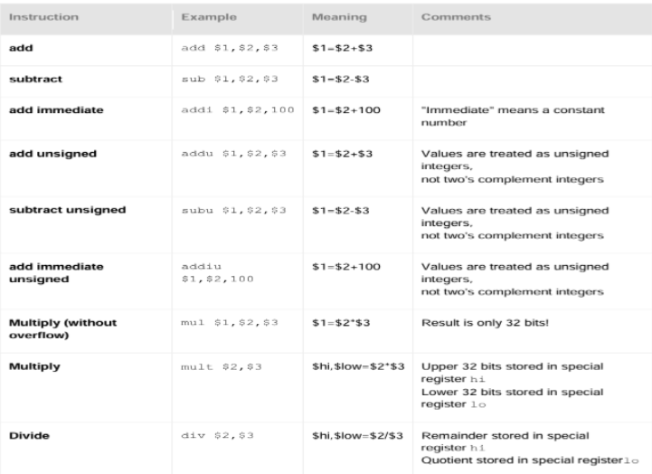

⚙ **Computer Architecture 공부**

## MIPS Arithmetic Instructions
---

> **<span style="color: #008000">부호 있는 연산(signed)</span>**(`add`, `sub`): **음수 표현이 가능**한 2의 보수(two's complement) 방식으로 연산. **오버플로우 확인**  
> **<span style="color: #008000">부호 없는 연산(unsigned)</span>**(`addu`, `subu`): 모든 비트를 양수로 취급. 오버플로우 확인X.  
* `mult`: 32bits × 32bits = 최대 64bits 결과가 나올 수 있어 **<span style="color: #008000">special register</span>**(`hi`, `lo`)를 사용.
  * `hi`: **상위 32bits** 저장
  * `lo`: **하위 32bits** 저장
* `div`: **나눗셈 결과는 두 부분**으로 나뉨.
  * `lo`: **몫(quotient) 저장**
  * `hi`: **나머지(remainder) 저장**

#### Example: FACTORIAL OF N
```
# 팩토리얼 계산 예제(n! 계산)
# 입력: $s1 = n
# 출력: $t0 = n!

move $t0, $s1    # result = n
addi $s1, $s1, -1  # n = n - 1

factorial_loop:
    mul $t0, $t0, $s1  # result *= n
    addi $s1, $s1, -1  # n -= 1
    bne $s1, $zero, factorial_loop  # if n != 0, repeat
```
* **Branch Instructions**:
  * `bne $s1, $zero, factorial_loop`: $s1 값이 0이 아니면 factorial_loop 레이블로 점프
  * 기타 branch instructions - `beq src1, src2, label`: 두 값이 같으면 branch (`Branch if Equal`)

## MARS Simulation
---
**MIPS 프로그램은 두 가지 주요 세그먼트로 구성**된다.  
```
# 기본 MIPS 프로그램 템플릿
.text             # text segment 시작
main:             # 프로그램 시작점
    # 여기에 명령어 작성
    
    # 프로그램 종료
    li $v0, 10    # exit 시스템 콜 코드
    syscall       # 시스템 콜 실행

.data             # data segment 시작
    # 여기에 변수 정의
    message: .asciiz "Hello, World\n"  # 문자열 변수
    array:   .word 1, 2, 3, 4, 5       # 정수 배열
# 이 밑에는 function .text 작성가능
```  
#### **<span style="color: #008000">text segment(.text)</span>** 
* 실행 가능한 code 저장
* **주요 요소**:
  * **main**: 프로그램 시작점
  * **레이블**: 함수나 점프 위치를 표시 (예: `factorial_loop:`)
  * **명령어**: 실제 실행할 MIPS 명령어들

#### **<span style="color: #008000">Data segment(.data)</span>**
* 정적 데이터(변수) 저장
* **데이터 타입**:
  * `.asciiz`: null로 끝나는 문자열 (예: `message: .asciiz "Hello"`)
  * `.ascii`: null로 끝나지 않는 문자열
  * `.word`: 32비트 정수 (예: `array: .word 1, 2, 3, 4`)
  * `.half`: 16비트 정수
  * `.byte`: 8비트 정수
  * `.space n`: n바이트 공간 할당

#### **System Calls**
* **MIPS에서는 `syscall` 명령어를 사용하여 운영체제 서비스 호출 가능**
* **주요 syscall code**:
  * `$v0 = 1`: **정수 출력** (인자: `$a0` = 출력할 정수)
  * `$v0 = 4`: **문자열 출력** (인자: `$a0` = 문자열 주소)
  * `$v0 = 5`: **정수 입력** (반환: `$v0` = 입력된 정수)
  * `$v0 = 8`: **문자열 입력** (인자: `$a0` = 버퍼 주소, `$a1` = 버퍼 길이)
  * `$v0 = 10`: **프로그램 종료 **

* **합 계산 예제**

```
# 1 + 2 + 3 + ... + n 계산
# 입력: $s1 = n
# 출력: $t0 = 합계

move $t0, $zero    # 합계 초기화: sum = 0
move $t1, $zero    # 카운터 초기화: i = 0

loop:
    addi $t1, $t1, 1    # i = i + 1
    add $t0, $t0, $t1   # sum = sum + i
    bne $t1, $s1, loop  # i != n이면 반복
```
> 카운터 증가: `addi $t1, $t1, 1`  
> 현재 카운터 값을 합계에 추가: `add $t0, $t0, $t1`  
> 반복 조건 확인: `bne $t1, $s1, loop`
