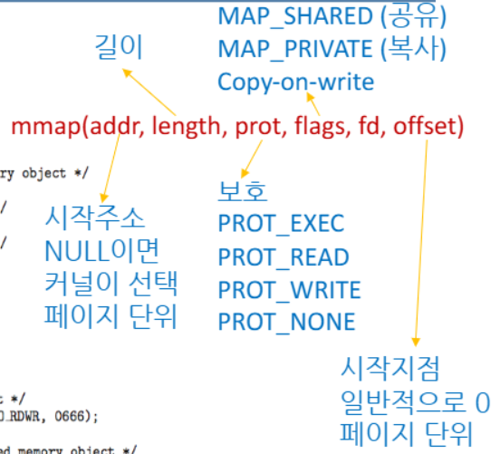
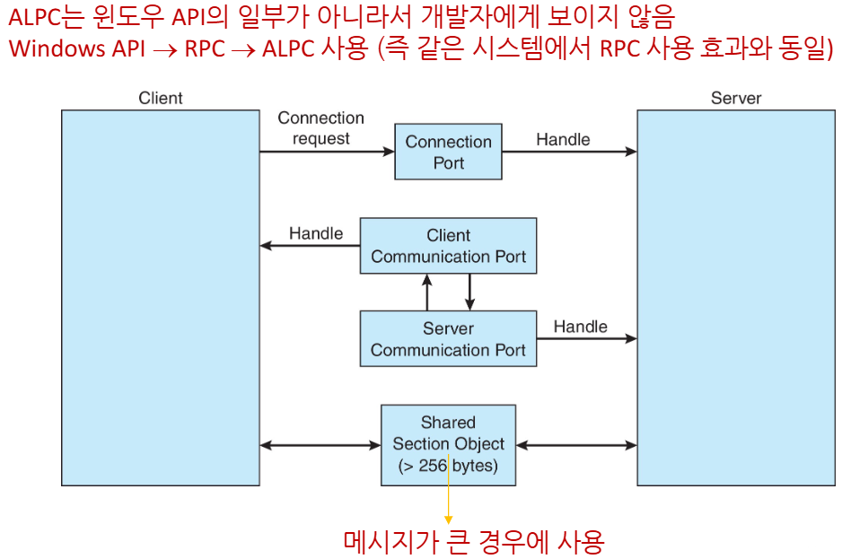
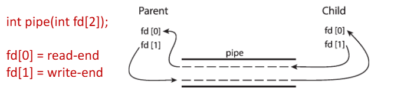
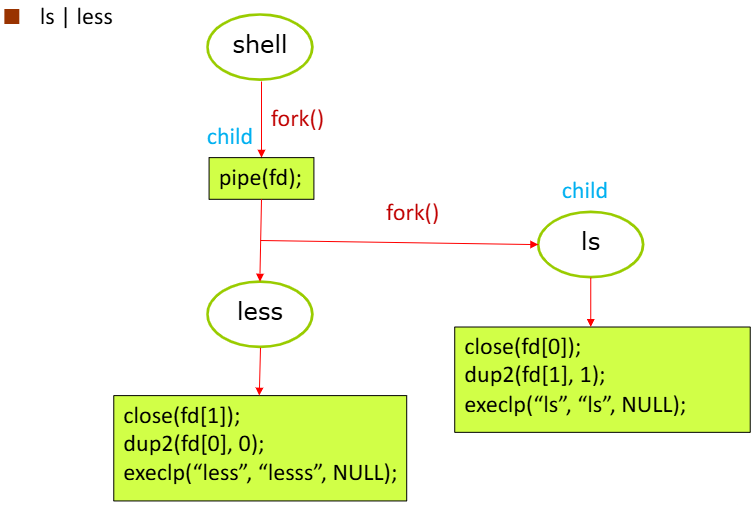
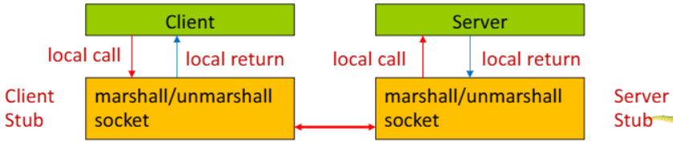
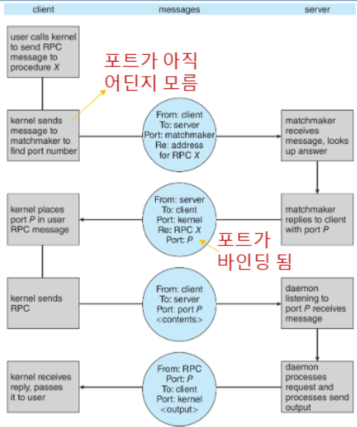

>🍀 운영체제 전공 수업 정리

### IPC - Message Passing
---
📚**Message Passing**은 **두 가지 주요 용도**를 가진다  
1. **communicate**
2. **synchronize**

* 프로세스가 서로 정보를 주고받을 때, 직접 같은 메모리를 쓰지 않고(공유 변수 없이)  
  `send(message)`와 `receive(message)` 기능을 통해 통신할 수 있다.
* message size is **fixed or variable**

* 두 프로세스 P와 Q가 통신하려면:
  * `communication link`를 설정해야 하며, 그 후 `send`/`receive`를 통해 메시지를 주고받음

✅**Implementation issues**:  
  * 링크 설정 방법?
  * 링크당 허용되는 프로세스의 수?
  * 통신에 필요한 링크의 수?
  * 링크의 용량?
  * 메세지의 크기는 고정/가변 ?
  * 링크는 단방향일까 양방향일까?

__📝**link의 구현 두 가지 방식**:__

1. 📦 **<span style="color: #008000">Physical</span>**
  * Shared Memory
  * Hardware Bus
  * Network
2. 🧠 **<span style="color: #008000">Logical</span>**
  * `Direct` vs `Indirect` (직접 통신 vs 간접 통신)
  * `Synchronous` vs `Asynchronous` (동기 vs 비동기)
  * `Automatic` vs `Explicit` Buffering (자동 vs 명시적 버퍼링)

#### Direct Communication
---
Processes must **name each other explicitly**  
    → 각 프로세스는 상대방의 이름을 명시적으로 알아야 메시지를 보낼 수 있음
 * `send(P, message)` → P라는 프로세스에게 메시지를 <u>보냄</u>
 * `receive(Q, message)` → Q라는 프로세스로부터 메시지를 <u>받음</u>

✅**Properties of communication link**  
1. Links are established **automatically**
2. A link is associated with exactly **one pair** of communicating processes
3. Between each pair, there exists exactly **one link**
4. Link **may be unidirectional**, but is **usually bi-directional**

> 단순하지만, 유연성이 떨어질 수 있음 (상대방 이름을 미리 알아야 함)

#### Indirect Communication
---
📚**<span style="color: #008000">Indirect Communication</span>**: `Mailbox`를 이용한 메시지 전달
* 메시지는 <u>`mailbox`를 통해 송수신</u>된다 (Mach에서는 mailbox를 "port"라고 칭함)
* 각 `mailbox`는 **고유한 ID**를 가지며, **이를 공유해야만 프로세스 간 통신이 가능**

__✅**Properties of communication link**:__
1. Link establish **only if processes share a common mailbox**
2. 하나의 mailbox는 **여러 프로세스와 연결 가능**
3. 프로세스 쌍마다 **여러 개의 통신 링크를 가질 수 있음**
4. Link may be **<span style="color: #008000">unidirectional</span>** or **<span style="color: #008000">bi-directional</span>**

* Mailboxes는 다음과 같은 **operations**을 지원
  * **새로운 mailbox 생성**
  * **메시지 송수신**
  * **mailbox 제거**

* **원시 함수(primitive)가 존재**:
  * `send(A, message)` → mailbox A에 메시지 보냄
  * `receive(A, message)` → mailbox A로부터 메시지 받음

✅ **Mailbox 공유 문제 & 해결 방법**  
> P1, P2, P3가 같은 mailbox A를 공유  
> P1이 메시지를 보냄  
> 그런데 P2와 P3가 동시에 받으려고 하면…? 
>  
> ❓ 누가 메시지를 받게 될까?

✅ Solutions:
  * mailbox는 **최대 2개의 프로세스만 연결 가능**하도록 제한
  * 한 번에 하나의 프로세스만 receive 가능
  * 시스템이 receiver 선택, Sender에게 누가 받았는지 알려줌

🧠 **Synchronization**
* Message passing 방식은 `blocking`과 `non-blocking`이 있다.
* **<span style="color: #008000">Blocking</span>**
  * **Blocking = synchronous**
  * `Blocking send`: 메시지를 보낸 프로세스는 **상대가 받을 때까지 기다림** → **Queue 사용 시 non-blocking 효과 가능**
  * `Blocking receive`: 메시지를 받을 프로세스는 **메시지가 도착할 때까지 기다림**
  * 둘 다 기다리기 때문에 **시간 동기화가 잘 맞음** → 안정적이지만 느릴 수 있음

* **<span style="color: #008000">Non-blocking</span>**
  * **Non-blocking = Asynchronous**
  * `Non-blocking send`: 메시지 보낸 후 **기다리지 않고 바로 다음 일 수행** → **메시지 손실 방지를 위해 Queue 필요**
  * `Non-blocking receive`: 수신자는 다음 중 하나를 **즉시** 받음
    * 유효한 메시지
    * 빈 메시지 (null)

* 다양한 조합 가능
  * `Blocking + Blocking`: **rendezvous(런데뷰)**(:**서로 딱 만날 때까지만 대기**)
  * `Non-blocking + Non-blocking`: **서로 신경 안 씀 → 메시지 손실 가능성 큼**

📝`Blocking send/receive`를 사용한 producer/consumer 문제 → **`rendezvous`형식**

__Producer-message Passing:__

```c
message next_produced;

while (true){
    /* produce an item in next_produced */
    send(next_produced); // blocking send
}
```

__Consumer-message Passing:__

```c
message next_consumed;

while (true){
    receive(next_consumed); // blocking receive
    /* consume the item in next_consumed */
}
```

* 전체 흐름 그림  
```scss
🟢 Producer                      🟢 Consumer
produce item                    wait for item
    ↓                                ↑
  send(item)  ─────[rendezvous]─── receive(item)
```  
> 둘 다 **blocking** 상태이므로, 딱 만나서 데이터를 교환함  
> 일종의 "**약속된 만남"이므로 데이터 손실 없음**

#### Buffering
---
📚**Buffering: Blocking send/receive의 성능을 향상시킴**

✅Implemetns in one of three ways:
1. **<span style="color: #008000">Zero capacity</span>**:
   * 큐가 없음
   * 메시지는 반드시 **즉시 receiver에게 전달되어야 함**
   * Receiver가 준비되지 않으면 Sender는 **기다려야 함** = `rendezvous` 방식(완전 동기)
2. **<span style="color: #008000">Bounded capacity</span>**:
   * 큐에 최대 n개의 메시지까지 저장 가능
   * 큐가 가득 찼을 경우, Sender는 기다려야 함
3. **<span style="color: #008000">Unbounded capacity</span>**:
   * 이론적으로 무한히 많은 메시지를 저장 가능
   * Sender는 절대 기다리지 않음 → 완전한 비동기
   * 큐가 넘칠 걱정이 없지만 **메모리 과다 사용 가능성** 있음

## Examples of IPC Systems - POSIX
---
📚**POSIX Shared Memory**  
   * 프로세스는 `shm_open()`을 통해 **공유 메모리 객체를 생성하거나 열 수 있음**
   * `shm_fd()` = `shm_open(name, O_CREAT | O_RDWR, 0666);`
   * `ftruncate()`를 이용해 **메모리 객체의 크기를 지정**
   * `ftruncate(shm_fd, 4096)`(4096은 size)
   * `mmap()`을 통해 이 공유 메모리를 실제 주소 공간(file pointer)에 매핑
   * 이후 이 `mmap()`된 pointer를 통해 메모리에 접근(read/write) 가능함.

```scss
프로세스 A (Producer)                   프로세스 B (Consumer)
----------------------                  ----------------------
1. shm_open() 생성                      1. shm_open() 열기
2. ftruncate() 크기 설정               2. mmap()으로 매핑
3. mmap()으로 주소 매핑                3. 포인터로 데이터 읽기
4. 포인터로 데이터 쓰기                4. shm_unlink()로 제거
```

* **IPC POSIX Producer**

```c
#include <stdio.h>
#include <stdlib.h>
#include <string.h>
#include <fcntl.h>
#include <sys/shm.h>
#include <sys/stat.h>

int main()
{
  /* the size (in bytes) of shared memory object */
  const int SIZE = 4096;
  // name of the shared memory object
  const char *name = "OS";
  // strings written to shared memory
  const char *message_0 = "Hello";
  const char *message_1 = "World";

  // shared memory file descriptor
  int shm_fd;
  // pointer to shared memory object
  void *ptr;
  
  // create the shared memory object
  shm_fd = shm_open(name, O_CREAT | O_RDWR, 0666);

  // configure the size of the shared memory object
  ftruncate(shm_fd, SIZE);

  // memory map the shared memory object
  ptr = mmap(0, SIZE, PROT_WRITE, MAP_SHARED, shm_fd, 0);

  // write to the shared memory object
  sprintf(ptr, "%s", message_0);
  ptr += strlen(message_0);
  sprintf(ptr, "%s", message_1);
  ptr += strlen(message_1);

  return 0;
}
```
> `shm_open`으로 공유 메모리 객체 생성  
> `ftruncate`로 크기 지정 (4096 바이트)  
> `mmap`으로 공유 메모리를 자신의 메모리 공간에 연결  
> 이후 `sprintf`로 메시지를 공유 메모리에 쓰기


> `Copy-on-write`는 **복사를 대기하다가 write 할때 복사해주는 옵션**

* **IPC POSIX Consumer**

```c
#include <stdio.h>
#include <stdlib.h>
#include <string.h>
#include <fcntl.h>
#include <sys/shm.h>
#include <sys/stat.h>

int main()
{
  /* the size (in bytes) of shared memory object */
  const int SIZE = 4096;
  // name of the shared memory object
  const char *name = "OS";
  // shared memory file descriptor
  int shm_fd;
  // pointer to shared memory object
  void *ptr;
  
  //  open the shared memory object
  shm_fd = shm_open(name, O_RDONLY, 0666);

  // memory map the shared memory object
  ptr = mmap(0, SIZE, PROT_READ, MAP_SHARED, shm_fd, 0);

  printf("%s", (char *)ptr);

  // remove the shared memory object
  shm_unlink(name);

  return 0;
}
```
> `shm_open`으로 기존 공유 메모리 열기  
> `mmap`으로 읽기 전용 매핑  
> 공유 메모리에서 문자열을 읽어와 출력  
> 사용 후 `shm_unlink()`로 공유 메모리 제거  
> `shm_unlink()`는 **"공유 메모리 객체 자체 제거"** 역할


## Examples of IPC Systems – Windows
---
📚**<span style="color: #008000">ALPC(Advanced Local Procedure Call)</span>**는 <u>동일한 시스템 내 프로세스들끼리 통신하기 위한 `message-passing`기반 **IPC 방식**</u>이다
* `ALPC`는 **RPC(원격 프로시저 호출)**와 유사하지만, **로컬에서만 작동함**
* `port`(like mailbox)를 사용하여 **통신 채널을 설정하고 유지 관리**

✅**작동 원리**  
1. Client가 연결 요청 시작
  * 클라이언트는 `subsystem`의 `connection port`에 대한 **handle**을 연다
  * 이 connection port는 모든 프로세스에게 보임
2. Client → 연결 요청(connection request) 전송
3. Server가 통신 준비
  * 서버는 **twoprivate communication ports**를 생성합니다.
  * 이 중 **하나의 포트를 클라이언트에게 다시 전달**
4. 양방향 통신 시작
  * 클라이언트와 서버는 전달된 `port handle`을 통해 **메시지를 주고받거나 callback**을 사용 가능



## PIP
---
📚 **<span style="color: #008000">Pipes</span>**: **파이프는 두 개의 프로세스 간에 데이터를 주고받기 위한 통로(conduit) 역할**
* 프로세스 A → 프로세스 B 로 데이터를 전송할 수 있도록 만들어진 통신 구조
* 파일처럼 쓰고 읽을 수 있음

__✅ 핵심 이슈들:__  
1. 데이터를 한 방향으로만 보낼 수 있는지 **(단방향/unidirectional)**, 양쪽 모두 가능 **(양방향/bidirectional)인지**
2. `Half-duplex`인지, `Full-duplex`인지? (ex - Simplex: 키보드, Half-duplex: 무전기, Full-duplex: 전화기)
3. 통신하려면 **부모-자식 관계**가 필요한가?
4. **네트워크를 통해** 사용 가능한가?

__✅ **두 가지 파이프 종류**:__ 
1. **<span style="color: #008000">Ordinary Pipe</span>**
  * **제한된 관계**: <u>부모-자식 관계</u>에서만 사용 가능
  * **외부 접근 불가**: 파이프를 만든 프로세스 <u>외부에서 접근 불가능</u>
  * 예시: 부모가 자식 만들고 → 자식에게 파이프로 명령 전달 
2. **<span style="color: #008000">Named Pipe</span>**
  * **독립적인 통신 가능**: 부모-자식 관계 필요 없음
  * **파일 시스템 상에 이름을 가짐** → 다른 프로세스와 쉽게 공유 가능
  * 예시: `ls | less` (유닉스에서 많이 사용)

### Ordinary Pipe
---
📚**<span style="color: #008000">Ordinary Pipe</span>**: 한 프로세스가 쓰기(write) 하고, 다른 프로세스가 읽기(read) 하는 단방향(unidirectional) 통신용 파이프
> 생성한 프로세스(부모)는 자신만 pipe를 볼 수 있음  
> 하지만 자식 프로세스는 상속받은 열린 파일로 pipe 접근 가능

__✅ **작동 방식**:__  
* **Producer** → 데이터를 작성(write)
* **Consumer** → 데이터를 읽음(read)
* **한 방향(unidirectional)** 으로만 통신 가능



* Windows에서는 **anonymous pipe** 라고한다
* 파이프는 운영체제 입장에서는 특수한 파일로 취급되므로 `read()` / `write()`를 그대로 사용해 통신이 가능

```c
// 파이프 생성
if (pipe(fd) == -1) {
    fprintf(stderr, "Pipe failed");
    return 1;
}
// 자식 프로세스 생성
pid = fork(); //부모 프로세스는 pid > 0,자식 프로세스는 pid == 0

if(pid<0){
  fprintf(stderr, "Fork Failed");
  return 1;
}

if(pid > 0){// parent process
  close(fd[READ_END]);// 읽기용 닫음 (안 씀)
  write(fd[WRITE_END], write_msg, strlen(write_msg) + 1);
  close(fd[WRITE_END]); // 쓰기 끝나고 닫음
}

else{//child process
  close(fd[WRITE_END]); // 쓰기용 닫음
  read(fd[READ_END], read_msg, BUFFER_SIZE); // 메세지 수신
  printf("read %s", read_msg);
  close(fd[READ_END]); // 읽기 끝나고 닫음
}
```

### Named Pipe
---
📚**<span style="color: #008000">Named Pipe</span>**:이름 있는 파이프. 파일 시스템 상에 존재
  * 🔄 **양방향 통신 (Bidirectional) 가능**
  * **부모-자식 관계 불필요**: 독립된 프로세스 간에도 사용 가능
  * **Ordinary Pipes보다 더 강력하고 유연함** → `UNIX` & `Windows` 모두에서 사용 가능

```c
int mkfifo(const char *pathname, mode_t mode);
```
> * `pathname`: FIFO의 이름
> * `mode`: 접근 권한 설정(예: 0666)
> 이후 `open()`, `read()`, `write()`, `close()` 등 일반 파일처럼 다룸


> 쉘이 `ls | less` 명령어를 처리하는 구조 → `ls`가 출력을 pipe에 쓰고 `less`가 그걸 받아 출력함.  
> 1. `pipe(fd)` 호출로 파이프 생성  
> 2. **`fork()`**로 첫 번째 자식 생성 → `less`  
>   * `close(fd[1])`: 쓰기 종료  
>   * `dup2(fd[0], 0)`: 파이프 입력을 표준 입력으로 연결  
>   * `exec()`: `less` 실행  
> 3. 다시 `fork()` → 두 번째 자식 생성 → `ls`  
>   * `close(fd[0])`: 읽기 종료  
>   * `dup2(fd[1], 1)`: 파이프 출력을 표준 출력으로 연결  
>   * `exec()`: `ls` 실행  

### Sokcet
---
📚**<span style="color: #008000">Sokcet</span>**: **통신의 출발점/도착점 역할**을 하는 소프트웨어 구조  
* **IP 주소 + 포트 번호**를 합쳐서 소켓을 구분함
  * 예: 161.25.19.8:1625 → **IP 주소: 161.25.19.8, 포트: 1625**
* 통신은 항상 pair로 이루어짐 (예: 클라이언트 ↔ 서버)
* 1024번 이하 포트는 시스템에서 예약된 포트들 (HTTP: 80, HTTPS: 443 등)
* `127.0.0.1` (**loopback**): **자기 자신에게 보내는 IP 주소** (예: 서버/클라이언트를 한 컴퓨터에서 테스트)

## Remote Producer calls(RPC)
---
📚 네트워크를 통해 다른 컴퓨터의 Producer(함수)를 로컬처럼 호출
  * 사용자는 마치 자신의 컴퓨터에서 함수를 실행하는 것처럼 사용하지만, 실제로는 다른 컴퓨터에서 실행

**__주요 요소:__**  
1. **<span style="color: #008000">Stubs</span>**:
  * **Client Stub**: 클라이언트 쪽에서 **서버 함수를 대신 호출**하는 코드
  * **Server Stub**: 서버 쪽에서 클라이언트의 요청을 받아 진짜 함수를 호출
2. **<span style="color: #008000">Marshalling / Unmarshalling:</span>**:
  * 데이터를 전송하기 위해 포맷을 변환하고(Marshalling), 반대쪽에서 다시 해석하는 것(Unmarshalling)

* Windows에서는 이 과정을 위한 코드 스펙을 정의하는 **Microsoft Interface Definition Language(MIDL)**를 사용


* **XDL(External Data Representation)**: 서로 다른 시스템 간 데이터 표현 방식을 통일
  * **Big-endian** and **little-endian**
*** 메세지 전달 방식**(remote communication은 local보다 오류가 많기 때문)
  * `exactly once`: 메시지가 한 번만 처리되도록 보장
  * `at most once`: 중복 메시지 방지, 무시 가능성 존재
  * 클라이언트와 서버 사이에는 네트워크 지연이나 손실이 발생할 수 있기 때문에 **정확히 한 번 처리(exactly once)**를 구현하는 것이 중요
  * 이를 위해 **ACK(응답 확인)**를 통해 요청 처리 완료를 알려줌
* **rendezvous(matchmaker)**:
  * 클라이언트가 서버를 찾도록 도와주는 OS 서비스

