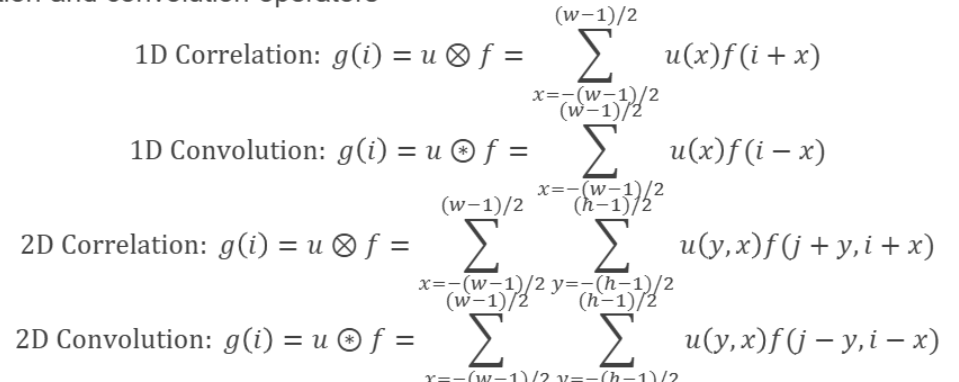
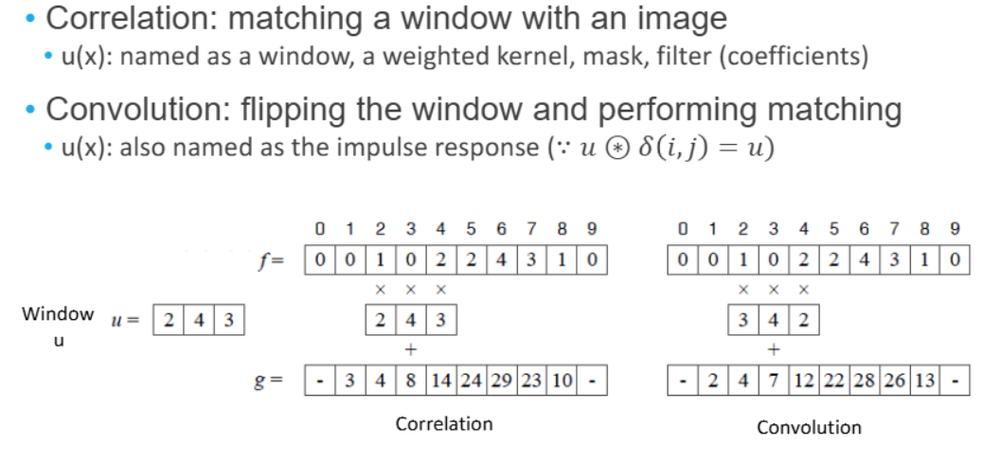
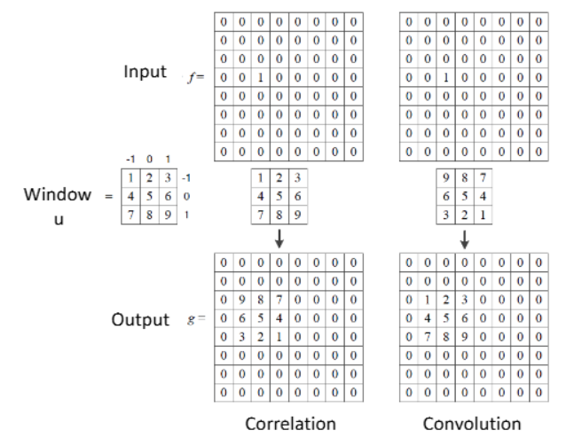
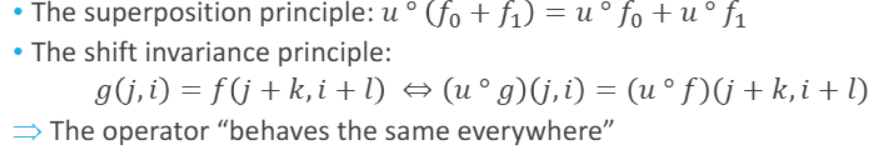
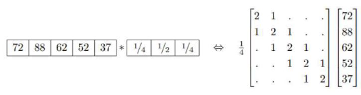
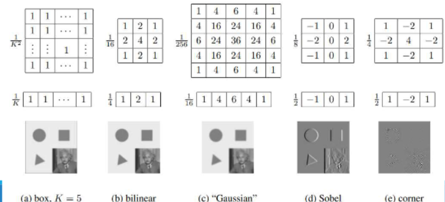
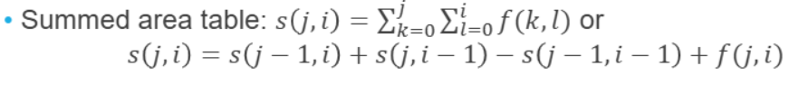
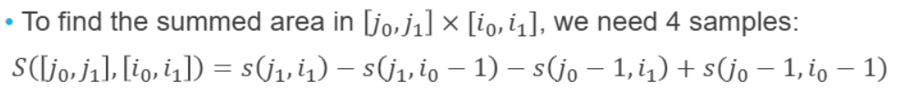
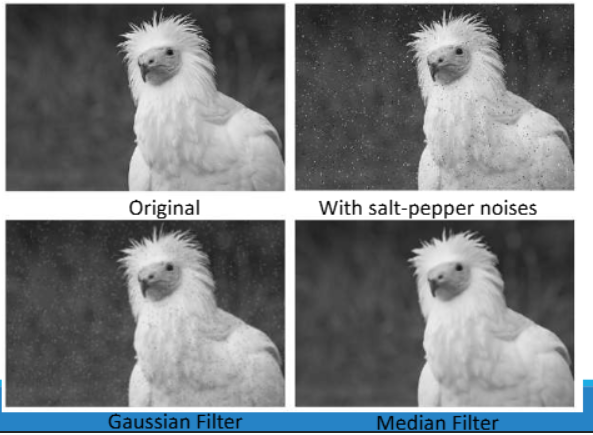
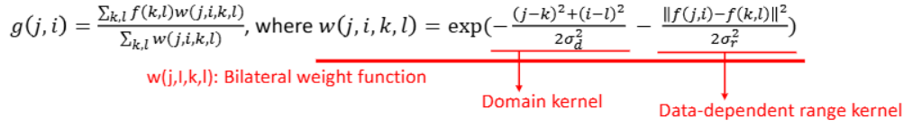

👓Computer Vision 정리

## Neighborhood operator
---
* **<span style="color: #008000">Neighborhood operator</span>**: pixel value computed using a collection of pixel values in a **small neighborhood**
* **Linear filter**: a pixel’s value is a <u>weighted sum</u> of pixel values within a small neighborhood

* Correlation and convolution operators
  * 

#### 1D Example

> 이미지 f에 필터 u를 적용함  
> Correlation: 그대로 곱해서 더함  
> Convolution: 필터를 뒤집어서 곱함

#### 2D Exmaple

> Convolution: 필터를 뒤집음 → **원래 입력과 같은 모양 출력**  
> Correlation: 필터를 그대로 사용 → **출력에서 필터가 반영되어 보임**

### Properties of Convolution(Correlation)
---
`Correlation` and `convolution`은 **linear shift Invariant를 공통 성질**로 가진다

* **<span style="color: #008000">LSI(Linear Shift Invariant)</span>**: 선형 & 이동 불변
  * **linearity**:
  * $$u(f_0​+f1_​)=uf_0​+uf_1$$
  * **shift-invariance(이동 불변성)**:
  * 입력 이동하면 출력도 똑같이 이동함


> 수식 형태
>The shift invariance principle: **한 픽셀씩 적용한 경우나 전체적으로 적용한 경우의 픽셀이 같다**

* Correlation and convolution can be written as a **matrix-vector multiplication: g = Uf**


> 1차원 5pixel convolution 경우는 5 by 5 행렬로 표현 가능

### Separable Filtering
---
* 2차원일 경우 $K^2$ operations per pixel을 하게 된다
* 좀 더 효율적으로 계산할 수 있나?
* filter의 shape을 (MxN) matrics처럼 표현할 수 있다 → 그걸 `(mx1)`,`(1xn)` 으로 **행렬을 seperate**해서 각각 `K operation`을 하면 된다(2K) 
  * 행렬을 seperate한다는 의미는 2개의 1D 필터로 분해한다는 뜻


* **Box filter(moving average filter)**: **averages the pixels in a K x K window**
* **Bilinear filter(Bartlett filter)**: **smooths image** with a piecewise “tent” function
  * 중간에 큰 가중치를 주고 싶을 때 사용
* **Gaussian filter**: **made by convolving the linear tent function** with itself(중심 강조, 노이즈 제거)
  * 중간에 가장 큰 가중치를 주고 주변으로 갈수록 작게 적용
* **Sobel filter**: simple 3x3 **edge extractor**(combination of horizontal central difference and a vertical tent filter)
  * 1~3번째는 noise를 없애기 위한 filter라면, sobel은 그림에서 엣지(feature)를 검출한다.
  * `edge extractor`: edge의 값이 변해서 edge가 변함, 예시에서는 오른쪽에서 왼쪽을 빼준다.
* **Simple corner detector**: look forsimultaneous **horizontal/vertical** second derivatives (+diagonal edges)
  * 수직, 수평의 변화를 filter함


### Summed Area Table(Integral Image,적분 영상)
---
> 넓은 사각형 영역의 합을 빠르게 구하는 기술

같은 이미지에 다른 크기의 box fliter를 적용해야하는 경우에 **적분 영상을** 사용하게 된다
* 원래 방식: M×M 영역의 합을 구하려면 $M^2$번 덧셈 필요
* **<span style="color: #008000">Summed Area Table</span>**을 사용하면 항상 4번만에 합 계산 가능
  * 빠른 `Box Filtering`구현 가능


> 누적합을 구하는 점화식  
> 왼쪽부터 구하고 (2,2)의 `5`를 계산하려면 `(3+2)+(3+1)-3+5 = 11` 이 된다.


> 가운데에 3x3 box filter를 적용하려면 `48 - 13 - 14 + 3` 의 값이 된다. 
> -13을 하면 왼쪽 세로 3,1,5,4가 날라가는 식

### Non-Linear Filtering
---
* Non-linear filters perform better in some applications (E.g. **Edge-preserving** filtering, removing shot noises)


> Gaussian Filter(linear): 노이즈는 줄지만 경계도 흐려짐  
> Median Filter(non-linear): 노이즈는 사라지고 **경계는 선명함**

#### Median filter
**<span style="color: #008000">Median filter</span>**: **selects the median value** from each pixel’s neighborhood
  * Can be implemented via linear-time algorithm(줄세우기)
  * Robust to removing shot noises while preserving edges

* 예시:

```csharp
3x3 윈도우:
[1 2 1]
[2 4 8]
[3 5 7]

→ 정렬: [1,1,2,2,3,4,5,7,8] → 중간값 = 4
```
→ `salt-pepper` 처럼 **확 튀는 현상을 배제**할 수 있음

#### Bilateral filter
**<span style="color: #008000">Bilateral filter</span>**: reject pixels whose values **differ too much from the central pixel value**(**in a soft way**)
* 가중치를 중앙 (픽셀에서의 거리 + 색상 값)에 대해서 적용해서 구함

* 
  * 가까우면서 → 값이 비슷한 → 픽셀만 살살 섞는다
  * 경계는 지키고, 노이즈만 제거할 수 있음