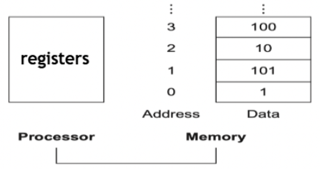
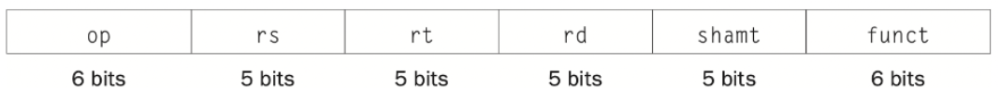
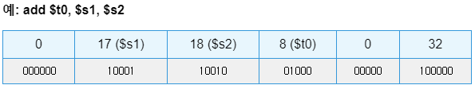
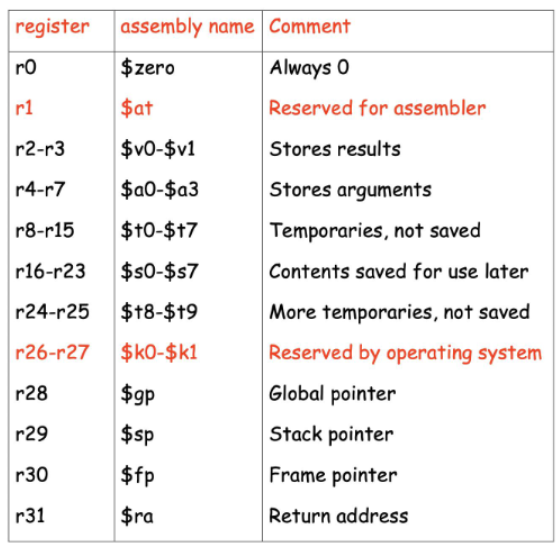
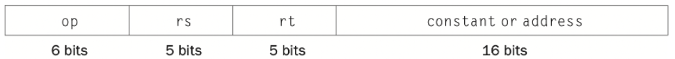
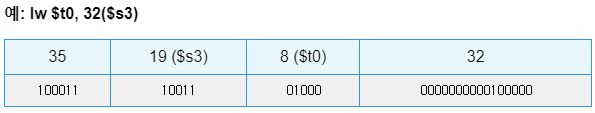

⚙ **Computer Architecture 공부**

## Memory Operands
---
* MIPS CPU는 **<span style="color: #008000">32개의 registers</span>만 가지고 있어 복잡한 데이터 구조를 처리하기 어려움**
* 배열이나 구조체는 레지스터보다 훨씬 많은 데이터 요소를 포함할 수 있음
* 실제로 데이터 구조는 메모리에 저장됨 (**레지스터가 아닌**)
* 하지만 산술 명령어의 피연산자(operands)는 반드시 register에 있어야 함


> Memory_sturcture
* Memory is a large, **single-dimensional array**
* The unit is a **byte**
* Address acting as **index** to that array, **staring from 0**

?이 문제를 해결하기 위해 MIPS에는 **<span style="color: #008000">Data transfer instructions(load and store)</span>**이 포함되어있음  
* `Load`: 메모리에서 레지스터로 데이터 전송
* `Store`: 레지스터에서 메모리로 데이터 전송

### Load Instruction (lw - load word)
---
* 형식: `lw register_to_be_loaded memory_address_to_be_accessed`
  * `memory_address_to_be_accessed`: index
##### 기본 예시  
```
lw $t0, 32($s3)  # $t0 = Memory[$s3 + 32]
```  
> 의미: 주소 `s3`에서 `32바이트`만큼 떨어진 **메모리 위치의 값**을 `t0`에 로드

##### `g = h + A[8];` 구현 예제
* 가정1: A는 100개 요소를 가진 4바이트 정수 배열
* 가정2: A의 기본 주소는 `$s3`에 저장됨
* 가정3: 변수 g와 h는 각각 `$s1`과 `$s2`에 매핑됨
```
lw $t0, 32($s3)    # $t0 = A[8] (32 = 8*4bytes)
add $s1, $s2, $t0  # $s1 = $s2 + $t0 (g = h + A[8])
```

### Store Instruction (sw - store word)
---
* 형식: `sw register_to_be_storedmemory_address_to_be_accessed`

##### 기본 예시
```
sw $t0, 48($s3)  # Memory[$s3 + 48] = $t0
```
> 의미: 주소 `s3`에서 `48바이트`만큼 떨어진 **메모리 위치의 값**을 `t0`에 저장

##### `A[12] = h + A[8];` 구현 예제
```
lw $t0, 32($s3)    # $t0 = A[8] (32 = 8*4bytes)
add $t0, $s2, $t0  # $t0 = $s2 + $t0 (h + A[8])
sw $t0, 48($s3)    # A[12] = $t0 (48 = 12*4bytes)
```

## Representing MIPS Insturction
---
? MIPS 명령어(`add`, `sub`, `addi`, `lw`, `sw` 등)도 결국 **정보이므로 이진수로 표현 가능**  
* 모든 MIPS 명령어는 **32bist(4bytes) 길이를 가짐**

### R-Type(Register-type) 명령어
---
* 어떤 명령어인지, **어떤 레지스터를 사용하는지 등을 나타내는 필드**들로 구성


> Register-type

* `op(opcode)`: basic operation code (6bits)
* `rs`: the 1st register source operand
* `rt`: the 2nd register source operand
* `rd`: the register source operand
* `shamt`: shift amount (5bits, 시프트 명령어에서 사용, 그 외에는 0)
* `funct`: function code(6bits)

* 예시:


* MIPS는 **32개의 register를 가지며**, 각 레지스터는 특정 목적으로 사용됨:


### I-Type(Immediate-type) 명령어
---
* **contants** 또는 **address offset을 포함하는 명령어에 사용**됨 (`Data transfer instructions`, `Immediate instructions` 등)


> Immediate-type

* `constant/address`: 상수 값 또는 주소 오프셋 (16비트)

* 예시:


#### 종합 예시
* **배열 요소 업데이트:** `A[300] = h + A[300];`
* 가정:
  * `$t1`에는 배열 A의 기본 주소가 저장됨
  * `$s2`는 변수 h에 해당함

```
lw $t0, 1200($t1)    # $t0 = A[300] (1200 = 300*4)
add $t0, $s2, $t0    # $t0 = h + A[300]
sw $t0, 1200($t1)    # A[300] = $t0
```
1. `lw $t0, 1200($t1)` (I-type)
   * `op` = 35 (100011)
   * `rs` = 9 (01001) - $t1
   * `rt` = 8 (01000) - $t0
   * `constant`/`address` = 1200 (0000 0100 1011 0000)
   * `lw $t0, 1200($t1)` = 100011 01001 01000 0000 0100 1011 0000
2. `add $t0, $s2, $t0` (R-type)
   * `op` = 0 (000000)
   * `rs` = 18 (10010) - $s2
   * `rt` = 8 (01000) - $t0
   * `rd` = 8 (01000) - $t0
   * `shamt` = 0 (00000)
   * `funct` = 32 (100000)
3. `sw $t0, 1200($t1)` (I-type)
   * `op` = 43 (101011)
   * `rs` = 9 (01001) - $t1
   * `rt` = 8 (01000) - $t0
   * `constant` = 1200 (0000 0100 1011 0000)