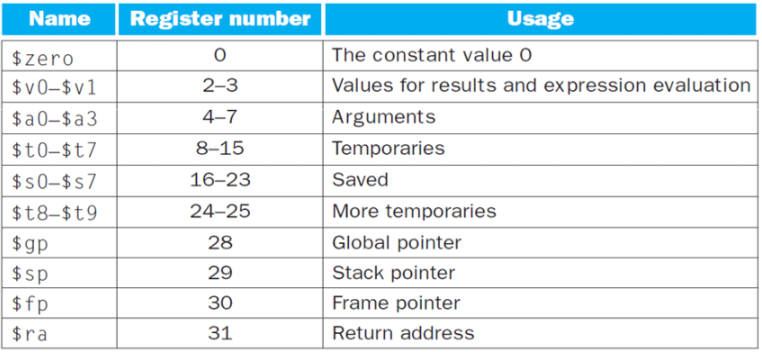
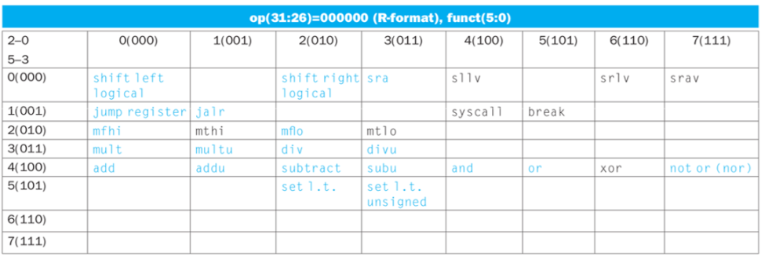

⚙ **Computer Architecture 공부**

## MIPS Registers
---
📚 MIPS CPU는 32개의 레지스터를 가지고 있으며 각각 **32bits**이다.
* 특징:
  * 32개의 레지스터 (번호: 0-31)
  * 레지스터 번호를 지정하려면 5비트 필요 (2^5 = 32가지 경우의 수)
  * 레지스터 번호는 **식별자 역할**을 하며, <u>레지스터가 저장하는 값과는 별개</u>


## Instruction Format
---
MIPS의 **모든 명령어는 32bits(4bytes) 길이**이며, 세 가지 주요 형식이 있다


1. **<span style="color: #008000">R-type</span>**: 레지스터 간 연산(덧셈, 뺄셈 등) 
2. **<span style="color: #008000">I-type</span>**: constant 사용, 메모리 접근, 분기 명령어
3. **<span style="color: #008000">J-type</span>**: jump 명령어

## Opcode
---
명령어의 **첫 6bits인 <span style="color: #008000">opcode</span>는 명령어의 종류를 결정**

##### R-type function code

* R-type의 경우 opcode는 `000000`으로 동일하며, 마지막 6bits인 **function code(funct)가 수행할 연산을 결정**함.


✅ **주요 opcode 예시**:  
* R-type instruction: `000000` (모든 R-type)
* I-type instruction:
  * `addi`: `001000` 
  * `lw(load word)`: `100011`
  * `sw(store word)`: `101011`

### 주요 예시
---
1. `add $t0, $t1, $t2`
* `opcode` = 000000 (R-type)
* `rs` = 01001 (`$t1` = register 9)
* `rt` = 01010 (`$t2` = register 10)
* `rd` = 01000 (`$t0` = register 8)
* `shamt` = 00000
* `funct` = 100000 (add)
```
R-type = op + rs + rt + rd + shamt + funct 
            ↓
000000 01001 01010 01000 00000 100000 = 32bits
```

1. `addi $s1, $s2, 10`
* `opcode` = 001000 (addi: I-tpye)
* `rs` = 10010 (`$s2` = register 18)
* `rt` = 10001
* `immediate` = 0000 0000 0000 1010 (16bits of 10)
```
I-type = op + rs + rt + immediate
            ↓
001000 10010 10001 0000000000001010
```

1. `lw t3,16(t4)`
* `opcode` = 100011 (lw)
* `rs` = 01100 ($t4 = register 12)
* `rt` = 01011 ($t3 = register 11)
* `immediate` = 0000 0000 0001 0000 (16bits of 16)
```
I-type = op + rs + rt + immediate
            ↓
100011 01100 01011 0000000000010000
```