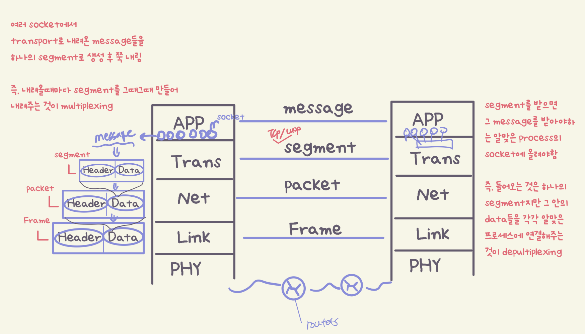
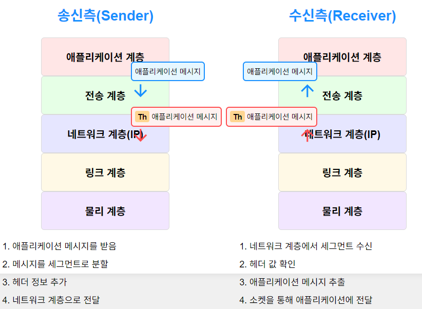
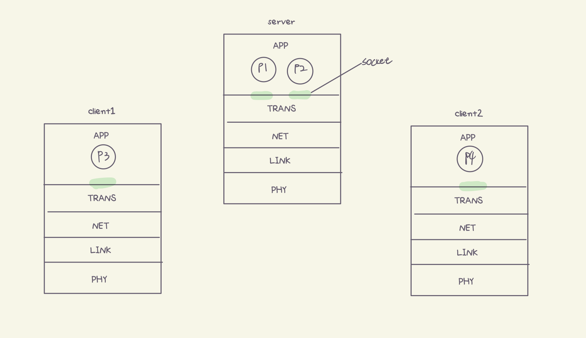
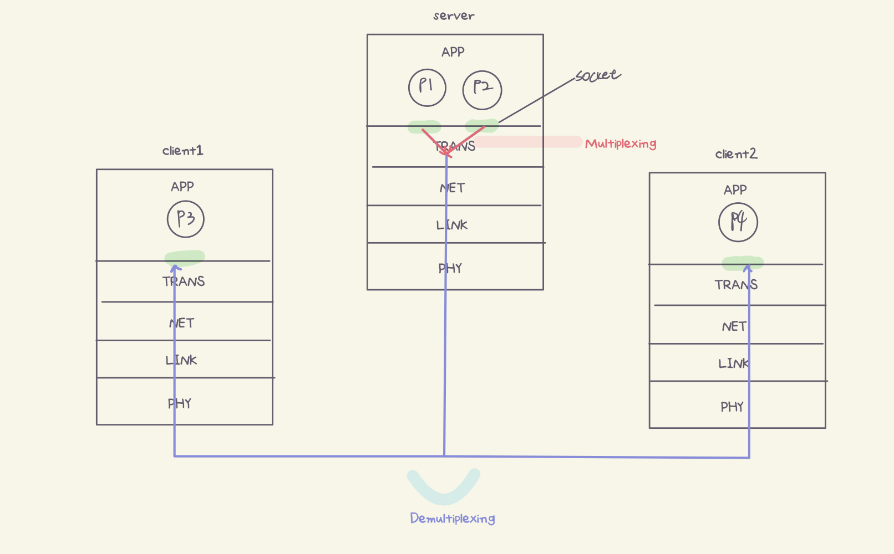
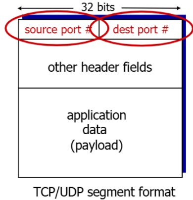
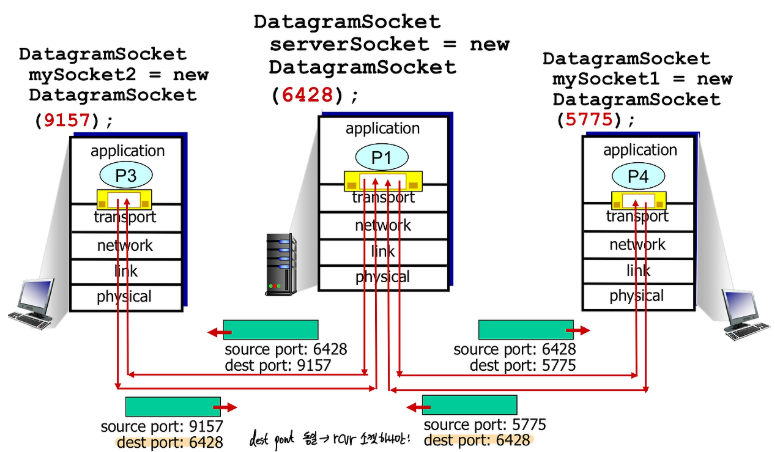
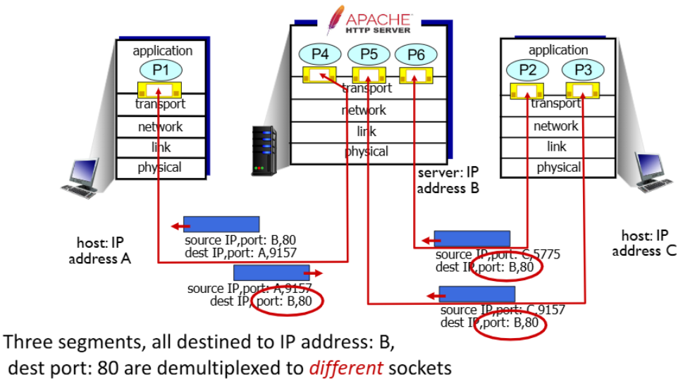
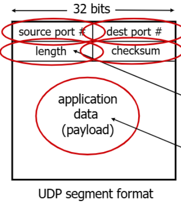

>📚컴퓨터 네트워크 전공 수업 정리

## Transport Layer
---
**<span style="color: #008000">Transport Layer</span>**: 서로 다른 컴퓨터에서 실행 중인 프로그램들이 **마치 직접 연결된 것처럼 데이터를 주고받을 수 있게 해주는 역할**


> Transport layer는 Application layer에서 **message를 받으면 segment로 나눔.**  
> 그 **segment는 Network layer에서 packet형태로 변환되어 receiver에서 수신됨**



### Two principal Internet transport protocols
---
#### TCP(Transmission Control Protocol)
* <span style="color: #008000"><span style="color: #008000">reliable 데이터 전송</span>: 데이터가 손실되지 않도록 보장
* <span style="color: #008000">in-order delivery</span>: 보낸 순서대로 데이터가 도착함
* <span style="color: #008000">congestion control</span>: 네트워크 상황에 따라 데이터 전송 속도 조절
* <span style="color: #008000">flow control</span>: 수신자의 처리 능력에 맞춰 데이터 전송
* <span style="color: #008000">connection setup</span>: 데이터 전송 전에 연결을 먼저 설정

#### UDP(User Datagram Protocol)
* `unreliable`: 데이터 손실이 발생할 수 있음
* `unordered delivery`: 보낸 순서와 다르게 도착할 수 있음
* `단순함`: TCP보다 단순한 구조

❌다음 두 서비스는 TCP와 UDP 모두 제공 안함  
* **delay guarantees**: 특정 시간 내에 데이터가 도착한다는 보장 없음
* **andwidth guarantees**: 특정 전송 속도를 보장하지 않음

### Multiplexing/Demultiplexing
---
> <span style="color: #008000">Multiplexing</span>: 다수의 소켓으로부터 데이터를 수집하여 네트워크 층에서 처리 가능한 데이터를 만들기 위해 분할하는 과정  
> <span style="color: #008000">Demultiplexing</span>: 수신 측에서 도착한 세그먼트를 해당 소켓으로 전달하기 위해 수신 측 포트 번호를 사용하여 세그먼트를 구분하는 과정

즉, **<span style="color: #008000">Multiplexing은 원하는 Socket으로 보내기 위한 과정**이고 **Demultiplexing 은 Segment에서 넘어온 정보를 받는 과정</span>**

#### Multiplexing
* `Client1`(프로세스 p3 실행), `Client2`(프로세스 p4 실행)
* `Server`(프로세스 p1, p2 실행)


> **p1 ↔ p3**, **p2 ↔ p4** 연결됨


* p1, p2에서 소켓을 통해 transport layer로 데이터를 밀어낸다.
* 하지만 transport layer는 하나이다. 
* 때문에 **transport layer**는 **오는 데이터를 각 소켓에서 transport header를 붙여 segment로 만든다.(캡슐화)**
* 그리고 segment들을 네트워크 계층으로 전달한다

#### Demultiplexing
<span style="color: #008000">Demultiplexing</span>은 다음과 같이 동작:

1. host가 `IP datagram`을 수신한다.
2. 각 datagram은 **source IP, destination IP주소를 가지고 있음**
3. 각 datagram은 **transport-layer segment를 carrie한다!**
4. 각각의 **segment는 source, destination의 port 번호**를 가진다.
5. host는 **IP adderss & port number를 사용하여 segment를 적절한 socket으로 전달**


> source, dest port # 는 각각 16bits  
> 약 65,000개 port 지정 가능!

#### Connectionless Demultiplexing : UDP

UDP socket 생성 → destination IP, destination port의 socket으로 전달 → 받는 쪽에서 IP, port를 본다 (transport layer에서는 port 만 확인) → **connectionless에서는 destination만 같으면 같은 socket으로 연다**

* 서로 다른 클라이언트에서 온 데이터그램이라도 **destination port가 같으면 socket을 하나만 연다**

#### Connextion-oriented demultiplexing : TCP
* TCP는 UDP와 달리 **4-tuple로 socket을 식별한다**:
  1. **source IP address**
  2. **source port number**
  3. **dest IP address**
  4. **dest port number**


> dest IP/port가 같아도 source IP/port에 따라 connection이 달라짐  
socket을 각각 연다 → destination IP/port가 같아도 source IP/port가 다르면 각각 connection이 되고, socket도 각각 생성됨

### UDP(User Datagram Protocol)
---
> no frills, bare bones Internet transport protocol : 아무런 장식없고 필수적인 것만을 갖춘 프로토콜

* **best effort 서비스**: 빠르게 데이터를 전송하되 신뢰성은 보장 X
* **connectionless 통신**: 연결 설정 및 해제 과정이 없음

✅**UDP 특징:**  
1. <span style="color: #008000">Connectionless</span>
  * **handshaking 과정이 없음**
  * 각 UDP segment는 **독립적으로 처리**
  * sender와 reciever 간에 **연결 상태 정보 유지 안 함**
2. <span style="color: #008000">Unreliable Transfer</span>
3. <span style="color: #008000">Congestion control 없음</span>
  * 네트워크 상황에 관계없이 데이터를 빠르게 쏟아부음


> **Source Port(16bits)**: 응답이 필요 없는 경우 0으로 설정할 수 있음  
> **Destination Port(16bits)**: 데이터를 올바른 애플리케이션으로 전달하는 데 사용  
> **Length(16bits)**: UDP header와 data를 포함한 전체 segment의 length(바이트 단위)
> **Checksum(16bits)**: 전송 중 발생한 오류를 검출하기 위한 값

✅**UDP 장점:**  
- **no connection establishment**: (딜레이가 추가될 수 있는) 연결설정 없음
- **simple**: 연결이 없기 때문에 간단함
- **small header size**

* **UDP used by:**
  * 스트리밍 멀티미디어(ex: youtube)
  * DNS 조회
  * SNMP (Simple Network Management Protocol)
  * HTTP/3(UDP 기반이지만 애플리케이션 계층에서 신뢰성 추가)
  * 온라인 게임

#### UDP Checksum
**segment 전송 과정에서 `error`가 있는지 확인** = 깨진 bit가 있는지 확인

📚기본 개념:  
1. sender는 **데이터에 대한 체크섬 값을 계산하여 함께 전송**
2. receiver는 **받은 데이터에 대해 동일한 방식으로 체크섬을 다시 계산**
3. **계산된 체크섬이 전송된 체크섬과 일치하지 않으면 오류가 발생**했다고 판단

📝Checksum 계산 방법
**UDP 체크섬은 1의 보수 합을 기반**

```
1110 0110 0110 0110  (첫 번째 16비트 정수)
+ 1101 0101 0101 0101  (두 번째 16비트 정수)
---------------------
1 1011 1011 1011 1011  (합계, 맨 앞의 1은 carry)

  1011 1011 1011 1011  (결과)
+                   1  (carry를 다시 더함 - wraparound)
---------------------
  1011 1011 1011 1100  (최종 합계)
  
  0100 0100 0100 0011  (체크섬 - 1의 보수)
```

* **sender는 계산된 값을 UDP header의 checksum 필드에 저장한다.**
* receiver도 동일하게 계산하고 수신된 segment의 checksum 값과 비교
* 일치하지 않으면 오류가 감지된 것이고, 일치하면 오류가 없는 것으로 판단