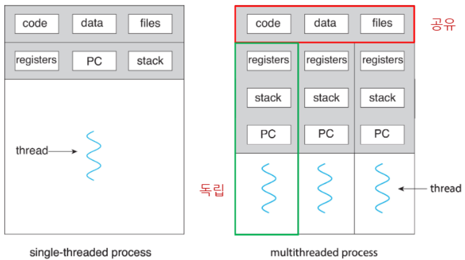
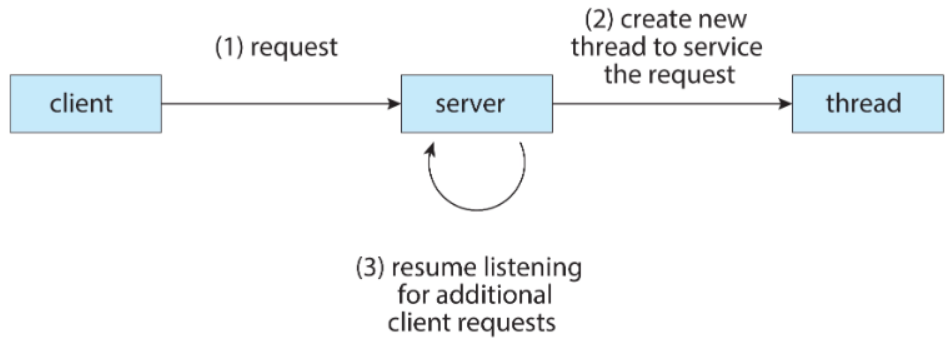
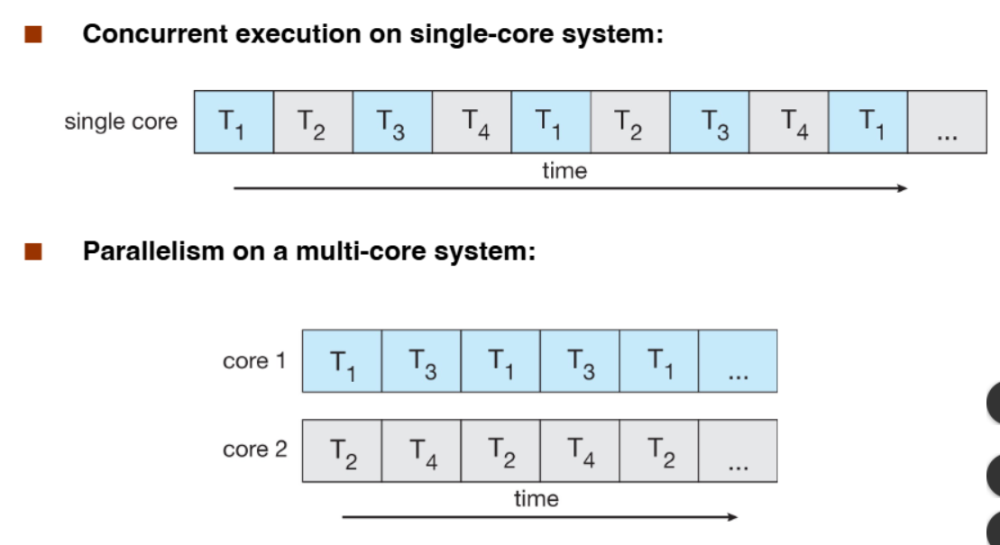
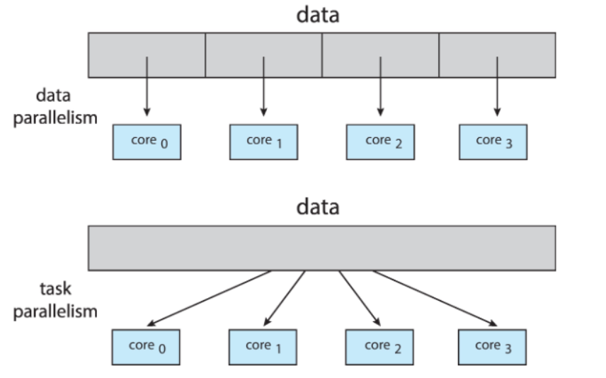
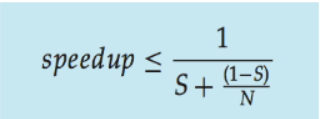
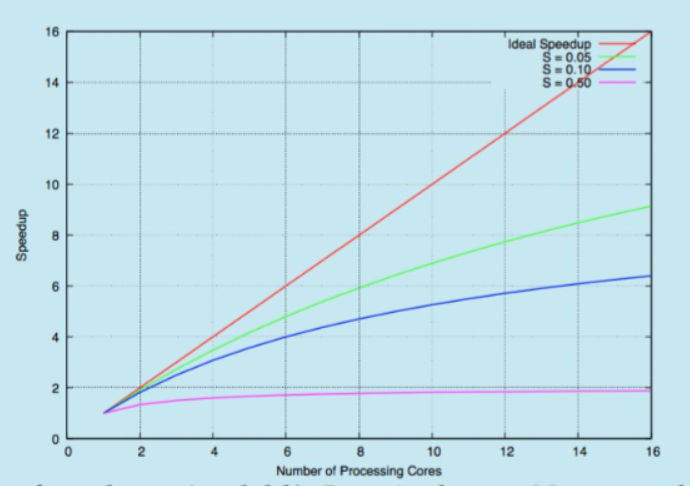
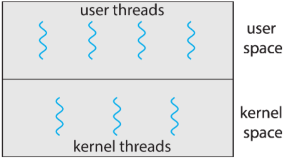
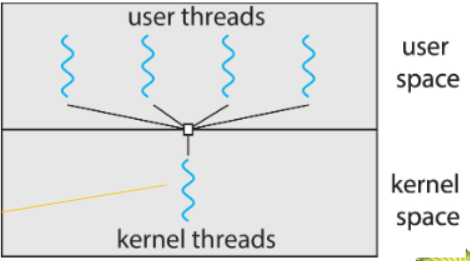

>🍀 운영체제 전공 수업 정리

## Single and Multithreaded Processes
---

* **single threaded process:**
  * 하나의 스레드만 존재
  * 모든 자원을 단일 스레드가 사용
* **<span style="color: #008000">multithreaded process</span>:**
  * `code`, `data`, `files`를 공유
  * `registers`, `PC`, `stack`: 스레드별 공유 영역

## Multithreaded Server Architecture
---

**multithreaded Server의 처리과정:**
1. client의 요청 접수
2. 요청 처리를 위한 새 스레드 생성
3. 다른 클라이언트의 요청을 받기 위해 리스닝 상태로 복귀

#### Benefit of Multithreading
1. **<span style="color: #008000">Responsiveness</span>**
   1. 프로세스 **일부가 block 되어도 계속 실행 가능**
2. **<span style="color: #008000">Resource Sharing</span>**
   1. 스레드는 프로세스의 자원을 공유
   2. **공유 메모리나 메시지 전달보다 효율적**
3. **<span style="color: #008000">Economy</span>**
   1. 프로세스 생성보다 저렴
   2. 스레드 전환이 `context switching` 보다 오버헤드가 낮음
4. **<span style="color: #008000">Scalability</span>**
   1. `Multicore architecture` 활용 가능

## Multicore Programming
---
Multicore환경은 몇가지의 도전과제가 있었다.
1. `Dividing activities`
2. `Balance`
3. `Data splitting`
4. `Data dependency`
5. `Testing and debugging`

* **<span style="color: #008000">Parallelism(병렬)</span>**: **여러개의 코어/CPU가 '동시에' 여러개의 task를 진행**함, 진짜로 동시에 여러 작업이 실행(simultaneously) 되는 것
* **<span style="color: #008000">Concurrency(병행)</span>**: 하나의 코어/CPU가 **여러 개의 task를 시간을 분할해서 동시에 진행함**(=scheduler)


> **single-core의 경우:** 하나의 코어가 시간을 조각내어 여러 task를 번갈아가며 실행. 
> 실제로는 한 번에 하나이지만, 빠른 전환으로 마치 '동시에' 실행하는 것처럼 보임  
> **multi-core의 경우:** 여러 코어가 각각 다른 task를 동시에 실행

### Type of parallelism
  * **<span style="color: #008000">Data parallelism</span>**: **동일한 데이터셋의 여러 부분을 여러 코어에 분배하여 동일한 연산을 수행하는 방식**(예: 큰 이미지를 여러 부분으로 나누어 각 코어에서 같은 필터를 적용하는 경우)
  * **<span style="color: #008000">Task parallelism</span>**: **서로 다른 스레드를 여러 코어에 분배하여 각 스레드가 서로 다른 연산을 수행하는 방식**(예: 웹 브라우저에서 하나의 스레드는 UI를 처리하고, 다른 스레드는 네트워크 요청을 처리하는 경우)



### Amdahl's Law
---
📚애플리케이션에 코어를 추가했을 때 얻을 수 있는 성능 향상을 식별함
* 결론: **코어의 수가 2배가 된다고 성능이 2배 좋아지진 않는다(1.6배 향상)**


> `S: 직렬 부분 비율(%)`, `1-S: 병렬 비율`, `N: processing core 수`  
> 만약 어떤 task의 75%가 병렬이 가능하고 나머지는 직렬만(25%) 가능할 때, 코어가 2배가 되면 최대 효율은 1.6배이다.  
> 즉, 최대의 speedup을 위해선 직렬만 가능한 프로그램이 적어야한다


> S가 50%인 경우 아무리 core를 늘려도 speed가 2배가 되지 않는다.

### User Threads and Kernel Threads
---
✅ **process와 thead를 혼동할 수 있다** → 현재는 거의 모두 thread를 사용한다.  
옛날에는 process단위로 scheduler를 했지만 **현재는 thread 단위로 함**

* **<span style="color: #008000">User threads</span>**: management done by **user-level threads library**
* **Three primary thread libraries:**
  * `POSIX Ptheads`: thread의 시발점 / 현재는 kernel level
  * `Windows threads`
  * `Java threads`

* **<span style="color: #008000">Kernel threads</span>**: Supported by the Kernel
* 대부분의 현대 범용 운영체제에서 지원:
  * `Windows`
  * `Linux`
  * `Mac OS X`
  * `iOS`
  * `Andriod`


> 개념적으로는 **user와 kernel이 분리**됨

{:.prompt-tip}
> 그 분리를 합치기 위한 방법이 있다.
> 

#### 1. Many-to-One
---
📚**<span style="color: #008000">Many-to-One</span>**: **여러 User Thread**가 **하나의 Kernel Thread**에 **Mapping**되는 방식



✅장점:  
  * 원하는 만큼 많은 사용자 스레드 생성 가능

❌단점:  
  * 병렬 처리 불가능 → 멀티코어의 장점 못 살림 
  * 하나라도 블로킹되면 전부 멈춤 → 효율성 저하
현재는 거의 사용 X

#### 2. One-to-One
---
각 하나의 유저 스레드에 커널 스레드가 매핑됨
→ user thread를 생성하면 kernel thread도 함께 생성됨

✅장점:  
  * 스레드가 블로킹되어도 다른 스레드 실행 가능
  * 여러 스레드를 **다중코어에 매핑 가능**
  
❌단점:  
  * 스레드 생성 시 **오버헤드 때문에 프로세스당 스레드 수가 제한**될 수 있음

#### 3. Many-to-Many Model
---
**여러개의 유저 스레드를 여러개의 커널 스레드에 매핑되는 방식**

✅장점:  
  * 사용자 스레드를 마음대로 생성 가능 + 멀티코어에서 병렬로 실행가능

❌단점:  
  * 여러개의 입력과 여러개의 출력을 스위칭해줘야하는데 그 비용이 상당함 → 구현이 어려움

## Thread Library
---
📚**<span style="color: #008000">Thread Library</span>**: 프로그래머에게 **스레드를 생성하고 관리할 수 있는 API(Application Programming Interface)를 제공**

이 라이브러리는 두 가지 방식으로 구현:
1. **user space에만 있는 라이브러리:**
  * 모든 스레드 코드가 사용자 공간에서 실행됨
  * 커널은 스레드의 존재를 인식하지 못함
2. **kernel-level에서 지원하는 라이브러리:**
  * 스레드 생성 및 관리가 커널에 의해 수행됨
  * 시스템 콜을 통해 커널과 통신

* `Asynchronous Threading`: 부모와 자식 스레드가 **독립적으로 병행 실행**
* `Synchronous Threading`: 부모 스레드는 **모든 자식 스레드가 종료될 때까지 기다림**  
> 부모 스레드는 메인 스레드, 자식 스레드는 서브 스레드라고도 한다.  
> `POSIX Pthreads`: user or kernel level  
> `Windows threads`: kernel level  
> `javathreads`: depending on OS  

### Pthreads
---
사용자 수준이나 커널 수준으로 제공될 수 있음
* **스레드 생성 및 동기화를 위한 API**
* 표준만 정의: **실제 구현은 라이브러리 개발자에게 맡김**

#### 스레드 생성

```c
#include <pthread.h>

int pthread_create(pthread_t *thread, const pthread_attr_t *attr,
                  void *(*start_routine)(void *), void *arg);
```
* `thread`: 생성된 스레드의 ID를 저장할 포인터  
* `attr`: 스레드의 속성(NULL이면 기본값)  
* `start_routine`: 스레드가 실행할 함수 주소  
* `arg`: 시작 함수에 전달할 인자  

```c
/* Example pthread */

#include <pthread.h>
#include <stdio.h>
#include <stdlib.h>

int sum; /* this data is **shared** by the thread(s) */
void *runner(void *param); /* threads call this function */

int main(int argc, char *argv[])
{
  pthread_t tid; /* 스레드 식별자 */
  pthread_attr_t attr; /* 스레드 속성 집합 */

  /* set the default attributes of the thread */
  pthread_attr_init(&attr);
  /* create the thread */
  pthread_create(&tid, &attr, runner, argv[1]);
  /* wait for the thread to exit */
  pthread_join(tid, NULL);

  printf("sum= %d\n", sum);
}

void *runner(void *param)
{
  int i, upper=atoi(param);
  sum =0;
  for(i=1; i<=upper; i++)
    sum += i;

  pthread_exit(0);
}

// 10개의 스레드를 생성하고 완전히 종료될 때까지 main thread가 기다리는 코드
#define NUM_THREADS 10

/* an array of threads to be joined upon */
pthread_t workers[NUM_THREADS];

for(int i = 0; i<NUM_THREADS; i++)
  pthread_join(workers[i], NULL); // 스레드 종료 대기
```