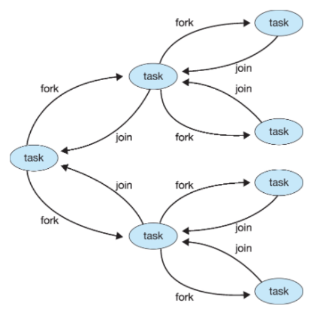

>🍀 운영체제 전공 수업 정리

## Single and Multithreaded Processes
---


## Multithreaded Server Architecture
---


## Multicore Programming
---

* **Parallelism(병렬)**: 여러개의 코어/CPU가 동시에 여러개의 task를 진행함, 진짜로 동시에 여러 작업이 실행(simultaneously) 되는 것
* **Concurrency(병행)**: 하나의 코어/CPU가 여러 개의 task를 시간을 분할해서 동시에 진행함(=scheduler)


* **Type of parallelism**
  * **Data parallelism**: **코어들이 하는 행위가 같음**, 각 코어가 데이터를 나누어서 덧셈을 하는 경우
  * **Task parallelism**: **코어가 하는 일이 각각 다름**, 같은 데이터에 대해 각 코어가 다른 통계 연산을 하는 경우


### Amdahl's Law
---
* 코어의 수가 2배가 된다고 성능이 2배 좋아지진 않는다는 법칙
* 

> s는 직렬, 1-S 는 병렬처리이고 N은 processing core
> 만약 어떤 task의 75%가 병렬이 가능하고 나머지는 직렬만 가능할 때, 코어가 2배가 되면 최대 효율은 1.6배이다.
> 즉, 최대의 speedup을 위해선 직렬만 가능한 프로그램이 적어야한다


> S가 50%인 경우 아무리 core를 늘려도 speed가 2배가 되지 않는다.

### User Threads and Kernel Threads
---
process와 thead를 혼동할 수 있다. 현재는 거의 모두 thread를 사용한다.
옛날에는 process단위로 scheduler를 했지만 현재는 thread단위로 함

* **User threads**: management done by **user-level threads library**
* Three primary thread libraries:
  * POSIX **Ptheads**: thread의 시발점 / 현재는 kernel level
  * Windows threads
  * Java threads

* **Kernel threads**: Supported by the Kernel
* Examples:
  * Windows
  * Linux
  * Mac OS X
  * iOS
  * Andriod


> 개념적으로는 user와 kernel이 분리됨

그 분리를 합치기 위한 방법이 있다.

#### Many-to-One
---
📚**User Threads**가 **하나의 Kernel Thread**에 **Mapping**되는 방식입니다.


* One thread blocking causes all to block
* Multiple threads may **not run in parallel** on multicore systems

✅장점  
* 원하는 만큼 많은 사용자 스레드 생성 가능

❌단점  
* 병렬 처리 불가능 → 멀티코어의 장점 못 살림 
* 하나라도 블로킹되면 전부 멈춤 → 효율성 저하

#### One-to-One
---
각각 하나의 유저 스레드에 커널 스레드가 매핑됨

✅장점  
* 스레드가 블로킹되면 다른 스레드를 실행할 수 있음
* 여러 개의

#### Many-to-Many Model
---
여러개의 유저 스레드를 여러개의 커널 스레드에 연결하는 방식

✅장점 
* 사용자 스레드를 마음대로 생성 가능 + 멀티코어에서 병렬로 실행가능

❌단점  
* 여러개의 입력과 여러개의 출력을 스위칭해줘야하는데 그 비용이 상당함 → 구현이 어려움

## Thread Library
---
📚**Thread Library**: 

부모 스레드는 메인 스레드, 자식 스레드는 서브 스레드라고도 한다.

### Pthreads
---
```c
/* Example pthread */

#include <pthread.h>
#include <stdio.h>
#include <stdlib.h>

int sum; /* this data is **shared** by the thread(s) */
void *runner(void *param); /* threads call this function */

int main(int argc, char *argv[])
{
  pthread_t tid; /* the thread identifier */
  pthread_attr_t attr; /* set of thread attributes */

  /* set the default attributes of the thread */
  pthread_attr_init(&attr);
  /* create the thread */
  pthread_create(&tid, &attr, runner, argv[1]);
  /* wait for the thread to exit */
  pthread_join(tid, NULL);

  printf("sum= %d\n", sum);
}

void *runner(void *param)
{
  int i, upper=atoi(param);
  sum =0;
  for(i=1; i<=upper; i++)
    sum += i;

  pthread_exit(0);
}

// 10개의 스레드를 생성하고 완전히 종료될 때까지 main thread가 기다리는 코드
#define NUM_THREADS 10

/* an array of threads to be joined upon */
pthread_t workers[NUM_THREADS];

for (int i = 0; i < NUM_THREADS; i++)
    pthread_create(&workers[i], NULL, some_function, NULL);  // 스레드 생성

for(int i = 0; i<NUM_THREADS; i++)
  pthread_join(workers[i], NULL); // 스레드 종료 대기
```

### Implicit Threading
---
📚 **Implicit Threading**: 스레드의 생성과 관리는 **컴파일러**나 **런타임 라이브러리**가 자동으로 처리해주는 방식  
  * 개발자는 **병렬로 처리할 수 있는 task**를 지정만 하면 됨

* **<span style="color: #008000">Thread Pools</span>**: 쓰레드의 수를 조절하기 위해 미리 스레드를 만들어두고 작업을 할당
* **<span style="color: #008000">Fork-Join</span>**: 작업을 여러 개로 나누고 (fork), 다 끝나면 다시 합침 (join)
* **<span style="color: #008000">OpenMP</span>**: C/C++에서 `#pragma`로 병렬 코드 쉽게 작성
* **Grand entral Dispatch**: 애플에서 만든 스레드 풀 기반 병렬 처리 프레임워크
* **Intel Threading Building Blocks**: C++ 템플릿 기반의 병렬 처리 라이브러리

#### Thread Pools
---
📚미리 생성된 여러 개의 thread를 **`pool`이라는 공간에 대기**시켜 놓고, **필요할 때마다 이 pool에서 thread를 가져와 작업을 처리**하는 방식

✅**Thread Pools의 장점**  
1. **속도 향상**: 새로운 스레드를 생성하는 것보다 이미 존재하는 스레드를 사용하는 것이 약간 더 빠름.
2. **스레드 수 제한**: 애플리케이션에서 사용하는 thread의 수를 pool 크기로 제한 가능 → 시스템 자원의 과도한 사용을 방지
3. **작업과 메커니즘 분리**: task를 수행하는 것과 스레드를 생성하는 메커니즘을 분리함 → 다양한 전략으로 작업을 실행 가능
   * 예: 작업을 주기적으로 실행되도록 스케줄링

* **Windows API에서의 스레드 풀 지원**
```c
DWORD WINAPI PoolFunction(AVOID Param) {
    /*
     * this function runs as a separate thread.
     */
}
```
> `QueueUserWorkItem()` 함수를 통해 **pool에 있는 스레드가 PoolFunction을 실행하게 함**

```markdown
* Thread Pools의 작동방식
[작업 큐(Task Queue)]  →  [스레드 풀(Thread Pool)]  →  [작업 실행(Task Execution)]
   작업1, 작업2, ...        스레드1, 스레드2, ...          결과1, 결과2, ...
```
#### Fork-join
---
📚 **Fork-Join Parallelism**  


> Multiple threads (tasks) are forked, and then joined


> merge_sort의 과정과 흡사함

#### OpenMP
---
OpenMP는 컴파일러 지시문으로 실행한다.

`#pragma omp parallel`을 쓰고 중괄호 사이의 코드를 코어의 수만큼 중복해서 실행한 뒤 종료하고 `join`을 함
```c
#pragma omp parallel
    {
        printf("[T%d] Hello, world!\n", id);
    }
```

**for loop 상황도 가능함**

```c
// 코어의 수만큼 스레드를 생성하고 N개의 iteration을 스레드에 분할매핑
// 만약 코어의 수가 10개면 3,3,2,2 식으로 매핑한다
#pragma omp parallel for
for (i=0; i<N; i++){
  c[i] = a[i] + b[i]
}
```
> 이 예제에서는 data의 종속성이 없어서 병렬 실행이 가능
> 종속성이 있는 경우에는 주의해야 함
> **스레드의 수를 지정할 수 있음** `num_threads(N)`
> 매핑 순서에 변화를 줄 수 있음 `schedule(dynamic)`

### Grand Central Dispatch
---
thread pool의 크기를 자동 조절

### Intel Threading Building Blocks (TBB)
---
* **Template library** for designing parallel C++ programs

## Threading Issues
---
1. **Semantics of `fork()` and `exec()` system calls**
2. **Signal handling**
   * **Synchronous(내부에서발생)** and **asynchronous(외부에서발생)**
3. **Thread cancellation of target thread**
   * **Asynchronous(외부에 의해 캔슬)** or **deferred(스무스하게 캔슬)**
4. **Thread-local storage**

### Semantics of fork() and exec() system calls
---
한 개의 스레드인 경우는 문제가 없지만, 여러 개의 스레드가 있는 경우 모두 `fork()`해야하는가?
→ 대부분 main thread만 `fork()`함
여러개의 스레드를 다 복제했더니 덮어씌우면 낭비이니 `fork()` 후 `exec()` 방식을 사용
⭐**"Dont use both <span style="color: #008000">threads</span> and <span style="color: #008000">forks</span>"**

### Signal handling
---
시그날은 **"프로세스"**에게 신호를 전달하는 행위, 스레드한테도 전달할 수도 있음
어떤 시그널을 특정 스레드에게 보냈는데 특정 처리를 안하면 그 스레드만 죽는게 아니라 프로세스 전체가 다 죽음

시그널 처리 방식:
1. 시그널은 특정 이벤트에 의해 발생할 수 있음(예:ctrl+c)
2. 프로세스에 전달됨(스레드에게만도 전달될 수 있지만 위험함. 그래서 프로세스의 전체 스레드에게 전달)
3. 시그널은 두개 중 하나
   1. 죽음(default)
   2. 사용자 정의(user-defined)

시그널의 기본 행위는 죽는건데, 사용자가 죽는게 싫으면 오버라이드 가능

* 시그널이 스레드한테 전달됐을 때
  * divide by zero 같은 상황이 발생했을 때 
  * 프로세스의 모든 스레드에게 보낼 수 있음(예: ctrl+c)/하지만 대부분 중복된 시그널은 첫번째 것만 수용하고 나머진 무시
  * 특정한 스레드에게도 시그널을 보낼 수 있음
  * 
```c
kill(pid_t pid, int signal); // 스레드를 죽이는 함수
pthread_kill()// 프로세스를 죽이는 함수
```
* 대부분의 Unix계열의 OS에서는 스레드마다 받는 또는 거부하는 signal을 설정할 수 있음.
* 따라서 다중스레드인 경우 signal을 허용하는 **첫번째 스레드가 처리**함

### Thread cancellation of target thread
---
스레드가 끝나기 전에 종료하는 행위

* 비동기적 종료: 즉각적으로 타겟 스레드를 종료 → 할당된 자원을 모두 free하지 못할 경우가 생길 수 있음
* 지연 종료: 종료할 타겟 스레드를 periodcally check하고 있음
  * Cancellation point에서 스레드를 캔슬함.
  * 일반적으로 `read()`와 같은 **blocking system call**이 **cancellation point**가 됨

```c
pthread_t tid;


```

만약 캔슬할 스레드가 cancellation point로 안가면 어떻게 되는가?

### Thread-local storage(TLS)
---
스레드는 자원을 공유하지만(전역변수) 전역변수를 변경 시 모든 스레드에 적용.
→ 지역변수가 필요할 경우도 있음(thread pool의 경우에 필요함)
→ 스레드 pool을 사용하면 사용자는 스레드생성에 관여하지 않기 때문에 TLS가 유용

* `static`data와 흡사함
  * TLS는 다른 스레드에게 unique함 

### Linux Threads
---
linux는 스레드 보다 task를 선호함
`clone()`system call을 사용해서 task를 복제함 