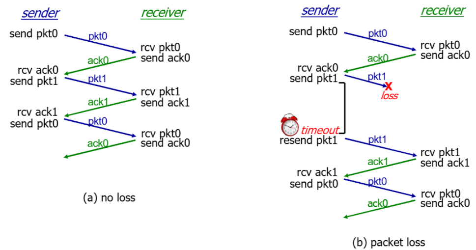

>📚컴퓨터 네트워크 전공 수업 정리

## rdt(Reliable Data Tranfer)
---
**RDT(Reliable Data Tranfer)**: **네트워크를 통해 데이터를 안정적으로 전송하기 위한 규칙 및 메커니즘의 집합**

* application layer입장에서는 보내기만 하면 reliable이 보장 된다고 생각한다.
  * transport layer에서는 **reliable을 보장해주어야한다**
* `rdt protocol`을 구현할 때, 통신 채널의 **신뢰성 여부가 프로토콜의 complex를 결정**한다.
  * ex: 만약 데이터 전송 채널이 신뢰적이지 않다면 **데이터 패킷이 손상되거나 유실될 가능성이 높아진다.**
  * 이를 보완하기 위한 `rdt protocol`은 더 복잡하고 안정적인 오류 제어 및 재전송 매커니즘이 필요

* `APP - TP - NET`으로 직접 연결되어있으니 **TP는 APP, NET 이렇게 둘만 소통할 수 있으면 된다.**
* 이 소통을 위한 인터페이스는 다음과 같다:

1. `rdt_send()`: **APP이 다른 APP으로 데이터를 송신할 때** Trans 계층에게 data를 담아 **rdt_send(data)를 호출**
2. `udt_send()`: 데이터를 받은 Trans는 데이터에 Trans header를 붙이고 아래 계층인 NET 계층으로 **udt_send(packet)를 한다**
3. `rdt_rcv()`: receiver의 NET은 **rdt_rcv(packet)로 받아온 패킷를 올려보낸다**
4. `deliver_data()`: Trans는 **Trans header를 빼고** 온전한 **데이터만을 deliver_data()로 APP에게 올려보낸다**

### rdt 1.0
---
가장 간단하게 **손실도 일어나지 않고 비트 에러도 일어나지 않는 reliable 네트워크 상황**이라고 가정해보자
→  손실을 위한 재전송 요청을 할 필요도 없고, 에러 체킹도 안해도 된다

FSM은 sender와 receiver 입장 이렇게 2개를 고려

> sender는 APP계층에서` rdt_send(data)`가 발생 → Trans 계층에서 packet을 생성 → 만든 packet을 NET 계층으로 전송(`udt_send(packet)`)  
> receiver는 `rdt_rcv(packet)`으로 패킷이 올라오면 패킷에서 데이터를 추출 → 추출한 data를 `deliver_data(data)`로 APP 계층에게 올려보냄

### rdt 2.0
---
이번엔 네트워크에서 **bit error가 발생할 수 있다고 가정**.
어떤 action을 해야할까?

✅**Checksum 필드로 파악 가능**
그럼 bit error가 발생했을 때 재요청은 어떻게 구현해야하는가?

* sender측에서 데이터가 잘 보내졌는지 파악해야함
이는 ack(aknownledgements)와 nak(negative aknownledgements)로 판단

* receiver가 잘 받았으면 sender에게 `ACK` 전송, 못받았으면 `NAK` 전송
* sender는 데이터를 보내고, receiver에게서 오는 ack또는 nak를 기다림
  * **ACK가 오면 해당 데이터 업무 종료, NAK가 오면 데이터 재전송 후 다시 ack또는 nak 기다림**

* **rdt2.0에서의 새로운 매커니즘**(rdt 1.0과 비교)  
✅ `에러 감지`   
✅ `피드백`: receiver가 sender에게 ACK,NAK 전송으로 피드백

{:.prompt-warning}
> ACK, NAK에도 bit error가 발생하는 경우는?
>

그게 rdt 2.1

#### rdt 2.1
그럼 데이터를 재전송 하면 되는가?
→ receiver는 전송된 결과가 이미 왔던건지 모름(중복 패킷 구분 X)
→ **duplicate 가능성 있음**

✅ **duplicate 해결 방법**:  
* sender는 ACK, NAK에서 corrupt가 일어나면 패킷 재전송
* sender는 각각의 패킷에 **sequence number**를 붙임 
* receiver는 받은 패킷이 왔던것이면 버리고 새것이면 처리해줌(ACK/NAK은 무조건 보냄)

✅ error ACK/NAKs 처리하기 = duplicate 문제점 해결을 위해 sequence number 이용

> sender의 FSM

* sender는 패킷에 0, 1이라는 **sequence #를 포함**
* 0을 보낼 차례, 1을 보낼 차례를 구분하는 상태로 분리
* 0 전송 상태 → `make_pkt`에 0을 담아 패킷을 만들고 전송
* 0번 패킷이 잘 도착했는지 기다리는 상태인 `wait for ACK or NAK 0`
* 비트 에러 판단하는 `corrupt()`함수 추가
  * 만약 비트에러가 있다면 재전송
  * 멀쩡한 ACK라면 1을 보내야하는 상태로 진입
  * 데이터 내려오면 1을 담아 패킷 전송
  * ACK/NAK waiting

> receiver의 FSM

* **rdt2.1에서의 새로운 매커니즘**(rdt 2와 비교)
✅`ACK, NAK 패킷 비트 에러`, `중복 패킷 비교`, `중복 패킷 버리기` 대응을 추가

{:.prompt-warning}
> 그럼 ACK, NAK 두 개 전부 필요할까?
>

**ACK만 사용해서 2.1을 구현하는게 rdt 2.2**

#### rdt 2.2
✅ **NAK 대신 <u>ACK만 활용</u>** - **OK받은 마지막 패킷에 대해 ACK 보내줌**
→ receiver가 ACK메세지를 보낼 때, ACK메시지에 포함된 시퀀스 번호가 receiver가 받은 패킷 중에서 어떤 패킷을 ACK하고 있는지 명확하게 표시해야한다 **(=ACK에 sequence number 포함해서 전송)**
→ 중복된 ACK 받으면 현재 패킷을 전송함

> seq #0에 대한 그림(1은 숫자만 바꾸면 됨)

* `sender`: 0번 전송 후 **ACK 0 wating 상태**로 전환
  * 만약 **ACK 1을** 받게되었다면 packet 재전송
* receiver: 0번 패킷 수신 → **체크섬과 함께 ACK 1을 전송** → 1을 기다리는 상태로 전환
  * 만약 0번이 중복으로 왔다면 **ACK 1을 재전송**

### rdt 3.0
---
**rdt 3.0**: **bit error뿐만 아니라 packet loss까지 고려**한 protocol

❌**데이터 패킷과 ACK, NAK도 손실될 수 있음**  
1. sender가 보낸 packet이 loss된 경우
2. receiver가 보낸 ACK가 loss된 경우
✅ 무작정 기다릴순 없으니 **timer**를 만듦  
→ 일정시간이 지나면 재전송

* 초기상태: 패킷 만들고 전송 한 후 타이머 시작해서 다음 상태로 넘어감
* 왔는데 시퀀스 넘버가 다르거나 문제가 있으면 **타이머는 그냥 흘러가도록 놔두고 상태 유지**
* **타임아웃이 걸리면 재전송하고 타이머 다시 시작 하고 상태 유지**
* ACK이 제대로 오면 타이머 스탑하고 다음 상태로 넘어감

> (b), (c)의 경우 timeout이 되면 다시 정상화  

* (d)이미지
  * timer를 짧게해서 ACK가 오기전에 timeout발생
  * **작동은 하지만 불필요한 재전송으로 duplicate가 많다**
  * **반면 timer를 너무 길게하면 loss 발생 시 복구가 오래 걸림**
  * 적당한 timer구현이 중요

#### performance of rdt 3.0
rdt 3.0은 `stop and wait`(timer에 의존) 때문에 성능이 좋지 않음

> 전송속도 1Gbps, 전파속도 15ms, 8000bit의 패킷을 보낸다, sender-receiver사이가 회선으로 연결되어있다고 가정

* 전송시간 : 패킷 내보내는데 걸리는 시간 : `8 usec`
* 전파시간 : 한 패킷이 끝까지 가는데 걸리는 시간 : `15ms`
* 보내는데 총 시간 = 전송시간 + 전파시간 = `15.008ms`
* ACK은 비트수가 작기 때문에 전송시간 매우 작다고 판단해서 무시하고 전파시간만 고려
* 따라서 패킷이 가는데 걸리는 시간 + ACK이 오는데 걸리는 시간 = 15.008 + 15 = `30.008ms`
* 8000비트 보내고 ACK 받는데 30.008ms 소요
* 효율성이 매우 떨어진다. (효율성이 1이 제일 좋음)

**이를 보완하기 위해 pipelined protocols 사용**

#### piplined protocols

* ACK의 유무 상관없이 뭉텅이로 패킷을 전송하고 그 뒤에 ACK뭉텅이를 받는다.

* 두가지 일반적인 파이프라인 프로토콜 형태: **go-Back-N**, **selective repeat**
##### 1. Go-Back-N(GBN)
: 손상된 패킷을 제외한 모든 패킷이 성공적으로 수신되어야만 다음 패킷을 전송할 수 있는 형태의 파이프라인 프로토콜
* sender는 최대 n개의 확인되지 않은 (unacked) 패킷을 파이프라인 상에 가지고 있음  
→ 이 때 N은 **window size**
* receiver는 **`cumulative ack`만을 보낸다**  
→ 빈 공간이 있을 경우 해당 패킷을 확인하지도, 응답하지 않음 (ack 안함)
* sender는 가장 오래 확인되지 않은 패킷에 대한 timer를 가지고 있으며, 타이머가 만료되면 **모든 확인하지 않은 패킷을 다시 전송한다.**

##### 2. Selective Repeat
: 패킷 손실이 발생해도 다른 패킷들은 계속 전송될 수 있음 → 전송 시간을 최적화
* sender는 최대 n 개의 확인되지 않은 패킷을 보낼 수 있다.
* receiver는 각 패킷에 대한 **`individual ack`을 보낸다.**  
* sender는 각 확인되지 않은 패킷에 대한 타이머를 유지한다.   
→ 타이머가 만료되면 **sender는 해당 확인되지 않은(unacked)패킷만 재전송한다.** 
