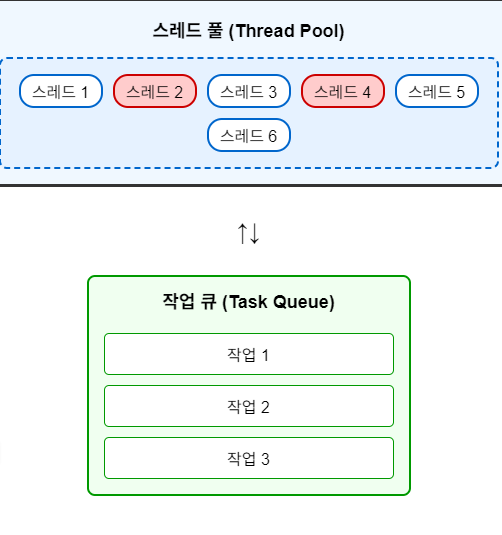
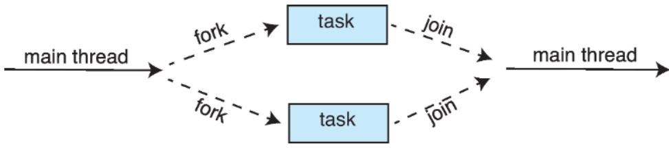
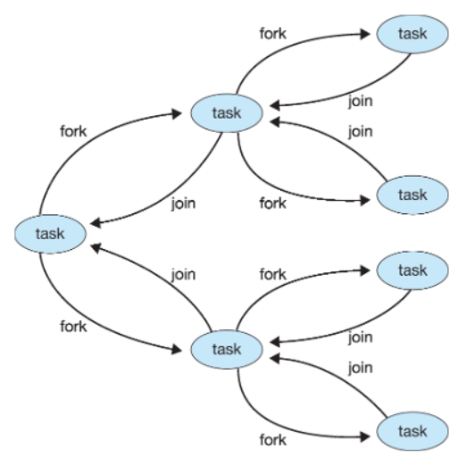

>🍀 운영체제 전공 수업 정리

## Implicit Threading
---
최근 스레드 개수가 증가함에 따라 프로그램의 정확성 보장이 어려워짐
이런 복잡성을 줄이기 위해 <span style="color: #008000">complier</span>와 <span style="color: #008000">run-time library</span>가 스레드의 생성과 관리를 담당
  * 개발자는 **병렬로 처리할 수 있는 task**를 지정만 하면 됨

* **<span style="color: #008000">Thread Pools</span>**: 쓰레드의 수를 조절하기 위해 미리 스레드를 만들어두고 작업을 할당
* **<span style="color: #008000">Fork-Join</span>**: 작업을 여러 개로 나누고 (fork), 다 끝나면 다시 합침 (join)
* **<span style="color: #008000">OpenMP</span>**: C/C++에서 `#pragma`로 병렬 코드 쉽게 작성
* **Grand entral Dispatch**: 애플에서 만든 스레드 풀 기반 병렬 처리 프레임워크
* **Intel Threading Building Blocks**: C++ 템플릿 기반의 병렬 처리 라이브러리

### Thread Pools
---
📚**<span style="color: #008000">Thread Pools</span>**: 미리 생성된 여러 개의 thread를 **`pool`이라는 공간에 대기**시켜 놓고, **필요할 때마다 이 pool에서 thread를 가져와 작업을 처리**하는 방식

✅**Thread Pools의 장점**  
1. **속도 향상**: 새로운 스레드를 생성하는 것보다 이미 존재하는 스레드를 사용하는 것이 약간 더 빠으
2. **스레드 수 제한**: 애플리케이션에서 사용하는 t**hread의 수를 pool 크기로 제한 가능** → 시스템 자원의 **과도한 사용을 방지**
3. **작업과 메커니즘 분리**: **task를 수행하는 것과 스레드를 생성하는 메커니즘을 분리**함 → 다양한 전략으로 작업을 실행 가능
   * 예: 작업을 주기적으로 실행되도록 스케줄링

* **Windows API에서의 스레드 풀 지원**
```c
DWORD WINAPI PoolFunction(AVOID Param) {
    /*
     * this function runs as a separate thread.
     */
}
```

> `QueueUserWorkItem()` 함수를 통해 **pool에 있는 스레드가 PoolFunction을 실행하게 함**

* **Thread Pools의 작동방식:**
1. 풀에 있는 스레드들은 **작업이 할당될 때까지 대기 상태**
2. 작업이 요청되면 **풀에서 사용 가능한 스레드가 해당 작업을 수행**
3. 작업이 완료되면 스레드는 다시 풀로 돌아가서 다음 작업을 대기



❌Thread pool의 `Sleeping Barber Problem`:  
1. 이발사(스레드)가 고객이 없을 때는 잠을 자고(대기 상태), 고객이 오면 깨어나 서비스를 제공
2. 대기실에 **제한된 수의 의자(풀 크기)가 있어, 고객(작업)이 더 이상 들어올 수 없으면 떠난다**
3. 스레드 풀 역시 이와 유사하게 **제한된 수의 스레드가 작업을 기다리다가 작업이 들어오면 처리**

### Fork-join
---
📚 **<span style="color: #008000">Fork-Join Parallelism</span>**: <u>하나의 메인 스레드에서 **여러 개의 작업 스레드를 생성**(`fork`)</u>, 모든 작업이 완료되면 **다시 하나의 스레드로 합치는**(`join`) 방식


> Multiple threads (tasks) are forked, and then joined
* 작동 방식:
1. `Fork`: 메인 스레드가 **여러 개의 작업 스레드를 생성**
2. `병렬 실행`: 생성된 **작업 스레드들이 동시에(병렬로) 실행**
3. `Join`: 모든 작업 스레드가 완료되면 **메인 스레드로 다시 병합**

**Fork-Join은 재귀적으로 사용 가능하다!**


> merge_sort의 과정과 흡사함
* 하나의 작업에서 여러 개의 서브작업을 포크 가능
* **각 서브작업은 또 다른 서브작업들을 포크 가능**
* **모든 서브작업이 완료되면 상위 작업으로 조인**

### OpenMP
---
**<span style="color: #008000">OpenMP</span>**: **공유 메모리 병렬 프로그래밍을 위한 API**
OpenMP는 컴파일러 지시문으로 실행한다.

`#pragma omp parallel`을 쓰고 중괄호 사이의 코드를 코어의 수만큼 중복해서 실행한 뒤 종료하고 `join`을 함

```c
#pragma omp parallel
    {
        printf("[T%d] Hello, world!\n", id);
    }
```

**for loop 상황도 가능함**

```c
// 코어의 수만큼 스레드를 생성하고 N개의 iteration을 스레드에 분할매핑
// 만약 코어의 수가 10개면 3,3,2,2 식으로 매핑한다
#pragma omp parallel for
for (i=0; i<N; i++){
  c[i] = a[i] + b[i]
}
```
> 이 예제에서는 data의 종속성이 없어서 병렬 실행이 가능
> 종속성이 있는 경우에는 주의해야 함
> **스레드의 수를 지정할 수 있음** `num_threads(N)`
> 매핑 순서에 변화를 줄 수 있음 `schedule(dynamic)`

### Grand Central Dispatch(GCD)
---
Apple이 개발한 thread pool, macOS/iOS에서 사용됨
* task를 queue에 제출하면 **시스템이 스레드 관리와 스케줄링을 담당**

✅**주요 특징:**  
* `확장성`: C, C++, Objective-C 언어, API 및 런타임 라이브러리로 확장
* `병렬 섹션 식별`: 개발자가 코드의 어느 부분을 병렬로 실행할 수 있는지 지정할 수 있다
* `스레딩 세부사항 관리`: GCD는 **스레딩의 대부분의 세부사항을 관리**해주어 개발자가 저수준 스레드 관리에 신경 쓰지 않도록 한다.

* 작동 방식:
1. Block 정의: 작업을 블록으로 정의

```c
^{ printf("I am a block"); }
```
2. 정의된 블록을 `Dispatch Queue`에 배치
3. 블록이 큐에서 제거될 때 스레드 풀의 사용 가능한 스레드에 할당됨

✅ Dispatch의 두 가지 유형  
1. **Serial Queue**:
  * 블록이 `FIFO` 순서로 하나씩 제거됨
  * 각 프로세스마다 하나의 메인 큐(main queue)가 있음

2. **Concurrent Queue**:
  * 각 프로세스마다 하나의 `main queue`가 있음
  * **서비스 품질(QoS)에 따라 구분된 4가지 시스템 전역 큐**:
    * `QOS_CLASS_USER_INTERACTIVE`: 신속한 응답이 요구될 때 (UI 관련)
    * `QOS_CLASS_USER_INITIATED`: 적당한 시간의 응답이 요구될 때
    * `QOS_CLASS_USER_UTILITY`: 긴 시간이 요구될 때
    * `QOS_CLASS_USER_BACKGROUND`: 시간에 관계없는 작업일 때

### Intel Threading Building Blocks (TBB)
---
📚**<span style="color: #008000">Intel TBB</span>**: **Template library** for designing parallel C++ programs

TBB는 기존 순차적 코드를 병렬 코드로 쉽게 변환할 수 있게 해준다:

* **순차적 for 루프**:

```c
for (int i = 0; i < n; i++) {
    apply(v[i]);
}
```

* **TBB를 이용한 병렬 for 루프**:
```c
parallel_for (size_t(0), n, [=](size_t i) {apply(v[i]);});
```

## Threading Issues
---
1. **Semantics of `fork()` and `exec()` system calls**
2. **Signal handling**
   * **Synchronous(내부에서발생)** and **asynchronous(외부에서발생)**
3. **Thread cancellation of target thread**
   * **Asynchronous(외부에 의해 캔슬)** or **deferred(스무스하게 캔슬)**
4. **Thread-local storage**

### Semantics of fork() and exec() system calls
---
한 개의 스레드인 경우는 문제가 없지만, 여러 개의 스레드가 있는 경우 모두 `fork()`해야하는가?
→ 대부분 main thread 한 개만 `fork()`함
여러개의 스레드를 다 복제했더니 덮어씌우면 낭비이니 `fork()` 후 `exec()` 방식을 사용
{:.prompt-warning}
> ❌"Dont use both threads and forks"
>

### Signal handling
---
📚 **<span style="color: #008000">Signal</span>**: **"프로세스"**에게 신호를 전달하는 행위, 스레드한테도 전달할 수도 있음
* 발생 원인:
  * **내부 발생**: 불법 메모리 접근, 0으로 나누기 등
  * **외부 발생**: Ctrl+C, 타이머 등
* 어떤 시그널을 특정 스레드에게 보냈는데 특정 처리를 안하면 그 스레드만 죽는게 아니라 프로세스 전체가 다 죽음

✅**시그널 처리 방식:**  
1. **시그널은 특정 이벤트에 의해 발생**할 수 있음(예:ctrl+c)
2. **프로세스에 전달됨**(스레드에게만도 전달될 수 있지만 위험함. 그래서 프로세스의 전체 스레드에게 전달)
3. **시그널은 두개 중 하나**
   1. **<span style="color: #008000">기본 핸들러(default)</span>**: 커널이 시그널 처리 시 실행
   2. **<span style="color: #008000">사용자 정의 핸들러(user-defined)</span>**: 기본 핸들러를 오버라이드

**시그널의 기본 행위는 죽는건데(커널 처리), 사용자가 죽는게 싫으면 오버라이드 가능**

* 멀티스레드 프로그램에서 **시그널을 어떤 스레드로 전달할지**는 중요한 문제!
  * **적용되는 스레드에만 전달**: `divide by zero` 같은 상황이 발생했을 때 
  * **모든 스레드에 전달**: (예: ctrl+c)/하지만 대부분 중복된 시그널은 첫번째 것만 수용하고 나머진 무시
  * **특정한 스레드에만 전달**
  * **특정 스레드가 모든 시그널 처리**: 한 스레드가 모든 시그널을 받도록 지정

signal은 처리 방식에 따라 두 가지로 나눌 수 있다:
1. **Synchronous 시그널**: 프로그램 실행 중 **코드에 의해 직접 발생하는 시그널**(예: 메모리 오류, 0으로 나누기)
2. **Asynchronous 시그널**: 프로그램 **외부에서 발생하는 시그널**(예: Ctrl+C, 타이머)

```c
kill(pid_t pid, int signal); // 프로세스를 죽이는 함수
pthread_kill(pthread_t tid, int signal)// 스레드를 죽이는 함수
```
* 대부분의 Unix계열의 OS에서는 스레드마다 받는 또는 거부하는 signal을 설정할 수 있음.
* 따라서 다중스레드인 경우 signal을 허용하는 **첫번째 스레드가 처리**함

### Thread cancellation of target thread
---
**스레드가 끝나기 전에 종료하는 행위**

* `Target thread`: 취소될 스레드
* **취소 방식:**
  1. **<span style="color: #008000">비동기식 취소(Asynchronous Cancellation)</span>**: **즉각적으로 타겟 스레드를 종료** → 할당된 자원을 모두 free하지 못할 경우가 생길 수 있음
  2. **<span style="color: #008000">지연 취소(Deferred Cancellation)</span>**: **종료할 타겟 스레드를 periodcally check**하고 있음
    * Cancellation point에서 스레드를 캔슬함.
    * 일반적으로 `read()`와 같은 **blocking system call**이 **cancellation point**가 됨

```c
pthread_t tid;

/* 스레드 생성 */
pthread_create(&tid, 0, worker, NULL);

/* 스레드 취소 */
pthread_cancel(tid);

/* 스레드 종료 대기 */
pthread_join(tid, NULL);
```

스레드 취소 요청을 보내도 실제 취소는 스레드의 상태에 따라 달리진다:


> 스레드가 취소 기능을 비활성화한 경우, 취소 요청은 스레드가 활성화할 때까지 대기 상태로 유지  
> 기본 취소 유형은 지연 취소(Deferred)

* 지연 취소(Deferred Cancellation)에서는 스레드가 **"<span style="color: #008000">취소 지점</span>"에 도달했을 때만 취소**된다 
  * `pthread_testcancel()` 함수 호출 시
  * `read()`와 같은 **블로킹 시스템 콜**이 취소 지점이 될 수 있음
취소가 성공하면 **정리 핸들러(cleanup handler)가 호출됨**

{:.prompt-warning}
> 만약 캔슬할 스레드가 cancellation point로 안가면 어떻게 되는가?
>
→ 취소 플래그는 설정되지만 실제 취소는 일어나지 않는다. 즉, **스레드가 활성화 될까지 대기 상태**

### Thread-local storage(TLS)
---
**스레드는 자원을 공유**하지만(전역변수: 변경 시 모든 스레드에 적용)
→ 지역변수가 필요할 경우도 있음(`thread pool`의 경우에 필요함)
→ 스레드 pool을 사용하면 사용자는 스레드 생성에 관여하지 않기 때문에 **TLS가 유용**

📚**<span style="color: #008000">TLS(Thread-local storage)</span>**: 각 스레드가 **고유한 데이터 복사본을 가질 수 있는 저장 공간**

지역 변수와 TLS 변수는 다름!
* **지역 변수(Local Variables)**: 단일 함수 호출 내에서만 접근 가능
* **TLS 변수**: 함수 호출 간에도 접근 가능하지만 해당 스레드 내에서만 유효
* `static data`와 흡사함
  * TLS는 다른 스레드에게 unique함

### Linux Threads
---
linux는 스레드 보다 **task라고 부르는 것을 선호**
* task 생성은 `clone()` 시스템 콜을 통해 이루어진다
* `clone()`: 자식 태스크(스레드)가 부모 태스크(프로세스)의 주소 공간을 공유할 수 있게 함

`clone()` 함수의 동작은 다양한 플래그로 제어 가능


`fork()`와 `clone()`의 차이점:
* `fork()`: **데이터 구조를 복사**(복사본 처리)
* `clone()`: **데이터 구조를 가리킴**(링크로 처리)
* `fork()`와 `pthread_create()`는 **내부적으로 결국 `clone()`을 호출**