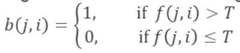
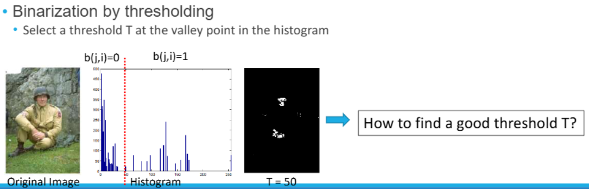
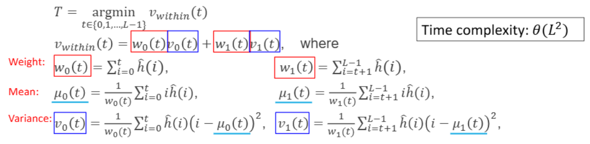
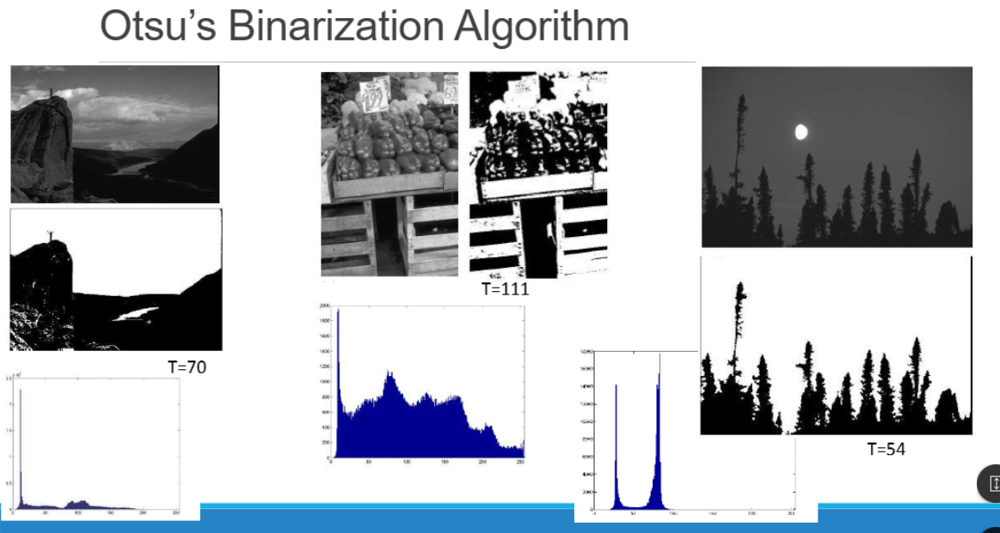
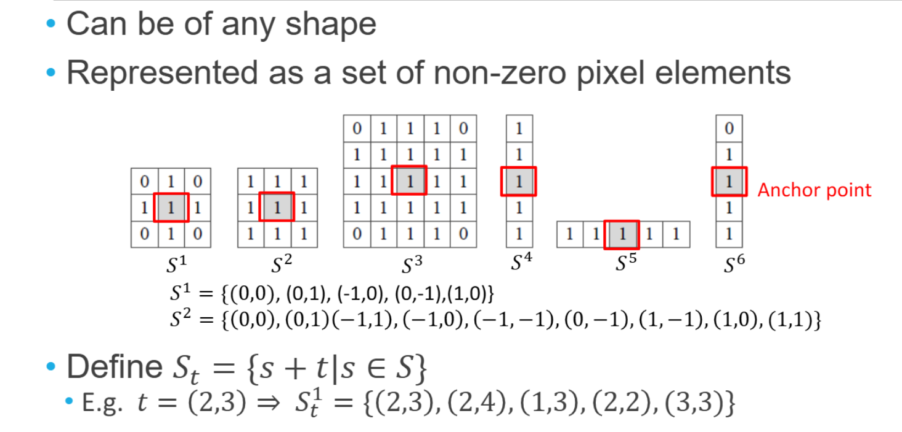
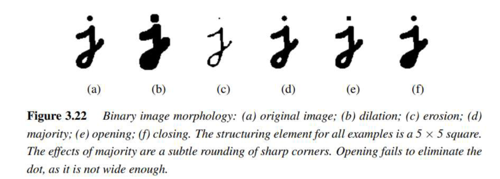
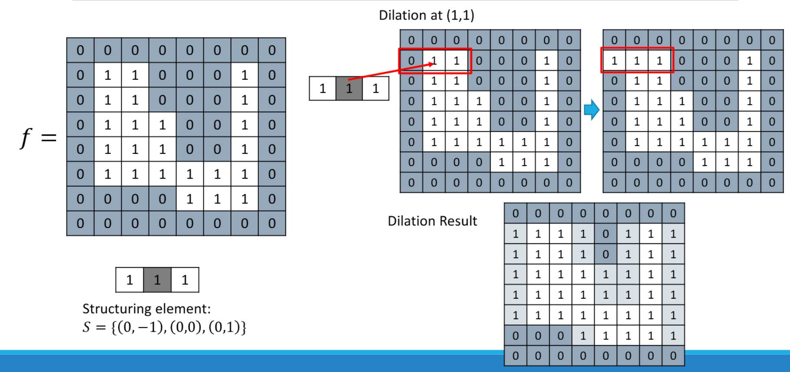
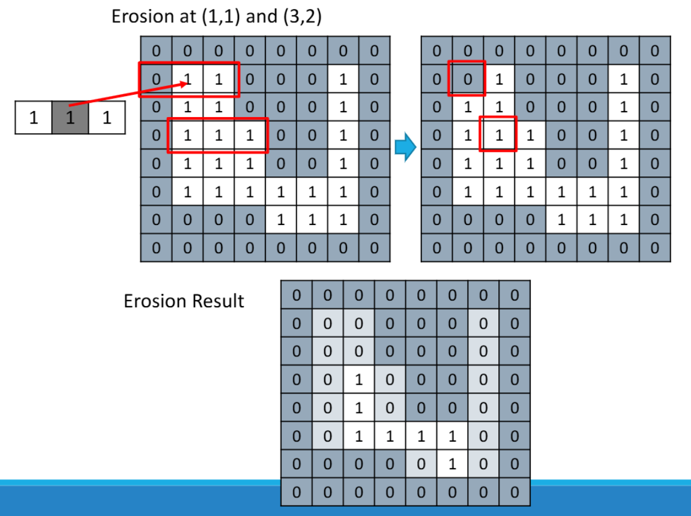
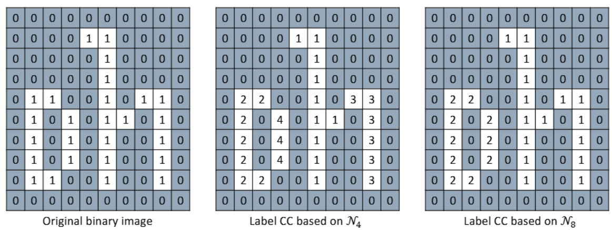
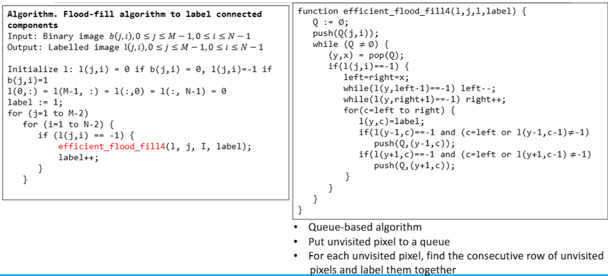

👓Computer Vision 정리

## Binary Image Processing 
---
* **<span style="color: #008000">Binary Image</span>**: an image only consisting of `0’s` and `1’s`(흑백 이미지)
* **<span style="color: #008000">Binarization(이진화)</span>**: binary image occurs after thresholding operation

* 
> **thresholding**: T값(임계값)을 설정해서 T보다 크면 1, 작으면 0


> 이미지의 histogram을 구해서 두 개의 피크 사이의 골짜기를 찾으면 됨  
> T=60을 설정하고 이보다 크면 1, 작으면 0으로 설정 → 우리가 **원하는 target만 detection 가능**  
> 그럼 어떤 수가 이상적인 `threshold`인가?

{:.prompt-tip}
> 그걸 구하기 위한 algorithm = **Otsu's Binarization Algorithm**
>

### Otsu's Binarization Algorithm
---
* histogram에서 **가장 표준편차, 분산이 작은 지점이 이상적인 T값**이다.
* Objective function: make **two split pixel sets as uniform as possible**
  * Two sets of pixels after splitting should have **small variances**
* Otsu’s algorithm **minimizes the weighted within-class variance**:


> T가 가장 작은 `weight`와 `variance`를 구해야함

수식 목표:
$$T=\argmin_{t}v_within(t)$$

내부 분산(within-class variance) 계산:
$$v_within(t)=w_0(t)v_0(t)+w_1(t)v_1(t)$$
* $w_0,w_1$: 두 그룹의 픽셀 비율(Weight)
* $u_0,u_1$: 그룹별 평군(mean)
* $v_0,v_1$: 그룹별 분산(variance)

수식 정리를 하다보면 다음과 같은 형태가 나옴:
$$T=\argmax_{t}v_between(t)$$
$$v_between(t)=w_0(t)(1-w_0(t))(u_0(t)-u_1(t))^2$$
→ **두 그룹 간의 평균 차이가 가장 큰 순간이 가장 좋은 $𝑇$값**


> 오른쪽 달 이미지가 이중 피크가 가장 잘나타나므로 분리가 잘된다!

### Morphology
---
**<span style="color: #008000">Morphology</span>**: **이미지 안에 있는 물체의 형태를 변경하는 연산**
* Can be applied to both **binary and grayscale images, but commonly used in binary images**

✅**Morphological operations**:  
  * Define a **structuring element**
  * **Convolve** the structuring element with the image
  * **Thresholding the result of the convolution**
  * input, output 둘다 binary image


> Structuring Element  
> 필터 같은 느낌 → 이미지 위에 이걸 올려서 어떤 픽셀을 바꿀지 결정  
> **Anchor point**: 구조 요소에서 중심 역할을 하는 좌표, 이 점을 기준으로 이미지에 적용


> Morphology operation 적용 예시

#### Dilation(팽창) & Erosion(침식)
* **<span style="color: #008000">Dilation</span>**:
  * 구조 요소(Structuring Element)가 이미지의 **1위치에 걸칠 수만 있으면 그 자리를 1로 바꿈**
  * → **형태가 굵어지고 연결성이 높아짐**
* **<span style="color: #008000">Erosion</span>**
  * 구조 요소가 이미지의 **1위치 전부에 완전히 맞아야 그 자리를 1로 유지**
  * → **형태가 깎이고 얇아짐**


> 원래 이미지에 `structuring element`가 닿는 곳이 있으면 → 1로 채움


> `structuring element` 전부가 해당 이미지 영역에 다 맞지 않으면 → 0으로 만듦

#### Opening & Closing
* **<span style="color: #008000">Opening</span>(침식 후 팽창)**
  * **작은 노이즈 제거**에 효과적
  * 모양 유지 + 작은 점 사라짐
* **<span style="color: #008000">Closing</span>(팽창 후 침식)**
  * **작은 구멍 채우기**에 효과적
  * 내부의 틈이나 깨진 부분을 메워줌


> Opening & Closing 예시

### Connect Component
---
**<span style="color: #008000">Connect Component(연결 성분)</span>**: **서로 인접한 픽셀들의 집합**을 의미

* **Pixel adjacency(픽셀 인접성)**: **어떤 픽셀들과 붙어있는지를 정의**
  * **𝒩4-adjacency (𝒩4-connectivity)**: a pixel has 4 neighbors (N,S,E,W)
  * **𝒩8-adjacency (𝒩8-connectivity)**: a pixel has 8 neighbors (N,S,E,W, NE,NW,SE,SW)



> N4에서는 동서남북만 생각하기 때문에 각 집합이 따로따로 정의됨
> N8에서는 8방향 모두 관계로 생각해서 2개의 connected compoenet가 생김

#### Connected Component Labeling
---
픽셀 덩어리(Connected Component)를 찾아야 하는데, 그 방법이 바로 **<span style="color: #008000">Labeling(레이블링)</span>**
* 같은 연결된 픽셀 그룹을 **같은 숫자로 마킹**
```python
# Connected Component LabelingAlgorithm
# Flood-fill algorithm to label connected components
Input: Binary image 𝑏𝑗,𝑖,0≤𝑗≤𝑀−1,0≤𝑖≤𝑁−1
Output: Labelled image l𝑗,𝑖,0≤𝑗≤𝑀−1,0≤𝑖≤𝑁−1

Initialize l: l(j,i) = 0 if b(j,i) = 0, l(j,i)=-1 if b(j,i)=1
l(0,:) = l(M-1, :) = l(:,0) = l(:, N-1) = 0
label := 1;
for (j=1 to M-2)
  for (i=1 to N-2) {
    if (l(j,i) == -1) { 
      flood_fill4(l, j, I, label);
      label++;
      }   
  }

# 아직 방문하지 않은 픽셀을 재귀적으로 따라가며 같은 레이블을 붙이는 방식
# 문제점: 재귀 호출이 너무 깊어지면 Stack Overflow 발생
function flood_fill4(l,j,l,label) {
  if(l(j,i)==-1) {
    l(j,i)=label;
    flood_fill4(l,j,i+1, label);
    flood_fill4(l,j-1,i, label);
    flood_fill4(l,j,i-1, label);
    flood_fill4(l,j+1,I,label);
  }
}
```


> 재귀 대신 반복문 기반 → Stack overflow발생을 방지
> **큐(Queue)**를 이용해 한 줄(라인)을 한 번에 처리