👓Computer Vision 정리

## Geometric Transformation
---
### Geometric 개념 정리
---

{:.prompt-warning}
> 주의: 이 슬라이드에 나와있는 점들의 좌표들은 (x-좌표,y-좌표)로 표기되어있음  
> 즉, computer vison에서는 (y,x)로 바꿔야함  

* **Scalar**: real number (only magnitude), (e.g., distance)
* **Vector**: direction + magnitude
* **Point**: a location in space

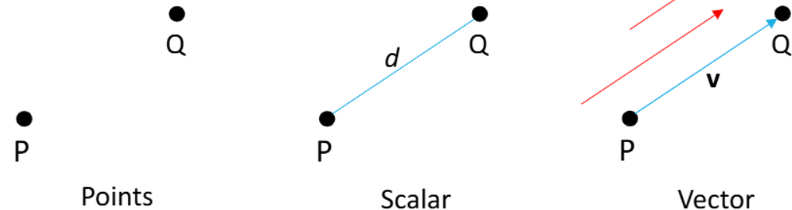

* 벡터의 합, 곱 등등
* 벡터 + 벡터 = 벡터 / 벡터 * 스칼라 = 벡터

#### Parametric Form & Affine Sum
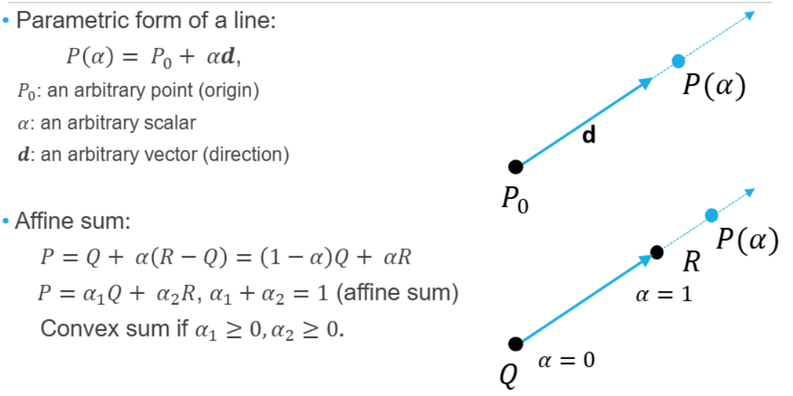

#### Dot Product(내적)
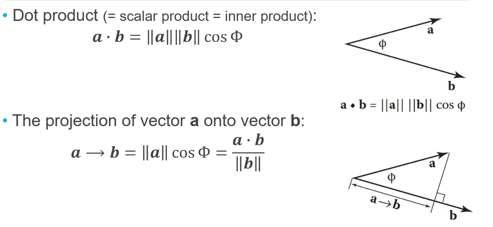
> $\vec{a}\cdot\vec{b} = 0$ → 두 벡터 수직

#### Cross Product(외적)
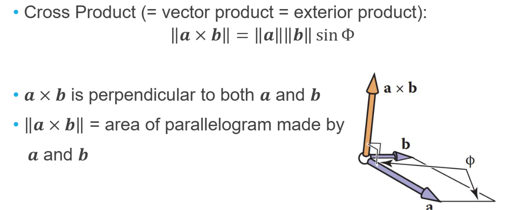
> 방향: $\vec{a}, \vec{b}$에 모두 수직, **오른손 법칙 따름**  
> 결과 벡터 크기(axb): **평행사변형 넓이**

## 2D Geometric Transformation
---
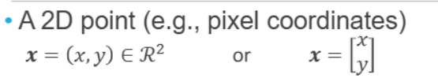
> 2차원 포인트는 $(x,y)$ or $x=\begin{bmatrix}x \\\\ y\end{bmatrix}$로 표현가능  

* **<span style="color: #008000">linear transformation</span>**: 어떤 행렬을 이용해 벡터를 변환하는 것

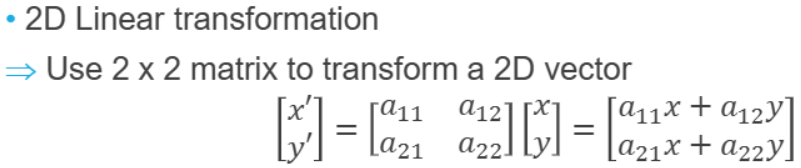
> 점에서 점으로 가는 mapping을 표현하기 위해 선형 변환을 사용  
> 2차원의 경우 2x2을 이용해 변환   
> 선형 변환 조건:  
> > $L(a+b) = L(a) + L(b)$  
> > $L(sa) = sL(a)$

### 2D Scaling
---
* **<span style="color: #008000">Scaling</span>**: changes length (and direction)

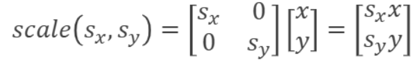
> 대각선 방향으로 변경하고자 하는 값을 쓰면 됨

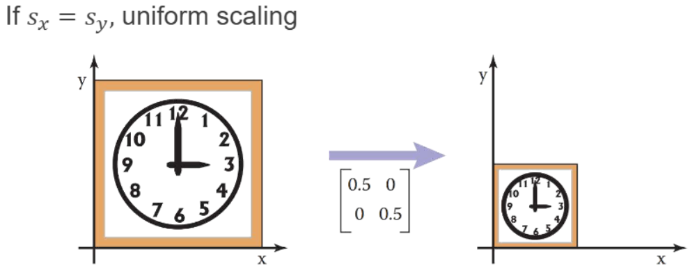
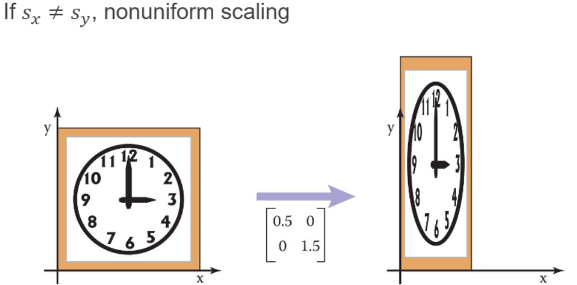
> $s_x = s_y$: 균일 스케일링 (uniform scaling) → 모양은 그대로 크기만 변함  
> $s_x \neq s_y$: 비균일 스케일링 (non-uniform) → 형태가 찌그러질 수 있음

### 2D Rotation
---
* **<span style="color: #008000">Rotation</span>**: 벡터를 각도 $\theta$만큼 **반시계 방향으로 회전**시키는 변환

✅ 벡터 $a=(x_a, y_a)$는 다음 두 가지 방식으로 표현 가능:  
  * 직교 좌표계(cartesian coordinates): $(x_a, y_a)$
  * 극좌표계(polar coordinates): $(r\cos\alpha, r\sin\alpha)$
    * $r$은 벡터의 길이: $r = \sqrt{(x_a^2 + y_a^2)}$
    * $\alpha$는 x축과 벡터가 이루는 각도

벡터 a를 각도 $\theta$만큼 반시계 방향으로 회전시킨 벡터 b는 다음과 같다:  
* $x_b = r\cos(α + \theta) = r\cos α\cos\theta - r\sin α\sin\theta$
* $y_b = r\sin(α + \theta) = r\sin α\cos\theta + r\cos α\sin\theta$
* 이때 $r\cos\alpha = x_a$와 $r\sin\alpha = y_a$이므로
  * $x_b = x_a\cos\theta - y_a\sin\theta$
  * $y_b = y_a\cos\theta + x_a\sin\theta$

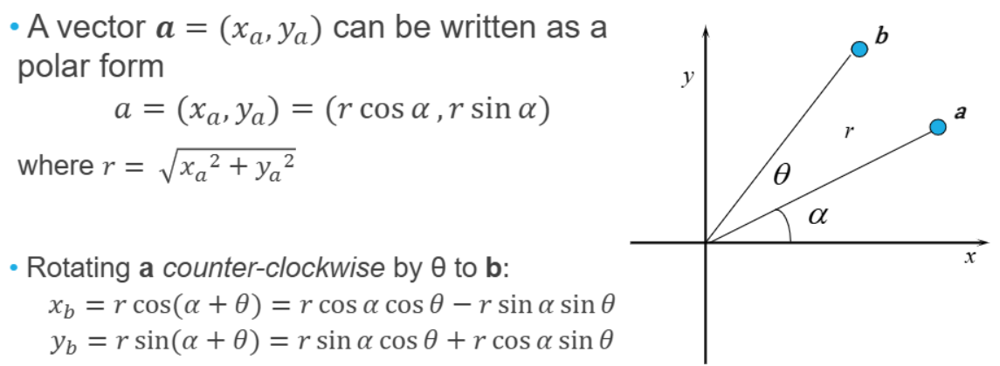

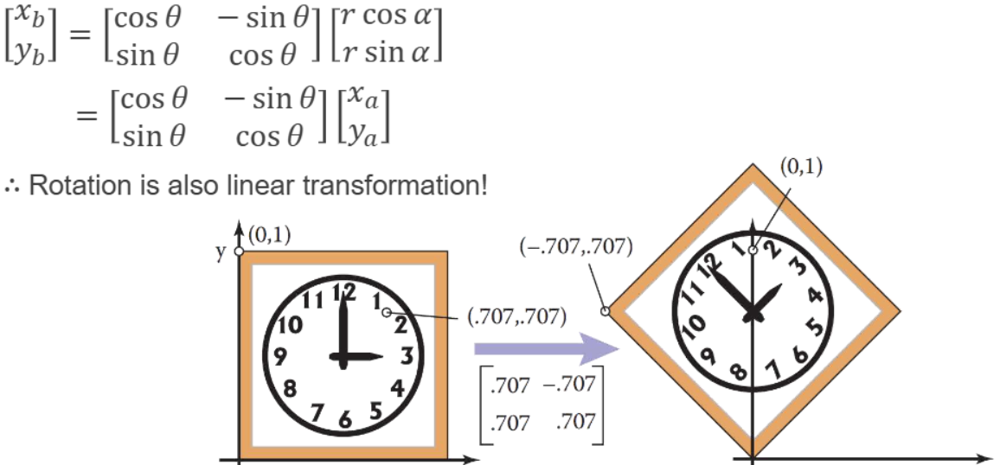
> (xb, yb)를 `matrix`로 나타내면 사진과 같음
> 2D rotation도 2x2로 계산이 되기 때문에 **linear transformation** 이다.

✅ **Rotation Properties**  
  * **Orthogonal matrix(직교 행렬)**: Two columns (rows) are orthogonal(서로 내접을 했을 때 0이 될때)
    * (cos𝜃,sin𝜃)∙−(sin𝜃,cos𝜃)=0
  * **inverse matrix(역행렬)**
    * 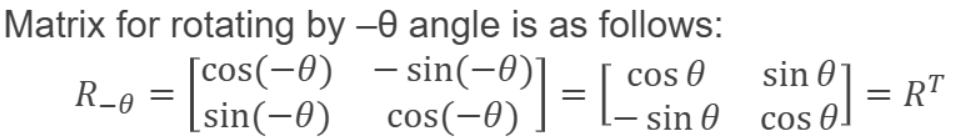
      > R의 역행렬은 (-theta) 를 해주는데 그게 **전치행렬**과 같다.
      > 즉, 역행렬을 구하기 위해서 그냥 전치행렬($R^T$)을 사용하면 되서 유용함

### 2D Shear
---
* **<span style="color: #008000">Shear</span>**: 물체를 한 방향으로 "밀어내는" 변환, 평행사변형 모형으로 변환된다.

**X, Y 방향 shear는 다음과 같다:**  
* `shear_x(s)` = $ \begin{bmatrix} 1 & s \\\\ 0 & 1 \end{bmatrix}$
* `shear_y(s)` = $ \begin{bmatrix} 1 & 0 \\\\ s & 1 \end{bmatrix}$
> shear_x(s) 변환이 점 (x,y)에 적용되면 $x' = x+sy, y'=y$
> 즉 y좌표는 변하지 않고, **x좌표는 y좌표에 비례하여 이동**

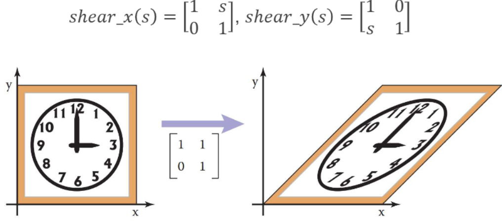
> x방향으로 shearing할때의 예시

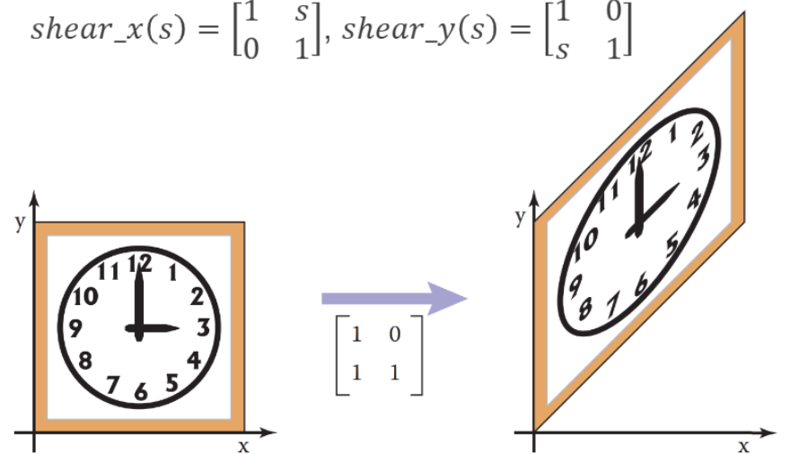
> y방향으로 shearing할때의 예시

### 2D Reflection
---
* **<span style="color: #008000">Reflection</span>**: 좌표 축을 기준으로 물체를 "뒤집는" 변환

**X, Y 방향 Reflection는 다음과 같다:**  
* `reflect_x` =  $ \begin{bmatrix} 1 & 0 \\\\ 0 & -1 \end{bmatrix}$
* `reflect_y` =  $ \begin{bmatrix} -1 & 0 \\\\ 0 & 1 \end{bmatrix}$
> reflect_x 변환이 점 (x,y)에 적용되면 $x' = x, y'=-y$  
> 즉, **y좌표만 부호가 바뀐다**

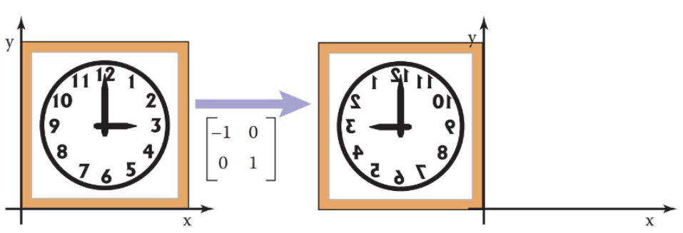
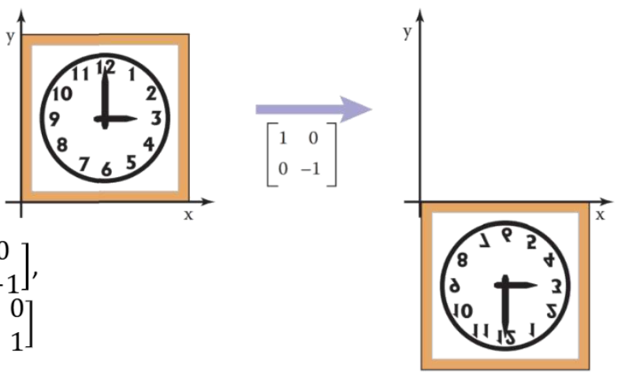

### 2D Translation
---
* **<span style="color: #008000">Translation</span>**: 물체의 **모든 점을 동일한 거리와 방향으로 이동시키는 변환**

이동 변환 수식:  
* $x' = x + x_t$
* $y' = y + y_t$
> $(x_t,y_t)$는 이동 벡터

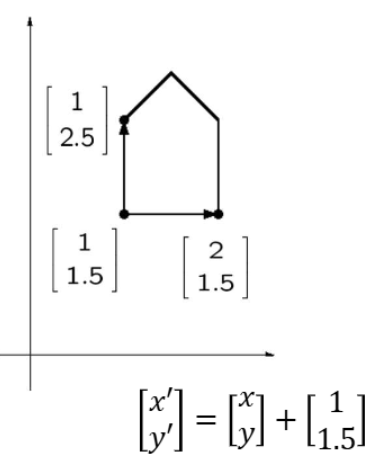

{:.prompt-warning}
> **일반적인 2x2행렬로는 Translation을 나타낼 수 없다!**

그럼 어떻게 계산해야하나? 
→ 그래서 나온 이론이 **<span style="color: #008000">Homogeneous Coordinate</span>**

### Homogeneous Coordinate
---
**<span style="color: #008000">Homogeneous Coordinate(동차 좌표계)</span>**: 동차 좌표계는 기존의 좌표계를 확정하여, 점,선,면 등을 일관된 방식으로 표현하고 변환할 수 있게 한다.

* 2차원에서 점 $x = (x,y)$는 동차 좌표계에서 다음과 같다.

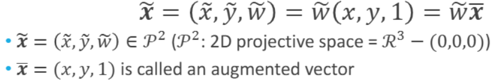
> $\tilde{x}$는 **동차 좌표계에서의 점**  
> $\bar{x} = (x,y,1)$은 **증강 벡터(augmented vector)**  
> $\tilde{w} \neq {0}$인 모든 $(\tilde{x},\tilde{y},\tilde{w})$는 2D 점 $\tilde{x}/\tilde{w}, \tilde{y}/\tilde{w}$를 나타낸다

{:.prompt-tip}
> 즉, 동차 좌표계에서는 (2,3,1), (4,6,2), (6,9,3) **모두 2D 공간에서 같은 점 (2,3)을 나타낸다!**

* 만약 $\tilde{x}$ = (x,y,0)(=$\tilde{w}$=0)이면 이 point는 **<span style="color: #008000">ideal point</span>** 또는 **point at infinity**라고 불린다
  * ideal point는 방향을 나타내는데 유용하다
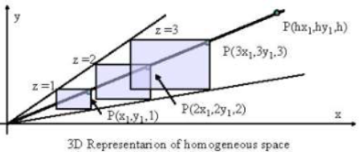

#### 2D Lines
---
**Homogeneous Corrdinate에서 <span style="color: #008000">2D line</span>:** $\tilde{l} = (a,b,c)$
* **직선의 방정식**: $\bar{x}\cdot\tilde{l} = ax + by + c = 0$
* $\tilde{l}$을 정규화:
  * $l = (\hat{n}x, \hat{n}y, d) = (\hat{**n**}, d), \parallel\hat{**n**}\parallel = 1$
> $\hat{**n**}$: 직선에 수직인 단위 **normal vector**  
> $\hat{**n**} = (\hat{n}x, \hat{n}y) = (\cos\theta, \sin\theta)$  
> d: 원점에서 직선까지 거리  
> $(\theta, d)$: 극좌표계

* $l$ = (0,0,1): **무한대에 있는 직선**으로, 모든 무한대 점들을 포함함

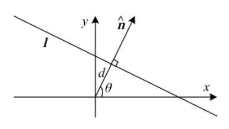

### Homogeneous Matrix
---
* 동차 좌표계에서의 2D 변환은 다음과 같이 변한다

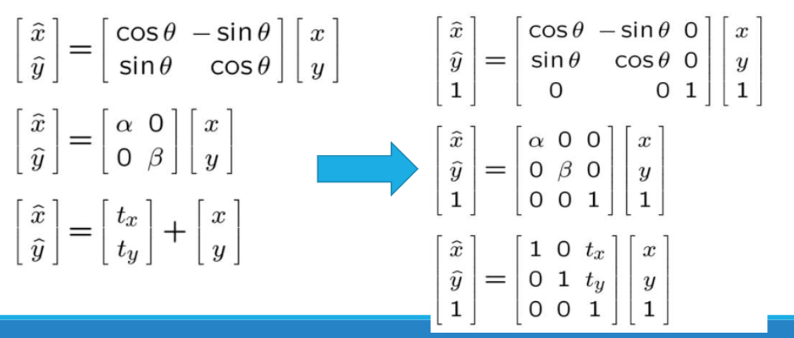
> 순서대로 `Rotation`, `scale`, `translation` 변환
* 여러 변환을 조합하려면 각 변환 행렬을 곱하기만 하면 된다!
{:.prompt-tip}
> 행렬을 곱할 때는 적용한 행렬의 반대 순서로 곱해야한다!

* **복합 변환 예시**:

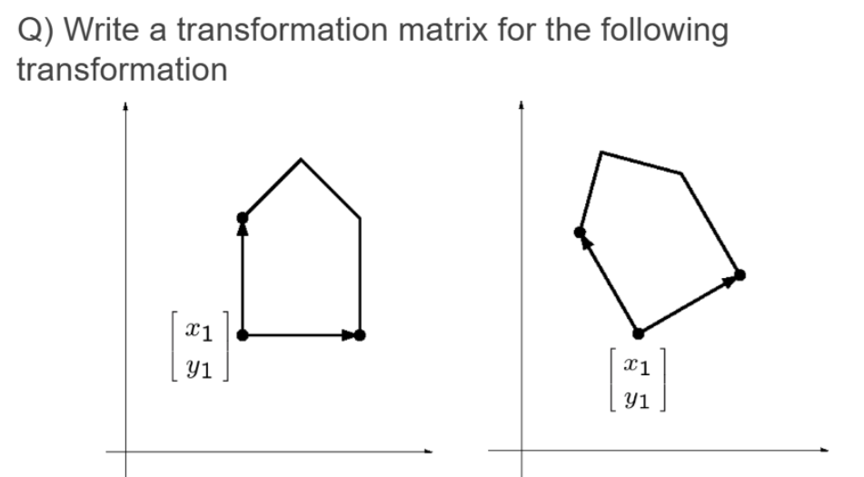

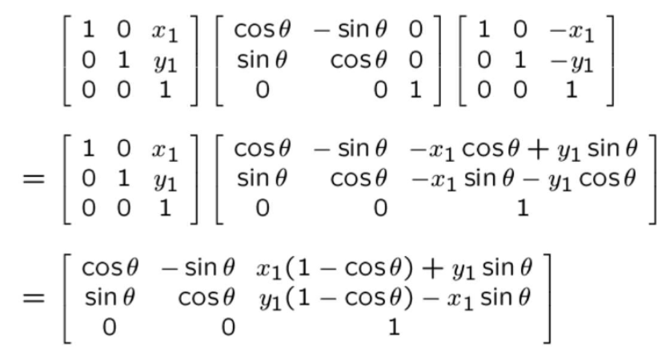

예시에서는 원점으로 이동 → Rotation 변환 → 다시 원래의 위치로 이동이므로

```
T_final = T_translation(원래 위치로 이동) × T_rotation x T_translation(원점 이동)
```

다시 CV관점으로 돌아와서 **(y,x) 좌표계에서의 Homogeneous Matrix**는 다음과 같다
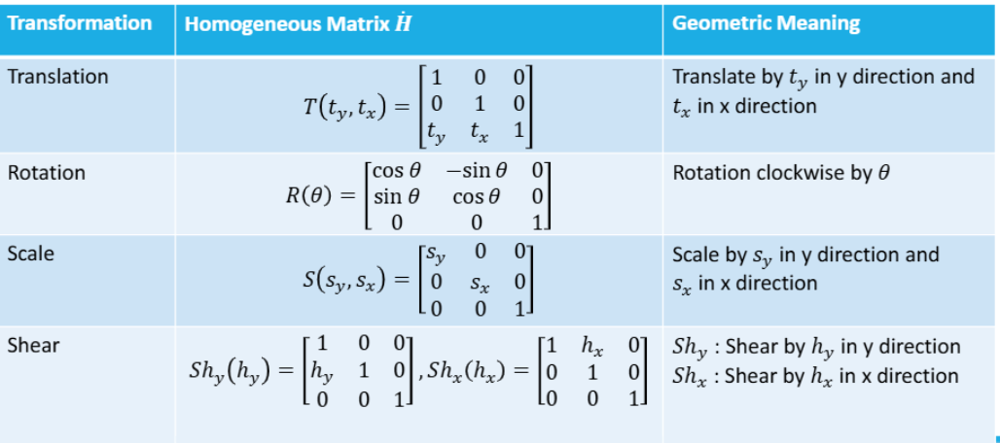

* (y,x)좌표계에서의 복합 연산 예시:
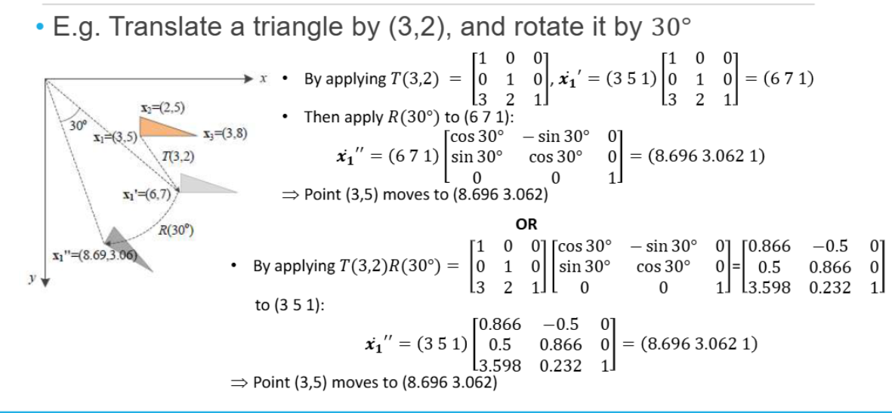

* 2D Transformation의 종류와 특성:
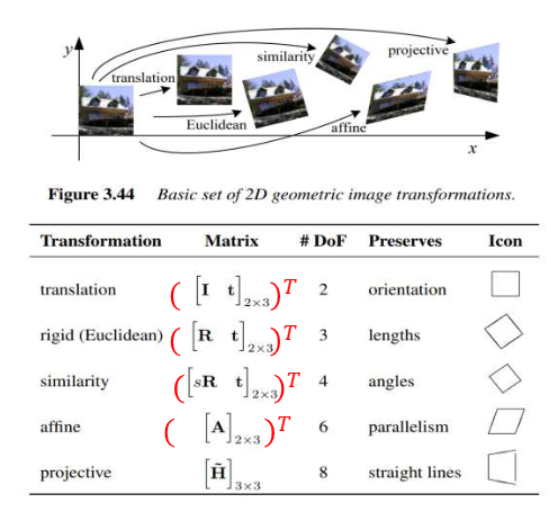  
> DoF는 자유도(우리가 변환하는 양)  
> Similarity에서 DoF: 4(스케일 1개, 회전 1개, 이동 2개)  
> 전치행렬 T인 이유는 사진은 (x,y)이기 때문

그럼 이미지에 Geometric Transformation은 어떻게 적용이 되는가?
#### Geometric Transformation 적용
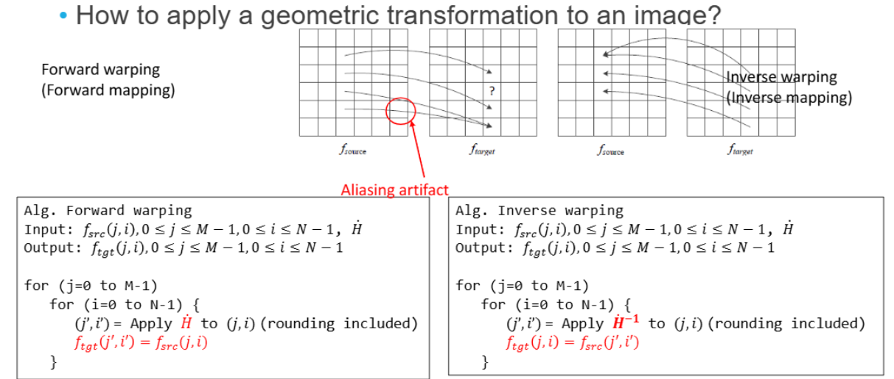
1. **<span style="color: #008000">Foward warping</span>:**
  * 소스 이미지의 **각 픽셀을 변환하여 대상 이미지의 위치로 매핑**
  * 문제점: 
    * **앨리어싱(aliasing) 아티팩트가 발생**할 수 있다.
    * **소스 이미지의 픽셀이 정확히 대상 이미지의 픽셀 격자에 맞지 않을 수 있어 빈 공간(홀)이 생길 수 있다**.
2. **<span style="color: #008000">Inverse warping</span>**:
  * **대상 이미지의 각 픽셀 위치에 대해, 소스 이미지에서 값을 가져온다**
  * 하지만 여기서도 다른 두 개의 대상 픽셀이 같은 소스 픽셀을 참조하므로 앨리어싱 발생

앨리어싱을 해결하기 위해 **<span style="color: #008000">Interpolation</span>**으로 보완한다

#### Interpolation
---
**<span style="color: #008000">Interpolation</span>**: 알려진 데이터 포인트 사이의 **중간 값을 추정**하는 방법

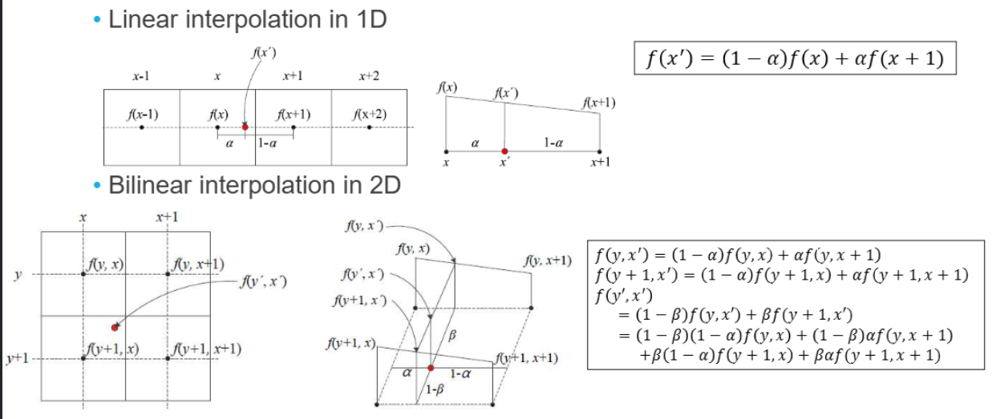
> 1D Linear Interpolation과 2D Bilinear Interpolation

* **1D Linear Interpolation**: **두 개의 알려진 데이터 포인트 사이의 값을 직선으로 근사하여 추정**
  * 
* **2D Bilinear Interpolation**: 알려진 **네 개의 격자점(grid points) 사이의 값을 추정**

* lecture 5의 Edge Thinning은 시험 X