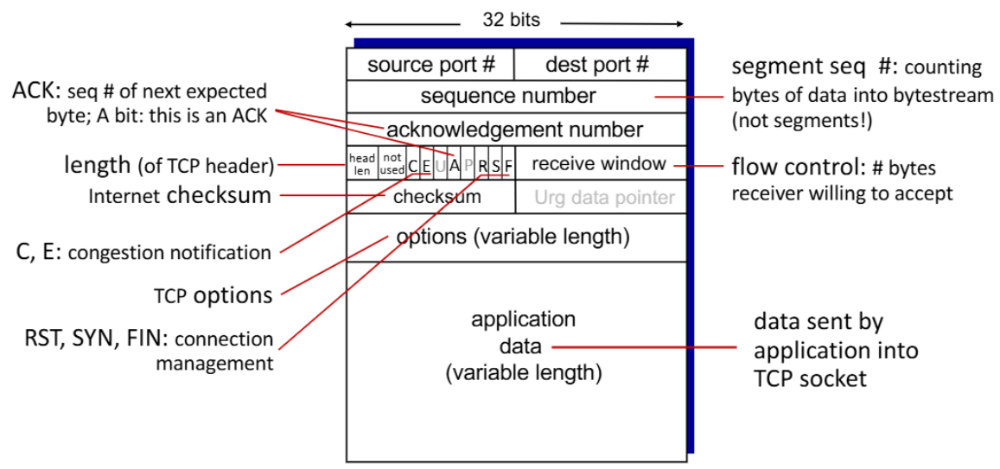
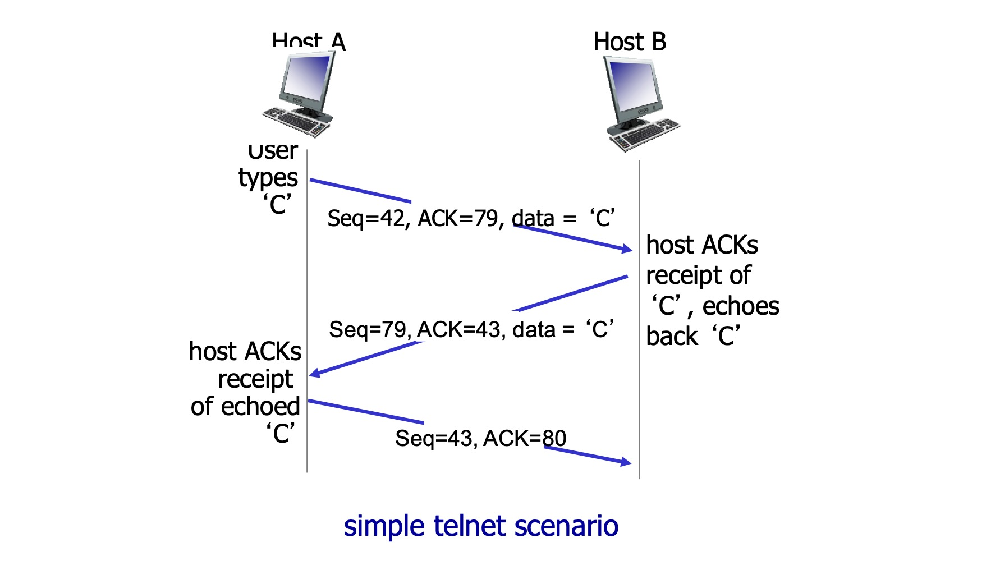
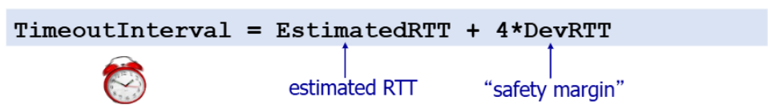
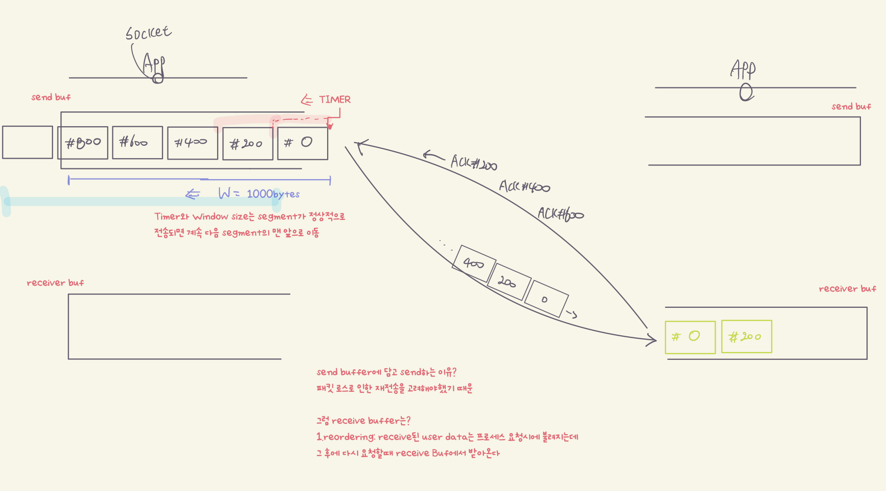
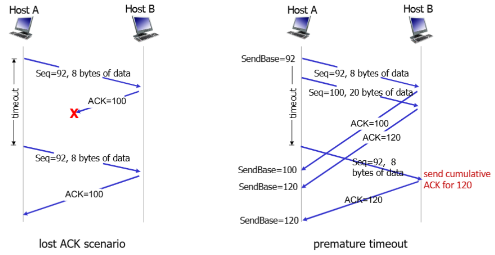
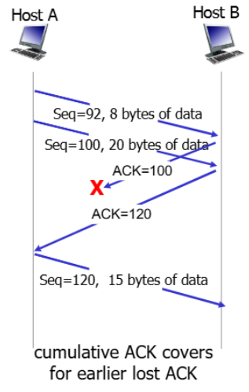
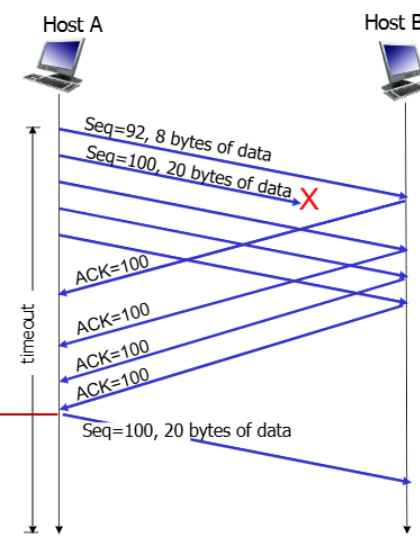

>📚컴퓨터 네트워크 전공 수업 정리

⭐ Transfer layer에서 가장 중요한 **T.C.P에 대해 알아보자**

## TCP
---
**<span style="color: #008000">TCP(Transmission Control Protocol)</span>**: 데이터를 안정적으로 전송하기 위한 핵심 프로토콜

✅TCP의 주요 구성 개념:  
* **<span style="color: #008000">Point-to-Point</span>**: 하나의 sender와 하나의 recevier만 연결
* **<span style="color: #008000">Reliable, In-order Byte Stream</span>**: 데이터가 손실 없이 보낸 순서대로 도착
* **<span style="color: #008000">Full Duplex Data</span>**: 양방향으로 동시에 데이터 전송 가능
* **<span style="color: #008000">Connection-oriented</span>**: 데이터 교환 전에 연결 설정 필요(**3-way handshaking**)
* **<span style="color: #008000">Flow Control</span>**: 수신자가 처리할 수 있는 양만큼만 데이터 전송

### TCP Segment sructure
---
TCP는 데이터를 <span style="color: #008000">segment</span>단위로 나누어 NETWORK layer로 전송한다.


* `Source/Destination Port`: UDP처럼 multi/demultiplexing을 위한 port
* `sequence number`: 데이터 바이트 순서
* `ackownledgement number`: ACK하는 넘버
* `A`: Ack 필드를 무시하라는 의미
* `P`: 모아서 올리지 말고 바로 올리라는 명령
* `R`: 리셋
* `S`: 커넥션 맺자고 요청하는 것. 맺어지면 0, 맺어지기전은 1이다.
* `F`: 커넥션 끊을 때 사용한다. 난 이제 안보내겠다는 의미. 하지만 상대는 아직 보낼 수 있다. 끊으려할 때 1로 바꾼다.
* `receive window`: 현재 나의 윈도우 버퍼 크기

### TCP Seq #, ACKs
---
<span style="color: #008000">Sequence Numbers</span>: 데이터 스트림에서 **첫 바이트의 위치**
<span style="color: #008000">ACK</span>: receiver가 다**음에 받기를 기대하는 바이트의 시퀀스 번호**


> Host A의 초기 시퀀스 넘버는 `42`, Host B의 초기 시퀀스 넘버는 `79`  
> A가 세그먼트를 보낼 때 ACK를 `79`로하고 전송  
> B는 이에 응답하여 `79` 시퀀스를 보내는데 ACK가 `43`  
> 이는 기대하는 세그먼트가 `43`번이라고 이쪽에서 미리 더해서 주는 것  
> A는 79를 잘 받았다고 ACK `80`과 다음 시퀀스 넘버인 `43`를 전송

#### TCP RTT & Timeout
{:.prompt-warning}
> Timeout시간을 어떤 기준으로 설정해야할까?
>
너무 짧으면 불필요한 재전송이 많아지고, 너무 길면 loss복구 시간이 길어진다.
→ **RTT보다 살짝 긴 시간이 최적의 시간이다.**

📚**<span style="color: #008000">RTT?</span>**
: sender에서 **segment가 receiver까지 가서 ACK가 돌아오는데 걸리는 시간**

그럼 RTT는 어떻게 계산하는가
→ `SampleRTT`를 이용한다
  * 세그먼트 전송부터 ACK 수신까지의 **실제 측정 시간**
* **네트워크는 dynamic하기 때문에 segment를 보낼 때마다 SampleRTT가 달라진다 → 불규칙적임**
* 따라서 평균값을 채택하기 위한 공식은 다음과 같다.

```
EstimatedRTT = (1-α) × EstimatedRTT + α × SampleRTT
```
* α는 일반적으로 0.125
* `EstimatedRTT`는 평균적인 RTT 추정값
* 이전에 계산된 RTT의 가중치는 `0.875`이고, 새로 계산된 RTT는 `0.125`의 가중치 → **새로운 평균 RTT를 계산한다는 의미**

또한 현재 **측정된 RTT가 기존의 평균 RTT를 얼마나 벗어나는지 파악**하는 것도 중요하다.

```
DevRTT = (1-β) × DevRTT + β × |SampleRTT - EstimatedRTT|
```
* `evRTT`: 안전성을 위한 **일종의 margin값**

`EstimatedRTT`와 `DevRTT`를 이용하면 Timeout 간격을 설정할 수 있다.


### TCP transfer 매커니즘
---

* 전송할 데이터가 App layer에서 Trasnport layer로 내려옴
* 여러 segment로 분할해서 **send buffer에 저장**
* 설정된 `window size`만큼 receiver측으로 segment를 **한번에 전송**
* segment를 receiver의 **receive buffer에 저장**
* sender는 전송한 segment들에 대한 ACK를 수신

#### TCP retransmission scenarios

##### 1. ACK lost
1. A가 데이터를 보내고(SEQ=92, 8바이트) B가 ACK를 전송(ACK=100)
2. 그러나 **ACK 패킷이 네트워크에서 손실**
2. 호스트 A는 타임아웃 후에 같은 데이터를 재전송
3. 호스트 B는 다시 ACK=100을 전송
4. 같은 데이터가 두 번 보내졌으나, TCP는 seq #를 통해 중복을 처리

##### 2. premature timeout
1. A가 두 개의 세그먼트를 전송(SEQ=92와 SEQ=100).
2. 타임아웃이 일찍 발생 → 호스트 A는 첫 번째 세그먼트(SEQ=92)를 재전송
3. 그 사이 호스트 B는 두 세그먼트에 대해 ACK=100과 ACK=120을 전송
4. A는 타이머를 불필요하게 재시작하게 되지만, 누적 ACK 메커니즘 덕분에 결국 모든 데이터가 제대로 전송됨


##### 3. cumulative ACK covers for earlier lost ACK
1. A가 두 세그먼트를 전송(SEQ=92와 SEQ=100).
2. 첫 번째 세그먼트에 대한 ACK=100이 손실
3. 두 번째 세그먼트에 대한 ACK=120이 도착
4. 누적 ACK 메커니즘으로 인해 ACK=120은 이전의 모든 데이터(SEQ=92 포함)가 받아졌음을 의미
5. 따라서 손실된 ACK=100에 대한 걱정 없이 통신이 계속된다.

{:.prompt-warning}
> 타임아웃을 기다리지 않고 더 빠르게 재전송 하는 방법은 없을까?
>

#### TCP Fast Retransmit
✅sender가 <span style="color: #008000">3 duplicate ACK</span>를 받으면, 해당 segment가 손실되었다고 판단 → **타임아웃 기다리지 않고 즉시 재전송**


> 3개의 같은 ACK가 아니라 3개의 중복 ACK에 주의!!  
> 첫 번째 정상 ACK는 포함X