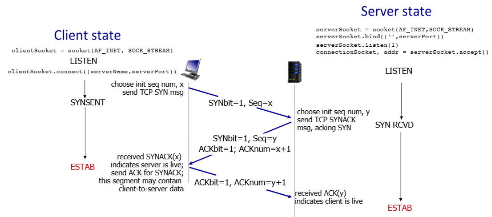
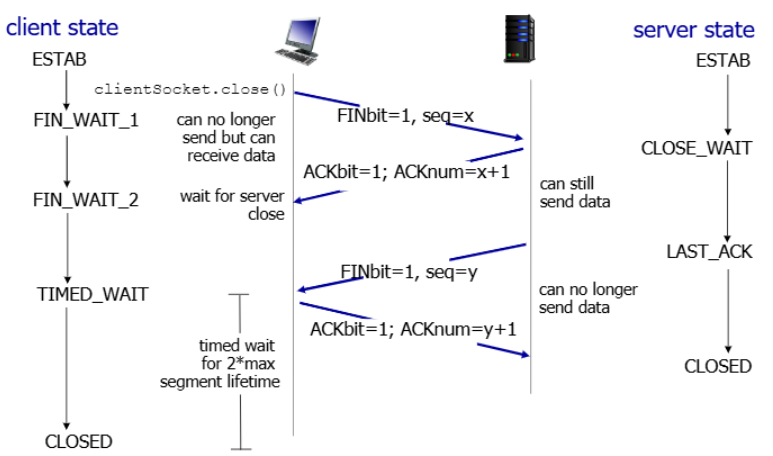

>📚컴퓨터 네트워크 전공 수업 정리

## TCP flow control
---
> 📝**sender가 receiver buffer에서 데이터를 처리하는 속도보다 빠르게 데이터를 전달하면 어떻게 될까??**

→ receiver buffer에서 **overflow가 발생해 데이터가 손실!!**

이러한 상황을 방지하기 위해 **flow control**을 사용

* **Receive Window(rwnd)**: receiver buffer에 남아있는 **여유 공간을 기록**하여 TCP 헤더에 포함됨
* sender는 receiver의 **rwnd 값에 따라 <u>window size를 조절</u>**하여 overflow를 방지한다

* 만약 `rwnd=0` 즉, receiver buf가 다 찼다면 **sender에서는 보낼 데이터의 1byte만 떼어서 지속적으로 send**한다.
  * 돌아오는 ACK에 따라 wnd size 조절!! 

## TCP Connection Management
---
TCP는 Connection-oriented이므로 **sender와 receiver간에 handshake를 통해 연결을 설정**한다.

### TCP 3-way handshake

1. **SYN**:
  * client: 초기 seq #x 선택
  * SYN message를 보냄(`SYNbit=1`, `Seq=x`)
  * 클라이언트 상태: `CLOSED` → `SYN_SENT`
2. **SYN-ACK**:
  * server: 초기 초기 seq #y 선택
  * SYNACK message를 보냄 (`SYNbit=1`, `Seq=y`, `ACKbit=1`, `ACKnum=x+1`)
  * `ACKnum=x+1`: "x까지 받았고 다음에는 x+1을 기대한다"는 의미
  * 서버 상태: `LISTEN` → `SYN_RCVD`
3. **ACK**:
  * client: `SYNACK`를 받고 서버가 활성 상태임을 확인
  * ACK 메시지를 전송(`ACKbit=1`, `ACKnum=y+1`)
  * 이때부터 **data를 함께 전송 가능**!(위 2단계는 header만 전송)

### TCP closing connection(4-way_handshake)

1. **FIN from Client**:
  * client가 연결 종료를 시작: `close()`
  * **FIN 메시지를 전송**(`FINbit=1`, `seq=x`)
  * client 상태: `ESTABLISHED → FIN_WAIT_1`
  * 이 상태에서 클라이언트는 더 이상 데이터를 보낼 수 없지만 받을 수는 있다
2. **ACK from Server**:
  * 서버는 클라이언트의 **FIN에 ACK로 응답**(`ACKbit=1`, `ACKnum=x+1`)
  * 서버 상태: `ESTABLISHED → CLOSE_WAIT`
  * 이 상태에서 서버는 여전히 데이터를 보낼 수 있다
3. **FIN from Server**:
  * 서버도 연결을 종료할 준비가 되면 **FIN 메시지 전송**(`FINbit=1`, `seq=y`)
  * 서버 상태: `CLOSE_WAIT → LAST_ACK`
  * 이 상태에서 서버는 더 이상 데이터를 보낼 수 없다
4. **ACK from Client**:
  * 클라이언트는 서버의 FIN에 ACK로 응답(`ACKbit=1`, `ACKnum=y+1`)
  * 클라이언트 상태: **FIN_WAIT_2 → TIME_WAIT → CLOSED**
  * 서버 상태: LAST_ACK → CLOSED (client ACK 수신 후)

✅**TIME_WAIT 상태의 중요성:**  
client가 바로 CLOSED 상태가 되었을 때, 만약 server에 FIN에 대한 ACK가 안왔다면 계속 FIN을 재전송하지만 받을 client가 없다. 그러면 무한으로 FIN을 재전송하게 됨