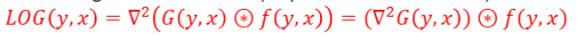
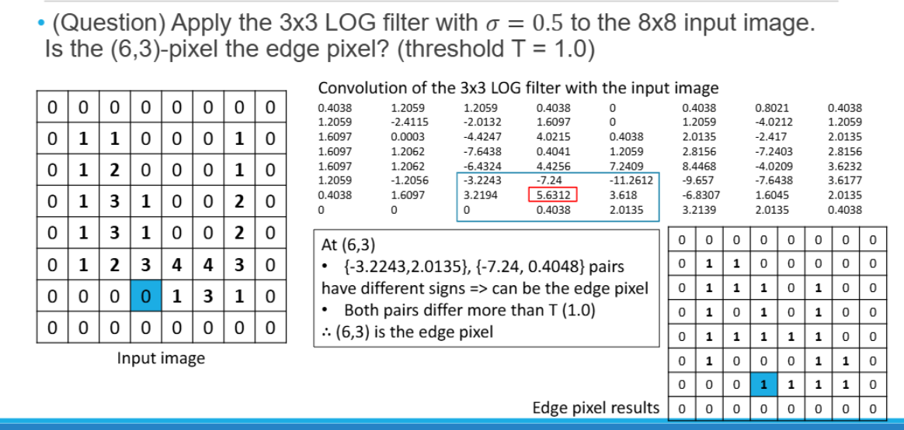

## Edges of Image
---
📚**Edges of Image**: 이미지에서 객체의 경계를 나타내는 지점

✅Edge 특징:  
* **Indicate occlusion(맞물린 경계) events in 3D**
* 대체로 눈에 보이는 윤곽선으로 표현됨
* 이미지 내에서 표면 방향이 급격하게 변하는 지점
* edge(boundaries)는 카메라 기준으로 표면이 향하고 있는 방향이 급격히 변할 때 그 위치에서 발생함
* **edge 포인트의 집합을 만들어서 곡률 직선 등을 표현**

## Edge Detection
---
✅**어디가 edge 또는 boundaries가 될 수 있는가?**  
1. **색상이 급격하게 변하는 부분**(무조건은 아님)
2. edge detect는 전체 이미지에 적용가능 하지 않고 **그 주변에 한해서 따로따로 detection하게 됨 (local information)**
3. **빛의 명도와 색의 급격한 변화량**을 통해 edge를 인식

### Derivatives of Digital Images
---
에지를 수학적으로 찾기 위해 이미지에 미분을 적용
미분을 적용하면 이미지의 급격한 변화를 감지하는데 도움이 된다.

* 미분을 했을 때 **델타x가 1인 경우에 f(x+1)-f(x)에서 가장 큰값을 변화가 가장 큰 부분이라고 생각**  
→ `이진화`로 그 **큰 부분만 1로 놓고 나머지를 0으로 생성**

> 1차원 디지털 이미지 f(x) 1차 미분

* 이를 mask=[-1, 1]로 **이미지를 컨볼루션**하여 계산한다

> 미분값: (2-2), (3-2), (2-3)...

* 2차 미분은 mask=[1, -2, 1]로 **이미지를 컨볼루션**하여 계산
* 3차 미분 mask = [1,-3,3,1]...
### Edge Model
---
이미지에서 발견할 수 있는 Edge 유형은 두 가지이다
1. **Step Edge(계단형 에지)**: 밝기가 갑자기 변하는 경계
  * **1차 미분에서 단일 피크(단일 너비)**로 나타남
  * **2차 미분에서 영점 교차(zero-crossing)**로 나타남
2. **Ramp Edge(경사형 에지)**: 밝기가 점진적으로 변하는 경계
  * **1차 미분에서 넓은 폭의 피크**로 나타남
  * **2차 미분에서 두 개의 영점 교차**로 나타남

> Ramp Edge의 경우 1차 미분의 피크가 넓어서 정확한 위치를 찾기 어려움  
> 2차 미분의 영점 교차를 사용하면 더 정확한 위치를 찾을 수 있음

#### Remarks on Edge Detection
이미지 미분은 노이즈를 증폭시키는 특성이 있다.
→ Edge detection전에 **스무딩 적용이 필수적**이다
* 가우시안 필터 같은 **스무딩 필터를 적용하여 노이즈를 감소시킴**

* 실제 구현에서는 더 정확한 미분 값을 위해 $\delta{x}=2$를 사용한 **중앙 차분법을 사용**한다

* 2D 이미지에서는 x방향과 y방향 모두에서 미분을 계산해야한다

### Edge Detector
---

* **Roberts Operator**: 대각선 방향 Edge 검출에 효과적
* **Prewitt Operator**: 수평/수직 Edge 검출에 효과적
* **Sobel Operator**: 
  * 중앙 픽셀에 가중치를 부여(2배)
  * 가잘 널리 사용됨

### Edge Magnitude and Edge Direction
---
2D 이미지에서 Edge는 **크기와 방향**을 가진다

* **Edge Magnitude**: 이미지의 각 위치에서 에지가 얼마나 강한지 나타냄
* **Gradient Direction**: 그래디언트는 에지에 수직인 방향을 가리킴
  * 에지 방향은 그래디언트 방향에 수직(perpendicular)

> Edge Direction은 오른쪽처럼 방향에 따라 양자화 되어있음

#### Sobel mask 적용 예제

* **Gradient Direction**: -63.4°
* **Edge Direction**: **그래디언트 방향에 수직인 방향** = 26.6°
* **양자화된 에지 방향**: 1 (45° 근처)

#### Marr and Hildreth’s Edge Detection Algorithm
에지 검출을 위한 중요한 방법 중 하나로, **2차 미분의 영점 교차를 이용**

✅동작 원리:  
1. **가우시안 필터로 이미지 스무딩**
2. **2차 미분을 사용하여 영점 교차 검출**

왜 가우시안 필터를 쓸까??

위 사진처럼 미분을 하면 노이즈가 증폭하기 때문에 이를 부드럽게 처리하기 위해서

> 2차원 가우시안은 x,y 방향에 대한 식을 곱한다

**마스크의 너비는 $6\sigma$보다 큰 숫자 중에 가장 작은 홀수로 결정**
* 예: σ = 1.0인 경우, 6σ = 6이므로 **7×7 가우시안 마스크 사용**

### LoG (Laplacian of Gaussian)
---
**LoG(Laplacian of Gaussian)필터**: Marr and Hildreth’s 알고리즘에서 Edge를 찾기 위해 사용된다

✅LoG 필터 단계:  
1. 가우시안 필터로 이미지를 스무딩
2. `Laplacian 필터`를 적용하여 **2차 미분 이미지 생성**
3. 2차 미분 이미지에서 **영점 교차(zero-crossing)을 찾아 Edge로 설정**

* **Laplacian Filter란?**
📚 **Laplacian Filter**: **2차 미분**을 계산하는 연산자

> 이미지에서 픽셀 가운데에 -4를 곱하고, 동서남북 방향에 1씩 더함

✅**LoG 필터 단계:**  
1. 가우시안 필터(G)로 이미지 스무딩 후 라플라시안 필터(L) 적용
2. 하지만 위 방법은 계산 비용이 높고 수치적 오류 가능성 있음
→ 가우시안 함수 자체에 라플라시안을 적용한 LoG 필터를 한 번에 적용:  

> 가우시안 필터 후에 라플라시 필터를 적용하나, 라플라시안 필터 후에 가우시안 필터를 적용하나 똑같은 결과

> $\sigma = 0.5$인 경우 6시그마가 3이므로 3x3필터 생성
#### LOG 필터를 이용한 Edge 검출 방법
1. **LOG 필터를 입력 이미지에 적용**
  * 한 번의 컨볼루션으로 스무딩과 2차 미분을 동시에 수행
2. 결과 이미지에서 **영점 교차(zero-crossing) 위치를 찾아 에지로 설정**

zero-crossing을 어떻게 찾아야하나
* 픽셀의 **동,서(E-W), 남,북(N-S), 북동-남서(NE-SW), 북서-남동(NW-SE) 방향의 이웃 쌍 확인**
* 두 개 이상의 쌍이 서**로 다른 부호**를 가지고, **그 차이가 임계값보다 큰 경우 Edge 픽셀로 표시**

> $\sigam$가 커질 수록 강한 Edge만 표현됨