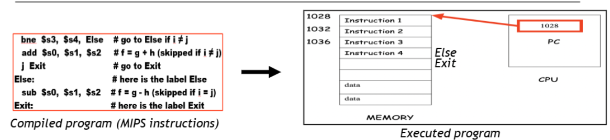
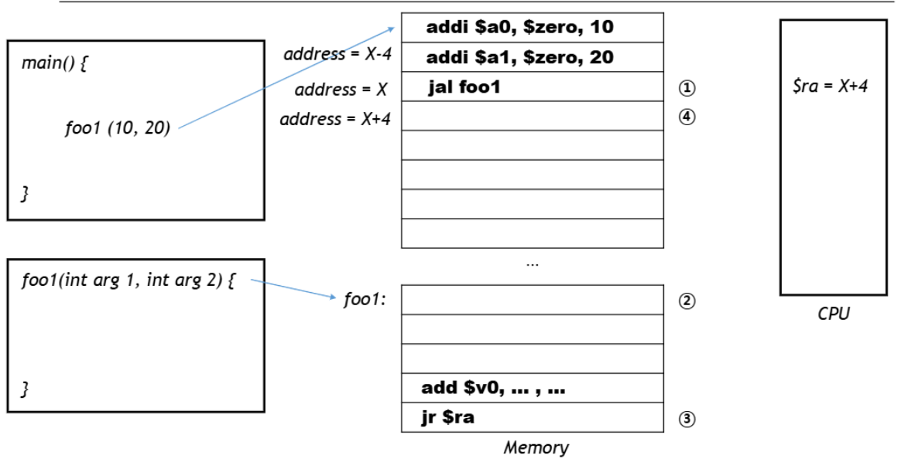
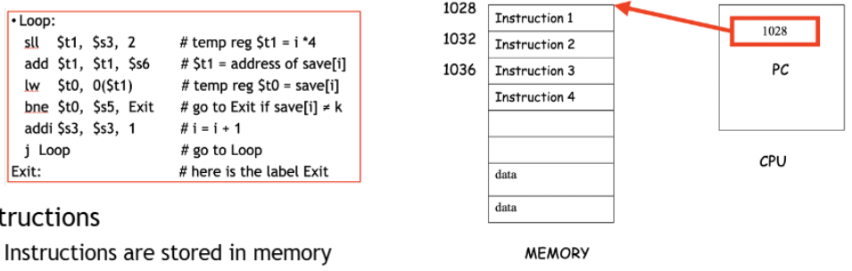
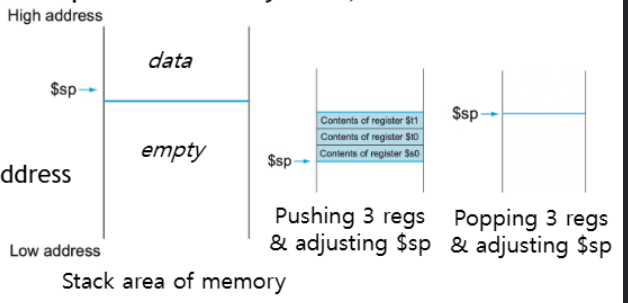
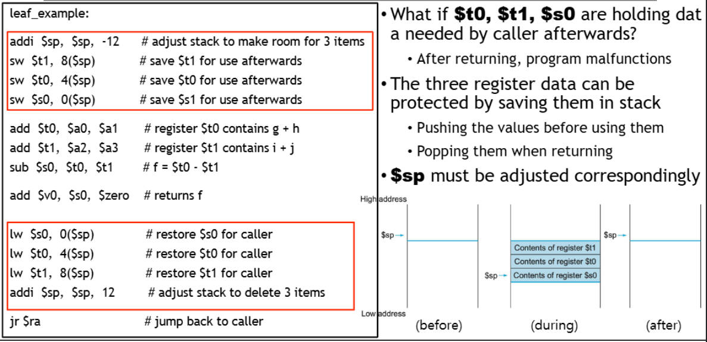
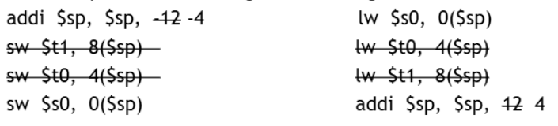

⚙ **Computer Architecture 공부**

## Flow of Program Execution
---
📚**프로그램 기본 실행 흐름**:  
* 컴파일된 프로그램이 실행되면, 그 명령어들은 **메모리에 로드**된다.
* 각 명령어는 **고유한 메모리 주소**로 식별된다
* 프로그램의 각 **label은 그 다음에 오는 명령어의 메모리 주소**를 나타낸다
* 기본적으로 CPU는 명령어를 처음부터 순차적으로 실행함
* 하지만 분기 명령어(`bne`, `beq`, `j`등)를 만나면 프로그램의 흐름이 바뀐다
  * **조건 만족O**: CPU는 지정된 lable로 `jump` -> 그 위치의 명령어 실행
  * **조건 만족X**: 다음 명령어 계속 실행 



## Supporting Procedures in Hardware
---
📚**<span style="color: #008000">Procedures(함수)</span>**: 프로그램을 이해하기 쉽게 만들고 **코드 재사용을 가능**하게 한다  
* `Caller`와 `Callee` 관계 존재:
  * `Caller`: 프로시저를 호출하는 프로그램
  * `Callee`: 명령어를 포함하는 프로시저
  * callee도 다른 프로시저를 호출하면 caller가 된다

✅**Procedure 실행 단계**:  
1. `caller`가 파라미터를 `callee`가 접근할 수 있는 위치에 배치
2. 제어권이 `callee`에게 이전
3. `callee`는 지정된 위치에서 파라미터 값을 가져옴
4. `callee`가 원하는 작업을 수행
5. `callee`는 결과를 `caller`가 접근할 수 있는 위치에 배치
6. 제어권이 `caller`의 실행 지점으로 반환

### SUPPORTING PROCEDURES IN MIPS INSTRUCTION SET
---
MIPS에서는 **Procedures 호출과 반환을 위한 특별한 레지스터와 명령어가 존재**

* `$a0-$a3`: 파라미터를 전달하기 위한 4개의 인자 레지스터
* `$v0-$v1`: 결과를 반환하기 위한 2개의 값 레지스터
* `$ra`: 원래 지점으로 돌아가기 위한 주소 반환 레지스터

* `jal procedureaddress`: **Jump-and-link 명령어**
  * **호출자가 피호출자에게 제어권을 이전**할 때 사용
  * 특정 주소(함수의 첫 번째 명령어)로 점프
  * 반환 주소(함수 호출 다음 명령어의 주소)를 `$ra`에 저장
* `jr register`: **Jump register 명령어**
  * 레지스터에 지정된 주소로 **무조건 점프**
  * 피호출자가 호출자에게 **제어권을 돌려줄 때 사용** - `jr $ra`



## Program Counter
---
📚**<span style="color: #008000">Program Counter</span>**: CPU가 현재 실행 중인 명령어의 주소를 추적하는 데 사용됨


* 명령어는 메모리에 저장됨
* 각 명령어는 4bytes(a word)를 차지
* CPU는 **Program Counter**라는 레지스터를 사용해서 현재 실행 중인 명령어의 주소를 저장함
* PC는 **명령어가 실행될 때마다 4씩 증가**
* `branch` 또는 `jump`명령어는 프로그램 흐름을 제어하기 위해 PC에 **target address를 설정**
* Procedure가 완료되면 `jr $ra`는 `$ra`의 값을 사용하여 호출자에게 제어권을 반환

### Using Stack for Procedure Call
---
프로시저 호출 시 레지스터 값을 보존하기 위해 **Stack**이 사용됨

{:.prompt-warning}
> 만약 caller가 사용 중인 레지스터 `$a0-$a3`, `$v0-$v1`을 callee도 사용하게 되면?
>

❌값이 의도치 않게 덮여쓰여짐!

-> **procedure 호출 전 레지스터 값을 저장하고, 반환 시 복원해야 함**
* 이를 위해 특별한 메모리 영역을 **<span style="color: #008000">Stack</span>**을 사용


* **stack**은 `High address`에서 `Low address`로 더해짐
* **LIFO(후입선출)** 구조
  * `Push`: stack에 데이터 저장
  * `Pop`: stack에서 데이터 제거
* **Stack pointer**는 가장 최근에 할당된 주소를 가리킴
* MIPS에서는 `$sp`(register 29)를 **stack pointer로 사용**
* **레지스터를 push**할 때 `$sp`는 4씩 감소
* **레지스터를 pop**할 때 `$sp`는 4씩 증가

__Stack 예시__:  
```c
int leaf_example(int g, int h, int i, int j){
    int f;

    f = (g+h) - (i+j);
    return f;
}
```

* caller가 `jal leaf_example`한 경우

```assembly
leaf_example:

add $t0, $a0, $a1   # register $t0 contains g+h
add $t1, $a2, $a3   # register $t1 contains i+j
sub $s0, $t0, $t1   # f = $t0-$t1

add $v0, $s0, $zero # returns f

jr $ra              # jump back to caller
```

* `$ra = PC+4`
* PC = leaf_example


> Stack pointer `$sp`를 12바이트 감소시켜 3개 레지스터 저장 공간 확보

### Saved vs Temporary Registers
---
모든 register를 stack에 저장하는 것은 비효율적!
-> MIPS는 register를 두 그룹으로 나눔

1. **<span style="color: #008000">Temporary registers</span>** (`$t0-$t9`)
    * procedure call에서 `callee`에 의해 보존되지 않는다
2. **<span style="color: #008000">Saved registers</span>** (`$s0-$s7`)
    * procedure call에서 반드시 보존되어야 함

