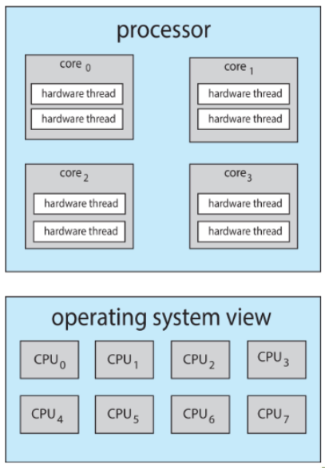

>🍀 운영체제 전공 수업 정리

CPU Scheduling은 현대에서는 Thread Scheduling과 같다

## CPU Scheduling basic concept
### CPU–I/O Burst Cycle
---
* 프로세스 실행은 **CPU burst와 I/O burst의 반복**으로 구성됨.
* 대부분의 프로그램은 짧은 `CPU burst`와 긴 `I/O burst`를 가진다.
* CPU brust 분포는 대부분 short bursts가 많고 longer bursts는 적은 형태를 보인다.
* CPU 활용을 최대한으로 하기 위함이다.
  * **<span style="color: #008000">CPU burst</span>**: 프로세스가 CPU를 사용하여 연산을 수행하는 시간
  * **<span style="color: #008000">I/O burst</span>**: 프로세스가 입출력 작업을 기다리는 시간


### CPU Scheduler
---
* **<span style="color: #008000">CPU Scheduler</span>**는 **Ready Queue에 있는 프로세스 중 어떤 프로세스에게 CPU core를 할당할 지 결정한다.**

* **CPU scheduling decisions**은 다음 네 가지 상황에서 발생:
1. 프로세스가 **실행 상태에서 대기 상태로 전환**될 때
2. 프로세스가 **실행 상태에서 준비 상태로 전환**될 때
3. 프로세스가 **대기 상태에서 준비 상태로 전환**될 때
4. 프로세스가 **종료**될 때

✅CPU Scheduling에 두가지 종류가 있다.  
1. **<span style="color: #008000">Nonpreemptive(비선점형)</span>**
  * 상황 1과 4에서만 스케줄링이 발생 
  * 프로세스가 CPU를 할당받으면 **자발적으로 놓을 때까지 CPU를 독점**
  * 즉, 종료/wating 상태가 아니면 CPU를 독점함

2. **<span style="color: #008000">Preemptive(선점형)</span>**
  * 모든 상황에서 스케줄링이 발생할 수 있음
  * OS가 실행 중인 프로세스로부터 CPU를 강제로 회수할 수 있다
  * 고려할 점 3가지
   1. **shared data에 대한 접근**(race condition 발생 가능)
      *  **race condition(경쟁 조건)**: 둘 이상의 스레드가 **동시에 자원에 접근**하면서, **실행 순서에 따라 결과가 달라지는 버그**를 일으킬 수 있는 상황
   2. **kernel mode에서의 선점**(선점시에 kernel에서 온전하게 task가 끝나지 않은채로 전환되면 문제가 생김)
   3. **중요 OS 활동 중 interrupts 발생**(불가피할 경우 interrupt를 disable하고 끝나면 다시 enable시킬 수 있음)

### Dispatcher
---
* **<span style="color: #008000">Dispatcher</span>**: CPU 스케줄러가 선택한 프로세스에게 실제로 CPU 제어권을 넘겨주는 모듈  
→ Scheduler내에 **task의 실행순서를 제어**하는 역할

* 주요 기능
  * **context switching**: 한 프로세스에서 다른 프로세스로 옮겨가는 작업
  * **switching to user mode**
  * **프로그램을 재시작하기 위해 사용자 프로그램의 특정 위치로 점프하는 작업**

* **Dispatch Latency(지연)**: 하나의 프로세스를 중지하고 다른 프로세스를 시작하는 데 걸리는 시간

## Scheduling Criteria
---
* <span style="color: #008000">CPU utilization(이용률)</span>:
  * CPU가 얼마나 바쁘게 일하는지를 측정
  * 40% 이하는 가벼운 시스템 부하, 90% 이상은 무거운 시스템 부하를 의미

* <span style="color: #008000">Throughput(처리량)</span>:
  * **단위 시간당 처리/완료**되는 프로세스의 수

* <span style="color: #008000">Turnaround Time(반환 시간)</span>:
  * 프로세스가 **Ready Queue에서 기다리는 총 시간**
  * <u>CPU time이나 I/O time은 스케줄러가 줄일 수 없다.</u>
  * 즉, **대기시간을 프로세스가 ready queue에 머무는 시간으로 측정**

* <span style="color: #008000">Response Time(응답 시간)</span>:
  * **요청 제출 시점부터 첫 응답이 나올 때까지의 시간**
  * 반환시간이 같아도 응답시간이 짧으면 결과를 미리 볼 수 있는 효과가 있음
  * 일반적으로 **평균보다 편차를 줄이는 것이 더 중요**
  
## Scheduling Algorithm
각 알고리즘의 평가 기준은 평균 대기시간이다.
**평균 대기시간이 짧을 수록 좋은 알고리즘이라고 평가**

#### FCFS(First-Come, First-Served)
---
Nonpreemptive(비선점형) 스케줄링이며, **먼저 도착한 프로세스를 먼저 실행**

> p1,p2,p3 순으로 들어온 경우  
> Gantt Chart는 그림처럼 나옴  
> 평균 대기 시간: (0 + 24 + 27)/3  = 17


> p2,p3,p1 순으로 들어온 경우  
> 평균 대기 시간: (6 + 0 + 3)/3 = 3

두 개의 순서를 비교해보면 한 task는 같지만 평균 시간이 엄청나게 차이난다.

❌ 단점: **Convoy Effect** - CPU 집약적인 **긴 프로세스 뒤에 짧은 프로세스들이 오래 기다려야 하는 현상**

#### SJF(Shortest Job First)
---
* 평균 대기시간을 줄이기 위해 **CPU brust가 가장 짧은 프로세스를 먼저 실행**
* Nonpreemptive(비선점형) 스케줄링
* 최소 평균 대기 시간을 제공하는 **optimal**한 알고리즘
* **다음 CPU brust 길이를 정확히 예측하기 어렵다.**

> 

{:.prompt-warning}
> 그럼 CPU Brust는 어떻게 측정해야하는가??
>

✅ **exponential averaging(지수 가중평균)기법을 사용**  
```
τₙ₊₁ = α·tₙ + (1-α)·τₙ
```
* τₙ = 실제 n번째 CPU brust의 길이
* τₙ₊₁ = 다음 CPU brust의 예측 값
* α는 0과 1사이 값
* α 값에 따라 최근 측정값의 반영 비율이 결정된다.

> α = 0: 과거 기록만 고려 - τₙ₊₁ = tₙ  
> α = 1: 최근 CPU 버스트만 고려 - τₙ₊₁ = α·tₙ

#### SRTF(Shortest Remaining Time First)
* **SJF의 선점형 버전(SRTF = preemptive SJF)**
* 새로운 프로세스가 도착할 때마다 **남은 실행 시간을 비교**하여 더 짧은 프로세스가 CPU를 차지
* 
> **평균 대기 시간**: [(10-1)+(1-1)+(17-2)+(5-3)]/4 = 26/4 = 6.5  
> p1, p2 .. 순인데 p2는 1초뒤에 도착하고 바로 실행했으니 (1-1)이다. `평균 대기 시간`임을 주의

#### RR(Round Robin)
---
* 각 프로세스는 <span style="color: #008000">시간 할당량(time quantum) q</span>를 받는다.
* **q 시간**이 지나면 프로세스는 **선점되어 Ready Queue의 끝으로 이동**
* **q가 크면 FCFS와 유사**해지고, **q가 매우 작으면 context switch 오버헤드가 증가**

> q가 4인 경우  
> SJF보다 평균 대기시간은 길지만, response가 더 좋음  
> q는 10ms~100ms 정도이며, context switch time(<10μs)보다 충분히 커야 한다.  
> 평균 대기 시간 = (4+7+6)/3 = 5.66


> q가 줄어듦에 따라 context switch가 빈번하게 일어남  
> 즉, 타임 퀀텀 설정에 민감함


> 일반적으로 CPU brust의 80%가 시간 할당량보다 작을 때 효율적이다.

#### Priority Scheduling
---
* 각 프로세스에 **<span style="color: #008000">우선순위 번호(정수)</span>를 할당**하고, **가장 높은 우선순위(가장 작은 정수)의 프로세스를 선택**한다.
* **선점형**과 **비선점형** 모두 가능
  * **선점형**: 나보다 더 높은 우선순위가 들어오면 양보하는 방식
  * **비선점형**: 나보다 더 높은 우선순위가 들어와도 하던 일을 마무리하는 방식

❌ 문제점: **Starvation** - **낮은 우선순위 프로세스가 실행 기회를 얻지 못할 수 있다**. 

✅ 해결책: **Aging** - 시간이 지남에 따라 **프로세스의 우선순위를 점진적으로 증가**시킨다.


> 이 예시는 **비선점형**  
> 평균 대기 시간 = (0+6+16+18+1)/5 = 8.2msec

그럼 동시에 도착하고 우선순위도 같은 경우는?


> 같은 우선순위는 **Round-Robin을 사용**한다.  
> q가 2인 경우는 예시와 같은 스케줄링을 가진다.

#### Multilevel Queue
---
* Ready Queue를 **우선순위별로 여러 큐로 분할**한다.


* 일반적으로 **프로세스 유형에 따라 큐를 분류**한다:

> real-time process (예: 응급 알림 시스템, 센서 제어 등 → **시간 내에 꼭 실행되어야 함**)
> system process
> interactive process
> batch process (최하위 우선순위)

1. **높은 우선순위를 무조건 먼저 실행**할 수도 있고,
2. 큐에 따라 **time-slice (시간 할당)**을 다르게 줄 수도 있음.

#### Multilevel Feedback Queue
---
* **프로세스가 큐 사이를 이동할 수 있는** `multilevel queue`이다.
*  **CPU를 많이 사용하는 프로세스는 낮은 우선순위 큐**로 이동하고, **오래 기다린 프로세스는 높은 우선순위 큐**로 이동할 수 있음.
*  가장 일반적이지만 가장 복잡한 스케줄링 알고리즘

✅ **설정 가능한 파라미터**:
* 몇 개의 큐를 쓸지 (`number of queues`)
* 각 큐마다 어떤 스케줄링 방식 쓸지 (`scheduling algorithm`)
* 어떤 기준으로 큐를 올릴지/내릴지 (`upgrade`, `demote`)
* 처음 어떤 큐에 넣을지 (`entry queue`)


* Scheduling 흐름:
1. 새 job은 Q₀부터 시작
    ⤷ CPU를 받으면 8ms 사용함
    ⤷ 다 못 끝내면 Q₁으로 이동
2. Q₁에선 16ms 시간 할당
    ⤷ 그래도 다 못 끝내면 Q₂로 이동
3. Q₂에선 FCFS 방식
    ⤷ 여기선 시간제한 없이 처리됨

📝핵심 정리  
* **빨리 끝날 수 있는 짧은 job은 빨리 끝내고, 긴 job은 점점 낮은 우선순위로 밀어냄**
* **유연하게 큐 이동 가능** → **CPU 자원 배분 효율적**

## Thread Scheduling
---
📚**<span style="color: #008000">Thread Scheduling</span>**은 **여러 스레드가 CPU 시간을 어떻게 나누어 사용할지 결정**하는 방법

✅**스레드 스케줄링의 두 가지 주요 범위**:
1. <span style="color: #008000">PCS - Process Contention Scope</span>
   * **같은 프로세스 내의 스레드들 간에 CPU 시간을 어떻게 나눌지 결정**
   * 스레드 라이브러리가 사용자 수준 스레드를 **LWP에 매핑하여 관리**
     * **LWP (Lightweight Process)**: user-level thread가 실제로 실행되는 논리적인 스레드 단위
   * 스케줄링 경쟁이 프로세스 내부에서만 발생
   * 프로그래머가 스레드의 우선순위를 설정할 수 있음
2. <span style="color: #008000">SCS - System Contention Scope</span>
   * **시스템 전체의 모든 스레드들 간에 CPU 시간을 어떻게 나눌지 결정**
   * 커널이 직접 스레드를 스케줄링
   * **모든 프로세스의 모든 스레드가 서로 경쟁**


1. **many-to-many model**
   * 다수의 사용자 수준 스레드를 적절한 수의 커널 스레드에 매핑
   * 프로세스 내 스케줄링은 사용자 수준 스레드 라이브러리가 담당(PCS)

2. **One-to-One model**
   * 각 사용자 수준 스레드가 하나의 커널 수준 스레드에 매핑
   * 장점: 한 스레드가 차단되어도 다른 스레드는 실행 가능, 멀티프로세서에서 병렬 실행 가능
   * 단점: 스레드 생성 시 커널 스레드도 생성해야 하므로 오버헤드 발생
   * Linux, Windows, macOS 등 현대 운영체제에서 주로 사용

#### Pthread Scheduling
---
* `PTHREAD_SCOPE_PROCESS`: PCS 스케줄링 사용
* `PTHREAD_SCOPE_SYSTEM`: SCS 스케줄링 사용

Linux와 macOS는 `PTHREAD_SCOPE_SYSTEM`만 지원
```c
// Pthread는 user-level에서 구현될 수도 있고 kernel-level에서 구현될 수도 있어서 두가지 scope가 존재
pthread_attr_setscope(pthread_attr_t *attr, int scope);
pthread_attr_getscope(pthread_attr_t *attr, int *scope);
```

## Multiple-Processor Scheduling
---
`multiprocessor`의 CPU Scheduling은 훨신 complex
* 여러 개의 CPU를 료율적으로 관리해야하기 때문

✅**multiprocessor의 구성:**  
1. <span style="color: #008000">Multicore CPU</span>: 하나의 칩에 여러 개의 프로세서 코어가 포함
2. <span style="color: #008000">Multithreaded core</span>: 하나의 코어가 여러 하드웨어 스레드를 지원
3. <span style="color: #008000">NUMA systems(Non Uniform Memory Access)</span>: 메모리 접근 시간이 균일하지 않음
4. <span style="color: #008000">Heterogeneous multiprocessing</span>: 모바일 시스템에서 동일한 기능을 하지만 전원을 절약하기 위해 성능이 다른 코어를 함께 가지고 있는 형태

### Symmetric multiprocessing(SMP)
---
📚**<span style="color: #008000">Symmetric multiprocessing(SMP)</span>**: 모든 프로세서가 동등, 각자 스케줄링을 처리
* 이는 현대 운영체제에서 사용되는 방식

✅**SMP의 스레드 관리 방식:**  
1. <span style="color: #008000">Common(공유) ready queue</span>: 
  * 모든 스레드가 하나의 공통된 readt queue에 저장됨
  * 모든 프로세서가 이 큐에서 작업을 가져옴
2. <span style="color: #008000">Per-core run queues</span>: 
  * 각 프로세서가 자신만의 개별 스레드 큐를 가짐

> (a) `ready queue를 공유` → **race condition 발생 가능**  
> race condition을 방지하기 위해 `Locking`이 필요 → 성능 저하+high contention
> (b) **가장 일반적인 형태**, **Cahce의 성능이 좋음**(workload balacning 알고리즘 필요)

## Multicore Processor
---
현대에는 여러 프로세서 코어를 하나의 칩에 배치하는 추세
✅Multicore 장점:  
1. **빠른 처리 속도**
2. **전력 효율성**
3. **코어별 다중 스레드(하드웨어 스레드)**

또한 **memory stall 상황**을 효율적으로 처리 가능
  * **memory stall(메모리 지연)**: CPU가 메모리에서 데이터를 가져오거나 내보낼때 아무것도 안하는 현상

1. 단일 스레드의 경우

> 메모리 지연 동안 CPU가 **Idle 상태(프로세스가 실행하고 있지 않은 상태)**로 대기하므로 CPU 활용률이 낮음

2. 멀티 스레드의 경우

> 한 스레드가 메모리 지연 상태 → **다른 스레드로 전환, CPU 자원을 계속 활용**  

## Multithreaded Multicore System
---
📚 **<span style="color: #008000">Multithreaded Multicore System</span>**: **각 코어가 두 개 이상의 하드웨어 스레드를 지원하는 시스템**  
* 각 코어는 여러 개의 하드웨어 스레드를 가질 수 있음
* 각 하드웨어 스레드는 **별도의 IP(Instruction Pointer)와 register set을 보유**
  * Instruction Pointer는 일반적으로 **program counter를 의미**

* **<span style="color: #008000">Chip-multithreading(CMT)</span>**: 각 코어에 **여러 하드웨어 스레드를 할당**하는 기술 = **simultaneous multithreading**
* Intel은 이를 `hyperthreading` 이라고 함
  * ex: Intel i7 hexa-core(6개) 프로세서는 총 12개의 하드웨어 스레드를 가짐
  * quad-core system에서 코어당 2개의 hardware thread가 있는 경우 → **OS는 8개의 logical processor로 인식**


> 코어 내에서 두 개의 하드웨어 스레드가 스위칭 할 때 instruction pipline이 깨짐 → 비용 증가 감안  
> 각 코어는 하나의 하드웨어 스레드만 실행 가능  

#### Two levels of scheduling
Multithreaded Multicore System에서는 스케줄링이 두 단계로 이루어짐

1. **level 1 - OS scheduling**: 운영체제가 **소프트웨어 스레드를 logical CPU(hardware thread)에 할당**
2. **level 2 - Core Internal scheduling**: 물리적 코어가 어떤 하드웨어 스레드를 실행할지 결정
  * level 2 알고리즘:
  * **Round-Robin** (ex: UltraSPARC)
  * **Dynamic Urgency Value** (ex: Intel Itanium)


### Load Balancing
---
SMP 시스템에서는 효율성을 위해 모든 CPU가 작업을 균등하게 나눠 가져야함
이를 위해 **<span style="color: #008000">load balancing</span>**이 필요
> load balancing은 **코어가 개별적인 큐를 가지고 있는 경우**에만 의미가 있음

📚**<span style="color: #008000">load balancing</span>**: workload를 균등하게 분배하는 과정
  1. **Push migration**: `periodic` task를 검사하여 **overloaded CPU에서 다른 CPU로 작업을 이동**
  2. **Pull migration**: **Idle processor가 busy prosseor로부터 작업을 당겨옴**

### Processor Affinity
---
📚**<span style="color: #008000">Processor Affinity</span>**: 스레드가 특정 프로세서에 대해 갖는 연관성
* 스레드가 한 프로세서에서 실행되면 해당 프로세서의 캐시에 메모리 접근 정보가 저장됨
* 로드 밸런싱으로 인해 스레드가 다른 프로세서로 이동 → 캐시 정보가 손실되어 성능 저하가 발생 가능

✅Processor Affinity 종류:  
1. **Soft affinity**: 운영체제가 스레드를 **가능한** 한 같은 프로세서에서 실행(보장X)
2. **Hard affinity**: 프로세스가 실행될 프로세서 집합을 **명시적으로 지정**(linux - `sched_setaffinity()` 함수 이용)