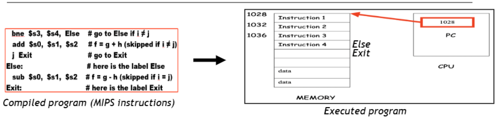
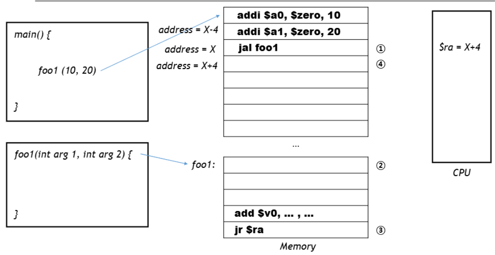

⚙ **Computer Architecture 공부**

## Sequential Flow of Program Execution
---
컴퓨터에서 프로그램이 어떻게 실행되는지 다시 복습해보자.


1. 컴파일된 프로그램을 실행하면 **명령어들이 메모리에 로드**된다
2. **<span style="color: #008000">Program Counter(PC)</span>는 현재 실행 중인 명령어의 주소**를 가리킨다
3. CPU는 기본적으로 **순차적으로 명령어를 실행**
4. 명령어 하나가 실행될 때마다 **PC는 4bytes씩 증가**
5. `branch`나 `jump` 명령어를 만나면 **<span style="color: #008000">target address</span>로 점프하고 PC는 해당 주소로 업데이트 됨**


1. main()은 인자를 `$a0, $a1`등에 설정
2. `jal`명령어로 foo1()로 점프
3. caller의 다음 실행 주소가 `$ra`에 저장됨
4. `foo1()`(callee)의 명령어들이 실행
5. callee는 결과값을 `$v0, $v1`에 저장
6. `jr $ra`명령어로 호출자에게 제어를 반환
7. 호출자는 함수 호출 이후의 명령어부터 계속 실행


#### A Function to Add Two Numbers
```assembly
# 메인 프로그램
main:
    li $a0, 5        # 첫 번째 인자(5)를 $a0에 로드
    li $a1, 10       # 두 번째 인자(10)를 $a1에 로드
    jal add_numbers  # add_numbers 함수 호출
                     # 결과는 $v0에 저장됨
    
    move $t0, $v0    # 결과를 $t0에 이동(선택적)
    # 프로그램 계속...
    
    li $v0, 10       # 시스템 콜 코드(종료)
    syscall          # 시스템 콜 실행

# 함수: add_numbers
# 설명: $a0와 $a1에 전달된 두 숫자를 더함
# 반환: 결과를 $v0에 저장
add_numbers:
    add $v0, $a0, $a1  # 인자들을 더하고, $v0에 저장
    jr $ra             # 호출자에게 반환
```

#### A Calculator
```assembly
# 메인 프로그램
main:
    li $a0, 4       # 첫 번째 인자(add_numbers용)
    li $a1, 6       # 두 번째 인자(add_numbers용)
    jal add_numbers # add_numbers 호출
                    # 결과는 $v0에 저장됨
    
    move $t0, $v0   # 덧셈 결과를 $t0에 저장
    
    li $a0, 3       # 첫 번째 인자(multiply_numbers용)
    li $a1, 7       # 두 번째 인자(multiply_numbers용)
    jal multiply_numbers # multiply_numbers 호출
                         # 결과는 $v0에 저장됨
    
    move $t1, $v0   # 곱셈 결과를 $t1에 저장
    
    # 프로그램 종료
    li $v0, 10      # 시스템 콜 코드(종료)
    syscall         # 시스템 콜 실행

# 함수: add_numbers
# $a0와 $a1을 더하고 결과를 $v0에 반환
add_numbers:
    add $v0, $a0, $a1  # $v0 = $a0 + $a1
    jr $ra             # 호출자에게 반환

# 함수: multiply_numbers
# $a0와 $a1을 곱하고 결과를 $v0에 반환
multiply_numbers:
    mul $v0, $a0, $a1  # $v0 = $a0 * $a1
    jr $ra             # 호출자에게 반환
```

#### A Nested(중첩) FUNCTION CALL
__C 코드__:  
```c
int square(int x) {
    return x * x;
}

int square_sum(int a, int b) {
    return square(a) + square(b);
}
main() {
    // square_sum(3, 4) 호출
}
```

__어셈블리 코드__:  
```assembly
# 메인 프로그램
main:
    li $a0, 3         # 첫 번째 인자
    li $a1, 4         # 두 번째 인자
    jal square_sum    # square_sum(3, 4) 호출
    move $t0, $v0     # 결과 저장

    # 프로그램 종료
    li $v0, 10
    syscall

# square_sum 함수 구현
square_sum:
    # 스택에 공간 할당하고 $ra 저장
    addi $sp, $sp, -4    # 스택에 4바이트 공간 할당
    sw $ra, 0($sp)       # 반환 주소 저장
    
    move $a0, $a0        # square(a) 호출 준비
    jal square           # square(a) 호출
    move $t1, $v0        # square(a)의 결과를 $t1에 저장
    
    move $a0, $a1        # square(b) 호출 준비
    jal square           # square(b) 호출
    move $t2, $v0        # square(b)의 결과를 $t2에 저장
    
    add $v0, $t1, $t2    # 결과 = square(a) + square(b)
    
    # $ra 복원 및 스택 정리
    lw $ra, 0($sp)       # 반환 주소 복원
    addi $sp, $sp, 4     # 스택 공간 해제
    
    jr $ra               # 호출자에게 반환

# square 함수 구현
square:
    mul $v0, $a0, $a0    # $v0 = $a0 * $a0
    jr $ra               # 호출자에게 반환
```

* **중첩 함수에서 중요한 점:**
  * 함수가 다른 함수를 호출할 때는 **반환 주소(`$ra`)를 스택에 저장**해야 한다
  * 중첩 호출이 끝난 후 **원래 반환 주소를 복원**해야 함
  * 스택 포인터(`$sp`)를 조정하여 **스택에 공간을 할당하고 해제**한다