>📚컴퓨터 네트워크 전공 수업 정리

## TCP Congestion Control
---
**Congestion**: **"too many sources sending too much data too fast for network to handle"**

✅flow control vs Congestion control  
* flow control: 한 sender가 한 receiver에게 너무 빠르게 데이터를 보내는 문제 해결(end-to-end)
* Congestion control: **너무 많은 sender가 네트워크에 너무 많은 데이터를 보내는 문제 해결(네트워크 차원)**

#### Congestion Control scenario 1
가장 단순한 이상적 시나리오(무한한 버퍼, 패킷 loss x)

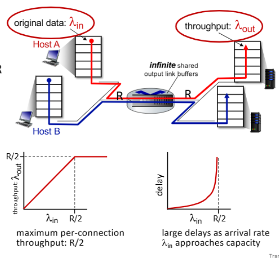
> no retransmissions = no packet loss  
* 두 연결의 **최대 throuput은 R/2**이다.
* 도착 속도(arrival rate)가 R/2에 접근할수록 **처리량이 선형적으로 증가**함
* **동시에 delay는 급격하게 증가함** → **패킷이 buffer에서 대기하는 시간이 길어지기 때문**

#### Congestion Control scenario 2
1. 이상적 상황
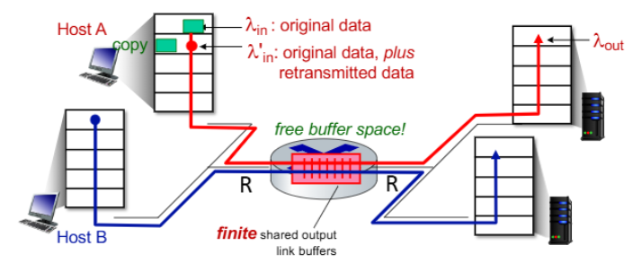 
> sender가 buffer의 용량만큼만 데이터를 전송  
> 처리량이 **최대 R/2까지 증가**

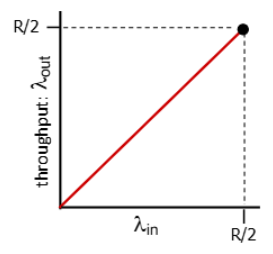

2. 조금 현실적으로 유한한 버퍼를 가진 라우터의 경우
* `packet loss` 가능
* `retransmission` 있음

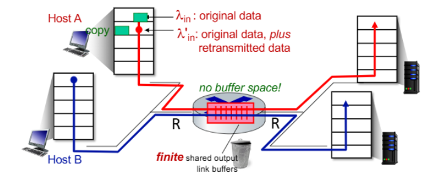
> 라우터 버퍼가 가득 차서 패킷이 손실  
> sender가 재전송 → "낭비된 용량"이 발생(재전송으로 인해 새로운 데이터 전송 가능 용량이 줄어듦)

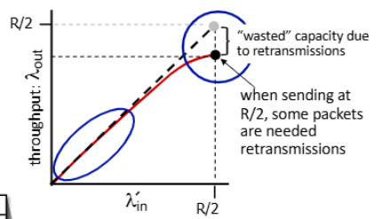

3. 현실적인 시나리오: 불필요한 duplication
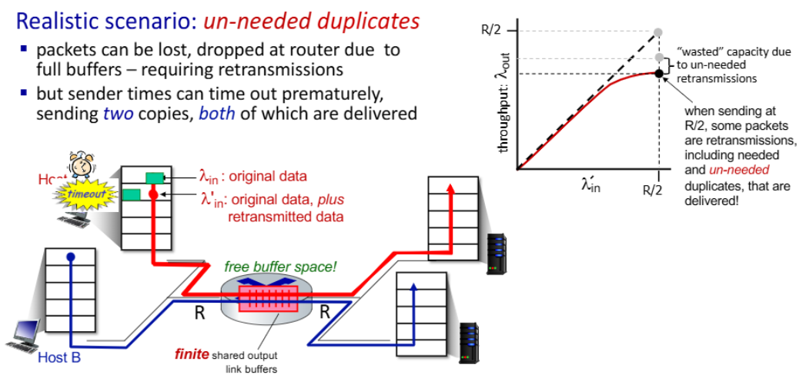
> **Timeout을 일찍 감지해서 불필요한 duplication이 발생**
> 이로 인해 처리량이 더 감소하고, "낭비된 용량"이 증가

#### Congestion Control scenario 3
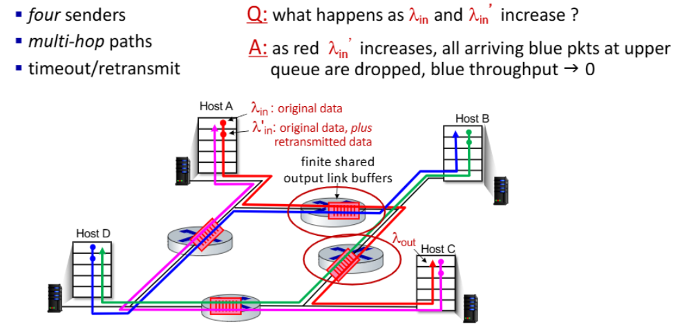
* A, B, C, D가 서로 데이터를 주고 받는다
* 데이터가 2개의 라우터를 거쳐 목적지에 도달한다
* packet loss 시 타임아웃 후 재전송

Q: 빨간색 라인의 데이터 인풋이 증가하면?
A: **맨위 라우터에 빨간색의 패킷으로 가득차고, 라우터를 공유하는 파란색 라인의 패킷들이 모두 버려진다**

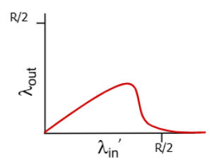
> 도착 시간이 길어짐에 따라 **처리량이 커지다가 0에 수렴**

{:.prompt-warning}
> 네트워크에서 패킷이 여러 라우터를 통과한 후 마지막 라우터에서 버려진다면, 그 패킷이 이미 소비한 모든 네트워크 리소스(버퍼 공간, 처리 시간)는 완전히 낭비된다!!
>

flow control에서 sender의 window size는 receiver window에 따라서 유동적으로 변한다고 했지만, 사실 네트워크 상황도 함께 고려해야한다

sender는 `RWND`와 네트워크 상황을 고려한 **CWND(Congestion Window)**중에서 작은 값을 택한다

* congestion control 방식을 알아보기 전에 `CWND`, `ssthresh`의 개념을 잡고 가자
* **CWND**: 한 번에 네트워크에 전송할 수 있는 데이터의 양(`LastByteSent - LastByteAcked ≤ cwnd`)
  * TCP 속도 ≈ cwnd / RTT (bytes/sec)

* **ssthresh**: slow start threshold(임계점)
  * **여기까지만 slow start를 사용**하겠다는 의미
  * 특정한 임계점을 정해놓고 윈도우 사이즈가 **임계점을 넘어가면 이후부터는 AIMD 방식을 사용**하여 윈도우를 증가시킴

그럼 congestion control에는 어떤 방식이 있을까?

### AIMD (Addictive Increase Multiplicative Decrease)
---
합 증가 - 곱 감소 알고리즘이다.
* **Addictive Increase**: network congestion이 감지되지 않는 동안 매 RTT마다 **MSS(Maximum segment size)만큼 전송속도를 증가**

* **Multiplicate Decrease**: 패킷 손실이 감지되면 그때마다 **전송 속도를 절반으로 줄임**
  * **TCP Reno**: **3-ACK duplication**이 감지되면 전송 속도를 절반으로 줄이는 방식
  * **TCP Tahoe**: **타임아웃**으로 손실이 감지되면 `cwnd`를 **1 MSS로 줄임**

### Slow start
---
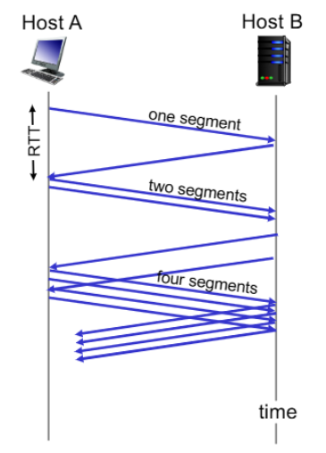
* 초기에는 `cwnd=1 MSS`로 설정
* 매 RTT마다 cwnd를 2배 증가 → 각 ACK를 수신할 때마다 cwnd 증가

**TCP Reno와 Tahoe**는 `AIMD + Slow start`를 혼합해서 congestion control을 하는 정책이다.

#### TCP Tahoe
📚 **Tahoe**은 혼잡 제어의 초기 정책이고 빠른 재전송이 처음으로 도입된 정책  

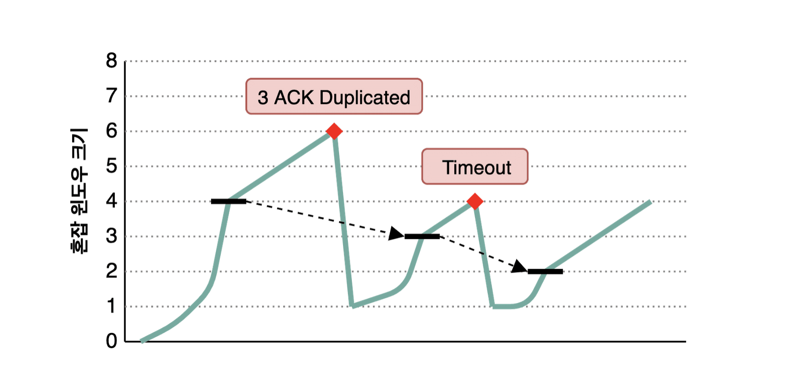
* **처음에는 동일하게 Slow Start 방식으로 윈도우를 증가시키다가 ssthresh 시점 이후부터는 AIMD 방식을 사용**
* `TimeOut` 이나 `3 ACK Duplicated` 상황이 발생 시 네트워크가 혼잡하다는 것을 인지
* → `ssthresh`는 wnd size의 **절반**으로, `window size`는 **1로 수정**

❌Tahoe의 단점은 초반의 Slow Start 구간에서 윈도우 크기를 키울때 너무 오래 걸린다  

그래서 나온 **Fast Recovery 방식을 활용한 TCP Reno**

#### TCP Reno
📚 **Tahoe와 마찬가지로 Slow Start로 시작하여 임계점을 넘어서면 합 증가로 변경하는 방법**  
* Tahoe는 명확한 차이가 있는데, 바로 `3 ACK Duplicated`와 `Timeout`을 **구분한다는 것**

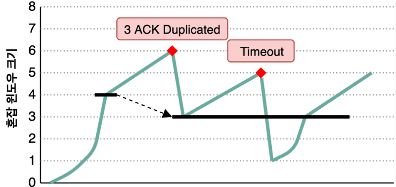
* Reno는 `3 ACK Duplicated`가 발생했을 때, 윈도우 크기를 1로 줄이는 것이 아니라 AIMD처럼 **반으로만 줄이고 sshthresh를 줄어든 윈도우 값**으로 정하게 된다.
* 이는 Tahoe에 비해 빠르게 원래 window size에 도달하기 때문에 **Fast Recovery**라고 불림
* `Timeout`의 경우에는 Tahoe와 마친가지로 window size를 1로 줄인뒤 slow start를 진행
  * **이때 <u>ssthresh는 변경하지 않음</u>**

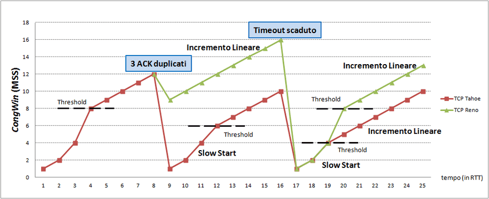
> Tahoe와 Reno 비교 그래프

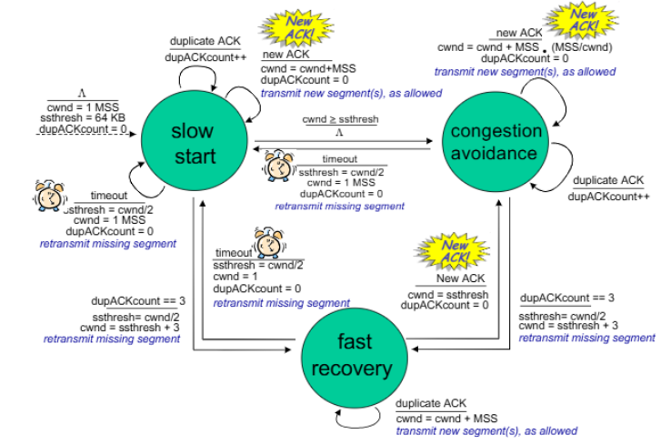
> Reno의 FSM

✅ **FSM 메커니즘:**  
##### 1. **Slow Start**
* 초기값: `cwnd = 1 MSS`, `ssthresh = 64 KB`, `dupACKcount = 0`
* 네트워크에 급작스러운 부하를 주지 않기 위한 시작 단계
1. **new ACK 수신:**
  * `cwnd = cwnd + MSS`(매 ACK마다 윈도우 크기 증가)
  * `dupACKcount = 0` (중복 ACK 카운터 초기화)
  * 새 세그먼트 전송 허용
2. **Timeout 발생 시:**
  * `ssthresh = cwnd/2`(임계값을 현재 윈도우의 절반으로 설정)
  * `cwnd = 1 MSS`(윈도우 크기 최소로 재설정)
  * `dupACKcount = 0`
  * 누락된 세그먼트 재전송

##### 2. **Congestion Avoidance**
* **Congestion Avoidance로 전이하는 조건:**
  * `cwnd ≥ ssthresh`
* 네트워크 용량에 가까워졌다고 판단하여 보다 신중하게 윈도우 크기 증가
1. **new ACK 수신:**
  * `cwnd = cwnd + MSS×(MSS/cwnd)`(약 1 MSS를 한 RTT당 증가, 즉 선형적 증가)
  * `dupACKcount = 0`
  * 새 세그먼트 전송 허용
2. **duplicated ACK 수신:**
  * `dupACKcount++`

##### 3. **Fast Recovery**
* **Fast Recovery로 전이하는 조건:**
  * `dupACKcount = 3`
  * 이때:
    * `ssthresh = cwnd/2`
    * `cwnd = ssthresh + 3`(윈도우 크기 조정)
    * 누락된 세그먼트 재전송
1. **duplicated ACK 수신 시:**
  * `cwnd = cwnd + MSS`(각 중복 ACK마다 윈도우 증가)
  * 새 세그먼트 전송 허용
2. **new ACK 수신 시(누락된 세그먼트에 대한 ACK):**
  * `cwnd = ssthresh`(윈도우 정상화)
  * `dupACKcount = 0`
  * **Congestion Avoidance로 전환**
3. **Timeout 발생 시:**
  * `ssthresh = cwnd/2`
  * `cwnd = 1 MSS`
  * `dupACKcount = 0`
  * **Slow start로 전환(심각한 네트워크 혼잡 상황)**

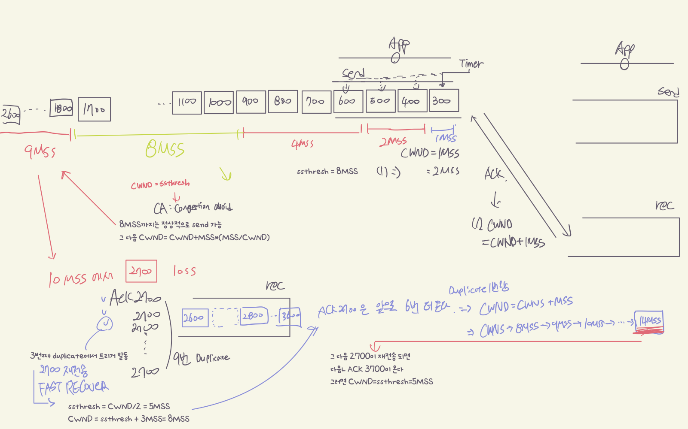