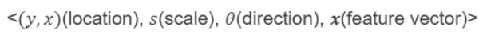
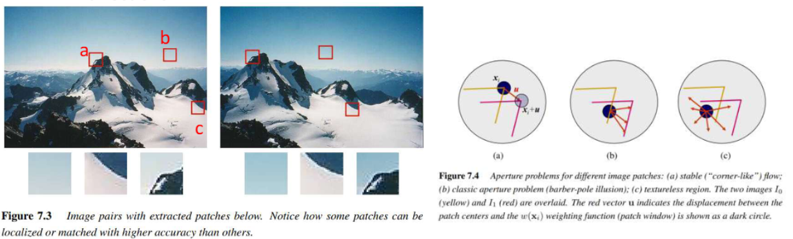

## Correspondecnce Problem
하나의 장면을 여러 이미지로 찍은 경우
같은 물체가 다른 시점의 두 이미지에서 나타났을 때 같은 물체를 찾는 문제
즉, 다른 두 이미지에서 같은 물체가 어디에 위치하는가를 대응하는 문제
→ 파노라마 찍을 때 필요한 기술(다른 이미지를 계속 이어붙이기 위한)

그럼 대응을 찾기 위해 무엇을 해야하는가?

1. Edges
   * 곡률이 큰 edge
   * edge는 윤곽선만 가지고 있어서 matching에 맞지 않을 수도 있음

2. Local features
   * 이미지의 특징 point(두 이미지에서 반복적으로 나타나는 point)를 감지

## Local Features
---
* local feature가 포함하는 내용:

어떤 파라미터를 가져야 좋은 feature point라고 할 수 있는가?
1. Repeatability(반복성): given two images of the same scene, the features of the same object are the same
2. Distinctiveness(구분성): 주변에 비해 구분이 크게 되는 부분
3. Locality: unique한 위치를 표시를 할 수 있어야함 

* trade-offs
  * 좋은 feature point를 위해 3개를 다 만족할 수 없음. 최소 하나는 양보

##### Good local feature
* match or track이 쉬운게 good local feature
* intensities가 빠르고 여러 방향으로 바뀌는 지점이 좋은 points!

> 1번 예시: a는 b point에 비해 좋은 point

지역 특징점을 계산해서 나온 point를 평행이동 = 평행이동한 이미지에서 지역 특징점을 찾아서 나온 point

### How to find Local Features
---
susan은 안함

### Moravec Corner Detection
---
summed square difference: 모든 픽셀들은 일정한 object만큼 이동할 때 그 위치와의 차이를 계산해 모두 더함

> 제곱은 절댓값을 구하기 위함(차이만 구하려고)
> b square는 위에 열부터 2+1+1 = 4

> point a는 좋은 point라고 어림짐작 가능
> b는 edge에서는 변화가 거의 없기 때문에 애매함
> c는 항상 small values를 가진다
동서남북으로 확인해서 변화량이 있는지 확인하고 어떤 일정값 이상으로 변화량이 있으면 corner로 인식함
only 4 방향만 고려함 → noise에 약함

### Harris Corner Detection
---
더 여러 방향의 변화를 계산하기 위해 `Moravec Corner Detection`을 개선함

Gaussian mask를 적용

> 하지만 (𝑓(𝑦+𝑣,𝑥+𝑢)−𝑓(𝑦,𝑥))^2 계산이 어려워서 근사치를 구함

#### Localization

* 평행 이동, 회전의 경우 특징점이 같음
* 하지만 scale의 경우는 아니다.

{:.prompt-warning}
> 그럼 scale invariance 경우 어떻게 해야 같은 특징점을 찾을 수 있을까?
>

multi-scale image: 여러 개의 scale 사진의 집합(M)을 모아놓는다.
각각의 scale은 2차원이지만 집합은 3차원

#### Sclae space
----
그럼 multi-scale image를 어떻게 구성하는가
1. Gaussian smoothing: 𝜎 controls the scale continuously
  * 각각 다른 가우시안 필터 값을 적용함
  * 이미지를 줄였다가 크게 키운것과 비슷한 효과를 볼 수 있음
2. Image pyramid: 이미지 사이즈를 1/2씩 계속 줄여서 만듦

이 챕터에서는 Gaussian smoothing 방식을 이용!

> 가우시안 스무딩을 이용한 scale space
* multi 이미지를 만들어서 (y,x,t) space를 만듦

> t의 값을 특정하기 위한 공식

어떤 물체가 s배 만큼 scale을 적용하면 t는 s^2만큼 scale 된다

#### Harris-Laplace Feature Detection
(y,x,t)에서 (y,x)를 구하기 위해 `Harris detector`를 이용해서 구함
t-space는 `normalized Laplacian`을 이용해서 구함

#### SIFT(Scale-Invariant Feature Transform)
Image Pyramid + Gaussian structure을 적용해서 scale space를 구한다.
시그마0=1.6, k=2^1/3을 적용하면 옥타브를 구현하면 4번째 이미지가 1번째 이미지 scale의 2배가 적용된다. 그럼 2배가 된 4번째 이미지를 다운샘플링을 한다.

SIFT에서는 복잡한 normalized Laplacian 대신에  **Difference of Gaussian (DoG)**를 사용한다
Difference of Gaussian (DoG): 두 이미지의 차를 구해서 '차이 영상'을 구함

> normalized Laplacian으로 유도 가능  
> 즉, DoG와 normalized Laplacian은 근사치를 가진다

그럼 이 차이 영상에서 corner detection은 어떻게 하는가?

* DOG가 5개의 층으로 이루어져 그 사이에서 구해야한다
* 맨 아래와 맨 위의 DoG를 빼고 그 사이의 3개 안에서만 local maxima를 찾는다
* 3개 층에서 9,8,9에 대해 비교해서 local maxima를 찾는다
* 찾은 maxima point를 key point라고 한다

key point는 <𝑦,𝑥,𝑜,𝑖>을 가지고 있다.
key point의 위치는 옥타브의 위치에 따라 다음과 같이 특정 가능

#### SURF(Speeded-Up RobostFeatures)
SIFT도 느려서 나온 SURF
가우시안 스무딩도 계산량이 많고 복잡함을 해소하기 위함
