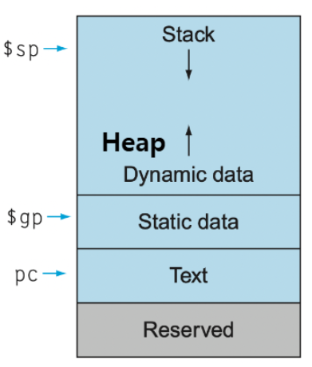

⚙ **Computer Architecture 공부**

## Memory Regions
---
컴퓨터의 메모리 공간은 목적에 따라 여러 영역으로 나뉜다

#### 1. Text Segment
**<span style="color: #008000">Text Segment</span>**: MIPS 기계어 코드가 저장되는 곳
* **프로그램이 실행될 떄 명령어들이 이곳에 로드됨**
* `PC(program counter)`가 현재 실행 중인 명령어를 가리킴

#### 2. Static Data Segment
**<span style="color: #008000">Static Data Segment</span>**: **constants(상수)와 static variable(정적 변수)이 저장**됨
* c에서 <span style="color: #008000">Static variable</span>은 **모든 프로시저 밖에서 선언되거나 `static`키워드로 선언됨**
* MIPS는 `$gp`(글로벌 포인터)를 제공 → static data에 접근

#### 3. Heap
**<span style="color: #008000">Heap</span>**: **Dynamic data Structure**(예: 배열, 리스트)를 위한 영역
* c예서 `malloc()`으로 할당, `free()`로 해제
* **Heap과 Stack은 서로를 향해 성장**

#### 4. Stack
**<span style="color: #008000">Stack</span>**: **local variable, procedure**를 위한 영역
* `$sp`(stack pointer)가 **가장 최근에 저장된 데이터**를 가리킴


> Stack + Heap + Static data segment + Text segment

## MIPS 주소 지정 (32-bits Address)
---
{:.prompt-tip}
> MIPS 명령어가 메모리의 Text segment에서 **주소를 어떻게 표현**할까?
>

#### 1. Jump instruction (J-type)

> 26bits를 사용하여 메모리 주소 표현

{:.prompt-warning}
> 만약 주소가 2^26bytes보다 크다면?
>

#### 2. Conditional branch instruction (I-type)

> 16bits만 사용하여 주소 표현 (J-type보다 훨씬 작음)

{:.prompt-warning}
> 32비트 메모리 주소는 어떻게 표현할 수 있을까?
>

### Word Addressing
---
* 각 명령어는 Text Segment에 저장
  * `j 10000` or `bne $s0, $s1, Exit`에서 `10000`이나 `Exit`은 대상 명령어를 가리킴
* **<span style="color: #008000">Instruction Size(Word)</span>**로 인해 **byte offset을 고려할 필요가 없다**
  * 마지막 두 비트는 항상 `00`(예: xxxx xxxx xxxx xxxx xx00)이므로 **필드에서 비트가 낭비됨**
* target address가 **워드 주소로 지정**되면, **바이트 주소 공간의 4배 크기 표현 가능**


#### Word Address vs byte Address
---
일반적인 메모리 주소 지정에서는 **<span style="color: #008000">byte address를</span> 사용**한다
각 바이트마다 고유한 주소가 있어, **메모리의 모든 바이트에 접근** 가능
32bits 주소 체계에서는 2^32(약 4GB)의 바이트에 접근 가능

__byte address 예시:__  

```
0x00: 바이트 1
0x01: 바이트 2
0x02: 바이트 3
0x03: 바이트 4
0x04: 바이트 5
...
```

**<span style="color: #008000">word address</span>**에서는 주소가 `4bytes(word)`단위로 증가함
명령어가 **항상 워드 단위로 정렬**되어 있음 → 실제로 명령어를 참조할 때는 **마지막 2bits(00)을 굳이 포함X**

__word address 예시:__

```
0x00: 워드 1 (바이트 주소 0x00~0x03)
0x01: 워드 2 (바이트 주소 0x04~0x07)
0x02: 워드 3 (바이트 주소 0x08~0x0B)
0x03: 워드 4 (바이트 주소 0x0C~0x0F)
...
```

* word address는 **실제 byte address의 1/4**
* byte address `0x1000`이 word address로는 `0x400`이 된다
* 즉, word address를 사용하면 마지막 2bits를 생략 가능해서 **같은 bits 수로 <u>4배 더 넓은 주소 공간을 다룰 수 있게 됨</u>**

### PC-Relative Addressing for I-Type
---
I-type 명령어의 16bits 필드는 `2^16 word(and instruction)`만 표현할 수 있는 제한이 존재

이를 극복하기 위해 **<span style="color: #008000">PC-Relative Addressing</span>**을 사용

* `target address`는 **PC(현재 명령어 주소)를 기준으로 지정**됨
* `Target address(32-bit)` is calculated as **PC(32-bit)+ branch offset (16-bit)**
  * `Target address(32-bit)` = (PC + 4) + (branch address in word * 4)
* 대부분의 `loop, if 문`은 **2^16 word보다 훨씬 작은 주소를 필요**로 함


✅PC-Relative Addressing의 장점:  
* **코드의 재배치성(relocatability)**: 코드가 메모리의 어디에 로드되든 분기가 올바르게 작동
* 더 작은 비트 필드로 실용적인 주소 범위 제공

### Pseudo-Direct Addressing for J-Type
---
I-type에도 제한이 있듯이 **J-type instruction의 26bits 필드**도 `2^26 word(and instruction)`만 표현 가능해서 제한 존재

이를 해결하기 위해 **<span style="color: #008000">Pseudo-Direct Addressing</span>** 사용

* Target address는 부분적으로 PC를 기준으로 지정
* `Target address(32-bits)` = `upper 4 bits of PC(32-bit)` ⊕ `branch offset(26-bit)` ⊕ `00`
  * ⊕ 는 연결(concatenation) 연산자
  1. PC의 가장 유의미한 4비트(32-29비트)를 가져와 상위 4비트로 사용
  2. 명령어의 26비트 주소 필드(28-3비트)를 중간 26비트로 사용
  3. 마지막 2비트는 00(바이트 정렬을 위해)


### MIPS 주소 지정 예제
---

```
Loop: sll $t1, $s3, 2     # 임시 레지스터 $t1 = 4 * i
      add $t1, $t1, $s6    # $t1 = save[i]의 주소 
      lw $t0, 0($t1)       # 임시 레지스터 $t0 = save[i] 
      bne $t0, $s5, Exit   # 만약 save[i] ≠ k라면 Exit으로 이동
      addi $s3, $s3, 1     # i = i + 1
      j Loop               # Loop로 이동
Exit:
```


> 위 코드를 해석한 도표

**가정:**
* loop가 메모리의 `80000` 위치에서 시작
* `bne $t0, $s5, Exit`: `80012`에 위치
* `j Loop`: `80020`에 위치

✅**PC-Relative Addressing(bne instruction):**  
* `Target address` = (PC + 4) + (offset * 4) 
* = (80012 + 4) + (2*4) = 80016 + 8 = 80024

✅**Pseudo-Direct Addressing:**  
* `Target address` = upper 4 bits of PC ⊕ (offset * 4)
* = 0000 ⊕ (20000 * 4) = 80000

### MIPS ADDRESSING MODES
---


1. **Immediate addressing**:
  * identy operand 값이 명령어에 직접 포함됨
  * 예: `addi $t0, $t0, 4` (4라는 값이 명령어에 즉시 포함)

2. **Register addressing**:
  * identy operand가 레지스터에 있음
  * 예: `add $t0, $t1, $t2` (모든 피연산자가 **레지스터**)

3. **Base addressing**:
  * 메모리 주소가 **베이스 레지스터와 오프셋의 합**으로 계산됨
  * 예: `lw $t0, 12($s0)` ($s0 + 12 위치에서 데이터를 로드)

4. **PC-relative addressing**:
  * branch 명령어에서 사용, **target address가 PC + 오프셋으로 계산**
  * 예: `beq $t0, $t1, Loop` (Loop 위치가 PC에 **상대적으로 계산**)

5. **Pseudo-direct addressing**:
  * jump 명령어에서 사용, **target address가 PC의 상위 비트와 주소 필드의 조합으로 계산**
  * 예: `j Exit` (Exit 위치가 의사 직접 방식으로 계산)