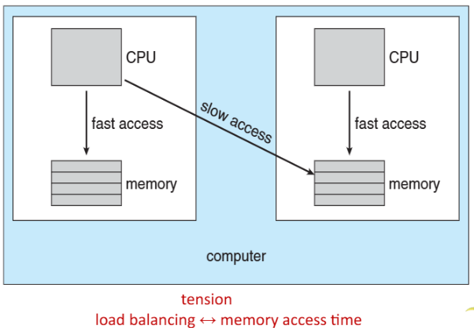

>🍀 운영체제 전공 수업 정리

## NUMA and CPU Scheduling
---
📚**<span style="color: #008000">NUMA(Non-Uniform Memory Access)</span>**: 메모리 접근 시간이 균일하지 않은 컴퓨터 메모리 설계


* 각 CPU가 **로컬 메모리를 가지고 있어 해당 메모리에 빠르게 접근 가능**
* 원격 메모리에 접근할 때는 상대적으로 **느린 접근 속도**

📚**<span style="color: #008000">NUMA-aware OS</span>**:
1. **메모리 근접성 최적화**: 스레드가 **실행 중인 CPU에 가까운 메모리를 할당**
2. **스레드 배치 최적화**: 관련 스레드들을 **같은 NUMA 노드에 배치**하여 메모리 공유 효율성을 높임
3. **메모리 이동 최소화**: **가능한 한 스레드를 이동시키지 않고 동일한 노드 내에서 실행**하도록 유지

✅ **NUMA 시스템에서는 load balancing과 memory access time 사이의 균형이 중요하다**  
→ 로드 밸런싱을 최적화하면 스레드가 여러 노드로 분산되어 원격 메모리 접근이 증가할 수 있으며, 메모리 접근 시간을 최적화하면 특정 노드에 작업이 집중될 수 있다.

## Real-time CPU Scheduling
---
> 일반 스케줄링과 차이점 존재

* **<span style="color: #008000">정해진 시간(Real-time)</span> 안에 작업이 끝나야함**
반드시 빠를 필요는 없고, 정해진 시간안에만 끝나면 되는 스케줄링

* <span style="color: #008000">soft real-time system</span>: 타임 바운드안에 끝내려고 **노력을 하는** 시스템(**no guarantee**)
  * **중요한 real-time task에 최고 우선순위 부여**
* <span style="color: #008000">hard real-time system</span>: 타임 바운드안에 **무조건 끝내**야하는 시스템

❌ **딜레이가 존재(Event latency)**  
* **어떤 사건(interrupt)이 발생 했을 때 이를 인지하고 서비스를 시작하기 까지 지연 시간 발생**

* <span style="color: #008000">Event latency</span> = `interrupt latency` + `dispatch latency`

✅**지연 시간의 두 가지 유형:**  
1. **interrupt latency**: 인터럽트 발생 시점부터 해당 인터럽트를 처리하는 루틴(ISR)이 시작될 때까지의 시간
  * 인터럽트 발생 → 인터럽트 타입 결정 → 컨텍스트 스위치 → 인터럽트 서비스 루틴 실행
2. **dispatch latency**: 현재 진행 중인 CPU를 다른 작업으로 교체할 때 지연 발생
  * `hard real-time system`에서 일반적으로 수 usec

##### interrupt latency

> `context switch`: 현재 상태로 다시 돌아가기 위한 스냅스를 찍기 위함

##### Dispatch latency

> 작업이 식별이 된 후 작업을 실행하기 까지 지연시간
> Dispatch latency: `conflicts`(`Preemption+Release`) + `dispatch`

* **conflict phase:**
  * `Preemption`: **현재 진행 중인 작업이 CPU를 뺏기는 행위**
  * `Release`: 현재 작업이 **어떤 resource를 잡고 있으면 놓게하는 행위**


#### Priority-based Scheduling
---
* real-time scheduling은 **선점형** + **우선순위 기반 스케줄링**이다.
소프트 실시간만 보장하는 경우에는 이것으로 충분하지만, 하드 실시간 시스템에서는 이에 더해 **데드라인을 충족시키는 능력이 필요**

##### Periodic Process
📚**<span style="color: #008000">Periodic Process</span>**: 일정한 간격으로 CPU를 필요로 하는 프로세스


> `t`: **processing time**, `d`: **deadline**, `p`: **period**  
> `0 ≤ t ≤ d ≤ p`
> **periodic task의 빈도(rate)는** `1/p`

* `Admission-control algorithm` - 프로세스가 스케줄러에게 `deadline`을 요청했을 때: 
  * **받아들여서 주어진 시간 내에 종료를 보장**
  * 또는 **불가능하기 때문에 거부를 결정**하는 알고리즘

{:.prompt-tip}
> 주요 real-time scheduling 알고리즘에 대해 알아보자.
> 

### Rate Monotonic Scheduling
---
📚**<span style="color: #008000">Rate Monotonic Scheduling</span>**: <u>주기를 기반으로 우선순위를 할당</u>하는 **정적 우선순위 스케줄링**  
= `static priority policy` + `preemption`

* 주기가 길수록 priority가 낮음
* 주기↓ = 우선순위 ↑
* 주기↑ = 우선순위 ↓

* 가정: periodic process의 processing time, **즉, CPU burst는 항상 같다**


> `P1`: p1=50, t1=20, d1=50  
> `P2`: p2=100, t2=35, d1=100  
* `P1`의 주기가 50이므로 50단위로 발생됨  
* `P1`의 주기가 `P2`보다 짧으므로 `P1`이 먼저 실행, `P2`가 30밖에 실행하지 못했지만 `P1`이 들어와서 양보해줌  

* CPU 활용도 계산:
  * 각 프로세스의 CPU 활용도 = `t/p`
  * 전체 CPU 활용도 = `Σ(t/p)`
  * 위 예제: 20/50 + 35/100 = 0.4 + 0.35 = 0.75 = 75%
  * → 스케줄링 가능!

{:.prompt-warning}
> **그럼 deadline을 지키지 못한 경우에 어떻게 되는가?**
>


* CPU utilization: 25/30 + 35/80 = 94%
  * 100%를 넘지 않는데 왜 스케줄링이 불가한가?

❌ **Rate-monotonic scheduling 알고리즘**은 <u>N개의 프로세스를 스케줄링할 때 CPU Utilization은 다음 식을 넘을 수 없다</u>  

* $N(2^(1/N)-1)$
  * N=1, Max Utilization = 1(100%)
  * N=2, Max Utilization = 0.83 (83%)
  * N=infinte, Max Utilization = 0.69 → N이 무수히 많다면 69%에 근접한다.
* 즉 위의 예제에서는 **0.83을 넘어서 스케줄링이 불가**

#### Earliest Deadline First Scheduling (EDF)
---
**<span style="color: #008000">deadline</span>**이 우선순위를 결정하는 지표
* `deadline`이 가까울수록 우선순위가 높음
* `deadline`이 멀수록 우선순위가 낮음

✅**특징:**  
* `EDF`는 **process가 periodic일 필요가 없으며 CPU burst가 일정할 필요도 없다.**
* **다만 스케줄러에게 `deadline`을 미리 알려줄 수 있으면 된다**


> `P1`: p1=50, t1=25, d1=50  
> `P2`: p2=80, t2=35, d1=80  
* EDF는 **이론적으로는** `optimal` 알고리즘 → **CPU utilization을 100%까지 가능**
* 그러나 **현실에서는** `context switching` 등 추가 비용으로 인해 **100%를 성취할 수 없다**

### Proportional Share Scheduling
---
📚**<span style="color: #008000">Proportional Share Scheduling</span>**: CPU 시간을 각 프로세스에 공정하게 분배하는 방식

✅**특징:**  
* 시스템에는 `T shares(total share)` 가 할당됨
* 각 애플리케이션은 N개의 공유`(N < T)`를 받음
* 이를 통해 **각 애플리케이션은 `N/T` 비율만큼의 프로세서 시간을 보장**

* 예시:
  * T = 100shares
  * Process A: 50shares
  * Process B: 15shares
  * Process C: 20shares
  * → **CPU Utilization** = 85% 
    * 만약 D가 30shares를 요청하면 거부됨
    * **이미 할당된 공유(85개)와 합쳐서 100개를 초과**하므로 `admission controller`가 D의 요청을 거부

### POSIX Real-Time Scheduling
---
📚**<span style="color: #008000">POSIX</span>**: 다양한 운영체제에서 호환성을 제공하는 표준

1. `SCHED_FIFO`: 
  * FCFS 전략으로 스레드 스케줄링
  * 동일한 우선순위를 가진 스레드 간에는 **시간 분할(time-slicing)이 없음**
  * 우선순위가 높은 스레드가 낮은 스레드를 선점할 수 있음
2. `SCHED_RR`: 
  * 동일한 우선순위를 가진 스레드 간에 **시간 분할이 발생**
  * RR 방식으로 동일, **우선순위 스레드 간 CPU 시간 분배**
  
```c
// 스레드 속성에서 현재 스케줄링 정책을 가져옴
pthread_attr_getsched_policy(pthread_attr_t *attr, int *policy)

// 스레드 속성에 스케줄링 정책(policy)을 설정
// 정책으로는 SCHED_FIFO, SCHED_RR, SCHED_OTHER 중 하나를 사용
// SCHED_OTHER: 비실시간 시스템에 따라 다름
pthread_attr_setsched_policy(pthread_attr_t *attr, int policy)
```