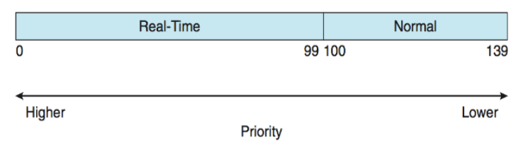
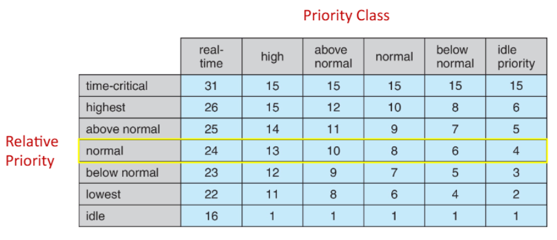

>🍀 운영체제 전공 수업 정리

## Linux Scheduling Through Version 2.5
---
2.5 이전에는 **표준 UNIX 스케줄링 알고리즘의 변형**을 사용, 2.5부터는 **상수 시간 O(1) 스케줄링 시간을 가진 알고리즘**으로 전환
   * **O(1) scheduling time**: 상수 알고리즘 
✅**특징:**  
1. **Preemptive, priority based**
2. **우선순위가 2가지로 나뉨**
  * `1~99:` real-time class(**낮은 숫자 = 높은 우선순위 주의!**)
  * `100~140`: conventional class
3. **전역 우선순위 매핑**
  * **숫자가 낮을수록 높은 우선순위**
  * **우선순위가 높을수록 더 큰 시간 할당량(quantum)을 받음**
4. **태스크 상태 관리**
  * 시간 할당량이 **남아있으면** 태스크는 `active`(실행 가능)
  * 시간 할당량을 **모두 사용**하면 `expired`(다른 태스크가 모두 시간 할당량을 사용할 때까지 실행 불가)
5. **runqueue 데이터 구조**
  * 각 CPU마다 존재하는 **실행 가능한 태스크 추적 구조**
  * 두 개의 우선순위 배열 (`active`, `expired`)
  * 태스크는 우선순위로 인덱싱됨
  * **active 배열이 비면 active와 expired 배열을 교체**

scheduler.png)
> O(1) 스케줄러는 효율적으로 작동했지만, 인터랙티브 프로세스에 대한 응답 시간이 좋지 않았음

## Linux Scheduling in Version 2.6.23+
---
> 앞의 linux O(1) 스케줄러 이후 2.6.23부터는 CFS를 도입

📚**Completely Fair Scheduler(CFS)**:  
  * CFS는 우선순위를 직접 할당하지 않고 `virtual run time`에 따라 **<u>동적으로 조정</u>**
  * runnable 태스크 중에서 **`virtual run time`이 가장 작은 것을 먼저 실행**
  * → 고정된 시간 할당 대신 **CPU 시간의 비율에 기반한 스케줄링**

#### Sheduling Classes
리눅스 커널에서 다양한 프로세스랑 스레드를 관리하기 위한 프레임 워크
기본적으로, Linux Scheduling은 `Scheduling class`에 의존하여 작용
* 각 클래스는 특정 우선순위를 가진다
* 스케줄러는 **가장 높은 스케줄링 클래스에서 가장 높은 우선순위 태스크를 선택**
* 기본적으로 2개의 클래스가 포함되며 추가 확장 가능:
  * `Defalut(CFS)`
  * `real-time(RT)`

{:.prompt-tip}
> virtual run time과 nice value란??
>

* **virtual run time**:
프로세스가 CPU를 사용한 시간을 추적하는 매트릭
→ 단순히 물리적 실행시간 X, **<u>우선순위(nice value)</u>에 따라 가중치 적용된 시간**
* CFS는 각 태스크별로 **virtual run time을 `vruntime` 변수에 저장**
* 가장 낮은 `vruntime`값을 가진 태스크를 다음에 실행할 테스크로 선택함
* 태스크가 실행되면 실행 시간에 따라 `vruntime`이 증가
  * 많은 CPU 시간을 사용한 프로세스는 우선순위가 낮아짐
  * 적은 CPU 시간을 사용한 프로세스는 우선순위가 높아짐

* **nice value**:
nice value는 -20부터 +19까지의 범위를 가진다
* nice value↓(-20) = 우선순위↑
* nice value↑(+19) = 우선순위↓
* 기본값은 0

* nice value는 **대상 지연(target latency)계산에 적용**된다
  * target latency: 모든 실행 가능한 task가 적어도 한 번은 실행되어야 하는 시간 간격(= 응답 시간)
  * 활성 task 수가 증가하면 각 task의 `timeslice(=context switching)`이 짧아짐 → **target latency 증가**
* nice value에 따라 **decay계수가 결정**
  * **decay 계수**: 실제 실행 시간에서 가상 실행 시간으로 변환할 때 적용되는 계수
  * 우선순위가 낮을수록(=값이 클수록) decay 계수가 높아진다
  * nice = 0인 경우, 가상 실행 시간 = 실제 실행 시간

> 리눅스는 POSIX.1b 표준에 따라 실시간 스케줄링을 지원
* 실시간 작업과 일반 작업을 글로벌 우선순위 체계로 통합
* `nice value -20`: 글로벌 우선순위 100에 매핑 (가장 높은 일반 우선순위)
* `nice value 0`: 글로벌 우선순위 120에 매핑 (기본 우선순위)
* `nice value +19`: 글로벌 우선순위 139에 매핑 (가장 낮은 우선순위)

* 리눅스는 **load balancing 뿐만 아니라 NUMA-aware도 지원**함
##### Scheduling Domain
* **Scheduling Domain**: `load balacing`이 가능한 CPU 코어의 집합
* domain은 공유하는 자원(ex: 캐시 메모리)에 따라 구성된다
* 또한 **스레드가 도메인 간에 migration되는 것을 방지**

{:.prompt-warning}
> 스레드가 다른 노드로 migration되면 여러 문제가 발생!
>

1. **Cold Cache 문제:**
  * **새 노드의 캐시는 스레드의 데이터를 포함X** → **캐시를 다시 채우는데 시간 소요**
2. **원격 메모리 접근 증가:**
  * 스레드가 원래 할당된 노드의 메모리를 계속 사용하면 원격 접근 발생
  * → 메모리 접근 지연 시간이 증가함

> 캐시 L1은 각 CPU코어에 전용으로 할당  
> L2는 코어별 또는 코어 쌍별로 할당  
> L3는 NUMA 노드 전체가 공유

## Window Scheduling
---
📚**Window Scheduling**: 우선순위 기반 선점 스케줄링

✅**스레드 실행 조건**:  
1. **블록(block) 상태**가 되었을 때 (예: I/O 작업 대기)
2. 할당된 **시간 할당량(time slice)**을 **모두 사용**했을 때 
3. 더 높은 우선순위의 스레드에 의해 **선점**되었을 때
4. 스레드가 **종료**되었을 때

* real-time 스레드는 `non-real-time(일반) 스레드를 선점` 가능

윈도우는 32-level의 `우선순위 scheme`가 있다
* `Variable class`: 1-15
* `real-time class`: 16-31
* **우선순위 0은 메모리 관리 스레드**
* 숫자가 클수록 우선순위가 높다(리눅스와 차이점 주의)

* 각 우선순위마다 별도의 **Queue(=ready queue)**가 존재
* 실행 가능한 스레드가 없으면 `idle thread`가 실행

### Windows Priority Classes
---
window OS는 **두 단계**의 우선순위 체계를 사용
1. **Priority Class**: **프로세스에 할당되는 우선순위**
2. **Relative Priority**: **같은 Priority Class 내에서 스레드에 할당되는 우선순위**

#### Priority Class
1. **REALTIME_PRIORITY_CLASS**: 가장 높은 우선순위
2. **HIGH_PRIORITY_CLASS**
3. **ABOVE_NORMAL_PRIORITY_CLASS**
4. **NORMAL_PRIORITY_CLASS**: 일반적인 애플리케이션의 기본 우선순위
5. **BELOW_NORMAL_PRIORITY_CLASS**
6. **IDLE_PRIORITY_CLASS**: 시스템이 Idle 상태일 때만 실행되는 가장 낮은 우선순위

* **Real-time을 제외한 모든 Priority Class는 가변적**
→ **시스템이 필요에 따라 우선순위 조정 가능**

#### Relative Priority
1. **TIME_CRITICAL**: 같은 클래스 내에서 가장 높은 우선순위
2. **HIGHEST**
3. **ABOVE_NORMAL**
4. **NORMAL**: 기본 우선순위
5. **BELOW_NORMAL**
6. **LOWEST**
7. **IDLE**: 같은 클래스 내에서 가장 낮은 우선순위

* `Priority Class` + `Relative Priority` = `숫자 우선순위(Numeric Priority)`

✅윈도우는 다음과 같은 경우에 **우선순위를 동적으로 조정**:  
1. **quantum 만료**: **우선순위 하락**, 기본 우선순위보다 낮아지지는 않음
2. **대기 상태 발생**: 스레드가 아무것도 안하고 있으면 **우선순위 상승**(Variable class에 속한 task만 해당, `키보드I/O>디스크I/O`)
3. **Foreground window**: 사용자가 **현재 활성화한 창은 3배의 우선순위 부스트**를 받음
* `Varialbep priority 스레드`가 I/O 작업을 기다리면 디스패처가 우선순위를 상승 → I/O-bound 스레드가 CPU-bound 스레드보다 우선시됨을 의미

### UMS(User-Mode Scheduling)
Window 7부터는 `User-Mode Scheduling(UMS)`이 추가됨

✅**UMS 특징**:
* 애플리케이션이 커널과 독립적으로 스레드를 생성하고 관리
* 대량의 스레드를 처리할 때 훨씬 효율적
* UMS 스케줄러는 `C++ Concurrent Runtime(ConcRT)` 프레임워크와 같은 프로그래밍 언어 라이브러리에서 제공

## Algorithm Evaluation
---
운영체제에서 **CPU 스케줄링 알고리즘을 선택하는 것은 시스템 성능에 큰 영향을 미치는 중요한 결정**이다

✅스케줄링 알고리즘 선택 과정:  
1. **평가 기준 설정**
2. **알고리즘 평가**
3. **최적 알고리즘 선택**

✅CPU 스케줄링 알고리즘 평가 방법:  
1. `Deterministic modeling`
2. `Queueing models`
3. `Simulations`
4. `Implementation`

### Deterministic modeling
---
📚**Deterministic modeling**: 분석적 평가(analytic evaluation) 유형
* 특정한 미리 정의된 워크로드에 대해 각 알고리즘의 성능을 정확히 계산
  * 간단하고 빠른 평가 방법
  * **정확한 입력값이 필요하며, 해당 입력에만 적용 가능**
  * 주로 **평균 대기 시간과 같은 성능 지표를 계산**

> 1. FCFS-`average waiting time` = 28ms  
> 2. Non-preemptive SJF-`average waiting time` = 13ms
> 3. RR-`average waiting time` =23ms

❌특정 워크로드에 대해서만 성능을 평가해서 다양한 조건에서의 알고리즘 성능을 일반화하기 어려움

### Queueing Models
---
📚**Queueing Models**:  프로세스의 도착과 CPU 및 I/O 버스트를 확률적으로 표현하는 방법

✅특징:  
* **지수 분포(exponential distribution)를 사용**하고 평균값(mean)으로 표현
* 처리량, 자원 활용률, 대기 시간 등의 성능 지표 계산

#### Little's Formula
---
📚**Little's law**: '$n = λ * W$'
= 안정 상태에서 시스템 내의 평균 프로세스 수(n)는 도착률(λ)과 평균 대기 시간(W)의 곱과 같음
* $n$ = **queue length의 평균(jobs)**
* $W$ = **queue에서의 평균 wating time(sec)**
* $λ$(도착률) = **queue에 도착하는 평균량(jobs/sec)**
> ex: 초당 7개의 프로세스가 도착, queue에 14개 프로세스가 있다면 평균 wait time은??  
> n = 14, λ = 7 → $W = n/λ = 2(sec)$

❌실제 시스템의 복잡성을 완전히 반영X

### Simulations
---
Queue model보다 `Simulations`이 더 정확함
* 컴퓨터 시스템의 프로그래밍 모델을 사용
* **시간을 변수로 취급** → 알고리즘 성능 통계 수집

✅**simulation data 수집 방법**:  
1. **Random number generator**
  * 확률에 따라 이벤트 생성
2. **Distributions of mathematically(수학적)/empirically(경험적)**
  * 수학 공식으로 정의된 분포
  * 실제 시스템을 관찰해 얻은 경험적 데이터
3. **Trace tapes**
  * 실제 시스템에서 발생한 이벤트 기록

> 1. 트레이스 테이프나 생성된 데이터를 입력으로 받음  
> 2. 여러 알고리즘(FCFS, SJF, RR 등)에 대해 동일한 입력으로 시뮬레이션 실행  
> 3. 각 알고리즘의 성능 통계(CPU 사용률, 대기 시간, 응답 시간, 처리량 등) 수집  
> 4. 결과 비교를 통해 특정 워크로드에 가장 적합한 알고리즘 선정

### Implemenation
---
Simulation으로 알고리즘의 성능을 충분히 평가해도 실제 시스템에서 동작은 다를 수 있다 
**Implemenation**: 최종적으로 실제로 구현하고 테스트해봐야 함

* 가장 정확한 성능 평가 방법
* 높은 비용과 위험이 수반됨
* 실제 환경의 모든 변수를 고려할 수 있음

📝4가지 평가 방법 비교  

