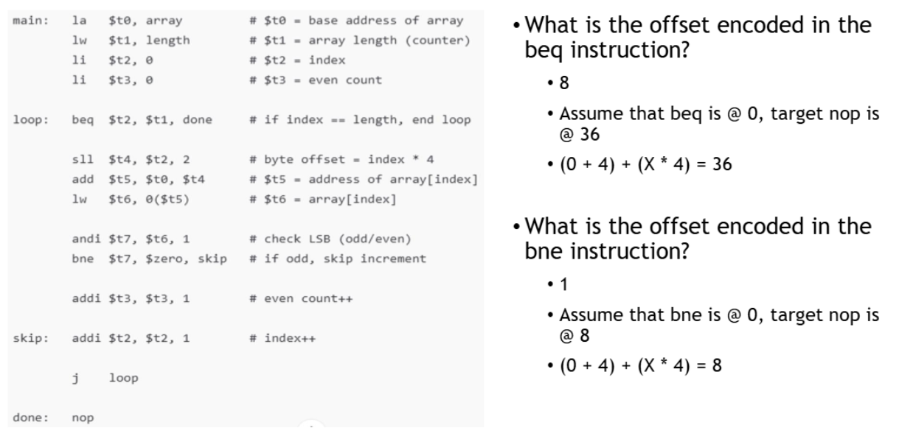
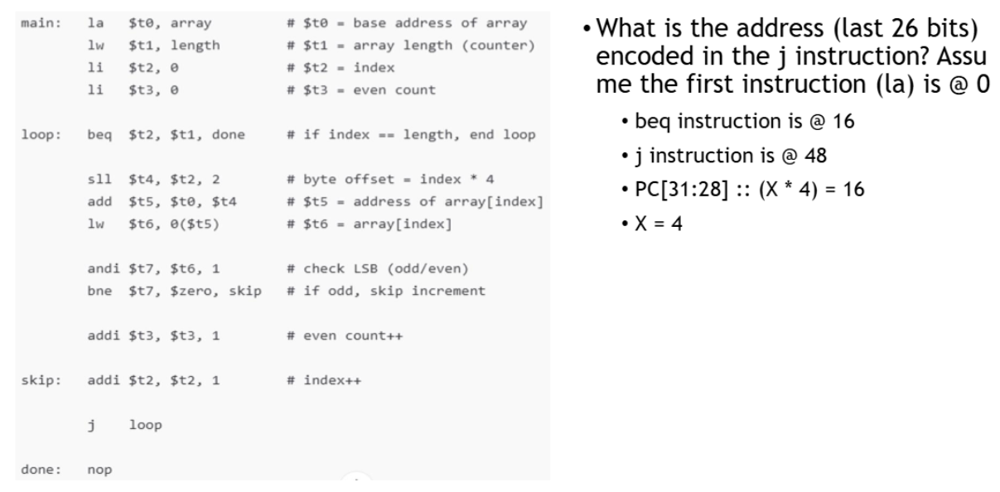

⚙ **Computer Architecture 공부**

앞에서 공부했듯이 I-type과 J-type 명령어는 표현할 수 있는 주소 범위가 제한되었었다. 

* I-type의 제한을 극복하기 위해 **<span style="color: #008000">PC-Relative Addressing</span>**을 사용
  1. 현재 **프로그램 카운터(PC) 값**에서 시작
  2. PC에 4를 더함 (다음 명령어 위치)
  3. 16비트 오프셋에 4를 곱함 (바이트 단위로 변환)
  4. 이 값을 더해 최종 목표 주소 계산

```
목표 주소 = PC + 4 + (오프셋 × 4)
```

* J-type의 제한을 극복하기 위해 **<span style="color: #008000">Pseudo-Direct Addressing</span>**을 사용
  1. PC의 **상위 4비트(31-28)**를 가져옴
  2. 명령어에 포함된 26비트 주소에 2비트 '00'을 추가 (워드 정렬을 위해)
  3. 이 두 부분을 연결(concatenate)하여 32비트 주소 생성

```
목표 주소 = PC[31:28] :: (명령어_인덱스 << 2)
```

### PC-Relative Addressing 예제
---

```
0x00400000    addi $t0, $zero, 5    # 카운터를 5로 초기화
              addi $t1, $zero, 0    # 합계 = 0
loop:         beq $t0, $zero, end   # 카운터가 0이면 루프 종료
              add $t1, $t1, $t0     # 합계에 카운터 추가
              addi $t0, $t0, -1     # 카운터 감소
              j loop                # 루프 시작으로 돌아가기
end:          nop                   # 프로그램 종료
```

✅명령어 주소:  
* `addi` @ 0x00400004
* `addi` @ 0x00400008
* `beq` @ 0x0040000C
* `add` @ 0x00400010
* `addi` @ 0x00400014
* `j` @ 0x00400018
* `nop` @ 0x0040001C

`beq` 명령어의 오프셋은 어떻게 구할까?

* beq의 PC = 0x0040000C
* Target address(end) = 0x0040001C
* Target address = (PC + 4) + (offset * 4)
* = (0x0040000C + 4) + (X × 4) = 0x0040001C
* 0x00400010 + (X × 4) = 0x0040001C
* X × 4 = 0x0040001C - 0x00400010 = 0x0000000C = 12
* **X = 3**
`beq`의 offset은 **3**

**추가 예제:**



### Pseudo-Direct Addressing 예제
---
앞의 동일한 프로그램에서 j 명령어 주소 필드 계산

```
0x00400000    addi $t0, $zero, 5    # 카운터를 5로 초기화
              addi $t1, $zero, 0    # 합계 = 0
loop:         beq $t0, $zero, end   # 카운터가 0이면 루프 종료
              add $t1, $t1, $t0     # 합계에 카운터 추가
              addi $t0, $t0, -1     # 카운터 감소
              j loop                # 루프 시작으로 돌아가기
end:          nop                   # 프로그램 종료
```

j 명령어의 주소 필드 계산:

* j 명령어의 PC = 0x00400014
* Target address(loop) =  0x00400008
* Target address = PC[31:28] :: (X * 4)
* = 0x0[31:28] :: (X × 4) = 0x00400008
* X * 4 = 0x00400008
* X = 0x00400008 ÷ 4 = 0x00100002 = 2

**추가 예제:**

