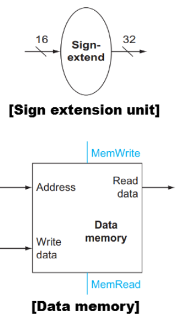

⚙ **Computer Architecture 공부**

## DataPath 요소 -Instruction Fetching
---


프로세스가 작업을 수행하려면 어떤 명령어를 실행해야 하는지 알아야 함
* **<span style="color: #008000">Instruction memory</span>**: **프로그램의 명령어들을 저장하는 memory unit**
  * **address를 input**으로 받으면, 해당 주소에 있는 **instruction을 output**으로 제공
  * → 이 output이 메모리의 일부분(**<span style="color: #008000">Text Segment</span>**)

* **<span style="color: #008000">Program Counter ,PC</span>**: **현재 실행 중인 instruction의 address를 저장하는 register**
  * 프로세서는 PC가 가리키는 address의 instruction을 실행

* **<span style="color: #008000">Adder</span>**: **PC를 증가시켜 다음 명령어의 주소를 가리키도록 하는 logic**
  * 프로세스가 한 명령어를 실행한 후, 다음 명령어로 넘어가기 위해 필요


> 명령어의 크기가 4bytes(32bits)임을 알 수 있다  
> 즉, 일반적으로 PC는 4씩 증가

✅DataPath 작동 과정:  
1. **명령어 가져오기**(**Fetch**):
  * **PC가 가리키는 주소가 명령어 메모리에 전달**됨
  * 명령어 메모리는 **해당 주소에 저장된 명령어를 출력**
2. **PC Update**
  * 동시에, PC의 값은 **Adder에 의해 4만큼 증가**
  * 증가된 값 `PC+4`는 **다음 명령어의 주소**를 나타냄 → 이 값이 다시 PC에 저장됨

### DataPath Elements: R-type
---
📚**<span style="color: #008000">R-type instruction</span>**: 두 개의 register를 읽음 → 읽은 내용에 대한 **arithmetic(산술)/logical operation**을 수행 → 결과를 register에 기록하는 명령어
* Ex: `add`, `sub`, `and`, `or`, `slt` etc

* **<span style="color: #008000">Register file</span>**: 프로세서의 `32개 범용 register collection`, CPU 내부에 있는 **매우 빠른 임시 저장소**
  * `Reading data`: 두 개의 register number 입력(`Read registers 1,2`)을 받아서 해당 레지스터의 값 출력(`Read data 1,2`)
  * `Writing data`: 쓸 레지스터 number(`Write register`)와 쓸 데이터(`Write data`)를 입력으로 받음
  * Writing은 `control signal(RegWrite)`에 의해 제어됨, 이 신호가 활성화(1)되어야 쓰기가 발생
  * **register input**은 `5bits wide`(<u>32개 레지스터를 나타내기 위함</u>), **data input/output buses**는 `32bits wide`


✅add 명령어 예시: `add $t0, $t1, $t2`  
1. 레지스터 파일은 `$t1`의 번호를 `Read register 1`로 받고, 그 값을 `Read data 1`으로 **출력**
2. 동시에, `$t2`의 번호를 `Read register 2`로 받고, 그 값을 `Read data 2`로 **출력**
3. `ALU`가 **두 값을 더함**
4. 결과는 `Write data`를 통해 레지스터 파일로 돌아오고, `$t0`의 번호는 `Write register`로 지정됨
5. `RegWrite 신호`가 **1로 설정**되어, **결과 값이 $t0에 기록됨**


#### ALU(Arithmetic Logic Unit)
**<span style="color: #008000">ALU</span>**: 다양한 arithmetic/logic operation을 수행하는 장치

##### ALU 구조 및 기능
1. **Input**
  * `two 32-bit operands`(피연산자)를 입력으로 받음
  * **Control Signal**: `4-bit control signal(ALU operation)`가 ALU가 수행할 연산을 결정
2. **Output**
  * `32-bit result(ALU result)`를 **출력으로 생성**
  * **Zeor Flag**: **결과가 0**인 경우 `1bits signal(참)`, 아닌 경우 `0bits signal(거짓)`생성


> 그림 하단 표는 4bits ALU 제어 코드 및 연산기능  
> 예를 들어 add연산이면 명령어 해독기가 `0010`을 **ALU control signal로 설정**

### DataPath Elements: Load/Store
---
**<span style="color: #008000">load/store instruction</span>**: memory address를 계산하기 위해 **base register와 명령어에 포함된 16bits offset field를 더함**
* E.g., `lw %t1, offset_value($t2)`
  * `$t2`값에 **offset_value를 더한 주소에서 데이터를 읽어** `$t1`에 저장
* E.g., `sw %t1, offset_value($t2)`
  * `$t1`값을 `$t2`값에 **offset_value를 더한 주소에 저장**

#### load/store instruction 계산 과정
1. **base register 값 읽기:**
  * `$t2`의 값을 레지스터 파일에서 읽음
2. **offset 추출:**
  * 명령어에서 16bits offset value를 추출
3. **memory address 계산:**
  * ALU가 base register값과 offset을 더해 memory address 계산
  * `$t2 + offset_value = memory address`

{:.prompt-tip}
> lw와 sw 데이터 흐름 차이에 주의!!
>

* `lw`
  * 계산된 주소의 메모리(`$t2`)에서 데이터를 읽음
  * 이 데이터를 `$t1` 레지스터에 기록
* `sw`
  * `$t1` 레지스터에서 데이터를 읽음
  * 이 데이터를 계산된 주소의 메모리(`$t2`)에 기록

✅ALU는 32bits operation을 수행하므로, `16bits offset`도 **32bits로 확장해야한다**

#### Sign Extension Unit(부호 확장 유닛)
📚**<span style="color: #008000">Sign Extension Unit</span>**: **16bits offset field를 32bits로 확장**

✅작동 방식:  
* **최상위 비트(부호 비트)가 0인 경우**: 양수 값은 앞에 0을 채움
* 최상위 비트(부호 비트)가 1인 경우: 음수 값은 앞에 1을 채움

```
0XXXXXXXXXXXXXXX → 0000000000000000 0XXXXXXXXXXXXXXX
1XXXXXXXXXXXXXXX → 1111111111111111 1XXXXXXXXXXXXXXX
```

#### Data Memory
📚**<span style="color: #008000">Data Memory</span>**: 실제 데이터를 저장하고 읽어오는 **memory unit**

* **Interface:**
  * `Address`: 계산된 메모리 주소를 입력으로 받음
  * `Read data`: 주소에서 읽은 데이터를 출력
  * `Write data`: 메모리에 기록할 데이터를 입력으로 받음
* **Control Signal:**
  * `MemRead`: 메모리 읽기 작업을 활성화하는 Control Signal
  * `MemWrite`: 메모리 쓰기 작업을 활성화하는 Control Signal



## DataPath 통합(R-type+Load/Store)
---


* **<span style="color: #008000">Mux(Multiplexers)</span>**: 여러 입력 중 하나를 선택하여 출력으로 내보내는 회로
  * `ALUSrc Mux`: ALU의 두 번째 입력이 **레지스터 파일에서 오는지(0)** 또는 **Sign Extension Unit에서 오는지(1) 선택**
  * `MemtoReg Mux`: 레지스터 파일의 쓰기 데이터가 **ALU 결과에서 오는지(0)** 또는 **데이터 메모리에서 오는지(1) 선택**

✅**Data flow control signal 정리:**  
* `ALUSrc`: ALU의 두 번째 입력 선택 (0: 레지스터 값, 1: extensioned offset)
* `MemtoReg`: 레지스터에 쓸 데이터 선택 (0: ALU 결과, 1: 메모리에서 읽은 값)
* `RegWrite`: 레지스터 파일에 쓰기 작업 활성화
* `MemRead`: 데이터 메모리 읽기 작업 활성화
* `MemWrite`: 데이터 메모리 쓰기 작업 활성화

#### `lw/sw` 명령어 실행 과정
* `lw $t1, 100($t2)`
1. 레지스터 파일에서 `$t2`의 값을 읽음
2. 명령어에서 offset(100)을 추출
3. Sign Extension Unit이 **16bits offset을 32bits로 확장**
4. ALU가 `$t2` 값과 확장된 offset을 더해 **메모리 주소를 계산**
5. **계산된 주소를 데이터 메모리의 주소 입력**으로 제공
6. `MemRead` 신호가 활성화되어 메모리 읽기 작업을 수행
7. 데이터 메모리가 해당 주소의 데이터를 출력
8. 이 데이터가 레지스터 파일의 **Write data input으로 전달**됨
9. `RegWrite` 신호가 활성화되어 데이터가 `$t1` 레지스터에 기록됨

* `sw $t1, 100($t2)`
1. 레지스터 파일에서 `$t1`(저장할 data),`$t2`(base register)의 값을 읽음
2. 명령어에서 offset(100)을 추출
3. Sign Extension Unit이 **16bits offset을 32bits로 확장**
4. ALU가 `$t2` 값과 확장된 offset을 더해 **메모리 주소를 계산**
5. 계산된 주소를 **데이터 메모리의 주소 입력**으로 제공
6. `$t1`의 값을 데이터 메모리의 **Write data input**으로 제공
7. `MemWrite` 신호가 활성화되어 `$t1`의 값이 계산된 메모리 주소에 기록됨

#### R-Type 명령어 실행 과정
* `add $t1, $t2, $t3`


**R-type 명령어 실행을 위한 Control Signal 설정**
* `ALUSrc = 0`: 레지스터 파일의 **Read data 2를 ALU의 두 번째 입력**으로 선택
* `MemtoReg = 0`: ALU 결과를 **레지스터 파일의 쓰기 데이터**로 선택

✅과정:  
1. 명령어 해독:
  * 명령어가 **R-type임을 식별**
  * 첫 번째 소스 레지스터(`$t2`), 두 번째 소스 레지스터(`$t3`), 목적지 레지스터(`$t1`)를 식별
  * ALU 연산을 `add`로 설정
2. register value 읽기:
  * 레지스터 파일에서 `$t2` 값을 `Read data 1`로 읽음
  * 레지스터 파일에서 `$t3` 값을 `Read data 2`로 읽음
3. ALU 연산:
  * `ALUSrc = 0`설정 → 두 번째 ALU 입력으로 레지스터 `Read data 2`(`$t3 값`)를 선택
  * ALU가 두 값(`Read data 1과` `Read data 2`)을 더함
  * 결과는 `ALU result`로 출력됨
4. 결과 저장:
  * `MemtoReg = 0`설정 → ALU 결과를 **레지스터 Wrtie data로 선택**
  * **RegWrite 신호가 활성화**되어 결과 값이 `$t1` 레지스터에 기록됨
  
❌R-타입 명령어 실행 중에는 다음 구성 요소들이 사용되지 않는다  
* `Sign Extension Unit`: R-Type Instruction은 **immediate value을 사용하지 않음**
* `Data Memory`: R-Type Instruction은 **메모리 접근을 수행하지 않음**

하지만 `lw/sw`는 레지스터 파일, ALU, Sign Extension Unit, 데이터 메모리 모두 사용!!