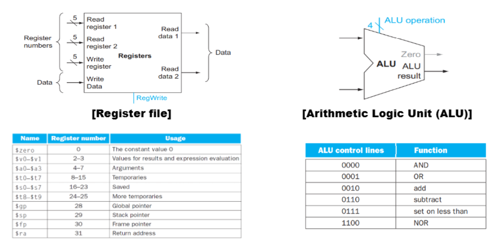
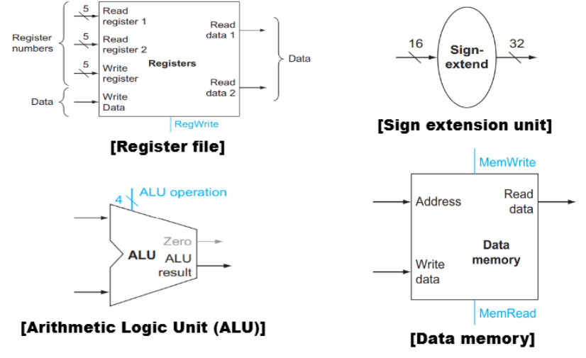
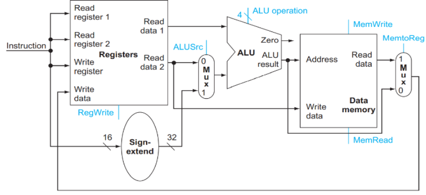
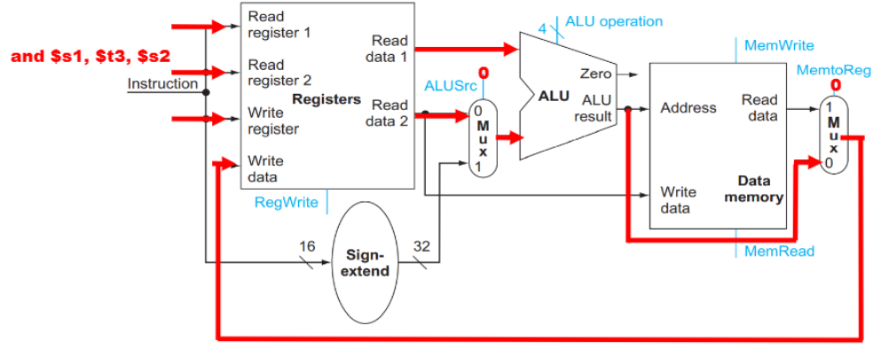
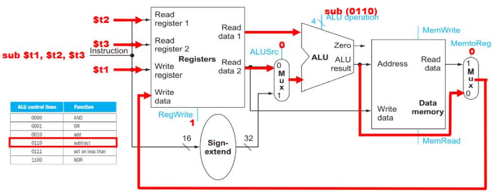
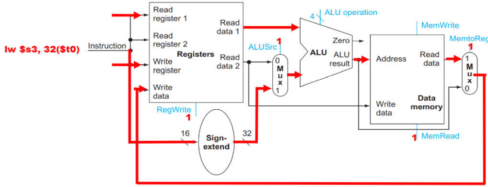
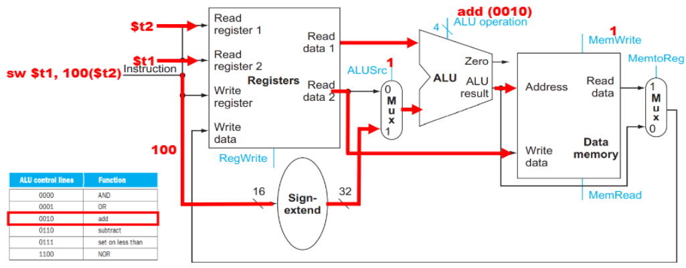

⚙ **Computer Architecture 공부**

이전 내용을 복습 및 정리해보지

## R-Type 명령어 Datapath
---

R-Type Datapath는 두 가지 구성요소로 이루어짐
1. **Register File**
  * 32개의 32bits register를 포함
  * 3개의 포트가 존재
    * `두 개의 read 포트`: **동시에 두 개의 레지스터 값을 읽을 수 있음**
    * `하나의 write 포트`: **결과를 레지스터에 저장할 수 있음**

2. **ALU**
  * 실제 연산을 수행하는 하드웨어
  * 어떤 연산을 수행할지는 **4비트 제어 신호로 결정**

## Load/Store 명령어 Datapath
---

1. **Sign Extension Unit**:
  * 명령어의 16비트 상수(`offset/immediate`)를 **32비트로 확장**
  * 최상위 비트(부호 비트)를 복제하여 16비트를 32비트로 확장
  * 음수 값을 올바르게 처리하기 위함

2. **Data Memory**:
  * **프로그램 데이터를 저장하는 메모리**
  * 포트:
    * `Address`: 메모리 위치를 지정
    * `Write data`: 저장할 데이터 값
    * `Read data`: 메모리에서 읽어온 데이터 값
  * 제어 신호:
    * `MemRead`: 메모리에서 데이터를 **읽을 때 활성화**
    * `MemWrite`: 메모리에 데이터를 **쓸 때 활성화**

## 통합 Datapath
---

1. Mux(Multiplexer):
  * **두 개 이상의 입력 중 하나를 선택**하여 출력으로 전달하는 장치
  * 선택은 `Control Signal`에 의해 결정됨
  
2. Control Signal:
  * `ALUSrc`: **ALU의 두 번째 입력을 선택**
    * `0`: 레지스터 파일의 출력(R-Type)
    * `1`: 부호 확장된 상수(load/store)

  * `MemtoReg`: **레지스터에 쓸 데이터 선택**
    * `0`: ALU 결과(R-Type)
    * `1`: 메모리에서 로드한 데이터(load)

  * `RegWrite`: 레지스터 파일에 **쓰기 작업 활성화**
    * R-Type과 load 명령어에서 `1`, store 명령어에서 `0`

  * `MemRead`: **데이터 메모리 읽기** 활성화
    * load 명령어에서만 `1`
  * `MemWrite`: **데이터 메모리 쓰기** 활성화
    * store 명령어에서만 `1`

## Execution of R-Type on the Datapath
---
#### and instruction

`and $s2, $s1, $t3`는 **R-type instruction** → Register File과 ALU만 활용

✅**실행 단계:**  
1. **명령어 해석**:
  * `Read register 1`: 첫 번째 소스 레지스터(`$s1`)
  * `Read register 2`: 두 번째 소스 레지스터(`$t3`)
  * `Write register`: 목적지 레지스터(`$s2`)

2. **레지스터 값 읽기**:
  * `Read data 1`: $s1의 값
  * `Read data 2`: $t3의 값

3. **ALU 연산**:
  * `ALUSrc = 0`: ALU의 두 번째 입력으로 **레지스터 값(Read data 2)을 선택**
  * `ALU operation = 0000`(`and` 연산): 두 값에 비트단위 `and` 연산을 수행
  * 결과가 **ALU result에 저장됨**

4. **결과 저장**:
  * `MemtoReg = 0`: 레지스터에 쓸 데이터로 **ALU 결과를 선택**
  * `RegWrite = 1`: 레지스터 파일에 **쓰기 작업을 활성화**
  * 결과가 목적지 레지스터(`$s2`)에 저장됨

R-Type instruction에서는 다음과 같은 control signal이 활성화:
* `ALUSrc = 0` (레지스터 값 사용)
* `MemtoReg = 0` (ALU 결과 선택)
* `RegWrite = 1` (레지스터 쓰기 활성화)
* `MemRead = 0` (메모리 읽기 비활성화)
* `MemWrite = 0` (메모리 쓰기 비활성화)
* `ALU operation`: (and의 경우 `0000`)

#### sub instruction

`sub $t1, $t2, $t3`는 **R-type instruction** → Register File과 ALU만 활용

✅**실행 단계:**  
1. **명령어 해석**:
  * `Read register 1`: 첫 번째 소스 레지스터(`$t2`)
  * `Read register 2`: 두 번째 소스 레지스터(`$t3`)
  * `Write register`: 목적지 레지스터(`$t1`)

2. **레지스터 값 읽기**:
  * `Read data 1`: $t2의 값
  * `Read data 2`: $t3의 값

3. **ALU 연산**:
  * `ALUSrc = 0`: ALU의 두 번째 입력으로 **레지스터 값(Read data 2)을 선택**
  * `ALU operation = 0110`(`sub` 연산): 두 값에 비트단위 `sub` 연산을 수행
  * 결과가 **ALU result에 저장됨**

4. **결과 저장**:
  * `MemtoReg = 0`: 레지스터에 쓸 데이터로 **ALU 결과를 선택**
  * `RegWrite = 1`: 레지스터 파일에 **쓰기 작업을 활성화**
  * 결과가 목적지 레지스터(`$s2`)에 저장됨

## Execution of Load on the Datapath
---
#### load instruction

`lw $s3, 32($t0)`는 **load instruction** → base register와 offset을 더해서 메모리 주소 계산 과정 추가

✅**실행 단계:**  
1. **명령어 해석**:
  * `Read register 1`: base address 레지스터(`$t0`)
  * `Immediate value`: offset(32)
  * `Write register`: 목적지 레지스터(`$s3`)

2. **base address 읽기**:
  * `Read data 1`: `$t0`의 값

3. **오프셋 부호 확장**:
  * 16bits offset을 32bits로 부호 확장
  * `Sign-extend`: 32(16bits) → 32(32bits)

4. **address 계산**:
  * `ALUSrc = 1`: ALU의 두 번째 입력으로 **부호 확장된 offset(32)을 선택**
  * `ALU operation = 0010`: **add 연산을 수행**
  * ALU에서 **base address(Read data 1, $t0의 값)와 부호 확장된 offset(32)을 더해 메모리 주소를 계산**

5. **메모리 접근**:
  * 계산된 주소를 사용하여 **Data Memory에 접근**
  * `MemRead = 1`: 데이터 메모리 **읽기 작업을 활성화**
  * 메모리에서 데이터를 읽어옴

6. **데이터 저장**:
  * `MemtoReg = 1`: 레지스터에 쓸 데이터로 **메모리에서 읽어온 데이터를 선택**
  * `RegWrite = 1`: 레지스터 파일에 **쓰기 작업을 활성화**
  * 메모리에서 읽어온 데이터가 목적지 레지스터(`$s3`)에 저장됨

load instruction에서는 다음과 같은 control signal이 활성화:
* `ALUSrc = 1` (부호 확장된 오프셋 사용)
* `MemtoReg = 1` (메모리에서 읽어온 데이터 선택)
* `RegWrite = 1` (레지스터 쓰기 활성화)
* `MemRead = 1` (메모리 읽기 활성화)
* `MemWrite = 0` (메모리 쓰기 비활성화)
* `ALU operation = 0010` (항상 덧셈 연산)

#### store instruction

`sw $t1, 100($t2)`는 **load instruction** → base register와 offset을 더해서 메모리 주소 계산 과정 추가

✅**실행 단계:**  
1. **명령어 해석**:
  * `Read register 1`: base address 레지스터(`$t2`)
  * `Immediate value`: offset(100)
  * `Write register`: 목적지 레지스터(`$t1`)

2. **레지스터 값 읽기**:
  * `Read data 1`: `$t2`의 값
  * `Read data 2`: `$t1`의 값

3. **오프셋 부호 확장**:
  * 16bits offset을 32bits로 부호 확장
  * `Sign-extend`: 32(16bits) → 32(32bits)

4. **address 계산**:
  * `ALUSrc = 1`: ALU의 두 번째 입력으로 **부호 확장된 offset(100)을 선택**
  * `ALU operation = 0010`: **add 연산을 수행**
  * ALU에서 **base address(Read data 1, $t2의 값)와 부호 확장된 offset(100)을 더해 메모리 주소를 계산**

5. **메모리에 데이터 쓰기**:
  * `Memwrite = 1`: 계산된 주소에 데이터를 쓰기를 활성화
  * 계산된 주소(ALU result)는 데이터 메모리의 Address 입력으로 전달됨
  * `$t1`의 값(Read data 2)은 데이터 메모리의 `Write data input`으로 직접 전달됨
  * `$t1` 레지스터 값이 계산된 메모리 주소(`$t2 + 100`)에 저장됨