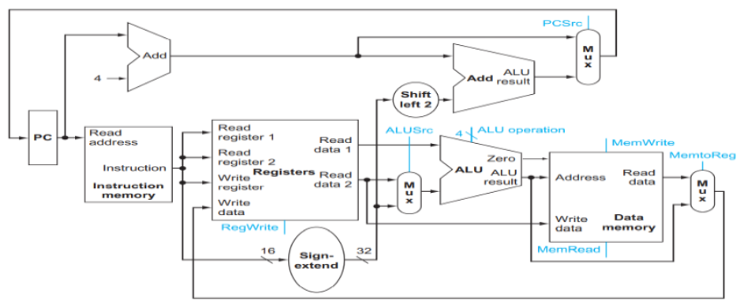
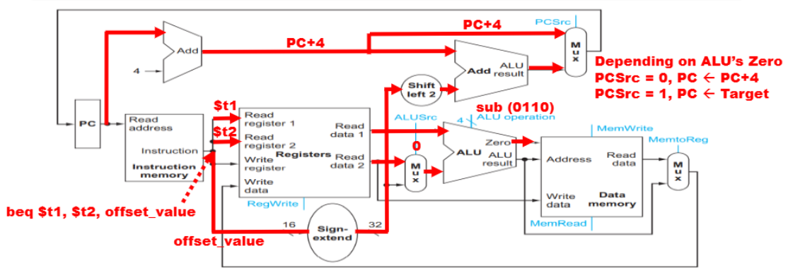

⚙ **Computer Architecture 공부**

## Branch instruction
---
**branch instruction**: 조건에 따라 PC의 값을 변경하여 다음에 실행할 명령어의 위치를 바꾸는 역할을 한다.
`beq $t1, $t2, offset_value` : $t1, $t2의 값이 같으면 PC를 현재 위치에서 offset_value만큼 이동해라

#### branch instruction의 target address 계산
branch instruction은 **PC-relative addressing**을 사용
* **target address** = `(PC+4) + (offset_value * 4)`
  * `PC+4`: 다음 명령어의 주소
  * `offset_value * 4`: 바이트 단위의 branch offset

* offset_value는 명령어에 **16bits로 인코딩**되어 있어서 이를 처리하기 위해:
  * **Sign extension**: 16bist 값을 32bits로 확장
  * **Shift left 2bits**: word 단위(4bytes)로 변환하기 위함

#### branch instruction 실행 시나리오
1. **조건이 참인 경우:**
  * branch가 **"taken"**되었다고 표현
  * `PC ← target address`(다음 명령어는 target address에서 가져옴)
2. **조건이 거짓인 경우:**
  * branch가 **"not taken"**되었다고 표현
  * `PC ← PC + 4`(다음 명령어는 순차적으로 실행)

## DataPath Elements: Branch
---
✅branch instruction을 위해 datapath에 필요한 요소:  
1. target address 계산을 위한 요소:
   * **Sign extension unit**: offset_value를 16bits에서 32bits로 확장
   * **Shift left 2 unit**: offset_value를 word 단위로 변환
   * **Adder**: `(PC + 4) + (offset_value * 4)` 계산

2. register value 비교를 위한 요소:
   * **Register file**: `$t1`과 `$t2` 값을 제공
   * **ALU**: 두 레지스터 값을 비교(`sub` 연산을 통해)
   * **ALU 연산 코드** = `0110`: `sub` 연산 수행

3. branch 결정을 위한 요소:
   * **Zero signal**: ALU 결과가 `0(두 값이 다름)` 혹은 `1(두 값이 같음)`인지 확인
   * **PCSrc control signal**: PC의 다음 값을 선택(PC+4 또는 target address)

### Execution of Branch
---

`beq $t1, $t2, offset_value` → **shift left 2 unit이 추가됨**

✅**실행 단계:**  
1. **명령어 해석**:
  * * 명령어 `beq $t1, $t2, offset_value`에서 필요한 정보 추출:
    * 두 개의 레지스터 주소: `$t1(Read register 1)`, `$t2(Read register 2)`
    * 오프셋 값: `offset_value(16bits)`

2. **두 가지 작업 병렬 수행**:
  * **target address 계산**:
    * 오프셋 값을 16비트에서 32비트로 부호 확장
    * 부호 확장된 값을 **왼쪽으로 2bits shift(word 단위 변환)**
    * PC+4와 시프트된 오프셋을 더해 타겟 주소 계산: `(PC+4) + (offset_value * 4)`
  
  * **레지스터 값 비교**:
    * 레지스터 파일에서 `$t1`과 `$t2`의 값을 읽음
    * `ALUSrc = 0`: ALU의 두 번째 입력으로 레지스터 값(`$t2`) 선택
    * `ALU operation = 0110`: 뺄셈 연산 수행(`$t1` - `$t2`)
    * 두 값이 같으면 결과가 0이 되고, ALU의 **Zero 출력이 1이 됨**

3. **분기 결정**:
  * `Zero = 1` (두 값이 같음):
    * `PCSrc = 1`: 타겟 주소가 다음 PC 값으로 선택됨
    * 다음 명령어는 타겟 주소에서 인출됨
  
  * `Zero = 0` (두 값이 다름):
    * `PCSrc = 0`: PC+4가 다음 PC 값으로 선택됨
    * 다음 명령어는 순차적으로 인출됨

4. **PC 업데이트**:
  * **선택된 주소(target address 또는 PC+4)가 PC 레지스터에 저장됨**
  * 다음 클록 사이클에서 새로운 PC 값에 따라 명령어 인출 시작

조금 더 풀어서 적어보자면
1. **명령어 인출:**
   * 주소 1000에서 `beq $t1, $t2, 5` 명령어 인출
   * PC+4 = 1004 계산

2. **타겟 주소 계산:**
   * `offset_value = 5` (16bits 표현: 0x0005)
   * 부호 확장: `0x00000005` (32bits)
   * 왼쪽 시프트: `0x00000014` (십진수로 20)
   * 타겟 주소 = `1004 + 20 = 1024 (0x400)`

3. **조건 평가:**
   * $t1 = 25, $t2 = 25 읽기
   * ALU 연산: 25 - 25 = 0
   * `Zero = 1` (두 값이 같음)
   * `Branch = 1` (beq 명령어)
   * `PCSrc = 1 AND 1 = 1`

4. **PC 업데이트:**
   * `PCSrc = 1`이므로 `PC ← 1024`
   * 다음 명령어는 **주소 1024에서 인출**됨

* 만약 $t1 = 25, $t2 = 30이었다면:
  * ALU 연산: 25 - 30 = -5
  * `Zero = 0` (두 값이 다름)
  * `PCSrc = 1 AND 0 = 0`
  * `PC ← 1004 (PC+4)`
  * 다음 명령어는 **순차적**으로 주소 1004에서 인출됨