>📚컴퓨터 네트워크 전공 수업 정리

## Network Layer
---
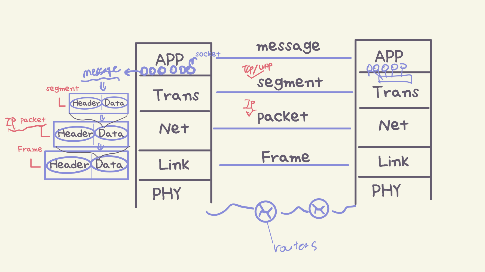

📚**NewworkLayer**: 데이터의 경로 설정과 전달을 담당
  
* **핵심기능:**
1. `sending host`에서 `receiving host`로 **trasport segment** 전달
2. sending 측에서 segment를 datagram으로 **캡슐화**
3. receiving 측에서 segment를 **transport layer**로 전달
4. 모든 호스트와 router에서 **network layer protocol** 실행
5. router가 모든 **IP datagram**의 헤더 필드 검사

### Netwrok의 two key functions
---
#### 1. Routing
📚**Routing**: 출발지에서 목적지까지의 **경로를 결정**하는 과정
* 여행을 계획할 때 출발지에서 목적지까지의 전체 경로를 계획하는 것과 같음

#### 2. Forwarding
📚**Forwarding**: 라우터가 **입력 포트에서 적절한 출력 포트로 패킷을 이동**시키는 과정
* 여행 중 각 교차로에서 어느 방향으로 갈지 결정하는 것과 같음

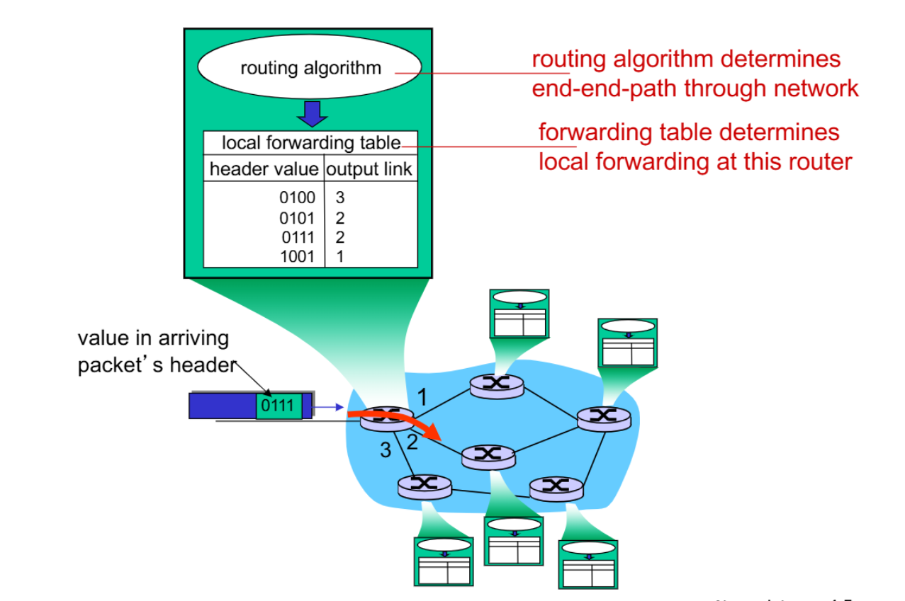

* **Routing algorithm**을 통해 최적의 경로로 **forwarding table**을 만듦
* **forwarding table**을 통해 **output link로 패킷 전송**
  * 하지만 유실 가능성은 존재!

{:.prompt-warning}
> 실제 인터넷에는 약 40억 개의 IP 주소가 존재 → 만약 각각의 목적지 주소마다 개별 엔트리를 만든다면 포워딩 테이블이 너무 커져서 비효율적!
>

* 그래서 각 엔트리에 전체 주소가 아닌 **Address range**를 사용한다

### Address Range Aggregation
---
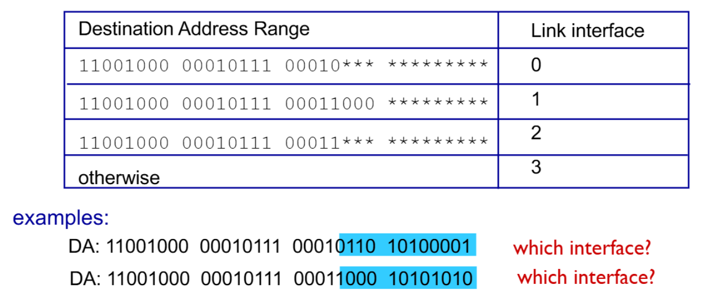

* 개별 주소 대신 **주소 범위**를 사용
* **여러 목적지를 하나의 entry로 통합** → table size를 대폭 감소

위의 table 예시에서 여러 엔트리에 목적지 주소가 매칭될 경우가 존재함

✅**가장 길게 매칭되는 엔트리를 찾아서 선택**!  

* **Longest Prefix Matching**
  * 목적지 주소와 각 테이블 엔트리의 prefix를 비교
  * 여러 매칭이 발견되면 **longest prefix matching**을 선택
  * 해당하는 출력 인터페이스로 패킷 전송

* **예시:**
* `DA: 11001000 00010111 00010110 10100001`
* 매칭 가능한 entrys:
  * `11001000 00010111 00010*** ********` (21bits 매칭)
  * `11001000 00010111 00011*** ********` (20bits 매칭)
* 21bits가 더 길므로 첫 번째 엔트리 선택 → **interface 0**

## ⭐IP(Internet Protocol)
---
#### IP datagram format
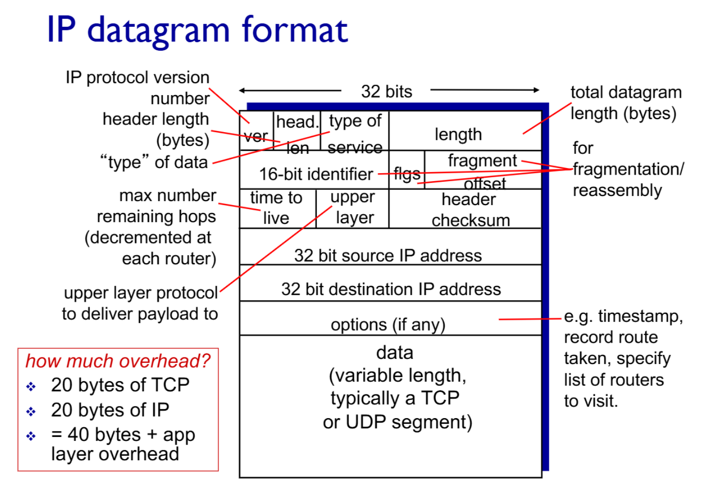
> IP datagram format

1. **기본 정보 필드**
* `ver`: IP protocol version (IPv4 = 4 / IPv6 = 6)
* `header length`: 헤더의 길이(4bytes)
  * 데이터 한 줄이 32bits(4bytes)이므로 `5줄 * 4bytes = 20bytes`가 기본 IP header 길이
* `type of service`: IP data type을 표시.
* `length`: 전체 데이터의 길이(bytes) = `header + data`

2. **분할/재조립 필드**
* `16-bit identifier`: 분할된 패킷들의 원본 식별자
* `flags` : 분할 제어
* `fragment offset`: 분할된 데이터의 원본 위치

4. **네트워크 제어 필드**
* `time to live(TTL)`: 패킷 생존 시간(hop 수). data가 라우터에서 무한히 존재하는 것을 방지
  * **hop**: 라우터를 하나 건너가는 행위
  * ex: 처음에 200개의 hop을 할당 → 데이터가 라우터를 건널때 마다 TTL필드 값이 줄어듦 → TTL=0이 되면 데이터의 수명이 다한 것으로 간주 → 라우터에서 해당 데이터를 제거 → 해당 데이터가 출발한 곳에 어떤 라우터에서 제거되었다고 알려줌
* `upper layer`: upper layer(=Transport layer) protocol(TCP/UDP) 식별
* `header checksum`: transport layer에서 받은 데이터의 header 오류 검출

5. **주소 필드**
* 가장 중요한 필드
* `32 bit source IP address`: 출발지 IP 주소
* `32 bit destination IP address`: 목적지 IP 주소

* `option`: 추가적인 정보 저장(없을 수도 있음)

각 필드별 자세한건 차차 알아보자

**IP data에는 TCP or UDP로 부터 받은 segment가 있고** 거기에 네트워크 layer header가 덧붙여진다
그 때문에 네트워크 패킷에는 오버헤드가 존재
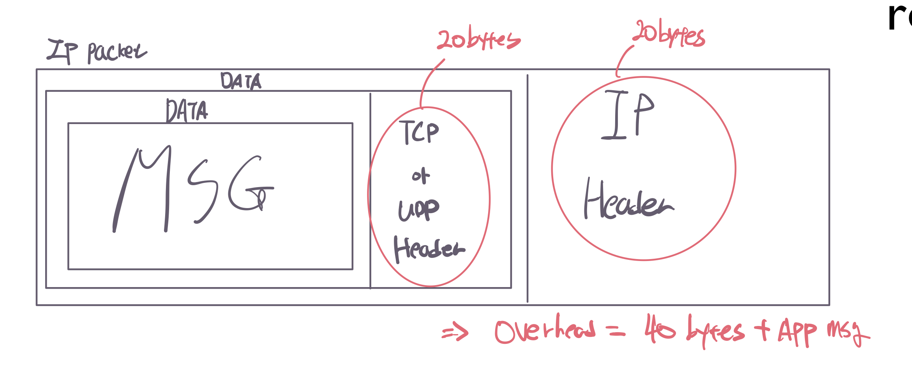

* **Total overhead**: **40bytes**(`IP 20bytes + TCP 20bytes`) + **app msg**

위에서 본 IP datagram format에서 가장 중요한 source/destination IP address에 대해 알아보자

### IPv4 addressing
---
📚**IP address**: **32-bit unique number**로, **호스트나 라우터의 interface를 식별**

* dotted-quad notation으로 표현됨
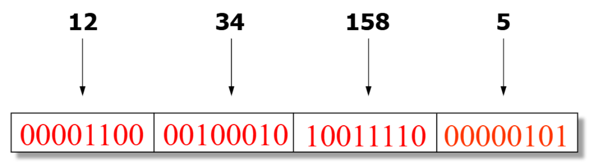
> `12.34.158.5`

그럼 어떤 방식으로 IP 주소를 배정할까??

#### Grouping Related Hosts
---
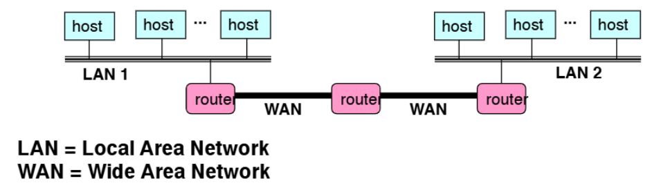
> 인터넷은 개별 호스트가 아닌 네트워크들이 연결되어 있는 모습이다

❌**호스트마다 임의의 주소를 할당한 경우**
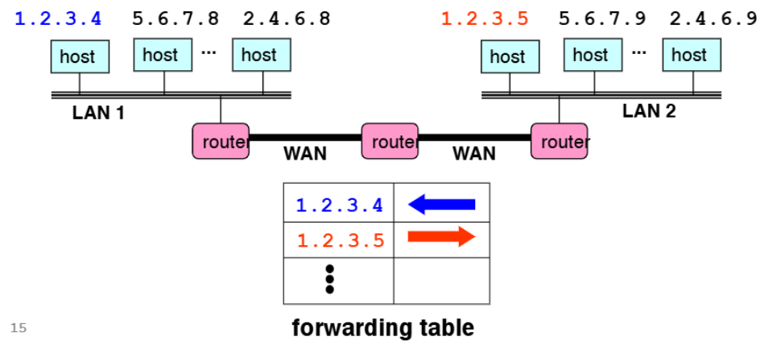

* 라우터가 모든 개별 호스트 정보 저장 필요
* forwarding table의 크기가 엄청나게 커짐!(전 세계 호스트의 수)

{:.prompt-tip}
> 주소를 계층구조로 만들자!!
>

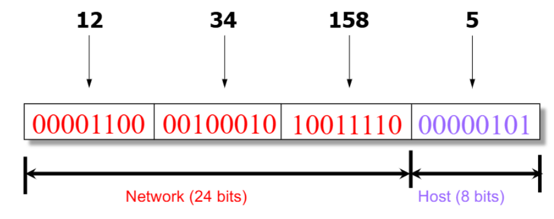

* IP address를 **네트워크 부분 + 호스트 부분**으로 분할
* 같은 **subnet**의 호스트들을 그룹화
* 라우터는 네트워크 단위로만 경로를 관리

##### Subnet Mask
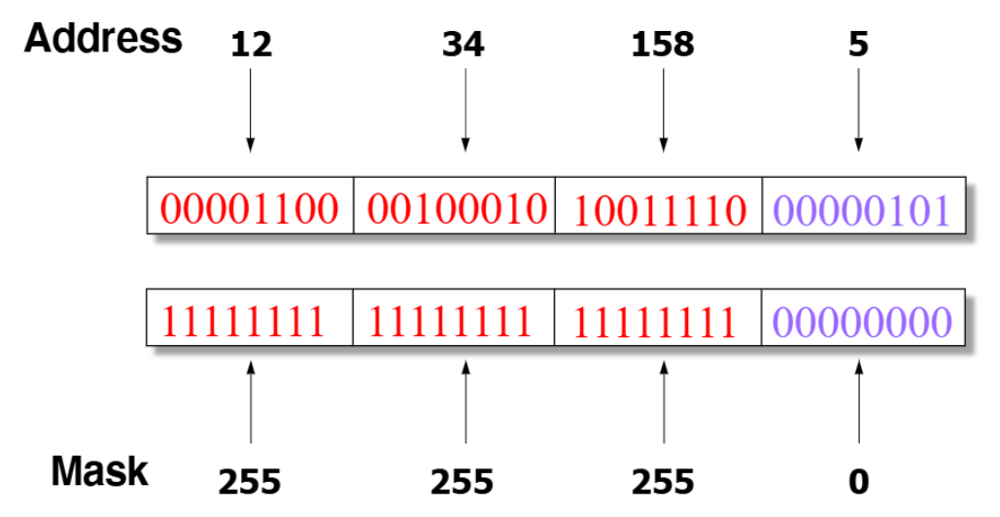

📚**Subnet mask**: IP 주소에서 **네트워크 부분과 호스트 부분을 구분하기 위한 32bit 값**

* IP 주소와 Subnet mask를 준비하고 AND 연산을 수행해서 네트워크 주소를 얻어냄

#### Scalability Improved
---
이제 개별 호스트마다 IP주소를 주고 관리할 필요 없이 네트워크 단위로 관리가 가능해졌다!

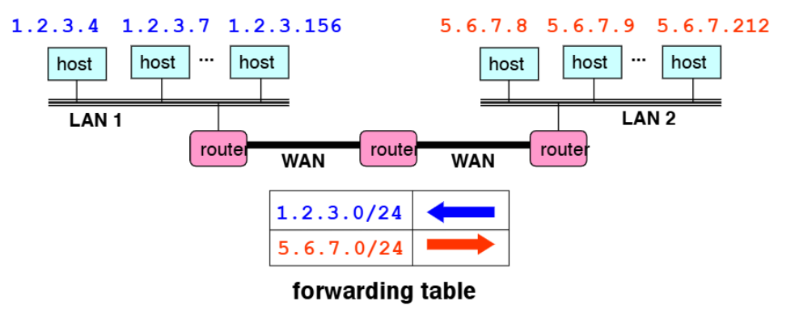
> 만약 `5.6.7.213` 호스트 추가 시 기존 `5.6.7.0/24` 경로를 활용하면 됨  
> 즉, forwading table 엔트리 추가(라우터 업데이트) 불필요