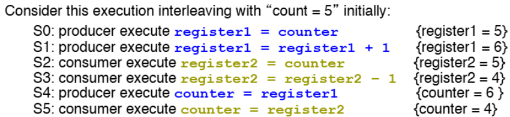
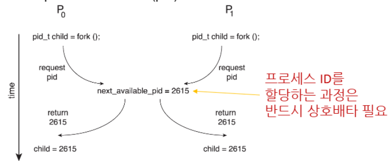
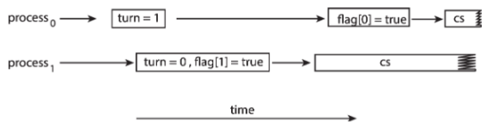
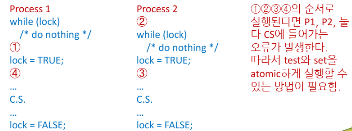

>🍀 운영체제 전공 수업 정리

프로세스들이 동시에 실행되면서 생기는 문제가 있다

{:.prompt-warning}
> 여러 프로세스가 공유 데이터에 접근할 떄 데이터 불일치 문제가 발생한다
>

그래서 데이터의 일관성을 위해서는 **olderly execution**을 보장하는 메커니즘이 필요

이에 대한 예시로 `Producer-Consumer Problem`이 있다

### Producer-Consumer Problem
* `Producer`: 데이터를 생산해서 버퍼에 저장
* `Consumer`: 버퍼에서 데이터를 가져와 사용
* 버퍼는 한정된 크기, 가득 찼을 때 생산자는 대기해야하고, 비어있을 때 소비자는 대기
* `counter`변수: 현재 버퍼에 있는 아이템의 수를 추적

##### Producer code
```c
while (true) {
    /* produce an item in next_produced */
    
    while (counter == BUFFER_SIZE)
        ; /* do nothing */ // "busy waiting"
    
    buffer[in] = next_produced;
    in = (in + 1) % BUFFER_SIZE;
    counter++;
}
```

* 생산자는 버퍼가 가득 찼는지 확인하고(counter == BUFFER_SIZE), 가득 찼다면 대기
* 공간이 있으면 아이템을 버퍼에 추가하고, in 포인터를 다음 위치로 이동

##### Consumer code
```c
while (true) {
    while (counter == 0)
        ; /* do nothing */ // "busy waiting"
    
    next_consumed = buffer[out];
    out = (out + 1) % BUFFER_SIZE;
    counter--;
    
    /* consume the item in next_consumed */
}
```

## Race Condition
---
📚**<span style="color: #008000">Race Condition</span>**: 두 개 이상의 프로세스가 **동시에 공유 데이터에 접근**하려고 할 때, **접근 순서에 따라 실행 결과가 달라질 수 있는 상황**  
→ 이로 인해 데이터 불일치 발생!

#### counter 예시
`counter++`와 `counter--`는 실제로 원자적이지 않다. 기계어로 번역하면 다음과 같다.

* `counter++`:

```
load:   register1 = counter
inc:    register1 = register1 + 1
store:  counter = register1
```

* `counter--`:

```
load:   register2 = counter
dec:    register2 = register2 - 1
store:  counter = register2
```


> 정상결과는 5이어야함  
> 하지만 이 두 명령어는 동시에 실행되기 때문에 데이터 불일치가 발생!

#### fork() 예시
* 프로세스 P0, P1이 `fork()`로 자식 프로세스를 생성했을 때, 동시에 호출하게 되면 동일한 PID를 받게 된다
* 이는 **동일한 PID가 두 개의 서로 다른 프로세스에 할당되는 문제**를 발생한다.


* 이러한 문제는 **mutual exclusion(상호배제)**이 필요하다

## Critical Section
---
📚**<span style="color: #008000">Critical Section</span>**: 여러 프로세스가 **공유하는 데이터나 자원에 접근하는 코드 영역**(접근만이 아니라 사용해야함)
* 이 영역에서는 한 번에 하나의 프로세스만 실행됨
* `Critial Section`에서 프로세스는 **공유 변수 변경, 테이블 업데이트, 파일 쓰기 등의 작업을 수행**

✅**프로세스의 일반적인 구조**:  

```
do {
    entry section       // 진입 영역
    critical section    // 임계 영역
    exit section        // 퇴출 영역
    remainder section   // 나머지 영역
} while (true);
```

* `entry section`: **critical section에 들어가기 위한 허가를 요청**하는 부분
* `critical section`: **공유 자원에 접근**하는 부분
* `exit section`: **임계영역 벗어날 때 실행**되는 부분
* `remainder section`: 그 외 나머지 코드 부분

### Critical Section solution
---
1. **<span style="color: #008000">Mutual Exclusion</span>**
   * 한 프로세스가 임계영역에서 실행 중이면, 다른 어떤 프로세스도 임계영역에서 실행 X

2. **<span style="color: #008000">Progress</span>**
   * 임계영역에서 실행 중인 프로세스가 없고, 몇몇 프로세스들이 임계영역에 들어가길 원한다면, 다음에 어떤 프로세스가 임계영역에 들어갈지 결정하는 것이 무한정 연기되어서는 안 되게끔 해야함

3. **<span style="color: #008000">Bounded Waiting</span>**
   * 프로세스가 임계영역에 들어가기 위한 요청을 한 후, 그 요청이 허용되기 전에 다른 프로세스들이 임계영역에 들어갈 수 있는 횟수에 한계가 있어야함
   * **starvation(기아 현상)을 방지**하기 위함

### Critical Section Handling in OS
---
운영체제에서 임계영역을 처리하는 방법은 커널이 **선점형(preemptive)인지 비선점형(non-preemptive)인지에 따라 다르다**.

* **Preemptive Kernel**
  * 프로세스가 커널 모드에서 실행 중일 때도 프로세스를 preemptive 가능
  * 즉, **높은 우선순위의 프로세스가 현재 실행 중인 프로세스를 중단시키고 CPU를 차지할 수 있다**
  * **단점**: SMP(Symmetric Multi-Processing) 아키텍처에서 설계하기 어렵다

* **Non-preemptive Kernel**
  * 프로세스가 커널 모드를 빠져나가거나, 블록 또는 자발적으로 CPU를 양보할 때까지 실행 된다.
  * 커널 모드에서 실직적인 **race condition**이 없다.
  * **단점**: 실시간 프로그래밍에 적합하지 않음

**단일 코어 시스템**에서는 `interrupt disabling`을 사용해서 **critical section을 보호할 수 있다**.  
→ 하지만 `다중코어/프로세스` 에서는 효율성이 떨어져서 쓰지 않는다.
* 그래서 **preemptive kernel을 선호!!**

### Peterson's Solution
---
📚**<span style="color: #008000">Peterson's Solution</span>**: 임계영역 문제를 해결하는 대표적인 알고리즘
* 현대 아키텍처에서는 별로이지만, 알고리즘적 접근법으로는 훌륭함

✅**주요 특징**:  
* 두 개 프로세스를 대상
* 기계어 `load`, `store` 명령이 **atomic**이라고 가정
  * **<span style="color: #008000">atomic</span>**: 바뀌지 않는 성질
* 두 개의 프로세스는 **두 개의 변수를 공유**:
  * `int turn`: 어떤 프로세스의 차례인지
  * `boolean flag[2]`: 각 프로세스가 임계영역에 들어갈 준비가 되었는지

✅**알고리즘 구현:**

```c
while (true) {
    flag[i] = true;       // 나 임계영역에 들어갈 준비가 됐어
    turn = j;             // 상대방에게 차례를 양보해
    while (flag[j] && turn == j)
        ;                 // 상대방이 준비되어 있고, 상대방 차례면 대기
    
    /* critical section */ // 임계영역
    
    flag[i] = false;      // 임계영역 사용 완료
    
    /* remainder section */ // 나머지 영역
}
```

1. `flag[i]=true`로 설정해서 임계영역에 들어가고 싶다고 표시
2. `turn` 변수를 상대방 프로세스 번호 `j`로 설정하여 "앙보"
3. 이후 상대방의 플래그 `flag[j] == true`이고 `turn==j`이면 대기
4. 임계영역을 실행한 후에는 자신의 플래그 `flag[i] == false`로 설정하여 임계영역 사용이 끝났음을 표시

{:.prompt-warning}
> 현대 아키텍쳐에서는 제대로 작동X  
>

프로세서나 컴파일러는 성능향상을 위해 의존성 없는 연산들의 순서를 재배치함  
→ **instruction reordering 문제 발생**
단일스레드에서는 괜찮지만 다중스레드에서 문제 발생

#### instruction reordering 예시
```c
flag[i] = true;
turn = j;
```

피터슨 알고리즘에 위와 같은 코드가 존재
컴파일러나 프로세서가 두 명령어의 순서를 바꾸면:

```c
turn = j;
flag[i] = true;
```

이렇게 되면 다음과 같은 상황이 발생할 수 있다


1. 프로세스 P0: `turn = 1` 실행 후 `flag[0] = true` 실행
2. 프로세스 P1: `turn = 0` 실행 후 `flag[1] = true` 실행

결과적으로 `flag[0] = true, flag[1] = true, turn = 0`이 되어 P0는 **while 조건을 통과**하고, P1도 turn = 0이므로 **while 조건을 통과**함
즉, **두 프로세스가 동시에 critical section에 진입하는 상호 배제 위반이 발생**

## Synchronization Hardware
---
그럼 software측면에서의 cs문제 해결 방안말고 hardware적 해결책을 알아보자

CS문제를 해결하기위해 현대 컴퓨터는 다양한 하드웨어 동기화 기법을 제공함

✅**그 이유 - uniprocessors 시스템의 한계**  
* 단일 프로세서 시스템에서는 <span style="color: #008000">disable interrupts</span> 방식으로 cs를 보호할 수 있다.
* 현재 실행 중인 코드는 **preemption 없이** 실행됨
* 하지만 이 방식은 **다중 프로세서 시스템에서는 비효율적**!
* 또한 **확장성(scalability)**이 떨어짐

##### 하드웨어 지원의 3가지 형태:
1. **Memory barriers**
2. **Hardware instructions**
3. **Atomic variables**

### Memory Barriers
---
📚**<span style="color: #008000">Memory Barriers</span>**: 다중 프로세서 환경에서 **메모리 연산의 순서를 보장**하기 위한 메커니즘
##### Memory Model
* **<span style="color: #008000">Memory Model</span>**: 컴퓨터 아키텍처가 응용 프로그램에 제공하는 **메모리 보장(memory guarantees)을 의미**

✅Memory model은 2가지로 나뉨:  
1. **Strongly ordered**: 한 프로세스에서 값 변경이 완료될 때 다른 프로세서에 즉시 보임
2. **Wekly ordered**: 값 변경이 완료되기 전에라도 현재 상태를 보여줌, 즉 바로 보이지 않을 수도 있음

* **<span style="color: #008000">Memory barrier</span>**: 메모리의 변경사항이 **모든 프로세서에 전파**(**propagated**)되도록 강제하는 명령어(=**memory fence**)
  * **현재 진행 중인 load와 store가 완료된 후에 새로운 load와 store가 수행**되도록 함

* memory barrier 활용 예제  

```c
// 공유 데이터
boolean flag = false;
int x = 0;

// 스레드 1
while (!flag)
    memory_barrier();  // x 값이 로딩되기 전에 flag 값이 로딩되는 것을 보장
print x;

// 스레드 2
x = 100;
memory_barrier();  // x = 100이 flag = true보다 먼저 완료되는 것을 보장
flag = true;
```

* **memory_barrier**는 **"x 값이 로딩되기 전에 flag 값이 로딩되는 것을 보장"**
* `x = 100`이 `flag = true`보다 먼저 완료되는 것을 보장
* **Memory barrier**는 very low-level operation으로 **커널 개발자가 mutual exclusion 코드를 특별히 작성할 때만 사용**

### Hardware Instruction
---
📚**<span style="color: #008000">Hardware Instruction</span>**: cs문제를 해결하기 위한 **special hardware instructions**


✅**특징**:  
* **원자적 실행 보장**: 명령어가 실행되는 동안 **인터럽트 불가**(uninterrupt)
* **워드 내용을 테스트하고 수정하거나, 내용 교환 가능**(test,modify,swap)
* 현대 프로세서에서 널리 지원됨

대표적으로 3가지 명령어가 존재:
1. **<span style="color: #008000">Test-and-Set instruction</span>**
2. **<span style="color: #008000">Compare-and-Swap instruction</span>**
3. **<span style="color: #008000">Compare-and-Exchange instruction</span>**

#### Test-and-Set instruction
* **<span style="color: #008000">Test-and-Set instruction</span>**: 변수의 값을 **테스트하고 설정하는 연산을 원자적으로 수행**

```c
boolean test_and_set(boolean *target) {
    boolean rv = *target;
    *target = true; //target을 TRUE로 설정
    return rv; // 설정 전 target값을 return
}
```

✅**특징:**  
1. **원자적으로(atomically)** 실행됨
2. 전달된 매개변수의 **원래 값을 return**
3. 매개변수의 값을 **true로 설정**

##### Test-and-Set을 이용한 critical section 해결책
```c
// 공유 boolean 변수 lock, 초기값은 false
do {
    while (test_and_set(&lock)) //spin lock
        ; /* 바쁜 대기 (busy waiting) */
    
    /* critical section */
    
    lock = false;
    
    /* remainder section */
} while (true);
```

* `test_and_set(&lock)`: **lock의 현재 값을 return**, **lock을 true로 설정**
* **return값이 true**: 다른 프로세스가 이미 cs영역에 있다는 의미 → 대기함
* **return값이 false**: CS에 아무도 없다는 의미, lock을 이미 TRUE로 만들었기 때문에 다른 프로세스가 CS에 들어오지 못함. 따라서 자신이 CS에 들어감
* cs를 빠져나올 때 **lock을 false로 설정** → 다른 프로세스 cs 진입 가능

이 방식은 **<span style="color: #008000">스핀 락(spin lock)</span>**이라고도 불리며, 프로세스가 락을 획득할 때까지 계속 CPU를 사용하며 대기하기 때문에 **CPU 자원을 낭비할 수 있음**

#### Compare-and-Swap instruction
* **<span style="color: #008000">Compare-and-Swap instruction</span>**: 메모리 위치의 내용과 주어진 값을 **비교**하고, **같으면 새 값으로 교체**
```c
int compare_and_swap(int *value, int expected, int new_value) {
    int temp = *value;
    if (*value == expected)
        *value = new_value;
    return temp;
}
```

✅**특징**:  
1. 원자적으로(atomically) 실행됨
2. value 매개변수의 **원래 값을 return**
3. value가 expected 값과 같을 때만 **value를 new_value로 설정**

##### Compare-and-Swap을 이용한 critical section 해결책:
```c
// 공유 int 변수 lock, 초기값은 0
while (true) {
    while (compare_and_swap(&lock, 0, 1) != 0) //spin lock
        ; /* 바쁜 대기 (busy waiting) */
    
    /* critical section */
    
    lock = 0;
    
    /* remainder section */
}
```

* `compare_and_swap(&lock, 0, 1)`: lock의 값이 **0이면 1로 변경하고 원래 값(0)을 반환**
* lock의 값이 0이 아니면 **값을 변경하지 않고 현재 값(1)을 반환**
* 반환값이 0이 아니면 다른 프로세스가 이미 임계영역에 있으므로 대기
* 반환값이 0이면 임계영역에 들어감

#### Compare-and-Exchange intruction
**<span style="color: #008000">Compare-and-Exchange instruction</span>** :  Compare-and-Swap의 확장된 버전, **값이 일치하지 않을 경우 예상 값을 업데이트**
```c
bool compare_and_exchange(int *value, int *expected, int new_value) {
    if (*value == *expected) {
        *value = new_value;
        return true;
    } else {
        *expected = *value;
        return false;
    }
}
```

✅**특징**:  
1. 원자적으로(atomically) 실행됨
2. value가 expected 값과 **같으면 value를 new_value로 설정하고 true 반환**
3. 일치하지 않으면 **expected를 value의 실제 값으로 업데이트하고 false 반환**

##### Compare-and-Exchange를 이용한 임계영역 해결책
```c
// 공유 int 변수 lock, 초기값은 0
while (true) {
    expected = 0;
    while (!compare_and_exchange(&lock, &expected, 1)) //spin lock
        expected = 0;
    
    /* critical section */
    
    lock = 0;
    
    /* remainder section */
}
```

{:.prompt-warning}
> 앞의 알고리즘들은 starvation을 방지 못할 수도 있다!!
>

이를 해결하기 위해 **Compare-and-Swap을 사용해서 bounded-waiting을 보장하는 알고리즘**이 있다.

#### Bounded-waiting Mutual Exclusion with CAS
```c
while (true) {
    waiting[i] = true;
    key = 1;
    while (waiting[i] && key == 1)
        key = compare_and_swap(&lock, 0, 1);
    
    waiting[i] = false;
    
    /* critical section */
    
    j = (i + 1) % n;
    while ((j != i) && !waiting[j])
        j = (j + 1) % n;
    
    if (j == i) // 아무도 기다리는 프로세스가 없다는 뜻
        lock = 0; // lock을 푼다
    else
        //cs에 들어가기를 기다리는 프로세스가 있어서 lock을 건 상태에서 들어가도록 함
        waiting[j] = false; 
    
    /* remainder section */
}
```

* `waiting[i] = true`: 프로세스 i가 임계영역에 들어가기를 기다리고 있음을 표시
* `key = compare_and_swap(&lock, 0, 1)`을 통해 lock을 획득하려고 시도
  * `key=1`: lock이 걸려있음(누군가 cs에 있음)
  * `key=0`: cs진입 가능
* **임계영역을 나올 때**, 대기 중인 다음 프로세스를 찾아 **waiting 상태를 false로 바꿔줌**
* 대기 중인 프로세스가 없으면 **lock을 0으로 설정**

이 알고리즘은 **대기 중인 프로세스들이 순서대로 임계영역에 접근할 수 있도록 보장**

### Atomic Variables
---
📚**<span style="color: #008000">Atomic Variables</span>**: 인터럽트 없이 원자적으로(atomically) 업데이트할 수 있는 특별한 데이터 타입, CAS 같은 하드웨어 명령어를 기반으로 구현됨

✅**특징:**:  
* `integer`, `boolean` 같은 **basic data type에 대한 원자적 연산 제공**
* 여러 스레드/프로세스가 동시에 접근해도 일관성 있는 결과 보장

#### atomic variable 주요 연산
1. 읽기/쓰기 연산
* `load()`: 원자적 변수의 현재 값을 읽음
* `store(val)`: 원자적 변수에 값을 씀

2. 증가/감소 연산
* `increment()`: 원자적 변수의 값을 1 증가시킴
* `decrement()`: 원자적 변수의 값을 1 감소시킴
* `fetch_add(val)`: 현재 값에 val을 더하고 이전 값을 반환
* `fetch_sub(val)`: 현재 값에서 val을 빼고 이전 값을 반환

3. 비교 및 교환 연산
* `compare_exchange_strong(expected, desired)`:
  * 현재 값이 expected와 같으면 desired로 변경하고 true 반환
  * 다르면 expected를 현재 값으로 업데이트하고 false 반환
* `compare_exchange_weak(expected, desired)`:
  * strong 버전과 유사하지만 하드웨어 제한으로 인해 "거짓 실패"가 발생할 수 있음
  * 일부 플랫폼에서 더 효율적이지만, 일반적으로 루프 내에서 사용됨

#### Increment func 구현
```c
void increment(atomic_int *v) {
    int temp = *v;
    while (!compare_and_exchange(v, &temp, temp+1));
}
```

1. 현재 값 `v`를 임시 변수 `temp`에 저장
2. `compare_and_exchange`를 사용 → 현재 값이 `temp`와 같은지 확인, 같다면 값을 `temp+1`로 업데이트
3. 성공하면 루프 종료
4. 실패하면(다른 스레드가 값을 변경했다면) `compare_and_exchange`는 temp를 **현재 값으로 업데이트**하고, **루프가 다시 실행**

#### Atomic_Compare&Exchange(C11)
* `atomic_compare_exchange_strong(object, expected, desired)`:
  * if `object == expected` → `object ← desired`, true return
  * if `object != expected` → `expected ← object`, false return
  * 거짓 실패 발생 X

* `atomic_compare_exchange_weak(object, expected, desired)`:
  * strong과 동작은 같지만 `object == expected`에서 false를 리턴할 가능성이 있음(거짓 실패)
  * 하지만 발생 확률이 낮고 상대적으로 빠르기 때문에 **거짓 판단이 크게 중요치 않은 while문에 사용**

strong/weak 예시:  
```c++
atomic_int lock = 0;
int expected = 0;

// Strong 버전: if문 안에서 사용할 때 적합
if (atomic_compare_exchange_strong(&lock, &expected, 1)) {
    // 임계영역 진입 성공
}

// Weak 버전: while 루프 안에서 사용할 때 적합
while (!atomic_compare_exchange_weak(&lock, &expected, 1)) {
    expected = 0;  // 실패 시 expected 값 재설정
}
```