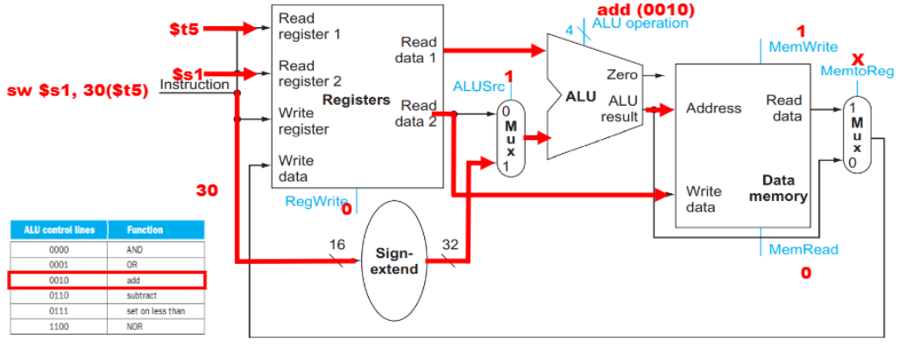

⚙ **Computer Architecture 공부**

## Execution of Store
---

`sw $s1, 30($t5)` → $s1 레지스터의 값을 $t5 레지스터의 값에 30을 더한 메모리 주소에 저장

✅**실행 단계:**  
1. **명령어 해석**:
  * `Read register 1`: base address 레지스터(`$t5`)
  * `Immediate value`: offset(30)
  * `Write register`: 목적지 레지스터(`$s1`)

2. **레지스터 값 읽기**:
  * `Read data 1`: `$t5`의 값
  * `Read data 2`: `$s1`의 값

3. **오프셋 부호 확장**:
  * 16bits offset을 32bits로 부호 확장
  * `Sign-extend`: 32(16bits) → 32(32bits)

4. **address 계산**:
  * `ALUSrc = 1`: ALU의 두 번째 입력으로 **부호 확장된 offset(30)을 선택**
  * `ALU operation = 0010`: **add 연산을 수행**
  * ALU에서 **base address(Read data 1, $t5의 값)와 부호 확장된 offset(30)을 더해 메모리 주소를 계산**

5. **메모리에 데이터 쓰기**:
  * `Memwrite = 1`: 계산된 주소에 데이터를 쓰기를 활성화
  * 계산된 주소(ALU result)는 데이터 메모리의 Address 입력으로 전달됨
  * `$s1`의 값(Read data 2)은 데이터 메모리의 `Write data input`으로 직접 전달됨
  * `$s1` 레지스터 값이 계산된 메모리 주소(`$t5 + 30`)에 저장됨

📝**정리:**  
1. Rs, Rt, offset
* `Rs(Source Register)`: `$t5` - 메모리 주소의 기본값을 제공하는 레지스터
* `Rt (Target Register)`: `$s1` - 메모리에 저장할 데이터를 포함하는 레지스터
* `Offset`: `30` - 메모리 주소 계산에 사용되는 상수값

2. ALUSrc? ALU operation?
* `ALUSrc: 1` - ALU의 두 번째 입력으로 **부호 확장된 상수(30)를 사용**
* `ALU operation`: `0010(add)` - **덧셈 연산**을 수행

3. MemWrite? MemRead? RegWrite?
* `MemWrite: 1` - **메모리 쓰기** 활성화
* `MemRead: 0 `- 메모리 읽기 비활성화
* `RegWrite: 0` - 레지스터 쓰기 비활성화

4. MemtoReg?
* `MemtoReg: X` (Don't care) - **레지스터에 쓰기를 하지 않으므로 중요하지 않음**