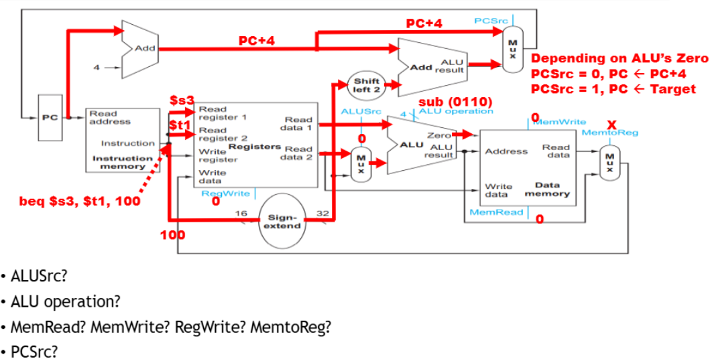
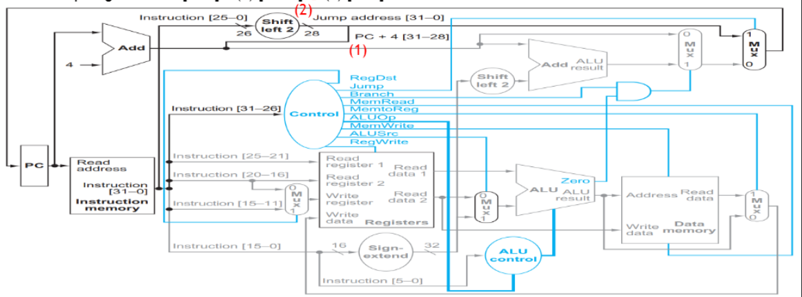
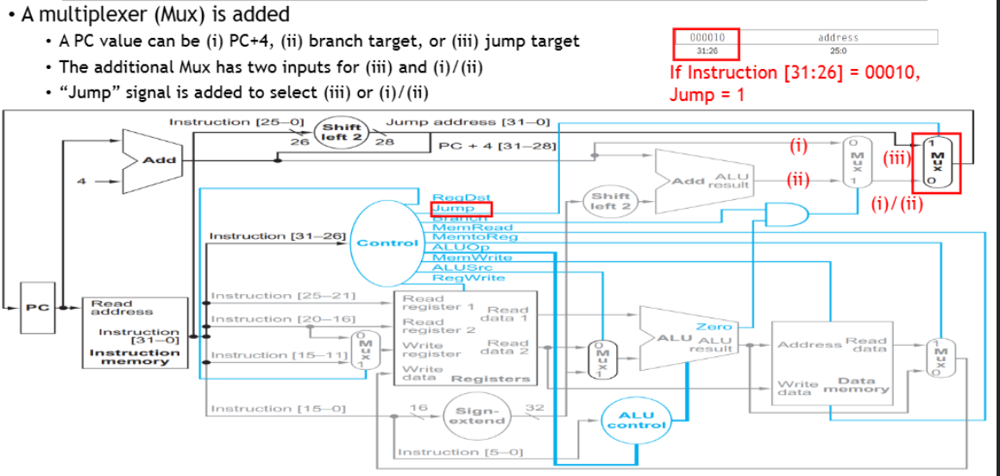

⚙ **Computer Architecture 공부**

## Execution of Store
---

`sw $s1, 30($t5)` → $s1 레지스터의 값을 $t5 레지스터의 값에 30을 더한 메모리 주소에 저장

✅**실행 단계:**  
1. **명령어 해석**:
  * `Read register 1`: base address 레지스터(`$t5`)
  * `Immediate value`: offset(30)
  * `Write register`: 목적지 레지스터(`$s1`)

2. **레지스터 값 읽기**:
  * `Read data 1`: `$t5`의 값
  * `Read data 2`: `$s1`의 값

3. **오프셋 부호 확장**:
  * 16bits offset을 32bits로 부호 확장
  * `Sign-extend`: 32(16bits) → 32(32bits)

4. **address 계산**:
  * `ALUSrc = 1`: ALU의 두 번째 입력으로 **부호 확장된 offset(30)을 선택**
  * `ALU operation = 0010`: **add 연산을 수행**
  * ALU에서 **base address(Read data 1, $t5의 값)와 부호 확장된 offset(30)을 더해 메모리 주소를 계산**

5. **메모리에 데이터 쓰기**:
  * `Memwrite = 1`: 계산된 주소에 데이터를 쓰기를 활성화
  * 계산된 주소(ALU result)는 데이터 메모리의 Address 입력으로 전달됨
  * `$s1`의 값(Read data 2)은 데이터 메모리의 `Write data input`으로 직접 전달됨
  * `$s1` 레지스터 값이 계산된 메모리 주소(`$t5 + 30`)에 저장됨

📝**정리:**  
1. Rs, Rt, offset
* `Rs(Source Register)`: `$t5` - 메모리 주소의 기본값을 제공하는 레지스터
* `Rt (Target Register)`: `$s1` - 메모리에 저장할 데이터를 포함하는 레지스터
* `Offset`: `30` - 메모리 주소 계산에 사용되는 상수값

2. ALUSrc? ALU operation?
* `ALUSrc: 1` - ALU의 두 번째 입력으로 **부호 확장된 상수(30)를 사용**
* `ALU operation`: `0010(add)` - **덧셈 연산**을 수행

3. MemWrite? MemRead? RegWrite?
* `MemWrite: 1` - **메모리 쓰기** 활성화
* `MemRead: 0 `- 메모리 읽기 비활성화
* `RegWrite: 0` - 레지스터 쓰기 비활성화

4. MemtoReg?
* `MemtoReg: X` (Don't care) - **레지스터에 쓰기를 하지 않으므로 중요하지 않음**

## Execution of branch
---

`beq $s3, $t1, 100` → **$s3와 $t1의 값이 같으면 PC+4에 (100*4)를 더한 주소로 점프**

✅**실행 단계:**  
1. **명령어 해석**:
  * 두 개의 레지스터 주소: `$s3(Read register 1)`, `$t1(Read register 2)`
  * 오프셋 값: `100(16bits)`

2. **두 가지 작업 병렬 수행**:
  * **target address 계산**:
    * 오프셋 값 100을 16비트에서 32비트로 부호 확장
    * 부호 확장된 값을 **왼쪽으로 2bits shift(word 단위 변환)**
    * `PC+4`와 `2bits 시프트된 오프셋`을 더해 타겟 주소 계산: `(PC+4) + (100 * 4)`
  
  * **레지스터 값 비교**:
    * 레지스터 파일에서 `$s3`과 `$t1`의 값을 읽음
    * `ALUSrc = 0`: ALU의 두 번째 입력으로 레지스터 값(`$t1`) 선택
    * `ALU operation = 0110`: 뺄셈 연산 수행(`$s3` - `$t1`)
    * 두 값이 같으면 결과가 0이 되고, ALU의 **Zero 출력이 1이 됨**

3. **분기 결정**:
  * `Zero = 1` (두 값이 같음):
    * `PCSrc = 1`: 타겟 주소가 **다음 PC 값으로 선택**됨
    * 다음 명령어는 타겟 주소에서 인출됨
  
  * `Zero = 0` (두 값이 다름):
    * `PCSrc = 0`: `PC+4`가 다음 PC 값으로 선택됨
    * 다음 명령어는 순차적으로 인출됨

4. **PC 업데이트**:
  * **선택된 주소(target address 또는 PC+4)가 PC 레지스터에 저장됨**
  * 다음 클록 사이클에서 새로운 PC 값에 따라 명령어 인출 시작

📝**정리:**  
1. ALUSrc?
* `ALUSrc = 0`: BEQ 명령에서는 두 레지스터 값을 비교해야 하므로, **두 번째 ALU 입력으로 레지스터 값을 사용**

2. ALU operation?
* `ALU operation = 0110 (sub)`

3. MemRead? MemWrite? RegWrite? MemtoReg?
* `MemRead = 0`: BEQ 명령은 메모리 읽기 수행 X
* `MemWrite = 0`: BEQ 명령은 메모리 쓰기 수행 X
* `RegWrite = 0`: BEQ 명령은 레지스터에 값을 쓰지 않음
* `MemtoReg = X`(Don't care): **RegWrite가 0이므로 중요하지 않음**

4. PCSrc?
* `Zero = 0`(두 값이 다름): `PCSrc = 0` → **PC+4**가 다음 PC 값
* `Zero = 1`(두 값이 같음): `PCSrc = 1` → 계산된 **타겟 주소**가 다음 PC 값

## DataPath Elements for Jump
---
📚**Jump Instruction**: 무조건 분기 명령으로, **프로그램 실행 흐름을 지정된 주소로 즉시 변경**

### Pseudo-Direct Addressing
**Pseudo-Direct Addressing**: jump instruction의 target address 계산 방식

✅**계산 방식**:  
1. **PC+4의 상위 4bits 추출** [31:28]
* 현재 명령어 **다음 명령어(PC+4)의 상위 4비트를 가져옴**
* 이는 현재 코드의 '영역'을 유지하기 위함

2. **명령어의 하위 26비트 확장** `[25:0] → [27:0]`
* 명령어에서 26비트 오프셋을 추출
* 이 값을 왼쪽으로 2bits shift(× 4)하여 bytes address로 변환
* 결과적으로 28bits 값 [27:0]

3. **최종 타겟 주소 조합**
* `jump target address [31:0]` = (1) PC+4 [31:28] ⊕ (2) 확장된 오프셋 [27:0]

### **Jump의 데이터패스 요소**

1. **PC+4 추출기**
   * 현재 PC+4의 상위 4bits [31:28]을 추출

2. **Shift left 2 Unit**
   * 명령어의 26비트 오프셋 [25:0]을 왼쪽으로 2비트 시프트하여 [27:0]으로 확장

3. **Jump address 조합기**
   * PC+4 [31:28]와 확장된 오프셋 [27:0]을 결합 → **최종 32bits jump target address [31:0]를 생성**

4. **MUX 추가**
   * 이 MUX는 다음 세 가지 입력 중 하나를 선택:
      1. `PC+4`: 다음 명령어의 주소(순차적 실행)
      2. `Branch Target`: 조건부 분기(`beq`, `bne` 등)의 타겟 주소
      3. `Jump Target`: JUMP 명령의 타겟 주소

   * 선택하는 과정은 다음과 같음:
      1. `(i)/(ii)` 중 하나를 선택(기존 Branch MUX)
      2. `(i)/(ii)`의 결과와 `(iii)` 중 하나를 선택(새로운 Jump MUX)

* **Jump Contorl Signal**:
  * 명령어 [31:26] = `000010`(JUMP 명령의 **op코드**)일 때 `Jump = 1`로 설정
  * 이 신호는 **새로운 MUX가 점프 타겟 주소(iii)를 선택하도록 제어**
  * `Jump = 0`이면 MUX는 이전 결과인 `(i)/(ii)`를 선택

✅**실행 단계:**  
1. **명령어 가져오기(Fetch)**:
* PC에 저장된 주소에서 명령어를 가져옴

2. **명령어 해독(Decode)**:
* 명령어의 "opcode [31:26] = `000010(JUMP)`"인지 확인
* JUMP로 확인되면 `Jump Contorl Signal`를 1로 설정

3. 주소 계산(Execute):
* PC+4의 상위 4비트 [31:28]를 추출
* 명령어의 하위 26비트 [25:0]를 왼쪽으로 2비트 시프트
* 두 부분을 결합하여 최종 점프 타겟 주소를 생성

4. PC Update:
* `Jump = 1`이므로, MUX는 계산된 **점프 타겟 주소를 선택**
* **PC는 이 점프 타겟 주소로 업데이트**