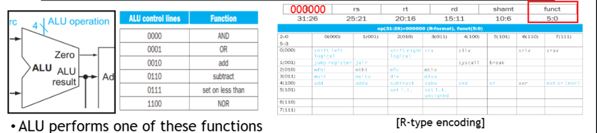
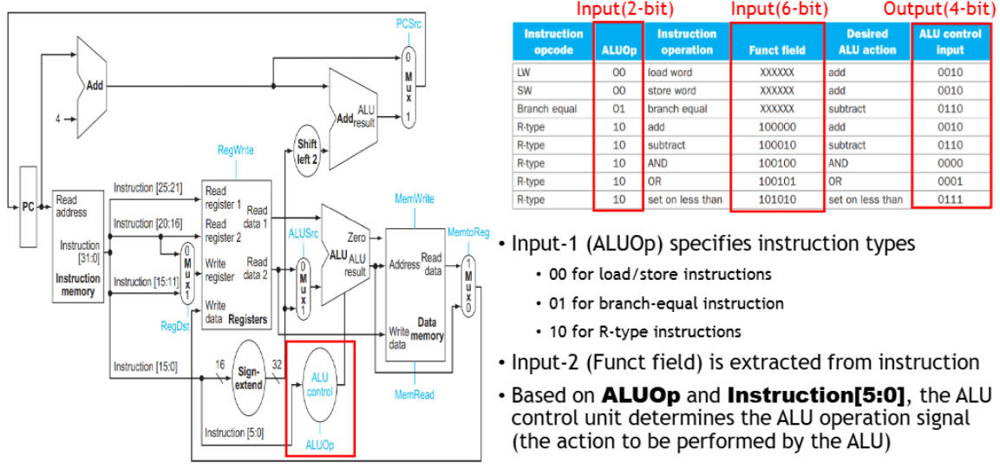
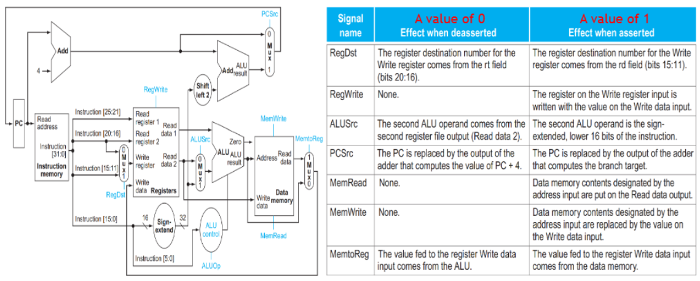
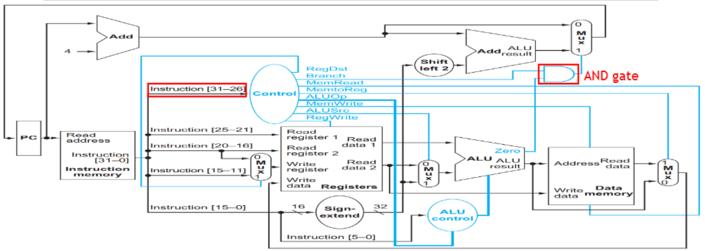
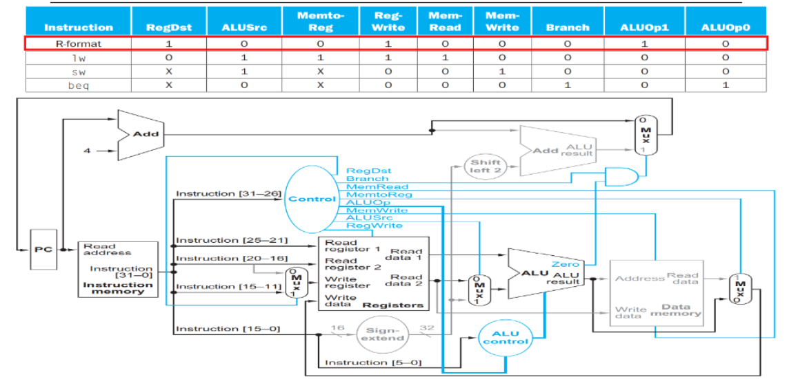
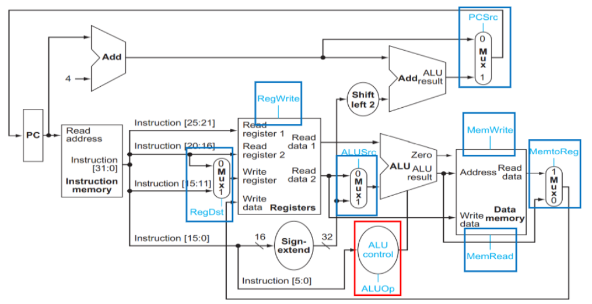

⚙ **Computer Architecture 공부**

## ALU
---

📚**ALU**: 모든 계산과 논리 연산 수행
* `Load/Store instruction`: 메모리 주소를 계산하기 위해 `add`를 사용
* `Branch instruction`: 두 레지스터 값을 비교하기위해 `sub`을 사용
* `R-type instruction`: 6-bit function field 값에 따라 다름

### ALU Control Unit
---

#### Input
1. **ALUOp(2bits)**: 명령어 타입을 지정
  * `00`: load/store
  * `01`: branch
  * `10`: R-type
  * `11`: I-type
2. **Funtion field(6bits)**: R-type intruction에서 추출된 연산 코드
  * 예:100000(`add`), 100010(`sub`), 100100(`and`) 등

#### Output
* **ALU Control Signal(4bits)**: ALU가 수행할 연산 지정
  * `0000`: AND 연산
  * `0001`: OR 연산
  * `0010`: Add
  * `0110`: Subtract
  * `0111`: Set on less than

## Seven Control Signals
---

1. **RegDst (Register Destination)**
* **용도**: 어떤 레지스터가 쓰기 작업의 대상이 될지 결정
* **값이 0일 때**: 쓰기 레지스터의 대상 번호가 `rt` 필드(bits 20:16)에서 옴
* **값이 1일 때**: 쓰기 레지스터의 대상 번호가 `rd` 필드(bits 15:11)에서 옴

2. **RegWrite (Register Write)**
* **용도**: 레지스터 파일에 데이터를 쓸지 말지를 결정
* **값이 0일 때**: 아무 동작 없음 (레지스터에 쓰기 작업을 수행하지 않음)
* **값이 1일 때**: 쓰기 레지스터 입력에 있는 레지스터에 **쓰기 데이터 입력의 값이 기록됨**

3. **ALUSrc (ALU Source)**
* **용도**: ALU의 두 번째 입력이 레지스터에서 오는지 or immediate value에서 오는지 결정
* **값이 0일 때**: ALU의 두 번째 피연산자는 **두 번째 레지스터 파일 출력**(`Read data 2`)에서 옴
* **값이 1일 때**: ALU의 두 번째 피연산자는 **명령어의 부호 확장된 하위 16bits**

4. **PCSrc (Program Counter Source)**
* **용도**: 다음 명령어의 주소(PC)가 **순차적으로 계산되는지 or 분기에 의해 결정되는지 제어**
* **값이 0일 때**: PC는 `PC+4` 값을 계산하는 가산기의 출력으로 대체
* **값이 1일 때**: PC는 `분기 대상`을 계산하는 가산기의 출력으로 대체

5. **MemRead (Memory Read)**
* **용도**: 메모리에서 데이터를 읽을지 여부를 결정
* **값이 0일 때**: 아무 동작 없음 (메모리에서 읽지 않음)
* **값이 1일 때**: 주소 입력에 의해 지정된 **데이터 메모리 내용이 읽기 데이터 출력에 배치됨**

6. **MemWrite (Memory Write)**
* **용도**: 메모리에 데이터를 쓸지 여부를 결정
* **값이 0일 때**: 아무 동작 없음 (메모리에 쓰지 않음)
* **값이 1일 때**: 주소 입력에 의해 지정된 **데이터 메모리 내용이 쓰기 데이터 입력의 값으로 대체**됨

7. **MemtoReg (Memory to Register)**
* **용도**: 레지스터에 쓰여질 데이터가 ALU 결과인지 메모리에서 읽은 데이터인지 결정
* **값이 0일 때**: 레지스터 쓰기 데이터 입력으로 전달되는 값이 **ALU에서** 옴
* **값이 1일 때**: 레지스터 쓰기 데이터 입력으로 전달되는 값이 **데이터 메모리에서** 옴

## Control Unit for Datapath
---

📚**Control Unit**: 명령어를 해석하고 해당 명령어 실행에 필요한 모든 제어 신호를 생성
* `Input`: 명령어의 opcode 부분 (Instruction [31-26])
* `Output`: 7개의 제어 신호 (RegDst, Branch, MemRead, MemtoReg, ALUOp, MemWrite, ALUSrc, RegWrite)

위 사진에는 PCSrc control signal이 AND gate로 대체되었다
* **AND gate 입력**:
  1. **branch 신호**: 현재 명령어가 branch instruction인지 표시 (`Branch = 1` 이면 branch 명령어) 
  2. **Zero 신호**: ALU의 연산 결과가 0인지 표시 (`Zero = 1` 이면 두 값이 같음)

* **AND gate 작동 방식**:
  * 두 입력이 모두 1일 때만 AND gate 출력이 1
  * 즉, `branch = 1 and zero = 1`
  * `AND gate = 1` → 계산된 분기 대상 주소가 PC에 기록된다

## 명령어 타입에 따른 Control Signal 분석
---

### R-type
* `RegDst = 1`: 목적지 레지스터 필드로 rd(bits 15-11)를 선택
* `ALUSrc = 0`: ALU의 두 번째 입력으로 레지스터 값을 사용(즉시값 아님)
* `MemtoReg = 0`: 레지스터에 쓰일 데이터는 ALU 결과에서 옴(메모리에서 읽은 값이 아님)
* `RegWrite = 1`: 레지스터에 쓰기 작업을 수행
* `MemRead = 0`: 데이터 메모리에서 읽기 작업 수행 X
* `MemWrite = 0`: 데이터 메모리에 쓰기 작업 수행 X
* `Branch = 0`: 분기 명령어 X
* `ALUOp = 10`: ALU 제어 유닛에 R-타입 명령어임을 전달, 이 값을 통해 ALU는 function 필드(비트 5-0)를 검사하여 구체적인 연산(add, sub, and 등)을 결정

✅**동작 과정**:  
1. 명령어를 가져와 해석
2. 두 소스 레지스터(rs, rt)에서 값을 읽음
3. Function 필드에 따라 ALU 연산을 수행
4. ALU 결과를 목적지 레지스터(rd)에 저장
5. PC를 다음 명령어로 증가시킴(PC+4)

### lw
* `RegDst = 0`: 목적지 레지스터 필드로 rt(비트 20-16)를 선택
* `ALUSrc = 1`: ALU의 두 번째 입력으로 즉시값(오프셋)을 사용
* `MemtoReg = 1`: 레지스터에 쓰일 데이터는 메모리에서 읽은 값에서 옴
* `RegWrite = 1`: 레지스터에 쓰기 작업을 수행
* `MemRead = 1`: 데이터 메모리에서 읽기 작업을 수행
* `MemWrite = 0`: 데이터 메모리에 쓰기 작업 수행 X
* `Branch = 0`: 분기 명령어 X
* `ALUOp = 00`: ALU는 주소 계산을 위해 덧셈 연산을 수행

✅**동작 과정**:  
1. 명령어를 가져와 해석
2. 기본 주소 레지스터(rs)에서 값을 읽음
3. 기본 주소에 부호 확장된 즉시값(오프셋)을 더하여 메모리 주소를 계산
4. 계산된 주소에서 데이터 메모리 값을 읽음
5. 읽은 데이터를 목적지 레지스터(rt)에 저장
6. PC를 다음 명령어로 증가시킴(PC+4)

### sw
* `RegDst = X`: don't care, 레지스터에 쓰기 작업을 수행하지 않기 때문
* `ALUSrc = 1`: ALU의 두 번째 입력으로 즉시값(오프셋)을 사용
* `MemtoReg = X`: don't care, 레지스터에 쓰기 작업을 수행하지 않기 때문
* `RegWrite = 0`: 레지스터에 쓰기 작업 수행 X
* `MemRead = 0`: 데이터 메모리에서 읽기 작업 수행 X
* `MemWrite = 1`: 데이터 메모리에 쓰기 작업 수행
* `Branch = 0`: 분기 명령어 X
* `ALUOp = 00`: ALU는 주소 계산을 위해 덧셈 연산을 수행

✅**동작 과정**:  
1. 명령어를 가져와 해석
2. 기본 주소 레지스터(`rs`)와 저장할 데이터를 담은 레지스터(`rt`)에서 값을 읽음
3. 기본 주소에 부호 확장된 즉시값(오프셋)을 더하여 메모리 주소를 계산
4. 레지스터(`rt`)의 값을 계산된 메모리 주소에 저장
5. PC를 다음 명령어로 증가시킴(PC+4)

### beq
* `RegDst = X`: don't care, 레지스터에 쓰기 작업을 수행하지 않기 때문
* `ALUSrc = 0`: ALU의 두 번째 입력으로 레지스터 값을 사용
* `MemtoReg = X`: don't care, 레지스터에 쓰기 작업을 수행하지 않기 때문
* `RegWrite = 0`: 레지스터에 쓰기 작업 수행 X
* `MemRead = 0`: 데이터 메모리에서 읽기 작업 수행 X
* `MemWrite = 0`: 데이터 메모리에 쓰기 작업 수행 X
* `Branch = 1`: 분기 명령어 O
* `ALUOp = 01`: ALU는 두 레지스터 값을 비교하기 위해 뺄셈 연산을 수행

✅**동작 과정**:  
1. 명령어를 가져와 해석
2. 비교할 두 레지스터(rs와 rt)에서 값을 읽음
3. ALU가 두 값의 차이를 계산(sub 연산)
4. 결과가 0이면(두 값이 같으면), Zero 신호가 1
5. Branch와 Zero 신호가 모두 1이면, AND 게이트의 출력이 1이 되어 분기가 발생
6. 분기가 발생하면, PC에 분기 대상 주소(PC+4+부호 확장된 즉시값*4)가 기록됨
7. 분기가 발생하지 않으면, PC는 단순히 다음 명령어로 증가(PC+4)

