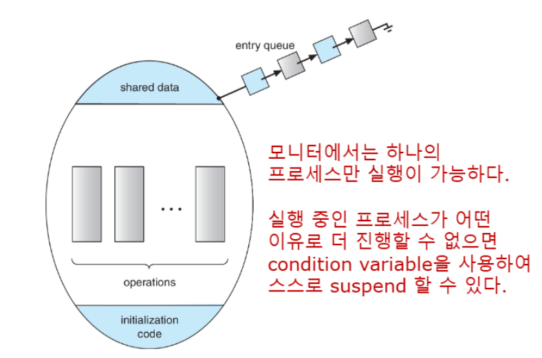
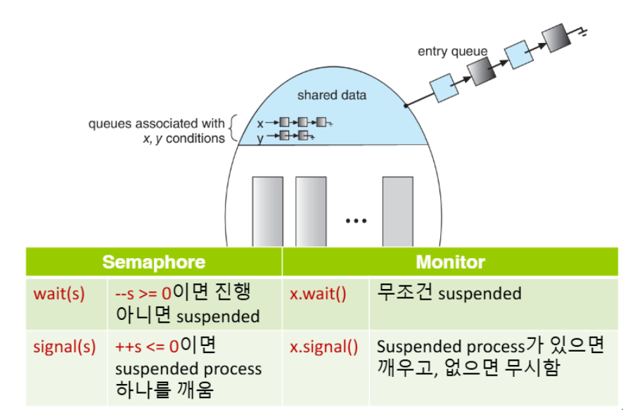
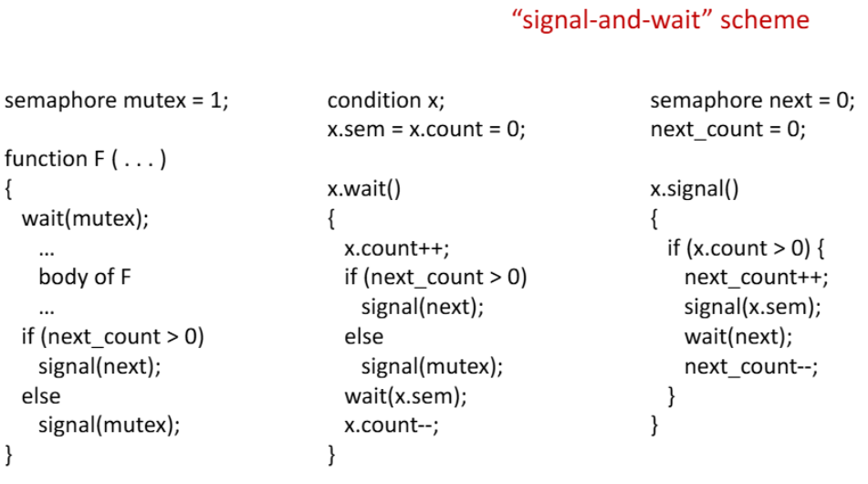
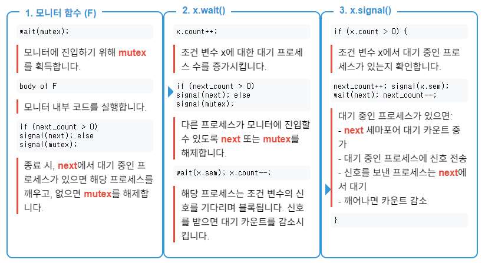
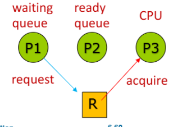

>🍀 운영체제 전공 수업 정리

{:.prompt-warning}
> semaphore는 잘못 사용하면 심각한 문제가 발생한다!!
>

1. **잘못된 연산 순서**: `signal(mutex)` 후에 `wait(mutex)` 호출
2. **중복 `wait()`호출**: `wait(mutex)` 후에 다시 `wait(mutex)` 호출
3. **연산 누락**: `wait(mutex)` 또는 `signal(mutex)` 누락

위 문제들은 **Deadlock, Race Condition, Starvation** 문제를 야기함!

이러한 문제점 해결을 위해 **더 높은 수준의 추상화를 제공하는 synchronization tool**이 필요  
→ **<span style="color: #008000">Monitors</span>**가 개발됨

## Monitors
📚**<span style="color: #008000">Monitors</span>**: semaphore보다 더 높은 수준의 추상화를 제공하는 동기화 메커니즘

✅**주요 특징**:  
* **Abstract Data Type**: 공유 데이터와 이를 조작하는 연산을 하나의 모듈로 **캡슐화**
* **내부 변수 은닉**: monitor 내부 변수는 오직 monitor내부의 코드만 접근 가능
* **상호 배제 자동 보장**: 한 번에 하나의 프로세스만 모니터 내부에서 활성화 가능
* **Condition Variable**: 특정 조건이 만족될 때까지 프로세스를 대기시킬 수 있는 메커니즘 제공

#### Monitor 구조
```
monitor monitor-name {
    // 공유 변수 선언
    Data data
    ...
    //공유데이터를 조작하는 함수들
    function P1 (...) { ... }
    function P2 (...) { ... }
    function Pn (...) { ... }
    
    //모니터 초기화를 위한 코드
    initialization code (...) { ... }
}
```



1. **공유 데이터(Shared Data)**: 모니터 내부의 공유 변수들
2. **연산(Operations)**: 공유 데이터를 조작하는 함수들
3. **초기화 코드(Initialization Code)**: 모니터 초기화를 위한 코드
4. **진입 큐(Entry Queue)**: 모니터에 진입 대기 중인 프로세스들의 큐

* 한 번에 하나의 프로세스만 실행 가능
* 다른 프로세스들은 진입 큐에서 대기
* 실행 중인 프로세스가 어떤 이유로 더 진행할 수 없으면 **<span style="color: #008000">Monitors</span>condition variable</span>을 사용하여 스스로 suspend 가능**

### Condition Variables
---
📚**<span style="color: #008000">Condition Variables</span>**: 특정 조건이 만족될 때까지 프로세스를 대기시킴
* `condition x,y`의 형식

##### Condition Variables operation
1. `x.wait()`: 이 연산을 호출한 프로세스는 `x.signal()`이 **호출될 때까지 suspended**
2. `x.signal()`: `x.wait()`을 호출하여 **대기 중인 프로세스가 있다면 그 중 하나를 깨움(resume)**

✅**특징**:  
* 조건 변수(x or y)는 개념적으로 **대기 큐의 이름**
* `x.wait()`을 호출한 프로세스가 없다면 `x.signal()`은 아무 효과 없음
* 조건 변수는 특정 상태나 사건을 나타내며, **해당 사건이 발생할 때까지 프로세스를 대기시킴**

* 프로세스(또는스레드)는 **모니터 안에서 함수를 방해받지 않고 실행할 수 있는 것을 보장**받음
* 만일 다른 프로세스의 병행실행을 허용하고 싶으면 **조건변수에 `wait()`를 실행함**으로써 가능
* 즉, **프로세스가 preemption 위치를 스스로 지정할 수 있음을 뜻함**


> semaphore와 monitor 조건 변수 비교

#### Condition Variable 사용 시 고려사항
* 조건 변수를 사용할 때 발생 가능한 문제: **signal 후 프로세스 실행 순서**

{:.prompt-warning}
> 프로세스 P가 x.signal()을 호출하고 프로세스 Q가 x.wait()에서 일시 중단된 상태일 때, 다음에 무엇이 일어나야 할까?
>

✅**가능한 옵션**:  
1. **<span style="color: #008000">signal and Wait</span>**: P는 Q가 모니터를 떠나거나 다른 조건 변수에서 대기할 때까지 기다림
2. **<span style="color: #008000">Signal and Continue</span>**: Q는 P가 모니터를 떠나거나 다른 조건 변수에서 대기할 때까지 기다림
3. **<span style="color: #008000">Concurrent Pascal 방식</span>**: P는 신호를 보낸 후 즉시 모니터를 떠나고, Q가 재개됨

각 옵션마다 장단점이 존재, 언어나 시스템에 따라 구현 방식 상이

#### Signal-and-Wait 구현


* **Semaphore**:
  * `mutex`: **모니터 진입을 제어하는 세마포어**, 초기값 1(binary semaphore)
  * `next`: **Condition variable에 신호를 보낸 후 대기하는 프로세스를 위한 세마포어**, 초기값 0
  * `x.sem`: **Condition variable x에 대해 대기하는 프로세스를 위한 세마포어**, 초기값 0

* **Counter**:
  * `x.count`: 조건 변수 x에 대해 대기 중인 프로세스 수
  * `next_count`: `next` 세마포어에서 대기 중인 프로세스 수



* **Condition variable x**
  * `x.sem`: 조건 변수에서 대기 중인 프로세스를 블록/언블록하는 세마포어
  * `x.count`: 현재 이 조건 변수에서 대기 중인 프로세스의 수

`wait(next)`를 실행하면 이를 실행한 스레드는 누가 깨워주는가?  
→ **시그널을 받은 스레드가 함수를 마치거나 다른 조건을 기다릴 때**

1. 조건 변수 x에 신호를 보낸 프로세스 A는 대기 상태
2. 신호를 받은 프로세스 B가 깨어나서 실행됨
3. **프로세스 A는 다음 두 가지 경우에 다시 깨어날 수 있다:**
   1. 프로세스 B가 작업을 완료하고 모니터를 떠날 때 (`signal(next)`)
   2. 프로세스 B가 다른 조건 변수를 기다리게 될 때 (`x.wait()`)

### Resuming Processes withing a Monitor
---
{:.prompt-warning}
> 여러 프로세스가 condition variable x에서 대기하고 있고, `x.signal()`d이 실행될 때 어떤 프로세스가 재개되어야 할까?
>

FCFS 방식이 무조건 적절하지는 않다!

이 문제를 해결하기위해 **조건부 대기(conditional-wait)** 도입

#### Coditional Wait
```
x.wait(c)
```

* 여기서 `c`는 **<span style="color: #008000">priority number</span>**
* 낮은 번호 = 높은 우선순위

### Single Resource Allocation
여러 프로세스 간에 하나의 자원을 효율적으로 배분하는 문제

> **우선순위 번호를 사용하여 자원을 사용할 계획인 최대 시간을 지정함으로써 경쟁하는, 프로세스 간에 단일 자원을 할당**

* **기본 사용 패턴**:
```
R.acquire(t);
...
access the resource;
...
R.release;
```

* `R`: ResourceAllocator 타입의 인스턴스
* `t`: 해당 프로세스의 우선순위

* **ResourceAllocator 구현 코드**:
```java
monitor ResourceAllocator
{
    boolean busy;
    condition x;
    
    void acquire(int time) {
        if (busy)
            x.wait(time);
        busy = true;
    }
    
    void release() {
        busy = false;
        x.signal();
    }
    
    initialization code() {
        busy = false;
    }
}
```

1. **상태 변수**:
  * `boolean busy`: 자원이 현재 사용 중인지 여부
  * `condition x`: 자원을 기다리는 프로세스들의 대기열을 관리하는 조건 변수

2. `acquire(int time)`:
  * 프로세스가 자원을 요청할 때 호출
  * `time`: 프로세스가 자원을 사용하기 위한 우선순위
  * 자원이 이미 사용 중이면 (`busy` = true), 프로세스는 조건 변수 x에서 대기
  * 자원이 사용 가능하면 (`busy` = false), 즉시 자원을 할당받고 busy를 true로 설정

3. `releasea()`:
  * 프로세스가 자원 사용을 마치면 호출
  * `busy`를 false로 설정하여 자원이 사용 가능함을 표시
  * `x.signal()`을 호출 → 조건 변수 x에서 대기 중인 프로세스 중 하나(가장 낮은 `time` 값을 가진 프로세스)를 깨운다

4. 초기화 코드:
  * 모니터가 생성될 때 `busy`를 false로 초기화

## Liveness
---
📚**<span style="color: #008000">Liveness</span>**: **시스템이 계속 진행되고 작업을 완료할 수 있는 능력**

* **liveness failure** 상태도 있다 → **무한 대기(Indefinite Waiting)**

#### Deadlock
📚**<span style="color: #008000">Deadlock</span>**: **두 개 이상의 프로세스가 대기 중인 프로세스 중 하나만이 발생시킬 수 있는 이벤트를 무한정 기다리는 상황**

✅예시:  
```
Let S and Q be two semaphores initialized to 1

P₀                      P₁
wait(S);                wait(Q);
wait(Q);                wait(S);
...                     ...
signal(S);              signal(Q);
signal(Q);              signal(S);
```

1. P₀가 `wait(S)`를 실행하고, P₁이 `wait(Q)`를 실행
2. P₀가 `wait(Q)`를 실행하려 하지만, Q는 P₁이 이미 획득했으므로 P₀는 P₁이 `signal(Q)`를 실행할 때까지 대기해야함
3. 마찬가지로, P₁이 `wait(S)`를 실행하려 하지만, S는 P₀이 이미 획득했으므로 P₁은 P₀가 `signal(S)`를 실행할 때까지 대기해야함
4. 결국, **P₀는 P₁이 Q를 해제하기를 기다리고, P₁은 P₀가 S를 해제하기를 기다리는 상황**!
5. `signal()` 연산은 절대 실행되지 않고 두 프로세스는 **deadlock**

#### Starvation
📚**<span style="color: #008000">Starvation</span>**: **프로세스가 필요한 자원을 얻지 못하고 무한히 기다리는 상황**

#### Priority Inversion
📚**<span style="color: #008000">Priority Inversion</span>**: **낮은 우선순위 프로세스가 높은 우선순위 프로세스가 필요로 하는 락을 보유할 때 발생하는, 스케줄링 문제**

✅**문제 발생 상황 예시**:  
1. 높은 우선순위의 프로세스 P1이 자원 `R`을 요청
2. 자원 `R`은 이미 낮은 우선순위의 프로세스 P3가 사용 중
3. P1은 P3가 자원을 해제할 때까지 기다림
4. **중간 우선순위의 프로세스 P2가 실행 가능해지면, P2가 P3를 선점**
5. P2(낮은 우선순위)가 간접적으로 P1(높은 우선순위)이 자원에 접근하는 것을 방해

{:.prompt-tip}
> 이러한 문제는 **Priority Ingeritance Protocol**로 해결 가능
>

### Priority Ingeritance Protocol
---
📚**<span style="color: #008000">Priority Ingeritance Protocol</span>**:  낮은 우선순위 프로세스가 자원을 사용 중일 때 **높은 우선순위 프로세스가 그 자원을 요청**하면, 낮은 우선순위 프로세스는 **일시적으로 높은 우선순위 프로세스의 우선순위를 상속받는다**



1. P3가 자원 R을 사용 중일 때 P1이 R을 요청하면, P3는 P1의 높은 우선순위를 상속받는다
2. 그러면 P2는 더 이상 P3를 선점할 수 없다
3. P3는 높은 우선순위로 실행을 계속함 → 자원 R을 빠르게 해제 가능
4. P3가 자원을 해제하면, P3는 원래의 낮은 우선순위로 돌아가고 P1은 R을 획득하여 실행