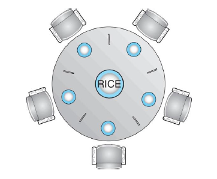
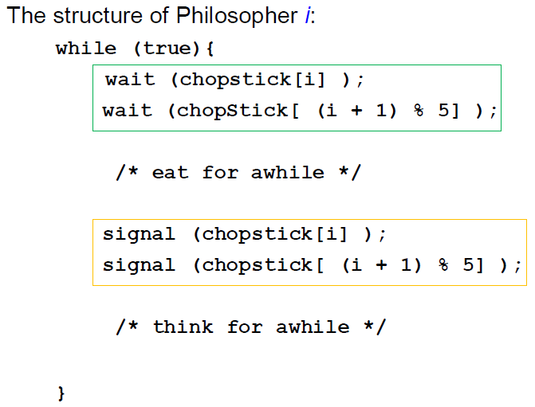

>🍀 운영체제 전공 수업 정리

Synchronization 문제들의 예시인 **<span style="color: #008000">bounded-buffer(유한 버퍼), readers-writers(읽기-쓰기), dining philosophers(식사하는 철학자)</span>**문제에 대해 알아보자

## Bounded-Buffer Problem
---
📚**<span style="color: #008000">Bounded-Buffer Problem</span>**: **여러 프로세스가 데이터를 공유 버퍼에 넣고 빼는 과정**에서 발생할 수 있는 동기화 문제(=Producer-Consumer Problem)

* **n개의 buffer**: 각 버퍼는 한 개의 아이템 저장 가능
* **Semaphore**:
  * `mutex`: 값 1로 초기화(상호 배제를 위한 binary semaphore)
  * `full`: 값 0으로 초기화(채워진 버퍼 수)
  * `empty`: 값 n으로 초기화(비어있는 버퍼 수)

> **semaphore의 값 = resource 개수**

* **counter 변수 없이 mutex만 사용해서 문제를 해결 못함!**
* **Counting semaphore**인 `full`, `empty`를 사용하는 것이 효율적!

* **producer process 구조:**
```c
while (true) {
    // 아이템 생산
    /* produce an item in next_produced */
    
    wait(empty);    // 비어있는 버퍼가 있는지 확인
    wait(mutex);    // 임계 영역 진입을 위한 잠금 획득
    
    /* add next_produced to the buffer */
    
    signal(mutex);  // 임계 영역 탈출 및 잠금 해제
    signal(full);   // 채워진 버퍼 수 증가
}
```

* **consumer process 구조:**
```c
while (true) {
    wait(full);     // 채워진 버퍼가 있는지 확인
    wait(mutex);    // 임계 영역 진입을 위한 잠금 획득
    
    /* remove an item from buffer to next_consumed */
    
    signal(mutex);  // 임계 영역 탈출 및 잠금 해제
    signal(empty);  // 비어있는 버퍼 수 증가
    
    /* consume the item in next_consumed */
}
```

* producer와 consumer가 **별도의 mutex락을 사용하는 것이 더 효율적**!
* → 생산자와 소비자가 **동시에 실행**될 수 있기 때문

## Readers-Writers Problem
---
📚**<span style="color: #008000">Readers-Writers Problem</span>**: 여러 프로세스가 공유 데이터에 접근할 때, 읽기 작업과 쓰기 작업 간의 동기화를 관리하는 문제

* **shared data set**: 여러 프로세스가 공유하는 데이터
* **Readers**: 데이터를 읽기만 하고 수정X
* **Writers**: 데이터를 읽고 쓸 수 있음

✅**problem**:  
  * **여러 readers**는 **동시에 데이터를 읽을 수 있어야함**
  * **writer**는 **독점적으로 데이터에 접근해야 함(한 번에 오직 하나의 writer)**
  * 데이터 일관성 유지 + 동시성 최대화

💾**Shared Data**:  
  * **Data set**: 여러 프로세스가 접근하는 공유 데이터
  * **Semaphore `rw_mutex`**: 값이 1로 초기화된 세마포어, reader와 writer의 상호배타 접근을 관리
  * **Semaphore `mutex`**: 값이 1로 초기화된 세마포어, reader가 read_count를 업데이트하기 위해 사용
  * **Integer `read_count`**: 0으로 초기화된 변수, 현재 진행 중인 reader의 수

* **Writer Process**:
```c
while (true) {
    wait(rw_mutex);    // 독점적 접근 권한 획득
    
    /* writing is performed */
    
    signal(rw_mutex);  // 접근 권한 해제
}
```

* 오직 한 개의 writer만 들어갈 수 있어야 함
* 이 해는 **multiple reader를 허용**하지만 writer가 지속적으로 굶을 수 있다.
* → **'reader 선호' 알고리즘**

* **Reader Process**:
```c
while (true) {
    wait(mutex);       // read_count 업데이트 보호를 위한 잠금 획득
    read_count++;      // 읽기 프로세스 수 증가
    
    // 유일한 reader라면 writer와 경쟁, 그렇지 않다면 다른 reader가 들어오는 것을 허용
    if (read_count == 1) {
        wait(rw_mutex); // 첫 번째 reader가 writer 접근 차단
    }
    
    signal(mutex);     // read_count 업데이트 완료, 잠금 해제
    
    /* reading is performed */ //→ reader가 중복해서 들어오는 것을 허용
    
    wait(mutex);       // read_count 업데이트 보호를 위한 잠금 재획득
    read_count--;      // 읽기 프로세스 수 감소
    
    if (read_count == 0) { // 더 이상 reader가 없으므로 writer 허용
        signal(rw_mutex); // 마지막 reader가 writer 접근 허용
    }
    
    signal(mutex);     // read_count 업데이트 완료, 잠금 해제
}
```

* **첫 번째 reader**가 들어올 때만 `rw_mutex`를 획득 → **writer의 접근을 차단**
* **마지막 reader**가 나갈 때만 `rw_mutex`를 해제 → **모든 reader가 작업을 완료하면 writer가 접근 가능**

### Readers-Writers Problem Variations
---
읽기-쓰기 문제에는 여러 변형이 존재, 모두 어떤 형태의 우선순위를 포함

#### 1. First variation - <span style="color: #008000">Reader Priority</span>
* reader는 대기하지 않고 바로 실행됨
* writer는 모든 reader가 완료될 때까지 대기
  * → **writer의 starvation** 가능성 있음!

#### 2. second variation - <span style="color: #008000">Writer Priority</span>
* writer가 대기 중이면 새로운 reader는 시작할 수 없음
  * reader의** 중복은 최대한 허용**하지만 기다리는 writer가 있으면 **reader는 writer를 앞지르지 못함**
  * **늦게 온 writer는 기다리고 있는 reader를 앞지를 수 있다**
* writer가 가능한 빨리 실행됨
  * **reader의 starvation** 가능성 있음!

두 변형 모두 starvation의 가능성이 있으며, 이로 인해 더 많은 변형이 생김

### Fair Solution
* **<span style="color: #008000">공정한 reader-writer</span>**: 선착순으로 CS에 들어가면서 reader의 중복을 최대한 허용하는 방식
  * 늦게 온 reader/writer가 기다리고 있는 다른 reader/writer를 앞지르지 못함!

* 프로세스의 도착 순서(FIFO)에 따라 접근 권한 부여
* 가능한 한 많은 읽기 프로세스 동시 접근 허용
* 늦게 도착한 프로세스는 먼저 대기 중인 프로세스를 추월할 수 없음

## Dining Philosophers Problem
---
📚**<span style="color: #008000">Dining Philosophers Problem</span>**: 교착 상태(deadlock)와 기아 상태(starvation)를 설명하기 위한 유명한 예제


* 5명의 철학자가 원형 테이블에 앉아 있다.
* 각 철학자 사이에는 하나의 젓가락(chopstick)이 있어 총 5개의 젓가락이 있다.
* 철학자들은 생각하기(`thinking`)와 먹기(`eating`)를 번갈아 수행
* 철학자가 식사를 하려면 좌우 양쪽의 젓가락 2개를 모두 집어야 한다.
* 젓가락은 한 번에 하나씩 집을 수 있으며, 식사가 끝나면 두 젓가락을 모두 내려놓는다.

**Shared Data**:
* **Bowl of rice**: 공유 data set
* `chopstick [5]`: **각각 1로 초기화된 semaphore 배열**

### 세마포어를 활용한 기본적인 solution
---


{:.prompt-warning}
> 위 알고리즘은 deadlock 가능성이 있다!
>

* 모든 철학자가 동시에 왼쪽 젓가락을 잡음
* 오른쪽 젓가락은 이미 다른 철학자가 잡고 있어서 대기
* 모든 철학자가 무한 대기 상태가 됨

✅**deadlock을 피하는 방법**:  
1. **젓가락 두 개를 다 집을 수 있을 때만 집는다.**
  * atomic 연산으로 두 젓가락을 모두 집거나 아예 집지 않음
2. **오름차순으로 집는다.**
3. **짝수번 철학자는 왼쪽→오른쪽, 홀수번 철학자는 오른쪽→왼쪽 순으로 집는다.**
  * `circular wait` 조건을 깨뜨림
4. **테이블에 최대 4명만 앉는다.**
  * 최대 4명만 테이블에 동시에 앉을 수 있도록 구현 → 최소 한 명은 무조건 젓가락 두 개 가능

### Monitor를 이용한 solution
---
```c
monitor DiningPhilosophers {
    enum { THINKING, HUNGRY, EATING } state[5];
    condition self[5];
    
    void pickup(int i) {
        state[i] = HUNGRY;
        test(i);
        if (state[i] != EATING) self[i].wait;
    }
    
    void putdown(int i) {
        state[i] = THINKING;
        // test left and right neighbors
        test((i + 4) % 5);
        test((i + 1) % 5);
    }
    
    void test(int i) {
        if ((state[(i + 4) % 5] != EATING) && 
            (state[i] == HUNGRY) && 
            (state[(i + 1) % 5] != EATING)) {
            state[i] = EATING;
            self[i].signal();
        }
    }
    
    // 초기화 코드
    initialization_code() {
        for (int i = 0; i < 5; i++)
            state[i] = THINKING; // 모든 철학자의 초기 상태는 생각하기
    }
}
```

1. **철학자의 상태 관리**:
```c
enum { THINKING, HUNGRY, EATING } state[5];
```

* THINKING: 철학자가 생각하는 상태
* HUNGRY: 철학자가 배고파서 젓가락을 집으려는 상태
* EATING: 철학자가 식사 중인 상태

2. **조건 변수**:
```c
condition self[5];
```

* 배고프지만 젓가락을 집을 수 없을 때 기다리기 위해 사용하는 조건 변수

3. **픽업 함수**:
```c
void pickup(int i) {
    state[i] = HUNGRY;     // 상태를 배고픔으로 변경
    test(i);               // 젓가락을 집을 수 있는지 확인
    if (state[i] != EATING) self[i].wait;  // 식사할 수 없으면 대기
}
```

4. **내려놓기 함수**:
```c
void putdown(int i) {
    state[i] = THINKING;   // 상태를 생각하기로 변경
    // 좌우 이웃 확인
    test((i + 4) % 5);     // 왼쪽 이웃 확인
    test((i + 1) % 5);     // 오른쪽 이웃 확인
}
```

* `test ~`: 좌우에 누가 먹기를 기다리고 있으면 깨워줌

5. **test 함수**:
```c
void test(int i) {
    if ((state[(i + 4) % 5] != EATING) &&   // 왼쪽 이웃이 식사 중이 아니고
        (state[i] == HUNGRY) &&             // 자신이 배고프고
        (state[(i + 1) % 5] != EATING)) {   // 오른쪽 이웃이 식사 중이 아니면
        state[i] = EATING;                  // 상태를 식사 중으로 변경
        self[i].signal();                   // 대기 중이던 철학자 깨우기
    }
}
```

철학자 프로세스는 모니터의 함수를 호출하여 실행됨:
```c
DiningPhilosophers.pickup(i);  // 젓가락 집기 시도

/** EAT **/  // 식사

DiningPhilosophers.putdown(i);  // 젓가락 내려놓기
```

* **No deadlock, but starvation is possible**
  * 특정 철학자가 계속해서 식사 기회를 얻지 못할 수 있다

## 각 problem 정리
---
* **<span style="color: #008000">bounded-buffer</span>**: 세마포어 사용(`mutex`, `empty`, `full`). 카운팅 세마포어로 버퍼 상태 추적. 생산자와 소비자 간 동기화

* **<span style="color: #008000">reader-writer</span>**: 세마포어와 카운터(`mutex`, `rw_mutex`, `read_count`) 사용. 읽기 프로세스 동시 접근 허용, 쓰기 프로세스 독점 접근 보장

* **<span style="color: #008000">dining philosophers</span>**: 세마포어(chopstick[5]) 또는 모니터 사용. 모니터는 조건 변수와 상태 관리를 통해 교착 상태 방지