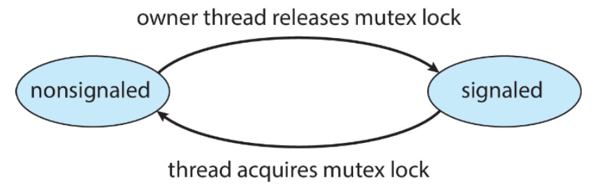
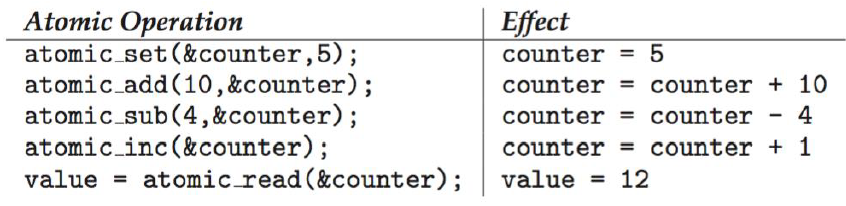
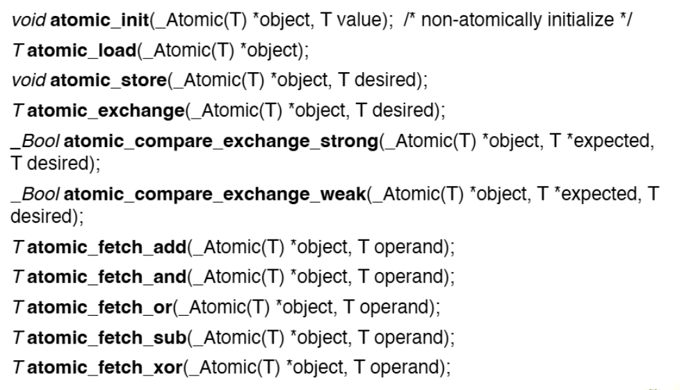

>🍀 운영체제 전공 수업 정리

## Kernel Synchronizatoin - Windows
---
* **<span style="color: #008000">uniprocessor systems</span>**: **Interrupt Mask**를 사용하여 global resource에 대한 접근을 보호
  * **<span style="color: #008000">Interrupt Mask</span>**: 특정 인터럽트의 처리를 일시적으로 차단 → 중요한 코드 섹션이 방해받지 않고 실행됨

* **<span style="color: #008000">multiple processor system</span>**: spinlock 사용하여 global resource에 대한 접근을 보호
  * **<span style="color: #008000">spinlock</span>**: 락을 획득할 때까지 계속해서 확인하는(spinning) 방식의 락
  * spinlock을 가진 스레드는 **never be preempted**
  * → 효율성 때문!: **spinlock을 가진 스레드가 선점되면 deadlock이 발생할 수 있다**

### Dispatcher Objects
* **Dispatcher Objects**: 윈도우가 제공하는 사용자 레벨에서 동작하는 객체(mutex, semaphore, events, timers)
  * `mutex`: 상호 배제를 위한 객체
  * `semaphore`: 제한된 자원 관리
  * `events`: 조건 만족 시 기다리는 스레드에게 `notify()`
  * `timers`: 시간이 만료되면 하나 이상의 스레드에 `notify()`

dispatcher object는 두 개의 상태가 존재:
1. **Signaled State**: 객체가 사용 가능한 상태
2. **Non-signal State**: 스레드가 블록되는 상태

{:.prompt-tip}
> 각 dispatcher object에는 waiting queue가 존재!  
> Object가 signaled-state로 바뀌면 queue에 대기하던 모든 스레드 또는 일부를 깨운다
>


> Mutex Dispatcher Object

작동 방식:
1. 스레드가 `mutex_lock`을 획득하면 mutex는 Non-signal state
2. 소유자 스레드가 `mutex_lock`를 해제하면 Signal state
3. 다른 스레드가 `mutex_lock`획득 가능

## Linux Synchronization
---
2.6버전 이전의 커널에서는 disables interrupt를 사용해서 CS를 구현

✅2.6이후 버전:  
* **<span style="color: #008000">fully preemptive</span>**방식 채택
* 커널 코드 실행 중에도 **더 높은 우선순위의 프로세스가 있으면 현재 실행 중인 프로세스를 선점할 수 있음**

### Linux provides
---
1. **<span style="color: #008000">Semaphore</span>**
* 자원의 개수를 카운팅하여 제한된 수의 스레드만 자원에 접근 가능
2. **<span style="color: #008000">Atomic Integers</span>**
* 원자적 연산을 지원하는 특수한 정수 타입(`atomic_t`)
3. **<span style="color: #008000">Spinlock</span>**
* 락을 획득할 때까지 계속해서 확인하는(spinning) 방식의 락
4. **<span style="color: #008000">Mutex Locks</span>**
* 상호 배제(Mutual Exclusion)를 구현하는 락

* 리눅스의 스핀락과 뮤텍스 락은 **nonrecursive** 특성
* → **락을 이미 획득한 상태에서 다시 획득하려고 하면 데드락이 발생할 수 있음**

* **Single-CPU System**: **disabling kernel preemption** 사용
  * spinlock은 단일 CPU에서 비효율적이기 때문

* **SMP(Symmetric Multi-Processing)**: **spinlock** 사용
  * 여러 CPU가 동시에 작업 처리가 되기 때문에 spinlock 효율 향상

* 커널에 있는 task가 lock 가지고 있으면 **이 task는 nonpreemptive**
* **preemptive하면 deadlock 발생 가능**
* 현재 가지고 있는 lock의 수를 `preempt_count`라는 변수에 저장
* `preempt_count`=0 이면 **preemption 가능!!**

### Atomic Variables
---
* atimic_t type:
```c
atomic_t counter;
int value;
```

**주요 atomic 연산**:


**C11 atomic library**:


* `atomic_init(_Atomic(T) *object, T value)`: 비원자적으로 초기화
* `T atomic_load(_Atomic(T) *object)`: 원자적으로 값 읽기
* `void atomic_store(_Atomic(T) *object, T desired)`: 원자적으로 값 저장
* `T atomic_exchange(_Atomic(T) *object, T desired)`: 원자적으로 값 교환
* `_Bool atomic_compare_exchange_strong/_weak(_Atomic(T) *object, T *expected, T desired)`: 비교 후 교환
* `T atomic_fetch_add/_and/_or/_sub/_xor(_Atomic(T) *object, T operand)`: 연산 후 이전 값 반환

## POSIX Synchronization
---
POSIX API는 멀티스레딩 프로그래밍을 위한 다양한 동기화 메커니즘을 제공

### POSIX Provides
---
* **<span style="color: #008000">Mutex Locks</span>**: 상호 배제를 위한 락
* **<span style="color: #008000">Spin Locks</span>**: 짧은 대기 시간을 위한 락
* **<span style="color: #008000">Semaphores</span>**: 자원 카운팅을 위한 메커니즘
* **<span style="color: #008000">Condition Variables</span>**: 특정 s조건이 충족될 때까지 스레드를 대기시키는 메커니즘

#### 주요 함수:

```c
// 뮤텍스 생성 및 파괴
int pthread_mutex_destroy(pthread_mutex_t *mutex);
int pthread_mutex_init(pthread_mutex_t *restrict mutex, 
                      const pthread_mutexattr_t *restrict attr);

// 정적 초기화
pthread_mutex_t mutex = PTHREAD_MUTEX_INITIALIZER;

// 뮤텍스 잠금 및 해제
int pthread_mutex_lock(pthread_mutex_t *mutex);
int pthread_mutex_trylock(pthread_mutex_t *mutex);
int pthread_mutex_unlock(pthread_mutex_t *mutex);
```

#### 뮤텍스 사용 예시
* 생성 및 초기화:

```c
#include <pthread.h>

pthread_mutex_t mutex;

/* 뮤텍스 락 생성 및 초기화 */
pthread_mutex_init(&mutex, NULL);
```

* 획득 및 해제:

```c
/* 뮤텍스 락 획득 */
pthread_mutex_lock(&mutex);

/* 임계 영역 */

/* 뮤텍스 락 해제 */
pthread_mutex_unlock(&mutex);
```

#### POSIX Spinlock
* spinlock 주요 함수:

```c
#include <pthread.h>

int pthread_spin_init(pthread_spinlock_t *lock, int pshared);
int pthread_spin_destroy(pthread_spinlock_t *lock);

int pthread_spin_lock(pthread_spinlock_t *lock);
int pthread_spin_trylock(pthread_spinlock_t *lock);
int pthread_spin_unlock(pthread_spinlock_t *lock);
```

* **`int pshared`에서 pshared 옵션**:
  * **PTHREAD_PROCESS_PRIVATE**: 프로세스 내 스레드간 공유 (기본값)
  * **PTHREAD_PROCESS_SHARED**: 프로세스 외 스레드간 공유 (락이 공유 메모리 상에 있어야 함)

#### POSIX Semaphore
POSIX는 두 가지 버전의 세마포어 제공
1. **<span style="color: #008000">Named Semaphores</span>**
* **서로 관련 없는 프로세스 간**에도 공유 가능

2. **<span style="color: #008000">Unnamed Semaphores</span>**
* **관련된 프로세스(예: 부모-자식) 간**에만 공유 가능

##### 공통 함수
* ``sem_wait(sem_t *sem)``: 세마포어 값을 감소시키고, 값이 0이면 블록됨 (P 연산)
* `sem_post(sem_t *sem)`: 세마포어 값을 증가시키고, 대기 중인 프로세스 깨움 (V 연산)
* `sem_trywait(sem_t *sem)`: 비블로킹 방식으로 wait 시도
* `sem_timedwait(sem_t *sem, const struct timespec *abs_timeout)`: 제한 시간 내에 wait 시도
* `sem_getvalue(sem_t *sem, int *sval)`: 현재 세마포어 값 조회

##### Named semaphore 함수
* `sem_t *sem_open(const char *name, int oflag)`: 기존 세마포어 열기
* `sem_t *sem_open(const char *name, int oflag, mode_t mode, unsigned int value)`: 새 세마포어 생성 및 초기화
* `int sem_close(sem_t *sem)`: 세마포어 닫기 (프로세스의 참조만 제거)
* `int sem_unlink(const char *name)`: 세마포어 이름 제거 (모든 참조가 닫히면 세마포어 파괴)


##### Unnamed semaphore 함수
* `int sem_init(sem_t *sem, int pshared, unsigned int value)`: 세마포어 초기화
* `int sem_destroy(sem_t *sem)`: 세마포어 파괴

##### Named Semaphores
* **Named Semaphores**: 파일 시스템 경로명으로 식별되며, 관련 없는 프로세스 간에도 공유 가능

* **생성 및 초기화:**

```c
#include <semaphore.h>
sem_t *sem;

/* 세마포어 생성 및 1로 초기화 */
sem = sem_open("SEM", O_CREAT, 0666, 1);
```

* `SEM`: 세마포어 이름
* `O_CREAT`: 세마포어가 없으면 생성
* `0666`: 접근 권한 (rw-rw-rw-)
  * rw 권한이 있어야 다른 프로세스가 사용 가능
* `1`: 초기 세마포어 값

* **획득 및 해제:**

```c
/* 세마포어 획득 */
sem_wait(sem);

/* 임계 영역 */

/* 세마포어 해제 */
sem_post(sem);
```

##### Unnamed Semaphore
* **Unnamed Semaphore**: 이름이 없고 메모리 주소로 참조, **주로 같은 프로세스 내의 스레드 간 또는 관련 프로세스 간(예: 부모-자식)에 사용**

* **생성 및 초기화**:

```c
#include <semaphore.h>
sem_t sem;

/* 세마포어 생성 및 1로 초기화 */
sem_init(&sem, 0, 1);
```

* `&sem`: 세마포어 포인터
* `0`: pshared 값(공유 범위)
  * `0`: 같은 프로세스 내 스레드 간 공유
  * `Non-zero`: 프로세스 간 공유(세마포어가 shared memory에 있어야 함)
* `1`: 초기 세마포어 값

* **획득 및 해제**:

```c
/* 세마포어 획득 */
sem_wait(&sem);

/* 임계 영역 */

/* 세마포어 해제 */
sem_post(&sem);
```

#### POSIX Condition Variables
* **조건 변수**: **대기열의 이름**, 스레드들은 특정 조건이 충족될 때까지 이 대기열에서 기다리고, 조건이 충족되면 다른 스레드가 신호를 보내어 대기 중인 스레드를 깨운

* POSIX는 일반적으로 C/C++에서 사용됨, **C/C++ 언어는 Monitor 제공 X**
* 그래서 POSIX 조건변수는 **mutual exclusion**을 위해 POSIX mutex lock과 같이 사용된다

* **초기화 및 파괴:**
```c
pthread_mutex_t mutex;
pthread_cond_t cond_var;

// 동적 초기화
pthread_mutex_init(&mutex, NULL);
pthread_cond_init(&cond_var, NULL);

// 정적 초기화
pthread_cond_t cond = PTHREAD_COND_INITIALIZER;
```

**주요 함수**:
* `pthread_cond_wait(pthread_cond_t *restrict cond, pthread_mutex_t *restrict mutex)`: 조건이 충족될 때까지 대기
* `pthread_cond_timedwait(...)`: 제한 시간 내에서 조건 대기
* `pthread_cond_signal(pthread_cond_t *cond)`: 대기 중인 스레드 하나를 깨움
* `pthread_cond_broadcast(pthread_cond_t *cond)`: 대기 중인 모든 스레드를 깨움

**조건 변수 사용 패턴**:
* 조건을 기다리는 스레드 (a == b가 되기를 기다림):

```c
pthread_mutex_lock(&mutex);
while (a != b) {
    pthread_cond_wait(&cond_var, &mutex);
}
pthread_mutex_unlock(&mutex);
```

1. **release mutex lock**: `pthread_cond_wait()`는 뮤텍스 락을 풀어주고 대기 상태 돌입
2. **wait on the condition variable**: 다른 스레드가 신호를 보낼 때까지 대기
3. 깨어나면 → **acquire mutex lock and return**

✅**while 루프를 사용하는 이유**:  
`pthread_cond_wait()`는 뮤텍스 락을 풀기 때문에 **a나 b의 값이 변경될 수 있음**. 따라서 **while 루프를 사용하여 조건을 다시 검사하는 것이 매우 중요**

* 조건을 신호하는 스레드:
```c
pthread_mutex_lock(&mutex);
a = b;  // 조건을 충족시킴
pthread_cond_signal(&cond_var);
pthread_mutex_unlock(&mutex);
```

* `pthread_cond_signal(&cond_var)`
  * 조건변수에서 기다리고 있는 스레드가 있으면 깨어나옴
  * 이때 깨어난 스레드는 mutex lock을 획득해야 하므로 이 예제의 경우 아직 진행이 정지된 상태

* `pthread_mutex_unlock(&mutex)`
  * a=b를 수행하기 위해 걸었던 lock을 signal을 호출한 후 **unlock을 하게되면, 깨어났지만 아직 대기상태에 있던 스레드가 lock을 획득한 후 다음을 진행할 수 있다**

* **pthread_cond_signal vs pthread_cond_broadcast**
`pthread_cond_signal`: **하나의 작업만 처리하면 되는 경우 사용**(예: 생산자-소비자에서 하나의 아이템만 준비된 경우)
* 대기 중인 스레드 **하나만** 깨움
* 어떤 스레드가 깨어날지는 시스템이 결정

`pthread_cond_broadcast`: 모든 대기 중인 스레드가 조건을 다시 확인해야 하는 경우(예: 프로그램 종료 신호)
* 대기 중인 **모든 스레드**를 깨움
* 모든 스레드가 동시에 뮤텍스 락을 획득하려고 경쟁
* 하나의 스레드만 락을 획득하고 나머지는 다시 대기상태

## Alternative Approaches
---
전통적인 동기화 메커니즘(뮤텍스, 세마포어, 조건 변수) 외에 **병렬 프로그래밍에서 사용할 수 있는 Alternative Approaches 존재**

1. **Transactional Memory**
2. **OpenMP**
3. **Functional Programming Languages**

### Transactional Memory
---
* **Transactional Memory**:  데이터베이스의 트랜잭션 개념을 메모리 연산에 적용한 것, **여러 메모리 읽기-쓰기 연산을 하나의 원자적 단위로 묶어서 처리**

전통적인 방식(뮤텍스):
```c
void update() {
    acquire();  // 뮤텍스 락 획득
    /* modify shared data */
    release();  // 뮤텍스 락 해제
}
```

트랜잭션 메모리:
```c
void update() {
    atomic {
        /* modify shared data */
    }
}
```

* 트랜잭션은 `atomic{S}` 구문을 추가하여 완성할 수 있으며, 이는 **S 내의 모든 연산이 원자적으로 실행되도록 보장**
  * 모든 연산이 올바르게 처리되어 commit(확정)되거나
  * 취소되서 원점으로 롤백하는 두 가지만 가능

### OpenMP
---
* **OpenMP**: **컴파일러 지시문과 API를 통해 병렬 프로그래밍을 지원**, 기존의 순차 코드를 **간단한 지시문 추가만으로 병렬화**할 수 있어 매우 실용적

주요 지시문:
```c
#pragma omp parallel  // 코어의 수만큼 스레드 생성 후, 병렬로 실행하라
{
    void update(int value) {
        #pragma omp critical  // Atomically 실행하라
        {
            count += value;
        }
    }
}
```

* `#pragma omp parallel`: 사용 가능한 코어 수만큼 스레드를 생성하여 병렬로 실행
* `#pragma omp critical`: 포함된 코드 블록을 임계 영역으로 처리하여 원자적으로 실행