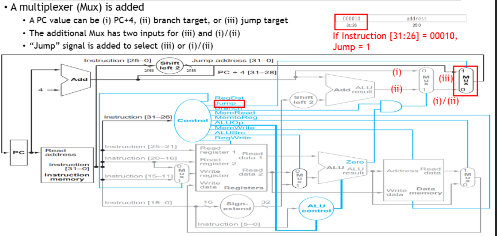

⚙ **Computer Architecture 공부**



이전에 본 datapath의 구현 모습이다
하지만 현대 프로세스는 이 구조를 사용하지 않는다!

❌**위 구현의 문제점**:  
1. **순자척 실행**: 한 번에 하나의 명령어만 처리 가능
2. **긴 실행 시간**: 각 명령어가 완전히 끝날 때 까지 다음 명령어 시작 불가
3. **자원 낭비**: 특정 시점에 일부 하드웨어만 사용됨

그럼 이를 해결하기 위한 이론을 먼저 알아보자

## AN ANALOGY OF LAUNDRY
---


* **세탁 과정의 단계**
1. 세탁기에 넣기(30분)
2. 건조기에 넣기(30분)
3. 개기 (30분)
4. 옷장에 넣기(30분)

#### Naive Approach
* 한 번에 하나의 빨래만 처리
* 총 4개의 빨래 → 8시간 소요 (4x2시간)
* 각 장비가 대부분의 시간 동안 놀고 있음!

#### Pipelined Approach


* 여러 빨래를 동시에 다른 단계에서 처리
* 첫 번째 빨래가 건조기로 가면, 두 번째 빨래를 세탁기에
* 총 시간: 3.5 시간으로 단축

### Response Time vs Throughput
---


왼쪽이 순차 처리 다이어그램이고 오른쪽이 파이프라인 처리 다이어그램이다.

각각 Response Time과 Throughput을 분석:

* **순차 처리**
  * **총 처리 시간**: 8시간
  * **각 작업 완료 시간**: 여전히 2시간
  * 대부분의 장비가 놀고 있어서 비효율적

* **파이프라인 처리**
  * **총 처리 시**간: 3.5시간
  * **각 작업 완료 시간**: 여전히 2시간
  * 모든 장비가 동시에 활용되므로 효율적

1. **<span style="color: #008000">Response Time</span>**
* **하나의 작업이 시작부터 완료**까지 걸리는 시간
* **Pipelining 영향 X**
* 세탁 예시: 작업 A는 여전히 2시간
* CPU 예시: 명령어 하나는 여전히 5 clock cycle

2. **<span style="color: #008000">Throughput</span>**
* 단위 시간당 완료할 수 있는 작업의 수
* **Pipelining으로 크게 개선!!**
* 세탁 예시: 0.5작업/시간 → 1.14 작업/시간 (2.3배 향상)
* CPU 예시: 5배까지 이론적 향상 가능

📚**<span style="color: #008000">Pipelining</span>**: **처리량을 극대화**하는 기술. 개별 작업의 속도는 빨라지지 않지만, **전체적인 작업 완료율을 크게 향상함**

## Five Stages of Datapath
---
#### 5단계 pipeline 구성
* **IF (Instruction Fetch)**: 메모리에서 명령어 가져오기
* **ID (Instruction Decode)**: 명령어 해석 및 레지스터 읽기
* **EX (Execute)**: 연산 수행 또는 주소 계산
* **MEM (Memory Access)**: 데이터 메모리 접근
* **WB (Write Back)**: 결과를 레지스터에 저장


* 명령어 실행 예시: `add $t1, $t2, $t3`


## Left-to-Right Flow
---
✅**Pipline이 가능한 이유**
* **순자척 진행**: 명령어가 왼쪽에서 오른쪽 순서대로 흐름
* **단방향성**: 뒤로 돌아가지 않음(세탁소에서 옷이 역행하지 않는 것과 같다)
* **독립성**: 각 단계가 서로 다른 하드웨어 유닛에서 수행

### Two Exceptions
---
**실제로는 데어티가 오른쪽에서 왼쪽으로 흘러야 하는 <span style="color: #008000">두 가지 중요한 예외</span>가 존재!**


##### <span style="color: #008000">WB Stage</span>
* WB 단계에서 레지스터에 결과를 저장
* 레지스터 파일은 datapath 중앙에 위치
* **ID 단계**에서 동시에 레지스터를 읽으려 할 수 있음
* **현재 ID 단계에 있는 명령어가 방금 계산된 결과를 필요**로 할 때 충돌 발생
  * 이전 명령어의 결과가 필요
  * 결과가 아직 준비 X
  * WB → ID 역방향 데이터 흐름 필요

* 예시:


##### <span style="color: #008000">Update o f PC (Branch)</span>
* **branch target address**는 EX 단계에서 계산됨
* PC는 IF 단계에서 사용됨
* 계산된 주소가 **다시 IF로 돌아가야 함**
* → **branch가 발생하면 이미 파이프라인에 들어온 명령어들을 취소**해야 함
  * 분기 방향이 확실하지 않음
  * 잘못된 명령어가 파이프라인에 진입
  * EX → IF 역방향 제어 흐름 필요

* 예시:


## NEED OF KEEPING INFORMATION OF INSTRUCTIONS
---
* 명령어 정보를 보존해야 한다
* 다음 명령어가 같은 단계에 들어오면 **이전 명령어의 정보가 손실됨**

```
@t    beq $t1,$t2,100    (분기 명령어)
@t+1  lw $s1,10($s2)     (로드 명령어)  
@t+2  3rd instruction
```

* `beq`가 `PC+4`(분기하지 않을 경우 다음 주소)를 필요로 함
* `lw`가 IF에 들어오면서 `PC+4` 값이 lw 기준으로 덮어씌워짐
* → `beq`가 정상 작동할 수 X

그래서 이 문제를 해결하기 위해 **<span style="color: #008000">Pipeline Registers</span>** 도입

## Pipeline Registers
---
📚**<span style="color: #008000">Pipeline Registers</span>**: 각 단계 사이에 파이프라인 레지스터를 배치해서 명령어 정보를 보존! - 세탁소의 **바구니**와 같다


* **IF/ID**: IF와 ID 단계 사이의 레지스터
  * 명령어, `PC+4`(다음 명령어 주소), 예외 정보 저장

* **ID/EX**: ID와 EX 단계 사이의 레지스터
  * 제어 신호(ALU, 메모리), 레지스터 데이터, 즉시값, 레지스터 주소, `PC+4`(분기 계산용)

* **EX/MEM**: EX와 MEM 단계 사이의 레지스터
  * ALU 결과, 메모리 제어, Store 데이터, 목적지 레지스터, 분기 정보

* **MEM/WB**: MEM과 WB 단계 사이의 레지스터
  * 메모리 데이터, ALU 결과, 목적지 레지스터, 레지스터 쓰기

✅**동작 원리**:  
1. **정보 저장**: 각 클록에서 현재 단계의 결과를 레지스터에 저장
2. **정보 전달**: 다음 클록에서 저장된 정보를 다음 단계로 전달
3. **독립성 보장**: 각 명령어가 독립적인 정보 공간을 가짐
