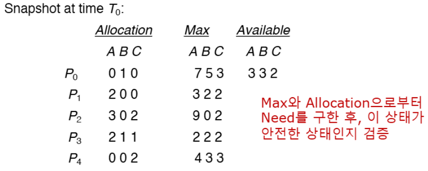

>🍀 운영체제 전공 수업 정리

## System Model
---
데드락에 대해 알아보기 전에 운영체제의 리소스가 어떻게 관리되는지 알아보자

시스템은 여러 종류의 리소스로 구성됨
* 리소스 타입: $R_1, R_2, ..., R_m$ (예: CPU cycle, memory space, I/O device)
* 각 리소스 타입 $R_i$는 $W_i$개의 인스턴스를 가진다.

✅프로세스가 리소스를 사용하는 3가지 단계:  
1. **request**
2. **use**
3. **release**

## Deadlock in Multithreaded Application
---
이제 **실제 deadlock이 어떻게 발생**하는지 코드를 통해 살펴보자

```c
pthread_mutex_t first_mutex;
pthread_mutex_t second_mutex;

pthread_mutex_init(&first_mutex, NULL);
pthread_mutex_init(&second_mutex, NULL);
```

💀 **deadlock** 발생 시나리오:  
1. Thread 1이 `first_mutex`를 획득
2. Thread 2가 `second_mutex`를 획득
3. Thread 1이 `second_mutex`를 기다림 (Thread 2가 보유 중)
4. Thread 2가 `first_mutex`를 기다림 (Thread 1이 보유 중)
→ 무한 대기 상태 발생!


> deadlock의 **resource allocation graph**

* thread_one이 `first_mutex`를 가지고 있는 상태로 `second_mutex`를 요청
* thread_two가 `second_mutex`를 가지고 있는 상태로 `first_mutex`를 요청
* deadlock이 발생할 수 있음!

* **<span style="color: #008000">deadlock</span>**: 스레드들이 완전히 멈춘 상태(아무것도 진행 X)
* **<span style="color: #008000">livelock</span>**: 스레드가 <u>정체된 상태는 아니지만</u> 계속 시도해도 진행이 안 되는 경우
  * ex: 마주 오던 두 사람이 같은 방향으로 피할 때, CSMA/CD

## Deadlock Characterization
---
✅**Deadlock 발생 필요조건**:  
1. **<span style="color: #008000">Mutual exclusion</span>**:
  * 한번에 하나의 프로세스만 자원 사용 가능 → 적어도 하나 자원 공유불가!
2. **<span style="color: #008000">Hold and wait</span>**:
  * 최소한 하나의 자원을 보유한 프로세스가 다른 프로세스가 보유한 추가 자원을 기다려야함
3. **<span style="color: #008000">No preemption</span>**:
  * Task가 완료한 후 자원을 release
4. **<span style="color: #008000">Circular wait</span>**:
  * 대기 중인 프로세스가 원형적으로 기다리는 구조(ex: 식사하는 철학자 문제)

{:.prompt-tip}
> 4가지 조건을 만족한다고 무조건 deadlock은 아니지만, deadlock일 때 4가지 조건을 모두 만족함!
>

### Resource-Allocation Graph
---
`P = {P₁, P₂, ..., Pₙ}` = 시스템 내 스레드/프로세스 집합
`R = {R₁, R₂, ..., Rₘ}` = 시스템 내 리소스 타입 집합

* $P_i$ → $R_j$ = **requset edge**
* $R_j$ → $P_j$ = **assignment edge**


> $T_1$: $R_2$ 인스턴스 1개 보유, $R_1$ 요청  
> $T_2$: $R_1$과 $R_2$ 인스턴스 각 1개 보유, $R_3$ 요청  
> $T_3$: $R_3$ 인스턴스 1개 보유

* 결과: **No cycle → No deadlock**


> T₁ → R₁ → T₂ → R₃ → T₃ → R₂ → T₁ : **cycle 존재!!!**

* **deadlock → cycle**  
* **nocycle → nodeadlock**
* **cycle →  deadlock/nodeadlock**
 

> **cycle → nodeadlock** 예시

* **<span style="color: #008000">single instacne</span>**(Ri의 리소스가 1개)인 경우
  * `deadlock ↔ cycle`
* **<span style="color: #008000">multiple instacne</span>**(Ri의 리소스가 여러개)인 경우
  * `deadlock → cycle`
  * `cycle → nodeadlock`

## Methods for Handling Deadlocks
---
✅**deadlock을 피하는 방법 4가지:**  
* **<span style="color: #008000">Deadlcok prevention</span>**
  * 필요조건 4개 중 적어도 하나 이상 차단
* **<span style="color: #008000">Deadlock avoidance</span>**
  * 필요한 자원에 대한 정보를 이용(각각의 스레드들이 얼마나 많은 자원이 필요한지)
*  **<span style="color: #008000">Deadlock detection</span>**
*  **<span style="color: #008000">Deadlock ignore</span>**
  * deadlock이 발생하지 않음을 가정하고 무시  
  * 대부분의 OS가 사용 → **비용이 저렴하기 때문!**

## Deadlock Prevention
---
📚**<span style="color: #008000">Deadlock Prevention</span>**: deadlock의 4가지 필요조건 중 적어도 힌 개 이상 만족 못하게 차단

* **Mutual Exclusion**:
  * 방법: 공유 가능한 자원 사용
  * 문제: 공유자원이 많아서 이 조건을 막는 것은 어려움!

* **Hold and wait**:
  1. 시작하기 전에 필요한 자원을 한꺼번에 할당
  2. 잡고 있는 자원이 없을 때만 자원을 요청
  * 문제: 자원 활용도 ↓, starvation 발생 가능

* **No preemption**
  1. 자원 할당이 불가능하면 **가지고 있는 자원을 다 내놓음**
  2. 대기 중인 프로세스의 자원을 반납하게 함
  3. 자원을 다 할당 받을 수 있을 때 프로세스를 다시 시작함

* **Circular Wait**
  * **가장 현실적인 방법**
  * 자원에 순번 부여, 그 순서대로 자원을 할당함
  * 1 → 2 는 가능하지만 그 반대는 X

### Circular Wait
* 각각의 리소스에 고유한 번호를 부여
* 그 번호 순서대로 자원을 할당


## Deadlock Avoidance
---
📚**<span style="color: #008000">Deadlock Avoidance</span>**: deadlock을 회피하기 위해서 자원 할당을 제어하는 방법

* 각 프로세스가 필요로 하는 자원의 **Maximum number를 미리 선언**해야함(a priori information)

### Safe State
---
어떠한 task를 끝내기 위해 "필요한" 자원의 개수를 미리 파악함
하지만 모든 프로세스가 리소스를 나눠가지기 때문에 deadlock 발생 가능함
왜냐면 모든 프로세스가 필요한만큼 자원을 나눠가지지 못하기 때문이다
모두가 필요한 자원을 위해 누군가가 반납하기를 기다림

그래서 `하나의 프로세스가 작업이 끝나고 자원 반납 → 다른 프로세스가 자원 반납`
이 순환이 **Safe state**이다

📚**<span style="color: #008000">Safe state</span>**: 시스템에 있는 모든 프로세스가 각자 필요한 자원을 사용할 수 있는 실행순서가 존재하는 상태


* `safe state → no deadlocks`
* `unsafe state → possibility of deadlocks`

시스템이 항상 안전한 상태에 남아 있도록 유지
즉, 시스템이 안전한 상태를 유지할 수 있을때만 자원을 공유


### Avoidance Algorithms
---
* **Single instance**의 경우
  * **<span style="color: #008000">resource-allocation graph</span>** 사용

* **Multiple instance**의 경우
  * **<span style="color: #008000">Banker’s Algorithm</span>** 사용

#### Resource-allocation Graph Scheme


> T2 → R2 할당해도 no cycle: 할당 허용!


#### Banker's Algorithm
다중 인스턴스 자원에서 deadlock을 회피하기 위한 알고리즘

* 각 프로세스가 사용할 자원의 최대치를 미리 선언
* 자원 요청 시마다 할당 후 **safe state 유지 여부를 검사**

✅**핵심 원리**:  
1. 프로세스가 자원을 요청하면 **일시적으로 할당**해본 후 안전 상태 검사
2. **안전하면 할당, 불안전하면 거부**하고 대기
3. 프로세스가 **모든 자원을 확보하면 유한 시간 내에 반드시 반납**

💾**데이터 구조**:  
* `n`: 프로세스 개수
* `m`: resource type 개수

* **Available**
  * 크기: `m`(자원 타입 수)
  * 의미: `Available[j] = k` → 자원 타입 Rj가 k개 사용 가능

* **Max**
  * 크기: `n x m`
  * 의미: `Max[i,j] = k` → 프로세스 Pi가 자원 타입 Rj를 최대 k개까지 요청 가능

* **Allocation**
  * 크기: `n x m`
  * 의미: `Allocation[i,j] = k` → 프로세스 Pi가 현재 자원 타입 Rj를 k개 할당받음

* **Need**
  * 크기: `n x m`
  * 의미: `Need[i,j] = k` → 프로세스 Pi가 작업 완료를 위해 자원 타입 Rj를 k개 더 필요
  * 계산: `Need[i,j] = Max[i,j] - Allocation[i,j]`

##### Safety Algorithm
**1단계: 초기화**

```
Work = Available (사용 가능한 자원 복사)
Finish[i] = false (모든 프로세스를 미완료로 설정)
```

**2단계: 완료 가능한 프로세스 찾기**

```
다음 조건을 만족하는 프로세스 i 찾기:
(a) Finish[i] = false (아직 완료되지 않음)
(b) Need_i ≤ Work (필요한 자원이 현재 가용 자원보다 적거나 같음)

조건을 만족하는 i가 없으면 → 4단계로
```

**3단계: 자원 회수 시뮬레이션**

```
Work = Work + Allocation_i (프로세스 i 완료 후 자원 회수)
Finish[i] = true (프로세스 i 완료 표시)
2단계로 돌아가기
```

**4단계: 결과 판정**

```
모든 i에 대해 Finish[i] = true이면 → 안전 상태
그렇지 않으면 → 불안전 상태
```

##### Resource-request Algorithm
**1단계: 유효성 검사**
```
Request_i ≤ Need_i 인가?
→ 아니면 에러 (최대 요구량 초과)
```

**2단계: 가용성 검사**

```
Request_i ≤ Available 인가?
→ 아니면 대기 (자원 부족)
```

**3단계: 할당 시뮬**

```
Available = Available - Request_i
Allocation_i = Allocation_i + Request_i  
Need_i = Need_i - Request_i
```

**4단계: safe state 검사**

```
안전 상태 알고리즘 실행
→ 안전하면: 할당 확정
→ 불안전하면: 원래 상태로 복구 후 대기
```

##### Example of Banker's Algorithm
---
* 프로세스: P0, P1, P2, P3, P4 (5개)
* resource: A(10개), B(5개), C(7개) (3types)

> 초기상태

* **Need 행렬 계산**: `Need = Max - Allocation`
```
      Need
      A B C
P0    7 4 3
P1    1 2 2
P2    6 0 0
P3    0 1 1
P4    4 3 1
```

✅**안전 순서 찾기**:  
**초기**: Work = (3,3,2), 모든 Finish = false

**1차 시도**:
* P1 검사: Need(1,2,2) ≤ Work(3,3,2) - `유효`
* P1 완료: Work = (3,3,2) + (2,0,0) = (5,3,2)

**2차 시도**:
* P3 검사: Need(0,1,1) ≤ Work(5,3,2) - `유효`
* P3 완료: Work = (5,3,2) + (2,1,1) = (7,4,3)

**3차 시도**:
* P4 검사: Need(4,3,1) ≤ Work(7,4,3) - `유효`
* P4 완료: Work = (7,4,3) + (0,0,2) = (7,4,5)

**4차 시도**:
* P0 검사: Need(7,4,3) ≤ Work(7,4,5) - `유효`
* P0 완료: Work = (7,4,5) + (0,1,0) = (7,5,5)

**5차 시도**:
* P2 검사: Need(6,0,0) ≤ Work(7,5,5) - `유효`
* P2 완료: Work = (7,5,5) + (3,0,2) = (10,5,7)

**결과**: 안전 순서 `< P1, P3, P4, P0, P2 >` 존재 → 안전 상태


##### Example: P1 request (1,0,2)
🔄 **P1이 (1,0,2) 요청하는 경우**  
**1단계**: Request(1,0,2) ≤ Need(1,2,2)? → 유효  
**2단계**: Request(1,0,2) ≤ Available(3,3,2)? → 가능  
**3단계**: 할당 시뮬레이션

```
Available = (3,3,2) - (1,0,2) = (2,3,0)
Allocation_1 = (2,0,0) + (1,0,2) = (3,0,2)
Need_1 = (1,2,2) - (1,0,2) = (0,2,0)
```

**4단계**: 안전 상태 검사 실행 → 안전 순서 발견 → ✅ 할당 승인

❌ **다른 요청들**:  
**P4가 (3,3,0) 요청**:
* Request(3,3,0) > Available(2,3,0) → 자원 부족으로 거부

**P0가 (0,2,0) 요청:**
* 할당 후 안전 상태 검사 → **unsafe state** → 거부

### Deadlock Detection
---
📚**<span style="color: #008000">Deadlock Detection</span>**: 시스템이 **deadlock 상태가 되는 것을 허용**
* Detection algorithm을 주기적으로 돌리는 형식
* 감지가 되면 deadlock회복을 위한 recovery scheme가 존재

✅**구성 요소**:  
1. **<span style="color: #008000">Detection Algorithm</span>**: deadlock 존재 여부 판별
2. **<span style="color: #008000">Recovery Scheme</span>**: deadlock 해결 방법

#### Single instance 경우
---
📚**Wait-for Graph**: Resource-Allocation Graph에서 **resouce node를 제거한 그래프**

* Process 노드만 존재
* `Pi → Pj` (Pi가 Pj를 기다림)

```
리소스 할당 그래프에서 Pi → Rk ∧ Rk → Pj 이면
Wait-for Graph에서 Pi → Pj
```

✅**탐지 방법**:  
* **주기적으로** Wait-for Graph에서 **cycle 탐지**
* cycle 존재 = deadlock 존재
* **시간 복잡도**:` O(n²)` (n: 프로세스 수)


> T1 → T2 → T4 → T1 cycle이 존재하니 deadlock!

#### Several instance 경우
---
> Banker's Algorithm과 유사

Max가 없는 대신 **현재 request를 need로 간주**, Banker's algorithm 실행  
→ unsafe state이면 deadlock으로 판정

✅**Detection Algorithm**:  
**1단계: 초기화**

```
Work = Available
Finish[i] = false (모든 i에 대해)

단, Allocation_i = 0이면 Finish[i] = true
(자원을 할당받지 않은 프로세스는 완료로 간주)
```

**2단계: 완료 가능한 프로세스 찾기**

```
다음 조건을 만족하는 프로세스 i 찾기:
(a) Finish[i] = false
(b) Request_i ≤ Work

조건을 만족하는 i가 없으면 → 4단계로
```

**3단계: 자원 회수**

```
다음 조건을 만족하는 프로세스 i 찾기:
(a) Finish[i] = false
(b) Request_i ≤ Work

조건을 만족하는 i가 없으면 → 4단계로
```

**4단계: deadlock 판정**

```
어떤 i에 대해 Finish[i] = false이면 → 데드락 존재
모든 i에 대해 Finish[i] = true이면 → 데드락 없음

Finish[i] = false인 프로세스들이 데드락에 관여
```

##### Example of Detection Algorithm
* process:  P0, P1, P2, P3, P4 (5개)
* resource type: A(7개), B(2개), C(6개) (3타입)
* 시간 T0에서 상태:
  
```
    Allocation    Request     Available
      A B C        A B C       A B C
P0    0 1 0        0 0 0       0 0 0
P1    2 0 0        2 0 2
P2    3 0 3        0 0 0
P3    2 1 1        1 0 0
P4    0 0 2        0 0 2
```

🔄 **알고리즘 실행 과정**:  
**초기화**:
* Work = Available = (0, 0, 0)
* P0, P2는 Request가 (0,0,0)이므로 요청 없음
* 나머지 프로세스들은 자원 요청 중

**1단계**: 요청 없는 프로세스 처리
* P0: Request(0,0,0) ≤ Work(0,0,0) ✅  
* Work = (0,0,0) + (0,1,0) = (0,1,0)
* P0 완료
* P2: Request(0,0,0) ≤ Work(0,1,0) ✅  
* Work = (0,1,0) + (3,0,3) = (3,1,3)
* P2 완료

**2단계**: 남은 프로세스들 검사
* P1: Request(2,0,2) ≤ Work(3,1,3) ✅  
* Work = (3,1,3) + (2,0,0) = (5,1,3)
* P1 완료
* P3: Request(1,0,0) ≤ Work(5,1,3) ✅  
* Work = (5,1,3) + (2,1,1) = (7,2,4)
* P3 완료
* P4: Request(0,0,2) ≤ Work(7,2,4) ✅  
* Work = (7,2,4) + (0,0,2) = (7,2,6)
* P4 완료

✅ **결과**:  
완료 순서: `< P0, P2, P3, P4, P1 >`
모든 프로세스 완료 가능 → No Deadlock!

##### P2가 추가 인스턴스 요청한 경우
* P2가 C 타입 자원 1개를 추가 요청:

```
    Allocation    Request     Available
      A B C        A B C       A B C
P0    0 1 0        0 0 0       0 0 0
P1    2 0 0        2 0 2
P2    3 0 3        0 0 1  ← 변경됨
P3    2 1 1        1 0 0
P4    0 0 2        0 0 2
```


> P1, P2, P3, P4가 데드락 상태

### Detection-Algorithm Usage
---
detection 알고리즘을 언제, 얼마나 자주 호출해야 할까??

1. **데드락 발생 빈도**
* 자주 발생 → 자주 검사 필요
* 드물게 발생 → 검사 빈도 낮춤

2. **롤백될 프로세스 수**
* 각 독립적인 **cycle마다 하나씩 롤백 필요**
* cycle이 많을수록 더 많은 프로세스 영향

Deadlock detection 알고리즘을 아무때나 수행하면 deadlock을 유발한 스레드를 식별하지 못할 수 있다.

반면에 자원요청이 실패할 때 deadlock detection 알고리즘을 수행하면 deadlock을 유발한 스레드를 식별하는데 도움이 된다.

### deadlock을 회복하는 방법
---
#### 1. **Process Termination**
**방법 1**: **<span style="color: #008000">All deadlock process 종료</span>**
* 확실하고 해결이 빠르지만 높은 비용, 많은 작업 손실 문제가 있음

**방법 2**: **<span style="color: #008000">한 번에 하나씩 종료</span>**
* 프로세스 종료 → detection algorithm 재실행 → 반복
* 최소한의 프로세스만 종료해서 작업 손실이 적음, 하지만 여러 번의 탐지 실행 필요

✅ **종료 프로세스 선택 기준**:  
1. **프로세스 우선순위**: 낮은 우선순위부터 종료
2. **실행 시간과 완료 예상 시간**: 짧게 실행되었거나 오래 걸릴 프로세스 우선
3. **사용한 자원의 양**: 적은 자원을 사용한 프로세스 우선
4. **완료에 필요한 자원**: 많은 자원이 필요한 프로세스 우선
5. **종료해야 할 프로세스 수**
6. **프로세스 타입**

{:.prompt-warning}
> 프로세스를 강제로 종료하면 시스템 불일치 상태가 발생할 수 있으므로 신중해야 함
>

#### 2. Resource Preemption
1. **<span style="color: #008000">Selecting a Victin</span>**: 비용 최소화
2. **<span style="color: #008000">Rollback</span>**: deadlock 발생 이전 시점(safe state)으로 복귀, 안전한 상태에서 restart
3. **<span style="color: #008000">Starvation Prevention</span>**
* 문제: **동일한 프로세스가 계속 희생자로 선택**
* 해결: **롤백 횟수를 비용 계산에 포함**