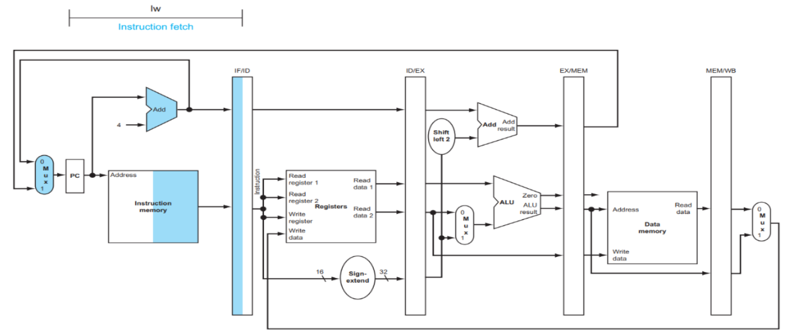
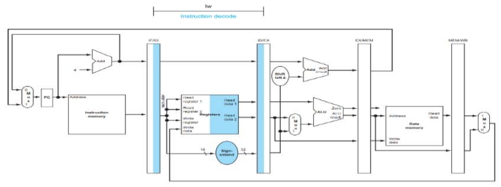
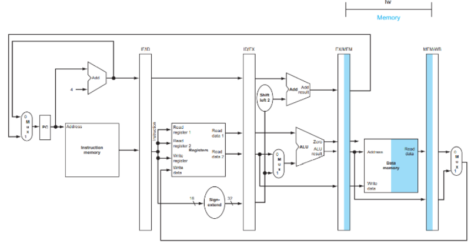
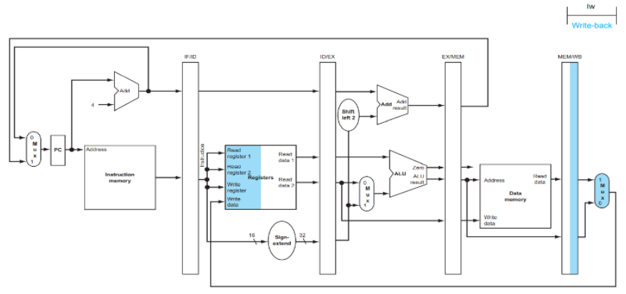
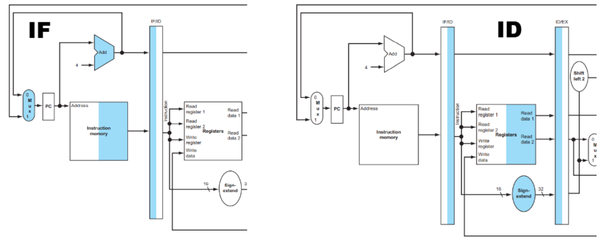
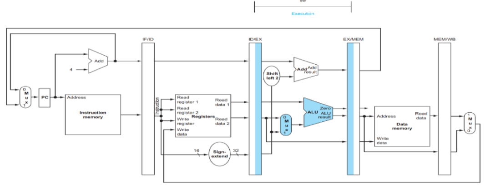
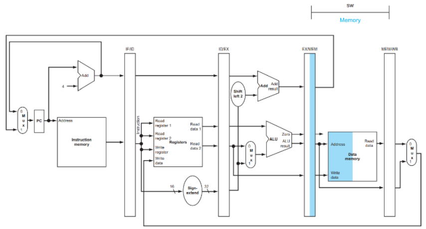

⚙ **Computer Architecture 공부**

이전 게시물을 정리해보자면:
Pipeline은 마치 **공장의 컨베이어 벨트**이다.
* 세탁 → 건조 → 다림질 → 포장
* 각 단계가 동시에 다른 옷들을 처리할 수 있음

✅**프로세서에서는 5단계로 나뉜다**:  
1. **<span style="color: #008000">IF(Instruction Fetch)</span>**: 명령어 가져오기
2. **<span style="color: #008000">ID (Instruction Decode)</span>**: 명령어 해석하기
3. **<span style="color: #008000">EX (Execute)</span>**: 실행하기
4. **<span style="color: #008000">MEM (Memory Access)</span>**: 메모리 접근하기
5. **<span style="color: #008000">WB (Write Back)</span>**: 결과 저장하기

📝각 단계 사이에는 **Pipeline Register**가 존재:  
* `IF/ID`, `ID/EX`, `EX/MEM`, `MEM/WB`

## LW INSTRUCTION IN PIPELINED DATAPATH
* **예시 명령어**: `lw $t1, 100($t2)` (메모리 [$t2 + 100]의 값을 $t1에 저장)
---
### 1. IF (Instruction Fetch)
---
* PC가 가리키는 주소에서 명령어 읽기
* 현재 예시: PC = 0x00400000에서 `lw $t1, 100($t2)` 가져옴
* `PC+4`로 다음 명령어 주소 계산

* **IF/ID 레지스터**에 저장되는 데이터:
  * **명령어**: 32bits lw 명령어
  * `PC+4`: 다음 명령어 주소 (**beq 명령어를 위해 보관**)


### 2. ID (Instruction Decode)
---
* 명령어 분석: 이것은 LW 명령어임을 식별
* `base register $t2`의 값을 읽음
* 16-bit offset 100dmf 32-bit로 **부호 확장**

* 부호 확장 예시:
  * 16비트: `0000000001100100 (100)`
  * 32비트: `00000000000000000000000001100100 (100)`

* **ID/EX 레지스터**에 저장되는 데이터:
  * base register value: $t2의 32-bit 값
  * 부호확장된 오프셋: 32-bit로 확장된 100
  * target register: $t1 (나중에 쓰기 위해)



### 3. EX (Execute)
---
* **주소 계산**: `base register` + `sign-extended offset`
* 계산식: `$t2`의 값 + 100 = target data memory address
  * 예시:  0x10010000 + 100 = 0x10010064

* **ALU 연산:** 
```
입력1: $t2 = 0x10010000 (베이스 주소) 
입력2: 100 = 0x00000064 (오프셋) 
출력: 0x10010064 (최종 메모리 주소)
```

* **EX/MEM 레지스터**에 저장되는 데이터:
  * 계산된 target data memory address: `0x10010064`
  * **target register**: $t1 (여전히 보관중)


### 4. MEM (Memory Access)
---
* **메모리 읽기**: 주소 `0x10010064`에서 데이터 읽기
* **읽은 데이터**: `32-bit word`
* **이 단계에서만 실제로 메모리에 접근!**

* **MEM/WB register**에 저장되는 데이터:
  * 읽은 데이터 (예: 0x12345678)
  * target register: `$t1`



### 5. WB (Write Back)
---
* **최종 단계**: 데이터를 target register에 저장
* `$t1` register에 0x12345678 저장
* **LW 명령어 실행 완료!**

* **최종 결과**

```
$t1 = 0x12345678 (메모리에서 읽은 값)
전체 과정 요약: lw $t1, 100($t2)
✅ → $t1 = Memory[$t2 + 100]
```



📝**LW 명령어 5단계 요약**:  
1. **IF**: PC에서 명령어 가져오기, PC+4 계산
2. **ID**: 명령어 해석, 레지스터 읽기, 부호확장
3. **EX**: ALU로 메모리 주소 계산 (베이스 + 오프셋)
4. **MEM**: 계산된 주소에서 데이터 읽기
5. **WB**: 읽은 데이터를 목적지 레지스터에 저장

## SW INSTRUCTION IN PIPELINED DATAPATH
---
* **예시 명령어**: `sw $t1, 200($s0)` - 메모리 [$s0 + 200] 주소에 `$t1`값 저장
* LW 명령어와 다르게 WB 단계에서 아무것도 안함(**NO Write Back**)

### 1. IF/ID (공통 단계)
---
* **IF stage**: 명령어 가져오기
  * PC가 가리키는 주소에서 SW 명령어 읽기
  * PC + 4로 다음 명령어 주소 계산
  * **모든 명령어에 동일한 과정!**

* **ID stage**: 명령어 해석 & 레지스터 읽기
  * 명령어 분석: **sw명령어**임을 식별
  * 두 개의 register 읽기:
    * base register: `$s0`(주소 계산용)
    * source register: `$t1`(저장할 데이터)
  * offset을 32bit sign-extended value로 만듦 

* **IF/ID register 저장 데이터**: SW instruction (32bit), PC+4
* **ID/EX register 저장 데이터**: `$s0`의 값(base address), `$t1`의 값(저장할 데이터), 부호확장된 offset(200)


### 2. EX (Execute)
---
* ALU에서 **메모리 주소 계산 단계**:
* **주소 계산**: `$s0 + offset` = memory address
  * 계산과정: `0x10010000(베이스 주소) + 200(0x000000C8) = 0x100100C8`
* source register(`$t1`)의 데이터도 다음 단계로 전달

* **EX/MEM register 저장 데이터**: 계산된 메모리 주소(0x100100C8), 저장할 데이터(`$t1`의 값)
* 
🔄 **LW vs SW 차이점 (EX 단계)**  
LW는 **주소만 계산해서 전달**하지만, SW는 **주소+저장할 데이터 모두 전달**


### MEM (Memory Access)
---
* **data memory에 쓰기 단계**:
* **메모리 쓰기**: 주소 `0x100100C8`에 데이터 저장
  * 저장할 데이터: `$t1`값
* **실제 메모리 접근이 일어나는 유일한 단계!**

```
메모리 쓰기 동작: 주소: 0x100100C8 
쓰기 데이터: $t1(예:0x12345678) 
메모리 상태 변화: 
  이전: Memory[0x100100C8] = ??? (알 수 없음)
  이후: Memory[0x100100C8] = 0x12345678
```

* **MEM/WB register 저장데이터**: **SW명령어는 레지스터에 쓸 데이터가 없음!!** - 비어있거나 의미없는 값

🔄 **LW vs SW 차이점 (MEM 단계)**  
* **LW**: 메모리에서 데이터를 읽어서 MEM/WB에 저장
* **SW**: 메모리에 데이터를 쓰고, WB용 데이터는 없음  


### WB (Write Back)
---
* SW명령어 특징: 레지스터에 쓸 데이터가 없음
* WB 단계에서는 아무 작업도 수행 X
* 하지만 **파이프라인 동기화를 위해 단계는 거쳐감!**