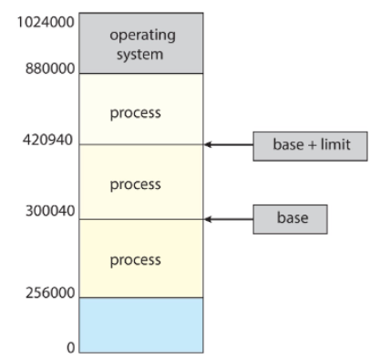
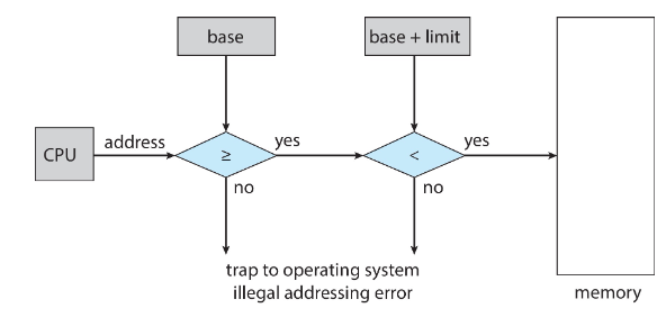
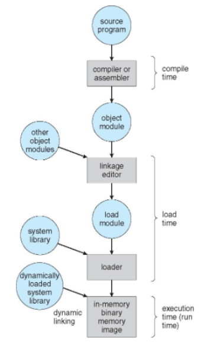
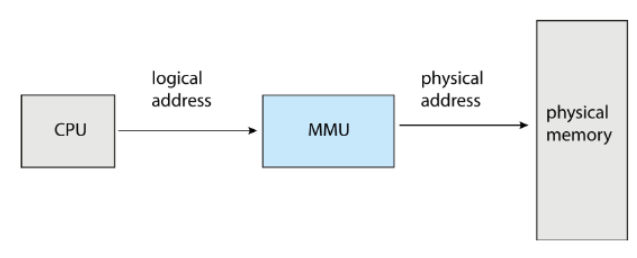
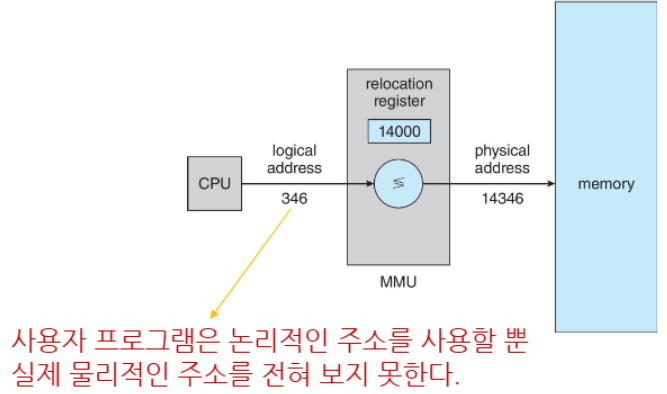
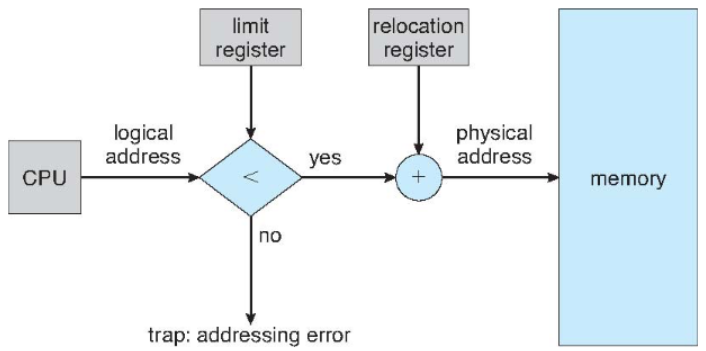
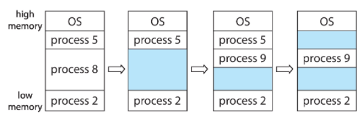

>🍀 운영체제 전공 수업 정리

프로그램을 실행하기 위해선 디스크에서 메인 메모리로 프로그램을 불러들여야함(프로세스 형태로 존재)

* **Main memory and register**: CPU가 직접 조회할 수 있는 유일한 저장소
* **메모리 접근 속도**: 레지스터 접근은 **one CPU clock (or less)**로 완료됨 → 굉장히 빠름, 메인 메모리는 여러 클럭 필요(`stall`때문!)
* **Cache**의 역할: 메인 메모리와 CPU register 사이의 속도 차이를 줄이는 중간 저장소

* **Memory unit의 역할**:
  * addresses + read requests
  * addresses + data and write requests

## Protection
---
멀티 태스킹 환경에서 각 프로세스는 자신만의 메모리 공간을 가져야 하고, 
다른 프로세스의 메모리에 함부로 접근 X. 
이를 위해 **Base and Limit register** 방식 사용

* **Base and Limit register**: 각 프로세스를 저장하려 할때 `base(시작점)`와 `limit(크기)`를 정해서 저장함
  * `Base register`: 프로세스가 접근 가능한 메모리의 **시작 주소**
  * `Limit register`: 프로세스가 접근 가능한 메모리의 **크기**
  * 유효 주소 범위: `Base ≤ 주소 < Base + Limit`

> 임의 Process는 주소 300040부터 시작  
> 접근 가능한 최대 주소 420940

### Hardware address Protection
---
CPU가 메모리에 접근하려면 address가 `base`와 `limit`사이에 있는 값이어야 함

> `address ≥ base` 조건 확인  
> `address < base + limit` 조건 확인  
> * 두 조건을 모두 만족하면 → 메모리 접근 허용
> * 하나라도 위반하면 → 운영체제로 **트랩(trap) 발생**

* Base and Limit 레지스터 설정은 **privilege instruction**
  * 이 레지스터를 OS는 설정 가능하지만, 사용자 프로그램은 변경 X

## Address Binding
---
📚**Address Binding**: 프로그램의 주소를 계산하고 메모리 주소로 연결하는 과정

✅**주소의 진화 과정**:  
* **Source code**: symbolic address(변수명, 함수명)
* **Compile code**: relocatable address(상대적 위치)
  * symbolic도 쓰긴 씀
* **Linker or loader**: absolute addresses 사용 (메모리를 불러올 때 주소 지정)

현대에는 실제로 사용하게 될 때 주소를 할당하게 됨

✅**Binding이 발생하는 3가지 시점**:  
1. **Compile time**
  * 메모리 위치가 **미리 알려진 경우**
  * **absolute code 생성**
  * 시작 위치가 변경되면 재컴파일 필요

2. **Load time**
  * 컴파일 시 메모리 **위치를 모르는 경우**
  * **relocatable code 생성**
  * loader가 최종 주소 결정

3. **Execution time**(현대 방식)
  * 실행 중 프로세스가 다른 메모리 세그먼트로 이동 가능
  * swapping, paging 시스템에서 사용
  * 하드웨어 지원(가상메모리 개념)이 필요함(**MMU - Memory Management Unit**)

📝**처리 단계별 설명**:  
1. **Compile Time**
* 소스 프로그램 → 오브젝트 모듈 변환
* 컴파일러/어셈블러가 수행
* 심볼릭 주소를 재배치 가능 주소로 변환

2. **Load Time**
* 링키지 에디터: 여러 오브젝트 모듈을 결합하여 로드 모듈 생성
* loader: 시스템 라이브러리와 결합하여 메모리에 로드
* 재배치 가능 주소를 절대 주소로 변환

2. **Execution Time**
* Dynamic Linking: 필요할 때만 라이브러리 로드
* 실행 중 주소 변환 (가상 메모리 시스템)

### Logical vs Physical Address Space
---
* **Logical address**: CPU에 의해 생성됨 → main memory의 주소가 아님! 즉, **가상주소**라는 뜻
  * 프로그래머와 프로그램이 보는 메모리 주소

* **Physical address**: 실제 메모리 하드웨어가 보고, RAM에서 실제로 사용되는 주소
  * memory unit이 보는 주소

{:.prompt-warning}
> 원래는 논리적인 주소와 실제 주소가 같지만(compile/load time) 그런데 실행하게 되면 논리 주소와 물리 주소가 달라짐
>

### Memory-Management Unit(MMU)
---
📚**MMU**: 논리 주소를 물리 주소로 바꿔주는 역할
* 물리 주소 = 논리 주소 + Relocation Register 값

> **프로세스 A의 Relocation Register = 14000**  
> **프로세스 B의 Relocation Register = 30000**  
> 
> **프로세스 A 실행 중:**  
> **CPU 생성 논리 주소: 346**  
> **MMU 변환: 346 + 14000 = 14346 (물리 주소)**  
> 
> **프로세스 B 실행 중:**  
> **CPU 생성 논리 주소: 346 (같은 논리 주소!)**  
> **MMU 변환: 346 + 30000 = 30346 (다른 물리 주소)**  

➡ **같은 논리 주소가 다른 물리 위치를 가리킴 (프로세스 독립성)**

### Dynamic Loading
---
전체 프로그램이 한번에 필요한 경우는 거의 없으니 한번에 모두 memory에 할당할 필요 X

📚**Dynamic Loading**: 필요할 때만 프로그램 일부분을 메모리에 로드하는 기법

* 전체 프로그램을 미리 메모리에 로드 X
* **Routine이 호출될 때만 해당 루틴을 메모리에 로드**
* 모든 routine은 디스크에 **relocatable**한 형태로 저장

✅**장점**:  
* 메모리 효율성
* 대용량 프로그램 지원

### Dynamic Linking
---
📚**Dynamic Linking**: **프로그램 실행 시점에 라이브러리를 연결**하는 기법
load한 바이너리 안에 내가 만들지 않은 코드를 활용하게 하는 것(ex: library)

* **Static linking**: 라이브러리 코드를 실행 파일에 포함
* **Dynamic linking**: 실행 시점에 필요한 라이브러리를 메모리에 로드

* **stub code**: 작은 코드 조각, 실제 라이브러리 함수의 '대리인' 역할
  * 프로그램이 라이브러리 함수를 호출하면 stub이 실제 함수의 위치를 찾아 연결함

* OS는 dynamic linking에서 **주소 공간 관리**, **라이브러리 로딩**, **주소 연결**을 담당

* Dynamic linking = **shared libraries**
  * 여러 프로그램이 동시에 같은 라이브러리 사용 가능
Dynamic loading과 달리 **dynamic linking과 shared libraries는 OS의 도움이 필요**

## Contiguous Memory Allocation
---
📚**Contiguous Memory Allocation**: 프로세스를 필요한 메모리에 대해 쪼개진 것이 아니라 **연속적인 메모리를 할당하는 것**

✅Main memory는 두가지로 구분됨:  
1. **Low memory**: 운영체제가 위치(interrupt vector 포함)
2. **High Memory**: 사용자 프로세스들이 위치
* 각 프로세스는 **single contiguous section**에 배치
  * 논리적으로는 연속적인 메모리이지만 물리적으로는 그렇지 않을 수도 있음

> 현대 사용 형태는 아님

* **Relocation Register**
  * 프로세스의 시작 물리 주소를 저장
  * 논리 주소를 물리 주소로 변환: `physical address = logical address + Relocation Register`
* **Limit Register**
  * 프로세스가 사용할 수 있는 최대 논리 주소 저장
  * 메모리 접근 보호: `logical address < Limit Register`

### Varible Partition
---
partition의 개수 때문에 동시 실행 가능한 프로세스 수가 제한된다
더 많은 프로세스를 실행하려면 더 많은 파티션 필요!

그래서 효율성을 위해 각 프로세스의 실제 크기에 맞춰 partition 크기를 조정하는게 **Varible Partition**

✅**동작 원리**:  
* **Hole 관리**
  * **Hole**: 사용 가능한 memory block, 다양한 크기가 메모리 전체에 분산되어있음
  * **동적 할당**: 프로세스 도착 시 **충분히 큰 hole에서 필요한 만큼만 할당**
  * **자동 결합**: 프로세스 종료 시 **인접한 빈 파티션들이 자동으로 하나의 큰 hole로 통합**

* **OS의 역할**
  * **allocated Partiion**: 각 프로세스의 위치, 크기, ID 정보 관리
  * **free partitions(Hole)**: 사용 가능한 메모리 블록의 위치와 크기 정보 관리 

> process 8이 종료(hole로 변환)된 후 9번이 요청되고 들어옴  
> 그 뒤에 5번이 종료됨(new hole)  
> 여러 개의 hole이 분산 존재

그럼 남은 hole들에 프로세스를 어떻게 할당해야 좋을까?

👍그 방식에는 3가지가 알고리즘 존재:  
1. **First-FIt**: **첫 번쨰로 요청 크기보다 큰 hole을 발견하면 즉시 할당**
2. **Best-FIt**: 할당했을 때 남는 조각이 가장 작은 곳부터 할당해줌
3. **Worst-FIt**: 가장 큰 곳에서 잘라줘서 할당

일반적으로는 First, Best Fit만 사용하고 worst는 비교를 위해 존재
First-Fit이 가장 빠름

위의 예시와 알고리즘들은 메모리의 Hole이 **연속적이지 않고**, 구멍이 나있는 형태를 띤다.

{:.prompt-warning}
> 효율성을 위해 hole들을 연속적으로 만들어야하는데 어떻게 해야할까?
>

### Fragmentation
---
* **External Fragmentation**: **빈 공간이 충분**하지만 **너무 작고 연속적이지 않아서** 못쓰는 공간
  * Variable partition에서 프로세스들이 종료되며 메모리 곳곳에 작은 hole들이 분산

* **Internal Fragmentation**: 원하는 만큼 할당해줬는데 다 활용하지않고 냅두는 공간(200요청 후 100만 사용)
  * 파티션 내부에서 사용되지 않는 공간

* **50-percent rule**: `First-Fit`은 N개의 블록이 할당되었다면 평균 0.5N개의 블록이 조각나서 사용할 수 없다는 분석이 존재
이렇게 되면 전체에서 **0.5N/(N+0.5N) = 1/3 = 33%**의 손실률 발생

external fragmentation을 줄이기 위해 **compaction**을 해야함

* **Compaction**: 메모리 내용 재배치
  * 모든 빈 공간을 하나의 큰 블록으로 통합
  * 프로세스들을 메모리 한쪽 끝으로 이동
  * → 연속된 큰 여유 공간 확보

❌**제약 조건 존재**  
1. **동적 재배치 필요**
* **Static relocation**: 컴파일 시 주소 고정 → Compaction X
* **Dynamic relocation**: 실행 시 주소 변환 → Compaction O

2. **실행 시점 제약**
* Compaction은 실행 중에만 수행 가능(load 시점에는 수행 X)

3. **I/O 문제**
* I/O 진행 중인 프로세스는 메모리에서 이동 불가
* I/O를 실행 중에 조각모음을 하게 되면 버퍼의 위치가 변경되서 문제가 발생
  * **해결책 1**: I/O 중인 job을 메모리에 latch (고정)
  * **해결책 2**: **I/O를 OS 버퍼로만 수행**

* main memory 말고도 **backing store도 동일한 단편화 문제가 존재**