>🍀 운영체제 전공 수업 정리

메모리를 관리할 때 필요한 메모리를 임의로 할당하고 free시키면 여러가지를 한다

{:.prompt-tip}
> 관리를 쉽게 하려면 메인 메모리를 동일한 규격으로 잘라놓고 사용하는 것이다!
>

## Paging(⭐)
---
📚**<span style="color: #008000">Paging</span>**: Main memory를 동일한 규격으로 잘라서 그 단위로 할당하고 관리한다
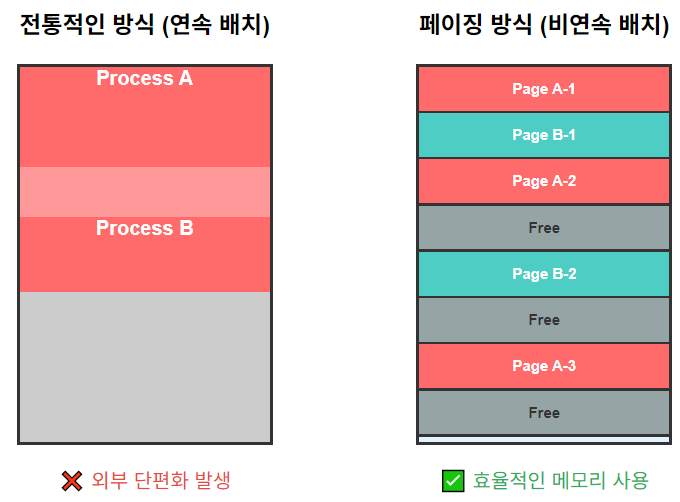

* **frames**: 물리 메모리를 고정 크기로 나눈 블록 
* **pages**: 논리 메모리를 frame과 같은 크키로 나눈 블록
* **page table**: 물리적인 주소를 논리적인 주소로 바꾸기 위한 매핑 table

### Address Translation Scheme
---
page 단위로 자른 주소를 보면 위치에 대한 정보가 담겨있다

* **Page Number**: 논리 주소의 상위 비트, page table의 인덱스로 사용
* **offset**: 논리 주소의 하위 비트, page/frame 내에서의 위치

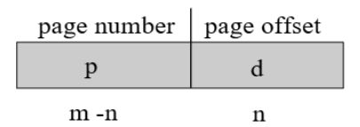
> logical address 구조  
> page size(offset) = $2^n$  
> page number = $2^(m-n)$ 

전체가 메모리 주소이고 만약 page size가 4KB라면 그 page 내에 위치를 표시하려면 12bits가 필요함
그럼 32-bit 시스템의 경우 page number = 32 - 12(page offset) = 20bits가 된다

`물리주소 = (페이지테이블[p] × 2^n) + d`

### Paging Hardware(⭐)
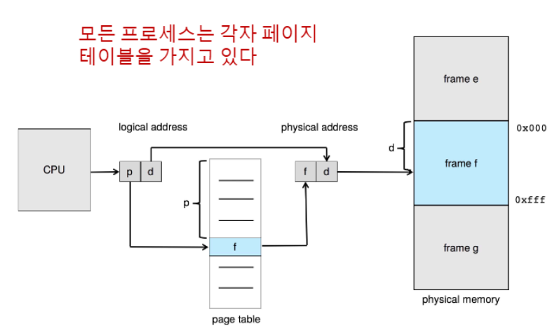

`p|d` 의 물리적 공간은 `f|d`이고 frame `f`에 저장된다
이걸 하기위해 **<span style="color: #008000">page table</span>**이 필요하다

또한 **모든 프로세스는 각자 page table을 가지고 있다**

* **Paging Model**:
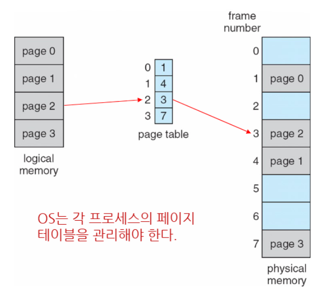

한 프로세스가 4개의 page를 쓰고 있다
각 page가 page table을 통해 논리적인 주소에서 물리적인 주소로 매칭된다

✅**동작 과정**:  
1. CPU가 논리 주소를 생성하면, 이를 페이지 번호(p)와 오프셋(d)으로 분할
2. 페이지 번호를 인덱스로 사용하여 페이지 테이블에서 해당하는 프레임 번호를 찾음
3. 찾은 프레임 번호와 원래 오프셋을 결합하여 물리 주소 생성
4. 생성된 물리 주소를 메모리에 전송하여 실제 데이터에 접근

#### Paging Example
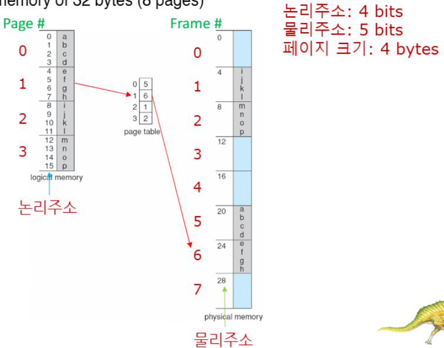
> 물리주소는 논리주소보다 커도 상관X

* 논리 주소 4bits = 16가지 주소 값 표현 가능(각 주소가 1byte를 가리킴)
* page size: 4bytes

#### Pageing- Internal Fragmentation 계산

```
Page size = 2,048 bytes (2KB)
Process size = 72,766 bytes

72,766 / 2,048 = 35.52..
→ 36개 page 필요

나머지 = 72,766 - 35pages(71,680) = 1,086 bytes(마지막 1,086만 씀)
→ 2,048 - 1,086 = 962 bytes를 안씀!
```

* **Worst case fragmenation** = 1 frame - 1 bytes
* **Average fragmentation** = 1/2 frame size

frame size를 작게 할수록 **page table entry가 증가**
가장 인기있는 page size는 4KB and 8KB

{:.prompt-tip}
> page table에는 frame 값 이외에도 추가 정보를 저장할 공간이 충분해야함
>

##### Free frames
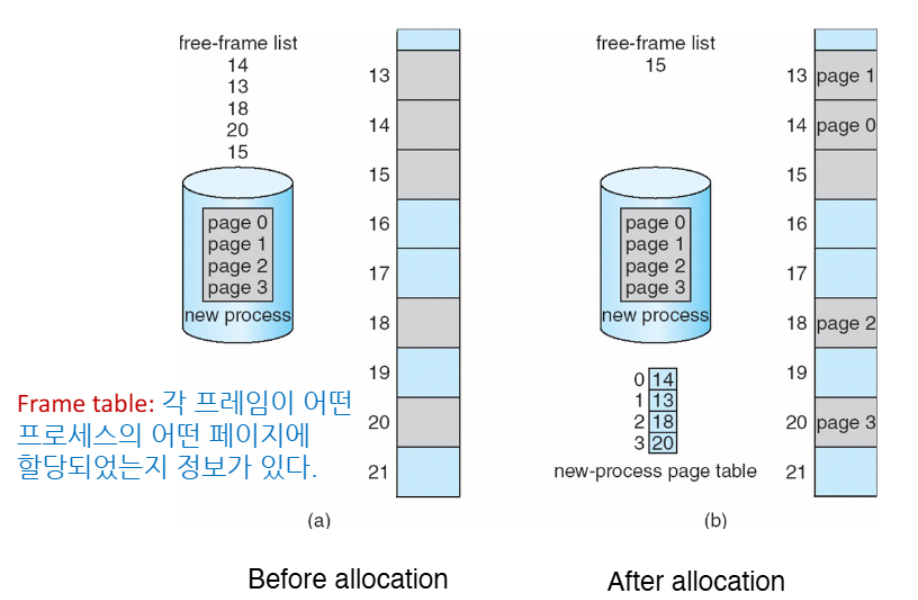
> 프레임 할당 과정

* 새 프로세스가 4개 page를 필요
* 할당 후에 free frame이 15 밖에 안남음

### Implementation of Page Table
---
* **<span style="color: #008000">Page-table base register (PTBR)</span>**: page table의 시작 주소를 가리키는 레지스터
* **<span style="color: #008000">Page-table length register (PTLR)</span>**: page table의 size를 나타내는 레지스터

❌메모리 접근 문제점:  
* 모든 data/instruction access를 요청하면 **최소 2번의 메모리 조회가 일어난다**
  1. page table에 접근하여 물리 주소 변환 정보 획득
  2. 실제 data/instruction 접근

그걸 해결하기 위해 **Translation look-aside buffers(TBLs)**이 있다

#### Translation look-aside buffers(TBLs)
---
📚**<span style="color: #008000">Translation look-aside buffers(TBLs)</span>**: 최소 두번의 메모리 조회의 시간을 줄이기 위해 빠르게 조회하기 위한 **cache**
* **최근에 사용된 페이지 변환 정보를 빠르게 저장함**
* → 페이지 테이블에 다시 접근할 필요 X, 즉시 physical address 획득 가능

✅**특징**:  
1. **ASID(Address Space Identifier)**
* 각 프로세스를 식별하는 고유 ID
* 프로세스 간 주소 공간 보호 제공
* ASID가 없으면 **context switch 때마다 TLB를 모두 비워야 함 (`flush`)**

2. **TLB 크기와 성능**
* 일반적으로 64~1024개의 엔트리
* **작지만 매우 빠른 접근 속도**
* Intel Core i7 예시: `L1 instruction TLB(128개) + L1 data TLB(64개) + L2 TLB(512개)` - **계층 구조**를 가지기도 함

3. **Replacement Policy**
* **TLB가 가득 찰 때** 어떤 entry를 제거할지 결정
* `LRU`, `FIFO`, `Random` 등의 정책 사용
* 일부 엔트리는 "<span style="color: #008000">wired down</span>" 가능 (영구 보존)

##### TLB hardware
* **Associative Memory (연관 메모리) - 병렬 검색 가능**
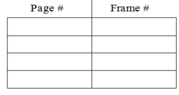

* 모든 엔트리를 동시에 검색
* 페이지 번호가 일치하는 엔트리를 즉시 찾아냄

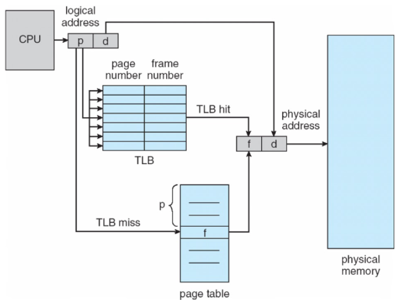

* **TLB Hit**: 메모리 접근 1회(매우 빠름)
* **TLB Miss**: 메모리 접근 2회(상대적으로 느림)

### Effective Access Time(EAT)
---
📚**<span style="color: #008000">Effective Access Time(EAT)</span>**: TLB의 적중률을 고려한 실제 평균 메모리 접근 시간

📝**EAT 계산 공식**

```
EAT = (Hit Rate × Hit Time) + (Miss Rate × Miss Time)
```

`80% hit ratio`의 시스템이 메모리 접근이 `10ns`가 걸린다 가정:
* Hit 시간: `10ns`
* Miss 시간: `20ns`
* 적중률: `80%`
* **EAT = 0.80 x 10 + 0.20 x 20 = 12ns**
* 성능 저하 20%

* 만약 고성능 시스템이라 `99% hit ratio`라면
* * **EAT = 0.99 x 10 + 0.01 x 20 = 10.1ns**
* 즉, 성능 저하가 1%에 불과함

### Memory Protection
---
📚**<span style="color: #008000">Memory Protection</span>**: 프로세스가 허용되지 않은 메모리 영역에 접근하는 것을 방지

* **protection bit**를 이용함!
1. `read-only`
2. `read-wirte`
3. `execute-only` 등이 있음

* page table에서 엔트리 존재여부를 확인할 때 **<span style="color: #008000">Valid/Invalid bit 또는 page-table length register(PTLR)</span>** 이용!
  
* `1(valid)`: 페이지가 프로세스의 주소 공간에 속함
* `0(invalid)`: 할당되지 않은 메모리 영역


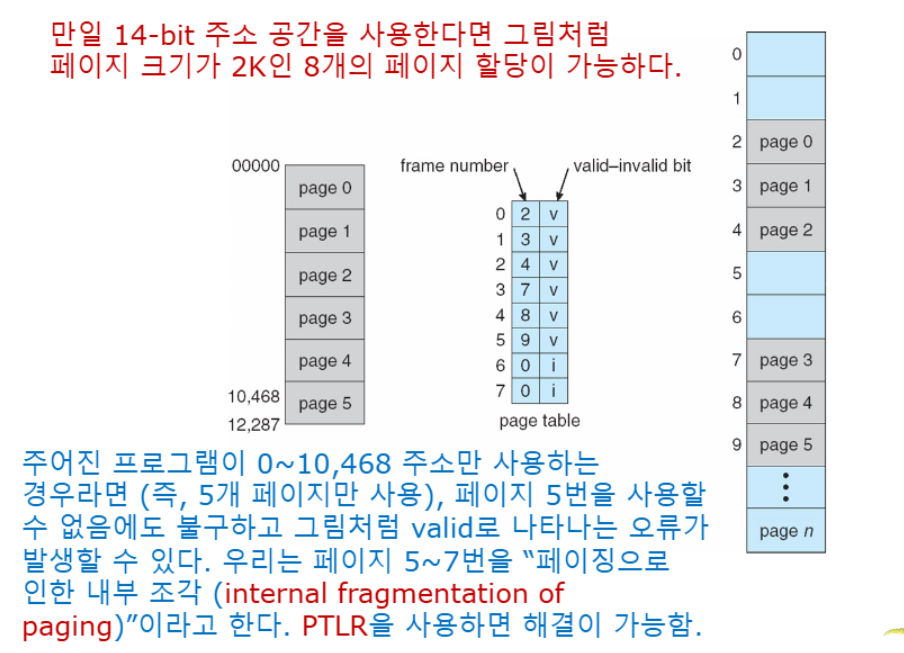

### Shared Pages
---
📚**Shared Pages**: **reentrant(재진입 가능) code**, 읽기 전용으로 설정, 여러 프로세스가 동시 사용 가능  
(ex: text editors, compilers, shared libraries)

* **개별 코드 및 데이터(shared data)**:각 프로세스별 독립적인 사본, read-write 가능 (ex: 전역 변수, 정적 변수)

✅**Reentrancy의 중요성:**  

```c
// ❌ 재진입 불가능한 함수 (전역 변수 사용)
static int counter = 0;
int bad_function() {
    counter++;  // 여러 프로세스가 동시 호출 시 문제!
    return counter;
}

// ✅ 재진입 가능한 함수 (지역 변수만 사용)
int good_function(int input) {
    int local_var = input * 2;  // 안전함
    return local_var;
}
```

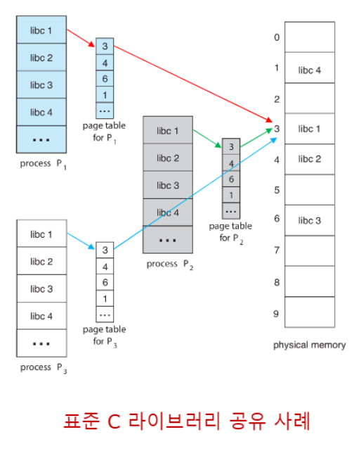

## Structure of the Page Table
---
우리가 위에서 알아본 page table에는 문제가 있다.

**32-bit 시스템에서 4KB 페이지를 사용**한다 가정:
* **전체 주소 공간**: %2^32% = 4GB
* **페이지 크기**: 4KB = 2¹²
* **총 페이지 수**: 2³²/2¹² = 2²⁰ = 1,048,576개
* **페이지 테이블 엔트리**: 각 4bytes
* **페이지 테이블 크기**: 4 × 2²⁰ = 4MB

❌문제점:  
* 프로세스마다 **4MB의 연속된 메모리가 페이지 테이블용으로 필요**
* 하지만 대부분의 프로세스는 전체 주소 공간을 사용 X(즉, 공간낭비)
* 메모리 부족 상황에서는 큰 부담

이를 해결하기 위한 방법 3가지:  
1. **<span style="color: #008000">Hierarchical Paging</span>**
2. **<span style="color: #008000">Hashed Page Tables</span>**
3. **<span style="color: #008000">Inverted Page Tables</span>**

### Hierarchical Paging
---
📚**<span style="color: #008000">Hierarchical Paging</span>**: page table을 paging 하는 것!


#### Two-Level Paging Example
---
4KB page size의 32-bit 시스템에서 논리 주소의 구조는 다음과 같음:
* 전체 주소 공간: 2^32 bytes(4GB)
* **page number** = 20-bits → 2^20 개
* **page offset(페이지 크기)** = 4KB (12-bits → 2^12bytes)

* page number, 즉 페이지를 다시 나눔:

```
32-bit logical address = [10bits][10bits][12bits]
                           p₁       p₂      d
```

* `p₁` (10bits): **Outer Page Table** 인덱스
* `p₂` (10bits): **Inner Page Table** 내에서의 **오프셋**
* `d` (12bits): 페이지 내 오프셋


✅**변환 과정**:  
1. p₁으로 Outer Page Table에서 Inner Page Table 주소 찾기
2. p₂로 Inner Page Table에서 물리 프레임 번호 찾기
3. 프레임 번호 + d로 최종 물리 주소 생성

#### Three level Paging Example
---
4KB page size의 64-bit 시스템에서 논리 주소의 구조는 다음과 같음:
* 전체 주소 공간: 2^64 bytes
* **page offset**: 4KB = `2^12bytes`
* **page number**: 2^64 / 2^12 = `2^52`개 페이지
* **page table entry**: `8 bytes` (64-bit 포인터)
* **page table size**: 2^52 x 8 = 2^55 bytes = `32 Petabytes`  
→ **프로세스당 32PB의 페이지 테이블 필요!(현실적으로 불가능)**

##### 2-level 시도
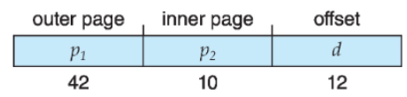

* `p₁` (Outer Page): 42bits
* `p₂` (Inner Page): 10bits
* `d` (Offset): 12bits
* **Outer page table size**: 2^42 x 8 = 2^45 = `32TB`
* 여전히 너무 큼!

##### 3-level 해결책
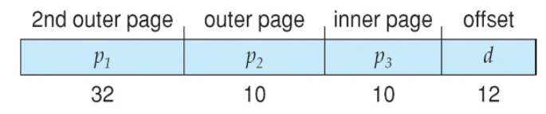

* `p₁` (2nd Outer): 32bits
* `p₂` (Outer): 10bits
* `p₃` (Inner): 10bits
* `d` (Offset): 12bits
* **2nd Outer Page Table**: 2^32 × 8 bytes = 2^35 bytes = 32GB
* 하지만 여전히 32GB는 크고 **메모리 접근 횟수도 4회**로 증가함

**intel**은 9bits씩 4계층으로 나눠서 64bit 중 **36bit + offset 12bit**만 사용한다

```
- 64비트 중 48비트만 사용
- 가상 주소 공간: 2^48 = 256TB (충분히 큼)
- 4-Level 페이징 사용

48-bit 구조: [9][9][9][9][12]
PML4 → PDP → PD → PT → Offset
각 레벨당 512개 엔트리 (2^9)
```

### Hashed Page Table
---
📚**<span style="color: #008000">Hashed Page Table</span>**: 가상 메모리 시스템에서 **가상 페이지 번호를 물리적 프레임 번호로 변환**
* 일반적으로 **32bit보다 큰 주소 공간**에서 사용됨

✅**작동원리:**  
1. **hash 함수 사용**: 가상 페이지 번호를 해시 함수 h(p)에 입력하여 해시 테이블의 인덱스를 계산
2. **chain 구조**: 같은 해시 값을 갖는 여러 페이지들은 체인 형태로 저장됨
3. 각 엔트리는 3가지 정보를 포함:
   1. **Virtual Page Number**
   2. **Physical Frame Number**
   3. **다음 엔트리를 가리키는 Pointer**

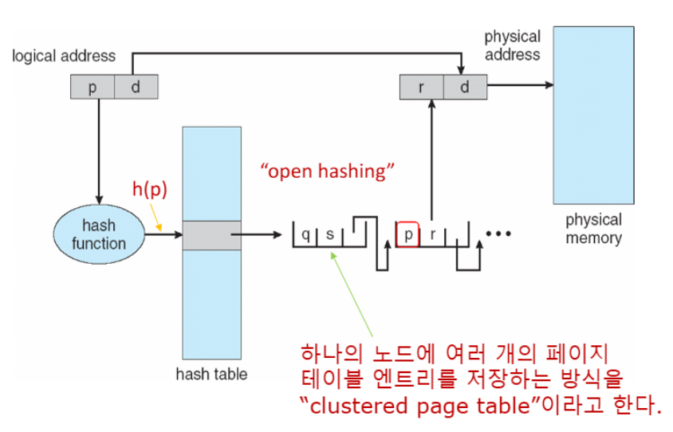

✅**작동 과정**:  
1. **해싱 과정**: 가상 페이지 번호(Virtual Page Number)를 해시 함수(`h(p)`)에 입력 → hash table의 인덱스 계산
2. **체인 검색**: 해시된 위치에서 연결 리스트 형태로 저장된 엔트리들을 순차 검색
3. **매칭**: 찾는 가상 페이지 번호와 일치하는 엔트리 발견 시 물리 프레임 번호 반환 → 물리 주소 생성

* page number = hash function
* h(p)가 hash table에 매칭이 되는지 확인함
* 위 예시에서는 p와 q는 같은 hash table에 존재하는 것을 알 수 있음

* **<span style="color: #008000">Clustered Page Tables</span>**
  * 64-bit system에서는 각 엔트리가 여러 페이지(예: 16개)를 참조하는 **Clustered Page Tables**를 사용함
  * **sparse address space**(메모리 참조가 불연속적이고 산재된 경우)에서 매우 유용

### Inverted page table
---
일반적으로 page table은 각각의 프로세스마다 가지고 있는데 그러다 보면 **page table이 frame table보다 많게 된다**

그래서 frame table을 관리하자는 취지의 table이 Inverted page table

📚**<span style="color: #008000">Inverted Page Table</span>**:
* 시스템 전체에 단 하나의 테이블만 존재
* 물리적 페이지들을 추적 (논리 페이지가 아닌!)
* 메모리 사용량이 물리 메모리 크기에만 비례

* 프로세스마다 페이지 테이블을 가지지 말고 물리적 페이지를 직접 관리하는 방법`


* **hash table 활용**
  * `(PID, p)`를 해시 함수에 입력하여 검색 범위를 1개 또는 몇 개의 엔트리로 제한
  * ✔ **TLB**와 함께 사용하면 더욱 빠른 접근 가능

❌ **공유메모리 구현이 어렵다**  
→ 하나의 물리적 주소에 하나의 가상메모리 주소만 매핑되기 때문에
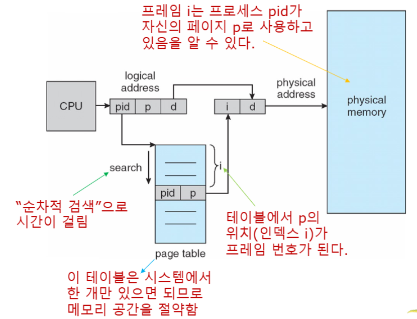

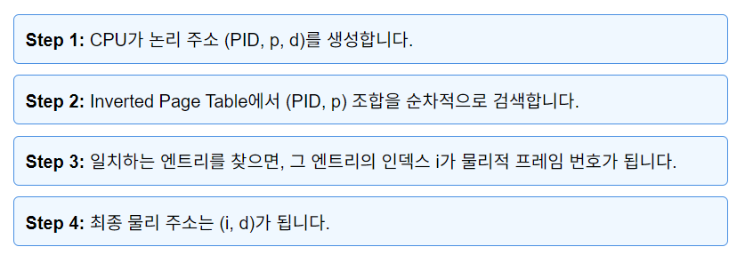

* 누구의 page인지를 알기 위해 `pid` 정보도 같이 들어간다
  * 즉, 어떤 프로세스(pid)의 페이지(p)가 i번째 프레임에 할당 되어있음을 알 수 있다

* 그래서 프로세스마다 page를 가지고 있지 않기 때문에 **메모리가 줄어든다**